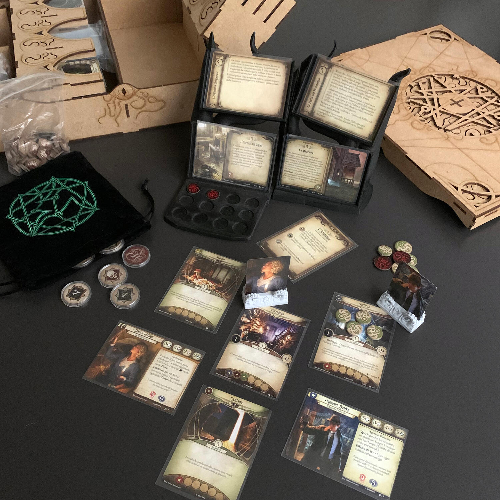
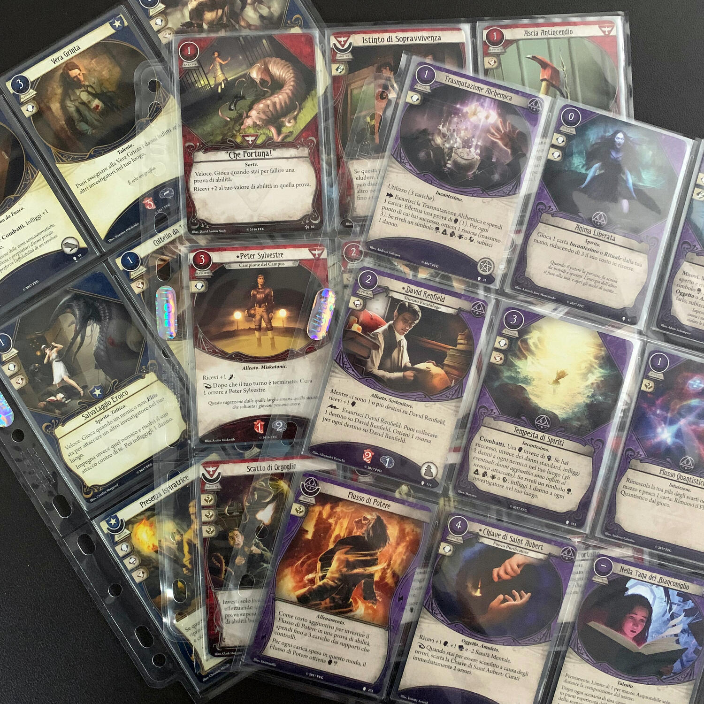

<Setting>

  <em>Presumendo che fossi nel pieno possesso delle mie facoltà mentali, l’esperienza di quella notte fu tale che nessun uomo ebbe mai a viverne una simile. Essa fu inoltre una conferma terrificante di tutto quel che avevo tentato di rifiutare in quanto frutto dei miti o dei miei sogni.{" "}</em>   
  – H. P. Lovecraft, L’Ombra Venuta dal Tempo
   
   
  Nella placida città di <strong>Arkham</strong>, Massachusetts, un piccolo gruppo
  di intrepidi investigatori cerca di far luce sulla vera natura di una sinistra
  minaccia che incombe sull’umanità… ma dovranno fare attenzione! Il reame arcano
  cela innumerevoli terrori e gli investigatori dovranno mettercela tutta per sopravvivere
  e difendere strenuamente i loro ultimi rimasugli di sanità mentale.

</Setting>

<Rules>

  Prendete il manuale, leggete l'introduzione al capitolo e{" "}
  <strong>immergetevi</strong> in questo tanto terrificante quanto magnifico
  mondo. Ogni <strong>ciclo</strong> è composta da <strong>scenari</strong> e
  ogni scenario è composto da <strong>carte</strong>: carte trama e carte
  capitoli (che rappresentano lo sviluppo della narrazione, nel bene o, quasi
  sempre, nel male), carte incontro e carte luogo (tutte le raccapriccianti
  esperienze che vivrete e tutti i posti in cui potrete mettere piede e morire
  male).  
  Scegliete gli <strong>investigatori</strong> con i quali intendete affrontare l'avventura,
  partite con i mazzi precostruiti (o preparateveli da soli) e siete pronti a giocare.
   
  Il vostro scopo è uno: <strong>arrivare sani e salvi a una delle conclusioni dello scenario</strong>, prima che il mazzo trama si esaurisca. Questo è composto da un numero
  variabile di carte che verranno pescate con il passare dei turni: se si dovrà pescare
  una nuova carta ma il mazzo è terminato… beh, probabilmente siete morti… malamente…
  D’altra parte, prima porterete a termine il mazzo dei capitoli e meglio sarà (si
  spera).  
  Il primo turno di una partita comincia con la fase degli investigatori, ma
  ciascuno dei successivi seguirà l’ordine delle seguenti 4 fasi: miti,
  investigatori, nemici e gestione.  
  Nella fase degli investigatori si hanno <strong>3 azioni</strong> per giocatore:
  si potranno pescare e giocare carte, scoprire indizi, ottenere risorse, attivare
  azioni specifiche, ci si potrà muovere e si potrà combattere, impegnare o eludere
  un nemico.  
  Ogni volta che sarà necessario affrontare una sfida di{" "}
  <strong>volontà</strong>, <strong>intelletto</strong>,{" "}
  <strong>scontro</strong> o <strong>agilità</strong>, quantificata da un numero
  che occorrerà quanto meno eguagliare, si sommeranno il valore di
  caratteristica del vostro personaggio, vari modificatori, determinati anche
  dalle carte che scarterete dalla mano per aumentarlo, e poi si confronterà il
  totale con la sfida… non prima però di avere estratto un token dal “sacchetto
  del caos” (nella maggior parte dei casi un malus, anche pesante) che
  imparerete a odiare per tutti i tentacoli che vi farà crescere sul corpo. Se
  passa bene, se va male… eheh.  
  Nella fase seguente, i nemici verranno ad abbracciarci con molto amore e ci faranno
  perdere la testa per loro.  
  Seguirà la fase di gestione, durante la quale si otterranno risorse, si
  pescheranno carte e ci preparerà al turno successivo.  
  <strong>Nella fase dei miti succede, solitamente, il finimondo.</strong> Partiamo
  collocando un destino sulla trama attuale… che tradotto significa un passo in avanti
  verso la morte. Poi, ogni giocatore affronterà una carta incontro: minacce alla
  nostra salute e sanità mentale, nemici che sbucheranno da dietro l'angolo, magie
  che ci bloccheranno la strada, paure ancestrali e terrori indicibili che porteranno
  i nostri investigatori a piangere in un angolino… Insomma, solo cose belle.  
  Se, e diciamo se, riusciremo a raggiungere la fine dello scenario, leggeremo
  sul manuale un paragrafo di fine capitolo e ci prepareremo ad affrontare il
  successivo. Altrimenti…

</Rules>

<Feedback>

  Arkham horror LCG è il <strong>compagno ideale</strong> per quelle serate dove
  vi sale un'irrinunciabile voglia di essere presi a tentacolate in faccia. Non
  vi succede mai? Come potete immaginare, infatti, il gioco non perdona.  
  La narrazione, seppur stringata (non aspettatevi un libro game o un <Link to="/reviews/tainted-grail-la-caduta-di-avalon/">
    Tainted Grail
  </Link>), riesce a farci calare nelle tenebre e a <strong>toglierci ogni speranza</strong>.  
  Per quanto a inizio scenario sarà possibile scegliere la difficoltà con la
  quale lo affronteremo, modificando di conseguenza i <strong>token</strong>{" "}
  all'interno del <strong>sacchetto</strong>, diciamo le cose come stanno:{" "}
  <strong>il caos e il caso regnano sovrani</strong>; pescare dal sacchetto è
  come tirare un dado, ma d'altronde chi ha la certezza che tirando una
  coltellata a un topo questo non sia più veloce di noi e ci morsichi la punta
  dei piedi?  
  **È davvero difficile trovare le parole per esprimere la bellezza di questo titolo.
  **
   
  Il gioco si divide in <strong>due macro momenti</strong>: <strong>la creazione dei mazzi</strong> investigatore e lo svolgimento dello <strong>scenario</strong>. La prima
  fase può spaventare, considerata anche la grande quantità di carte che si possono
  scegliere, ma non temete: <a href="https://arkhamdb.com/" target="_blank">
    questo sito
  </a> vi aiuterà nella scelta e vi farà cogliere delle possibilità che non avevate
  notato, portandovi a una migliore comprensione delle modalità di innesco delle
  combo.  
  Se vogliamo parlare di "difetti", me ne vengono in mente due: come organizzare
  le vostre carte e il <strong>costo</strong>. Per combattere il primo, ci sono
  dei magnifici organizer che, comunque, non sono necessari sin dall'inizio (è
  tranquillamente gestibile con le scatole che vi vengono date e un po' di
  fantasia). Quello in foto è <a href="https://thedicetroyers.com/shop/arkham-horror-lcg-storage-system/" target="_blank">questo</a>. Quanto al secondo… mi hanno sempre detto che "quel che è gratis non vale nulla"…
  beh, questo gioco vale tanto!  
  La scatola base di Arkham horror LCG è come una{" "}
  <strong>bustina di cocaina</strong> "regalata", che non volete provare per
  paura di finire nel tunnel della droga… anche perché sapete benissimo come
  andrà a finire… e andrà esattamente così. Ma cosa sono i soldi rispetto a
  delle avventure che vi segneranno nella vostra vita di giocatori?
   
  Ho iniziato a giocarci un anno fa: non ho ancora smesso.
   
  Cultisti di tutto il mondo, unitevi!

</Feedback>

