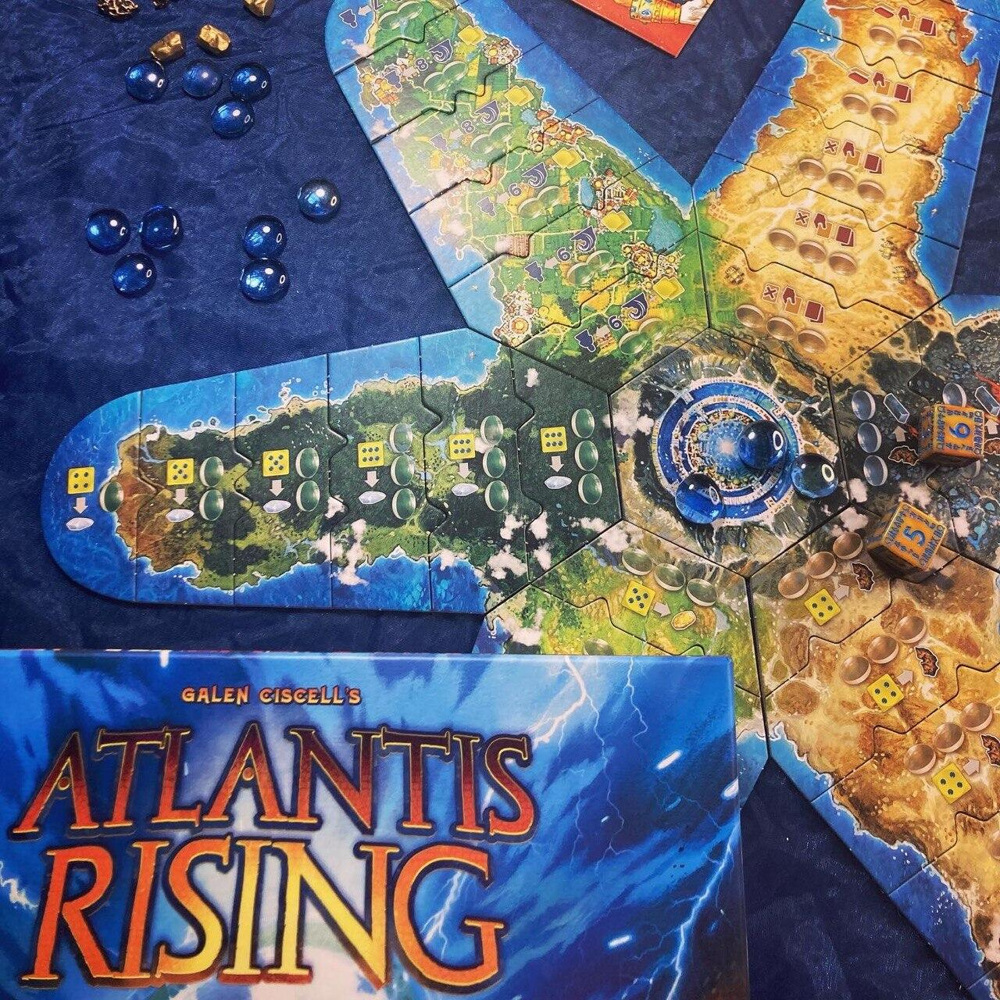
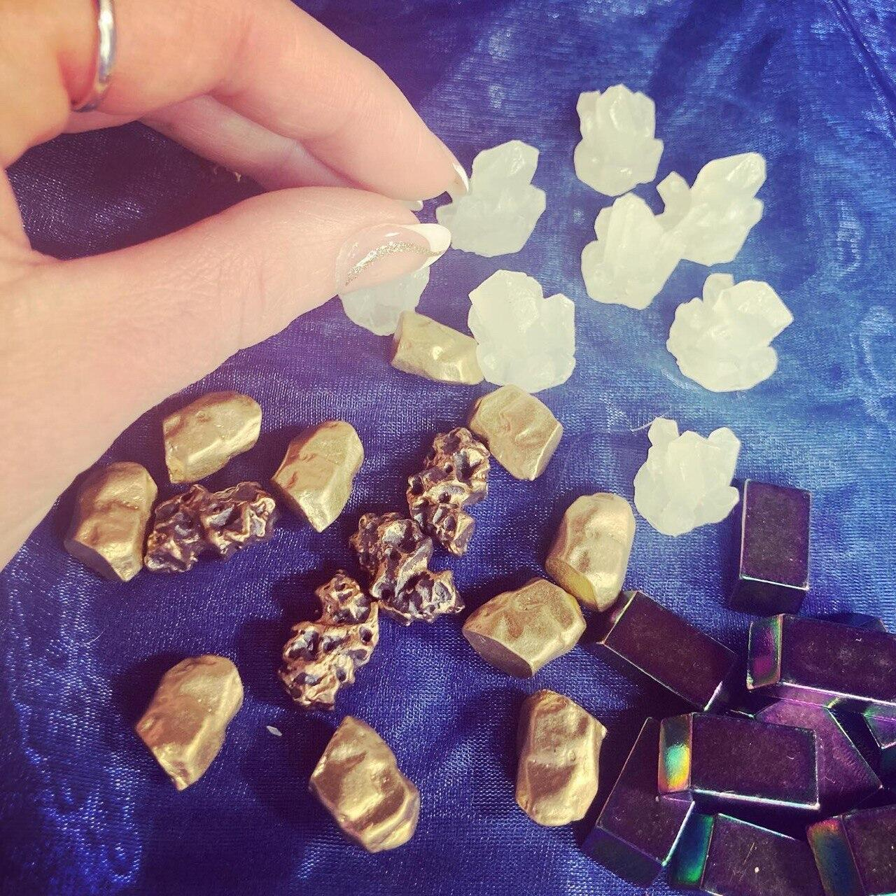

<Setting>

  <em>    «Davanti a quella foce che viene chiamata, come dite, Colonne d'Eracle,
    c'era un'isola. Tale isola, poi, era più grande della Libia e dell'Asia
    messe insieme, e a coloro che procedevano da essa si offriva un passaggio
    alle altre isole, e dalle isole a tutto il continente che stava dalla parte
    opposta, intorno a quello che è veramente mare. [...] In tempi successivi,
    però essendosi verificati terribili terremoti e diluvi, nel corso di un
    giorno e di una notte, tutto il complesso dei vostri guerrieri di colpo
    sprofondò sotto terra, e l'Isola di Atlantide, allo stesso modo sommersa dal
    mare, scomparve.»</em>   
  (Platone, Timeo)  
   
  Sono innumerevoli le leggende che narrano del mito di Atlantide e tra i testi
  più famosi ricordiamo i Dialoghi “Timeo” e “Crizia” di Platone nei quali si
  racconta che il Dio Poseidone s'innamorò di Clito, una fanciulla dell'isola e
  «recinse la collina dove ella viveva, alternando tre zone di mare e di terra
  in cerchi concentrici di diversa ampiezza», rendendola inaccessibile agli
  uomini.
   
  L'isola divenne rigogliosa e presto Poseidone e Clito ebbero dieci figli, il
  primo dei quali, Atlante, sarebbe divenuto il primo governatore dell'impero.
   
  La civiltà atlantidea divenne una monarchia ricca e potente e l'isola fu
  divisa in dieci zone, ognuna governata da un figlio del dio del mare. La terra
  generava beni e prodotti in abbondanza; sull'isola sorgevano porti, palazzi
  reali, templi, maestose opere e al centro della città vi era il santuario di
  Poseidone e Clito rivestito di argento, oro e avorio.
   
  Ognuno dei dieci re governava la propria regione di competenza, e tutti erano
  legati gli uni agli altri seguendo le volontà del padre.
   
  La virtù e la sobrietà dei governanti durò per molte generazioni, finché però
  il carattere umano ebbe il sopravvento sulla loro natura divina. Caduti preda
  della bramosia e della cupidigia, gli abitanti di Atlantide si guadagnarono
  l'ira di Zeus che non diede loro scampo.

</Setting>

<Rules>

  Durante il gioco vestirete i panni di Alti Consiglieri, ognuno con un'abilità
  speciale, e avrete l'arduo compito di far sopravvivere il vostro popolo;
  Atlantide sta per essere sommersa e l'unica salvezza è far ripartire il
  Portale Cosmico che vi permetterà di fuggire.
   
  Per raggiungere questo obiettivo dovrete costruire i suoi nove componenti più
  il Nucleo di Potenza centrale e, per farlo, saranno necessarie delle risorse
  che dovrete raccogliere nelle penisole. Il round si sviluppa in 4 fasi:

     <strong>FASE 1:</strong> Posizionamento del proprio Leader e dei due Atlantidei di partenza
      a disposizione sulle caselle le cui azioni più si preferiscono.
       
      Nelle Penisole Selvagge (Foresta, Collina e Montagne) si possono ottenere
      rispettivamente le risorse Cristalli, Oro, Ferro; in quelle Civilizzate
      (Forgia, Biblioteca e Città) invece, si possono svolgere rispettivamente
      le azioni trasformare il Ferro in Atlantium, ottenere carte Manufatto e
      carte biblioteca e ottenere un nuovo Atlantideo da riporre nella propria
      riserva.
    <strong>FASE 2:</strong>  Ogni giocatore rivela una Sventura dal mazzo dedicato e la risolve
      immediatamente.
       
      Le carte Sventura prevedono dei malus che possono ostacolare i piani dei
      giocatori e nella maggior parte dei casi velocizzano l'inondazione di
      Atlantide, ma possono influenzare negativamente il round anche in altri
      modi come per esempio impedendo lo svolgimento di determinate azioni.
       
      Quando verrà richiesto ai giocatori di inondare una tessera su cui sono
      presenti degli Atlantidei, questi saranno costretti a tornare nella
      riserva senza poter così svolgere la propria azione.
       
      Molto interessante ed utile l'abilità speciale dell'Astrologo/a che
      permette di piazzare le proprie pedine dopo lo svolgimento delle carte
      Sventura.
    <strong>FASE 3:</strong>  Svolgimento delle azioni: i giocatori possono risolverle
      nell'ordine che preferiscono, sia sulle penisole che sul Portale Cosmico.
       
      Da non dimenticare la tessera centrale dell'isola, la Fonte del Potere
      Mistico, che permette ad ogni Atlantideo su di essa di ottenere un'Energia
      Mistica, essenziale sia come risorsa che come moneta per ottenere dei
      bonus.
    <strong>FASE 4:</strong>  Ira degli Dei! Durante questa fase si allagano tante tessere
      quante indicate dal segnalino presente sulla plancia dedicata. Infine il
      segnalino verrà spostato avanti di una casella e quando raggiungerà il
      valore massimo non verrà più mosso fino a fine partita.
       È molto importante ricordare che le tessere da girare in questa fase
      sono a discrezione dei giocatori!
  Indipendentemente dai round di gioco la partita termina nel momento in cui
  tutti i componenti del Portale Cosmico sono costruiti oppure quando tutte le
  tessere dell'isola, compresa la Sorgente del Potere Mistico, vengono inondate.

</Rules>

<Feedback>

  Per via dei suoi componenti sgargianti, è praticamente impossibile non notare
  Atlantis Rising intavolato! E se il vostro desiderio estetico ha degli
  standard molto alti potete contare su un playmat d'impatto e su componenti
  deluxe che renderanno la vostra esperienza di gioco ancora più lussuosa!
   
  Io l'ho scoperto e provato per la prima volta lo scorso anno alla Play di
  Modena ed è stato subito amore a prima vista! Ha persino colpito al cuore il
  mio fidanzato, quindi era destino che prima o poi arrivasse nelle nostre mani!
   
  Essendo un gioco in cui l'alea è molto presente, bisogna calibrare molto bene
  le proprie mosse per poter fronteggiare qualsiasi imprevisto e non nego che
  alle volte sia davvero difficile, ma in fondo questo rende tutto più
  eccitante, no?!  
  A tal proposito, saper sfruttare al meglio le abilità speciali degli Alti Consiglieri
  è indispensabile per non farsi sopraffare dall'Ira degli Dei e salvare Atlantide.
   
  Altrettanto importanti sono le Barriere Mistiche: durante le prime partite non
  le abbiamo prese molto in considerazione e ne abbiamo pagato presto le conseguenze
  perché, nonostante le vittorie ottenute, la fatica per raggiungerle era sempre
  molta; sfruttandone pienamente il potenziale, invece, tutto è diventato molto più
  semplice.
   
  La cosa interessante di questo gioco è che ogni singolo elemento è concatenato
  ad un altro, così come ogni mossa ne influenza un'altra e, anche se la presenza
  della fortuna si fa sentire, è proprio questa la ragione per cui si ha sempre voglia
  di rigiocarlo.
   
  Ah quasi dimenticavo la cosa più importante: se gli amici ti danno buca, non disperare,
  puoi sempre contare su un Ologramma e l'Automa, che saranno fedeli alleati nella
  tua missione!

</Feedback>

