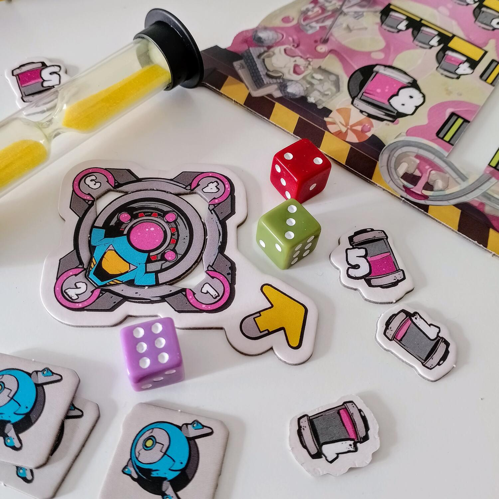
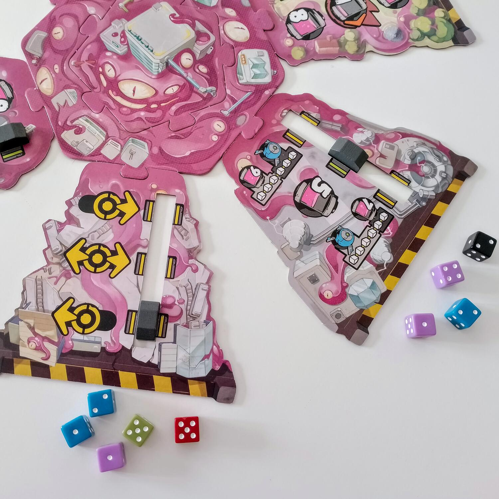
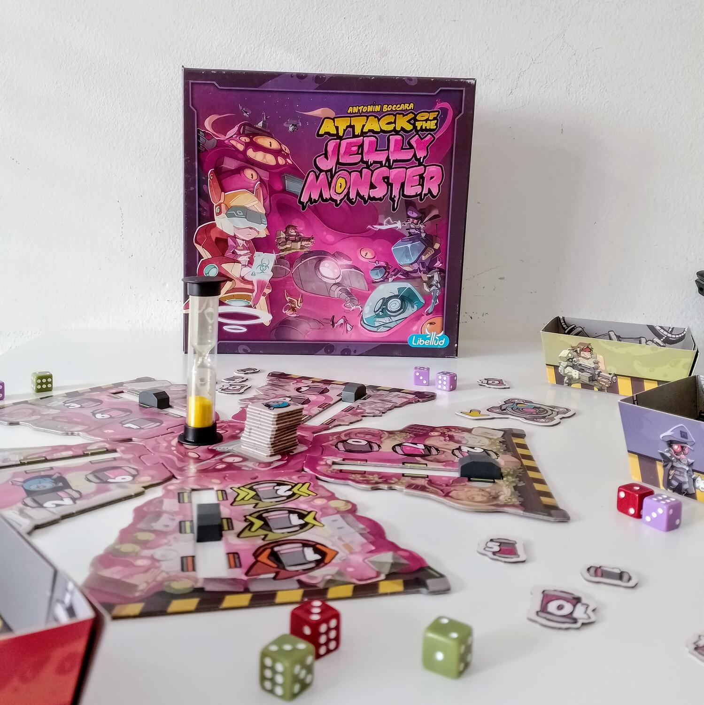

<Setting>

  La città è sotto l’attacco di un <strong>alieno gelatinoso rosa</strong>.
  Imbracciate le armi e sparpagliatevi nei vari quartieri per colpire l’invasore
  a suon di dadi e{" "}
  <strong>raccogliere quanta più materia aliena possibile</strong>. Il giocatore
  che alla fine dei quattro round ne avrà collezionata di più vincerà la
  partita.
   

</Setting>

<Rules>

  Questo è un gioco <strong>real-time</strong>, quindi si gioca tutti
  contemporaneamente.
   
  Si assembla la plancia con i <strong>quartieri</strong> della città in base al
  numero di giocatori. Ogni quartiere prevede una scelta di{" "}
  <strong>3 ricompense</strong>, ma solo quella selezionata dall’apposito
  indicatore sarà assegnata alla fine del round.
   
  Al via, tutti i giocatori lanceranno i <strong>7 dadi</strong> del proprio
  colore grazie ad un apposito garage di carta che farà da “vassoio”. Dopo ogni
  lancio, un giocatore può scegliere di prendere uno dei suoi dadi, rispettando
  il risultato scelto, e <strong>piazzarlo</strong> in uno dei quartieri. Che
  decida di compiere o meno questa azione, il giocatore dovrà sempre rilanciare
  i dadi e ripetere in questo modo il ciclo.
   
  In base al risultato, ogni dado può innescare un effetto diverso, una volta
  piazzato nel quartiere:
   
  <ul>
    <li>      <strong>1-2: Elimina</strong> un dado avversario dal quartiere e rimettilo
      nel suo garage;</li>
    <li>      <strong>3-4: Sposta</strong> di una posizione in alto o in basso
      l’indicatore della ricompensa del quartiere;</li>
    <li>      <strong>5-6: Nessun effetto.</strong></li>
  </ul>
       
      Quando un giocatore esaurisce tutti i dadi nel suo garage può prendere la{" "}
      <strong>clessidra </strong>al centro e capovolgerla: da quel momento, gli
      altri giocatori avranno 10 secondi per continuare a lanciare e piazzare
      dadi, allo scadere dei quali il round in corso sarà dichiarato concluso.
       
      Si passa all’attribuzione delle ricompense. In ogni quartiere{" "}
      <strong>si eliminano tutte le coppie di dadi</strong> dello stesso colore
      e numero, quindi si sommano i risultati per colore. Il giocatore che è
      riuscito a piazzare la <strong>somma più alta</strong> ottiene il bonus
      accanto all’indicatore, che solitamente è un certo ammontare di gelatina.
       
      Alla fine di questa fase, si ruota la plancia di 90° e si procede come
      descritto sopra finché non sono stati giocati 4 round, alla fine dei quali{" "}
      <strong>il giocatore con più gelatina è dichiarato il vincitore</strong>.

</Rules>

<Feedback>

  <em>Attack of the Jelly Monster</em> è un gioco crudele. Lo è perché è così{" "}
  <strong>caotico </strong>da voler passare per party game, e credi di non
  poterlo prendere sul serio. Ma una volta che sei seduto al tavolo e lanci e
  piazzi i dadi, ti rendi conto che il gioco ti sta facendo subodorare la
  vittoria: te la avvicina e te la allontana continuamente da sotto il naso, e
  ti colloca in un’atmosfera concitata in cui è impossibile pensare lucidamente.
  E tuttavia devi farlo. <strong>Non si tratta solo di maggioranze</strong>, ma
  di scegliere dove, come e quando piazzare i propri dadi, se si vuole vincere o
  perdere in un dato quartiere, considerato che la ricompensa cambia e può
  essere anche negativa in alcuni casi. A questo punto non ti interessa
  divertirti: <strong>vuoi vincere e basta</strong>, ed è uno degli aspetti più
  interessanti di questo titolo (a mio parere) fin troppo sottovalutato.
  L’esperienza che offre è un po’ frustrante, ma non è necessariamente un male
  se riesci ad abbracciarne la poetica.
   
  Ma la cosa che più rapisce di <em>Attack of the Jelly Monster</em> è
  l’assoluta disinvoltura con cui riesce a ricreare l’esperienza di uno{" "}
  <strong>sparatutto </strong>(peraltro, molto ben legata tematicamente) con uno
  dei componenti più vecchi e usati del mondo. C’è un uso dei dadi in questo
  gioco che da un lato è assolutamente ordinario – lanci il dado e lo piazzi –
  ma dall’altro ha un non-so-che di nuovo ed eccitante.
   
  Certo, <strong>i problemi ci sono</strong> e non sono da poco. Il continuo
  intessersi di braccia sulla plancia crea attriti, e non solo in senso fisico.
  Nella confusione, è facile che un dado eliminato non torni nel garage del suo
  proprietario. Si possono perdere secondi preziosi per cercare di trovare uno
  spiraglio attraverso cui infilare la mano. Si può anche essere trasportati
  dall’eccitazione e scostare la mano di un avversario – non proprio fair play.
  E se si è in numero dispari o il tavolo è di una certa forma, capita che dei
  giocatori guadagnino quei pochi centimetri di distanza che a lungo andare li
  penalizzeranno. Insomma, c’è tanto che può andare storto e non è raro che gli
  animi si surriscaldino. Ma non si tratta di errori di design: è la doppia
  natura del gioco ad essere conflittuale.
   
  <em>Attack of the Jelly Monster</em> è un gioco che – va detto – può lasciare
  perplessi. È un ibrido a più livelli: ha i modi di uno sparatutto ma è un
  gioco da tavolo; usa i mezzi del party game ma di fatto è uno strategico. E
  soprattutto è un real-time, una categoria non molto popolare di giochi, che in
  un certo senso “tradisce” il concetto di turno, quest’ultimo così comune da
  sembrare quasi intrinseco al medium. Tutto ciò gli conferisce diverse penalità
  di partenza. Ma gli va dato credito del fatto che cerchi di concepire
  l’esperienza del gioco da tavolo come qualcosa di manipolabile, un insieme di
  formule e regole che è lecito infrangere. Non accontenta tutti, forse neanche
  molti, ma è sicuramente un titolo che vale la pena provare con la giusta
  compagnia. E no, non quando si è anche vagamente brilli.
   

</Feedback>

