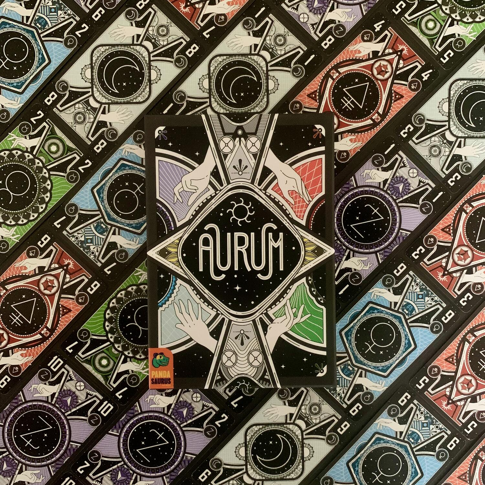
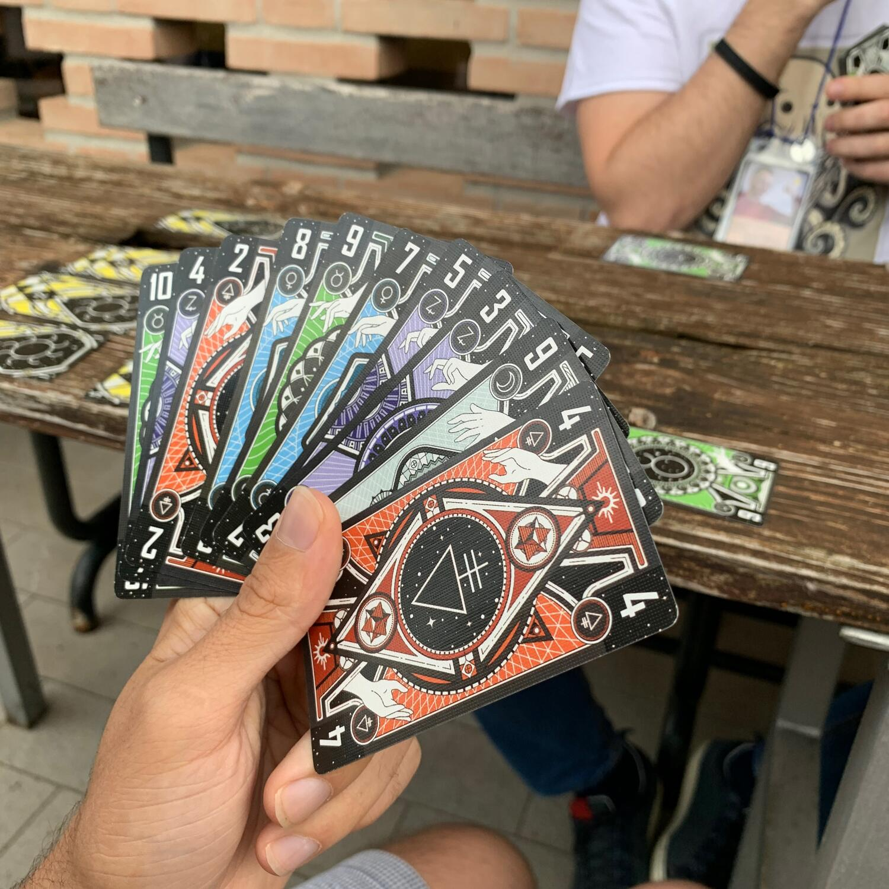
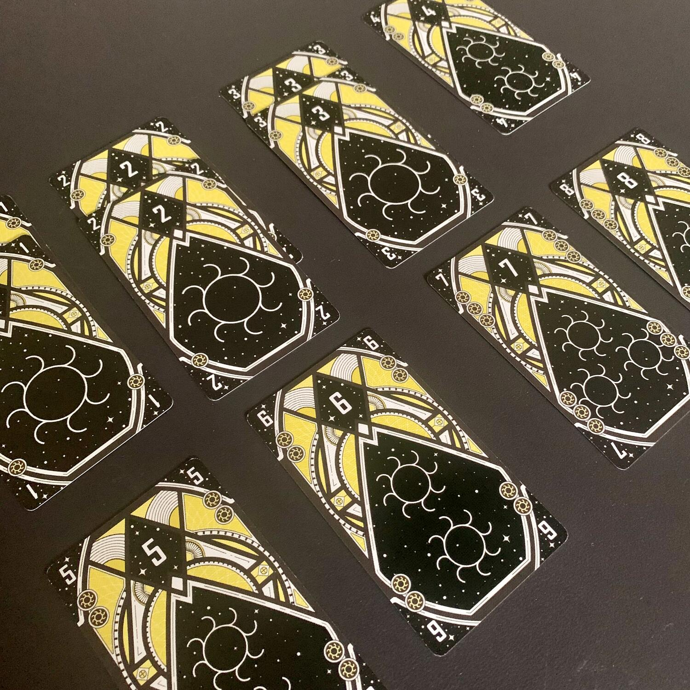

<Setting>

  Dopo anni di esperimenti nel vostro laboratorio comune, voi e i vostri
  colleghi <strong>alchimisti</strong> siete appena riusciti a trasmutare i
  metalli comuni in oro! Ora non resta che perfezionare la formula, ripetendo
  gli esperimenti per trovare la combinazione perfetta di metalli che produca
  l'oro più puro.

</Setting>

<Rules>

  Avete presente un normalissimo <strong>trick taking</strong>? La{" "}
  <strong>briscola</strong>? Questi giochi, solitamente, sono caratterizzati da
  un seme che, se giocato, sovrasta gli altri. Ad esempio, se la briscola è
  spade, è certo che l'asso di spade sarà la carta che non potrà mai essere
  sconfitta.  
  Aurum, nonostante sia un trick taking, non ha questa caratteristica… ma andiamo
  con ordine.
   
  Quelle che seguono sono le regole per <strong>4 giocatori</strong>, per 3 giocatori
  sono pressoché uguali, tralasciando che non ci sono le squadre. Infatti, se si
  gioca in 4, come nella briscola, si giocherà in <strong>2 contro 2</strong>, alternati.{" "}
   
  Aurum offre un mazzo di carte composto da <strong>5 metalli base</strong> (i
  semi), ognuno dei quali con carte <strong>da 1 a 10</strong>. Oltre a queste,
  ci sono <strong>le carte oro</strong>, numerate <strong>da 1 a 8</strong>, e
  con quelle da 1 a 3 in duplice copia.
   
  Dopo che tutte le carte sono state distribuite, ogni giocatore fa una{" "}
  <strong>scommessa su quante prese</strong> pensa di vincere con la propria
  squadra. Il numero maggiore tra le due carte della squadra è la scommessa
  effettiva.  A inizio turno, il giocatore designato giocherà una qualsiasi
  carta metallo base. A seguire,{" "}
  <strong>    tutti i giocatori dovranno giocare una carta, a patto che questa non
    rappresenti nessun colore base già giocato</strong>
  , oppure che questa sia una carta oro, ma questa volta senza nessun vincolo.  
  Se non sono presenti carte oro,{" "}
  <strong>chi avrà giocato la carta più alta</strong> vincerà la mano e sarà il
  nuovo "primo giocatore"; se invece sono presenti carte oro, si guarderà la
  carta oro con valore più alto.{" "}
  <strong>Chi ha giocato la carta con il numero minore</strong> otterrà una
  carta oro di pari valore, a patto che sia disponibile. In entrambi i casi, in
  caso di parità, l'ultima carta giocata con il numero maggiore o minore sarà
  quella vincitrice. Tutte le carte oro giocate in una presa vengono restituite
  alla scorta.
   
  <strong>    Il round termina immediatamente quando un giocatore non può giocare una
    carta metallo base e non ha o non vuole giocare una carta oro.</strong>
   
  In qualsiasi momento della partita è possibile sacrificare una carta oro per
  poter cambiare la propria scommessa, alzandola o abbassandola, scambiando la
  carta in campo con una in mano.
   
  Se si vincono <strong>più prese di quelle dichiarate</strong>, si guadagna il
  valore della propria dichiarazione in punti;{" "}
  <strong>se si rispetta esattamente la propria stima</strong>, si ottiene il
  doppio del valore della propria dichiarazione in punti. Altrimenti si
  collezionano 0 punti! Inoltre,{" "}
  <strong>si guadagnano i punti definiti dalla carte oro</strong> presenti nella
  propria collezione. Ogni carta oro, infatti, rappresenta un numero di soli che
  diventeranno punti vittoria. La squadra con il maggior numero di punti vince
  una pepita d'oro e il primo a collezionare due pepite vince!

</Rules>

<Feedback>

  Nonno mi ha introdotto alla briscola ancor prima che sapessi leggere: avrò
  avuto 4 anni. Lui e i suoi amici mi spiegavano le tattiche, l'arte di lasciare
  andare dei punti sicuri per poter attaccare quando più sarebbe stato efficace,
  a ricordare le carte passate, i segni e a leggere il gioco. Quindi, potete
  capire come questo genere di gioco io ce l'abbia nel sangue e, ogni volta, è
  capace di farmi tornare alla mente bei ricordi.  
  Aurum è stato capace di riportarmi lì, con Nonno.
   
  Ma sentimenti personali a parte, mi ha esaltato.  A differenza della briscola,
  ci sono molte più cose da tenere in considerazione: ad esempio, <strong>    la scommessa iniziale</strong>, oppure il fatto che si può giocare con l'idea di far terminare la partita
  quando più ci fa comodo; infatti, la partita termina se un giocatore non può giocare
  nessuna delle carte che ha in mano oppure se non può o non vuole giocare nessuna
  delle proprie carte oro. Se si riesce a capire che un giocatore non ha più carte
  rosse e verdi, e questo è ultimo di mano, <strong>    si può fare in modo che sia obbligato a giocarne una… facendo terminare in
    quel momento la partita</strong>
  . Avete distrutto i piani di gloria degli avversari? Che peccato!
   
  Un altro punto interessante è che <strong>    le carte con numero basso</strong>{" "}
  non sono per forza scarse, anzi: probabilmente ci permetteranno di ottenere
  delle carte oro da poter utilizzare per vincere una presa futura o, ancora
  meglio, di modificare la nostra scommessa.{" "}
  <strong>Le carte con numeri centrali</strong>, invece, sono molto
  situazionali: è possibile utilizzarle per vincere una presa oppure per
  ottenere carte oro che danno molti punti vittoria. Certo, deve esserci la
  situazione ideale, ma quando succede…  
  Il punto di forza o il punto negativo di questo gioco coincidono con l'idea sulla
  quale è basato: il non poter giocare carte di colori già giocati. Se si vuole padroneggiare,
  bisognerà <strong>    prestare molta attenzione a tutte le carte che passano sul tavolo</strong>, a cercare di carpire messaggi velati tra i giocatori della squadra avversaria
  e, al contempo, cercare di non dare troppe informazioni. Quindi, se pensate di
  giocare a briscola, non è del tutto vero. Questo potrebbe spaventare dei giocatori
  che temono di non avere abbastanza testa per poterlo affrontare.
   
  In ogni caso, Aurum è un gioco che vi porta a fare <strong>    una partita dietro l'altra</strong> e che si presta ad essere giocato in spiaggia invogliando anche sconosciuti
  con un semplice "ti va di provare una specie di briscola?". Le carte sono telate
  e, se si presta un po' di attenzione nel mescolare, non serve nemmeno imbustarle…
  anche perché hanno una dimensione abbastanza improponibile.  
  Questo gioco è per tutti gli amanti del trick taking, dei nostalgici e per chi
  crede che un gioco con poche regole possa comunque donare tempo di grande
  qualità.  

</Feedback>

