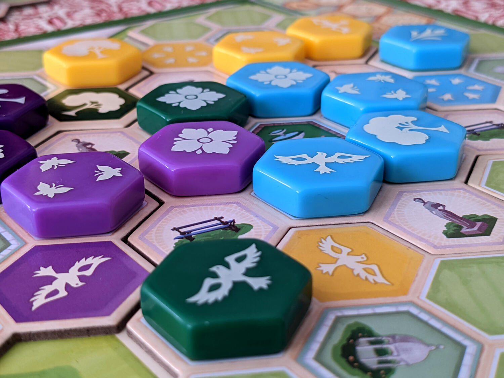
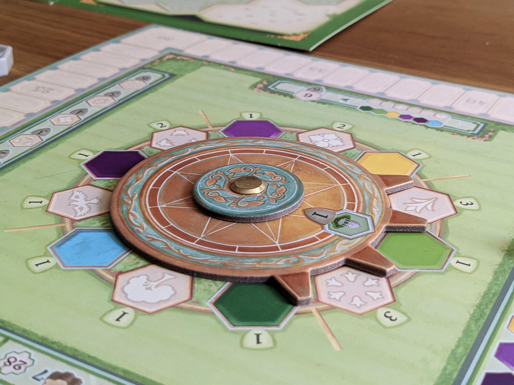

<Setting>

  Siamo in Portogallo nel 1500 d.C. Il re Manuel I ha commissionato ai migliori
  architetti di esterni del paese di costruire il più straordinario giardino per
  la sua amata moglie, la Regina Maria di Aragona. I fortunati architetti
  dovranno sfidarsi a colpi di exterior design per costruire uno splendido
  giardino arrangiando alberi, fiori, fontane e figure ornamentali.
   
  Solo l'architetto con più buon gusto ed eleganza riuscirà a conquistare il
  favore della Regina ed essere proclamato il migliore del paese.

</Setting>

<Rules>

  Come tutti gli Azul che si rispettino, le regole di questo gioco sono
  semplici. La difficoltà sta nel pesare le tue scelte con attenzione e tenere
  d'occhio il gioco dei tuoi avversari.  
  Durante il tuo turno dovrai scegliere tiles da piazzare nella tua storage area
  basando la tua scelta su specifici pattern o colori. Successivamente potrai valutare
  se continuare ad accumulare tiles (attenzione, gli spazi disponibili nella storage
  area sono limitati), o se iniziare a piazzarle nel tuo giardino. Una volta che
  tutti i turni sono stati completati e tutte le tiles sono state piazzate (o se
  non puoi più piazzarne nessuna), il conteggio dei punti si basa sul meccanismo
  del set collection. Infatti, seguendo le rigide regole di piazzamento, collezionerai
  punti per ogni set di tessere dello stesso colore (con tutti i simboli diversi)
  e set di tessere con lo stesso simbolo (con tutti i colori diversi).
   
  Suona facile? Non resta che provarlo :)

</Rules>

<Feedback>

  Questa versione di Azul è stata un successo per noi. Come amanti dei giochi
  astratti (e di Azul), non ci ha deluso ed ha pienamente soddisfatto le nostre
  aspettative. La domanda che tutti si pongono e ́: vale la pena possederlo se
  già abbiamo altri Azul in collezione? Per noi, la risposta è sì; riesce a
  differenziarsi significamente dagli altri della saga, e spicca specialmente
  per la sua complessità ́ (che inoltre gli fornisce un' elevata replayability).
   
  Il sistema di drafting risulta interessante e può dare origine a mosse
  cattivelle (come capita in molti dei precedenti Azul) ma senza mai risultare
  punitivo.
   
  Per concludere, il sistema di conteggio punti ci è sembrato davvero
  soddisfacente ed intrigante, e sicuramente ti lascia con la voglia di
  ricominciare da capo per migliorare la puntuazione e rendere il tuo giardino
  ancora più splendente.

</Feedback>

