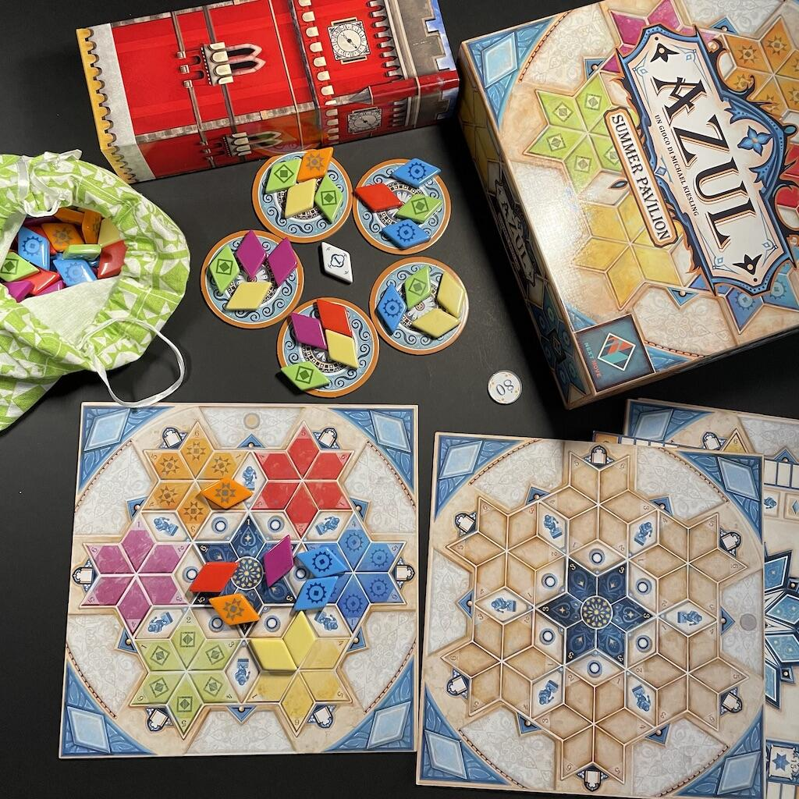
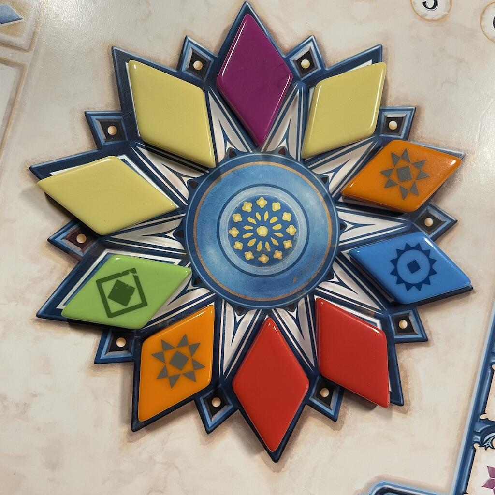

<Setting>

  XVI secolo: il re del Portogallo, Manuele I, commissiona ai più talentuosi artigiani del Paese la costruzione del suo
  Padiglione Estivo, dove intende onorare i membri più famosi della famiglia reale: sarete voi, mastri straordinari,
  all’altezza delle splendide aspettative di un tale illustre committente?

</Setting>

<Rules>

  Una partita ad Azul: Summer Pavillon dura 6 Round, ciascuno dei quali è suddiviso in 3 Fasi:
  <ul>
    <li>      <strong>prendere piastrelle</strong>;</li>
    <li>      <strong>giocare piastrelle</strong>;</li>
    <li>      <strong>preparazione del Round successivo</strong> o, all’ultimo Round,{" "}
      <strong>conteggio finale dei punti vittoria</strong>.</li>
  </ul>
  Selezionate le plance personali, disponete in base al numero di giocatori un certo numero di{" "}
  <strong>tessere vassoio</strong> al centro del tavolo, con 4 piastrelle su ognuna, e riempite le caselle scorta: la
  partita può iniziare.
   
  Un giocatore, al proprio turno, può prendere tutte le piastrelle di uno stesso colore (eccetto il jolly del Round in
  corso) <strong>da una qualsiasi tessera vassoio</strong> + una e solo una jolly, se presente; oppure, può prendere
  tutte le piastrelle dello stesso colore <strong>dal centro del tavolo</strong> + una e solo una del colore jolly, se
  presente. Se si attinge dal centro del tavolo per primi, durante un Round, si perde un ammontare di punti pari al
  numero di tessere pescate ma si ottiene anche il <strong>segnalino primo giocatore</strong>, che attribuirà
  l’iniziativa per il Round successivo. I giocatori si alternano nella pesca delle tessere fino a che non ne rimangono
  più nei vassoi o al centro: quindi, il primo giocatore può collocare una propria tessera su uno spazio romboidale
  idoneo della propria plancia, scartando nella <strong>torre</strong> il numero di tessere del medesimo colore (incluse
  eventuali tessere jolly) necessario a coprire la cifra stampata sullo spazio in questione; si possono usare tutti i
  jolly che si vogliono, ma la tessera da posizionare dovrà necessariamente essere del colore della stella a cui
  appartiene lo spazio romboidale. La sola stella al centro della plancia giocatore non pone limitazioni su dove
  collocare ciascun colore, ma tutte le piastrelle dovranno avere colori differenti. Ciascuna piastrella posizionata
  conferisce un punto vittoria + un punto per ogni altra piastrella connessa in adiacenza a quella appena collocata. Se
  si occupano le caselle che circondano una colonna, una statua o una finestra, si possono prendere rispettivamente 1, 2
  o 3 tessere dalla plancia con le piastrelle di scorta (anche tutte del colore jolly).  
  Se al proprio turno non si possono o non si vogliono posizionare piastrelle, si passa. Fino a 4 piastrelle possono essere
  conservate da un turno all’altro sulle <strong>finestre</strong> della plancia personale; ogni altra piastrella in eccesso
  va scartata nella torre e comporta la perdita di un punto.  
  Quando tutti hanno passato, si rimpinguano i vassoi, reintegrando le tessere dalla torre nel sacchetto se questo è
  vuoto, si ricolloca il segnaino primo giocatore al centro del tavolo e si avvia un nuovo Round o il conteggio finale:
  ogni stella completata e ogni set di caselle con lo stesso numero completato (da 1 a 4) conferirà ulteriori punti
  vittoria a fine partita. Dobbiamo proprio dire che vince chi ha più punti?

</Rules>

<Feedback>

  Anche i giocatori più scettici verso gli astratti non potranno non amare <em>Azul: Summer Pavillon</em>. Questa
  versione del fortunato titolo presenta un livello di interazione maggiore di quanto si senta dire in giro (si possono
  fare tanti sgambetti, che in un gruppo di veri intenditori potranno dare un certo fastidio a più giocatori al tavolo)
  e un alto livello di profondità strategica (la pianificazione inizia sin dalla prima pesca dai vassoi, passa per la -
  talvolta sofferta - conquista del segnalino primo giocatore e termina con la ponderata selezione dei bonus da
  perseguire per guadagnare punti a fine partita). Se cercate un titolo con cui catturare l’attenzione dei vostri
  amici/familiari che poco o nulla sanno del mondo ludico che c’è là fuori, questo titolo può senz’altro fare per voi:
  la gradevolezza alla vista e al tatto dei materiali, la sfida intellettuale, la durata contenuta, la portabilità e
  l’alta rigiocabilità (non dimentichiamoci del retro della plancia, che la aumenta considerevolmente) sono tutti
  fattori che concorrono a rendere <em>Azul: Summer Pavillon</em> uno dei migliori titoli per accompagnare un neofita in
  questo magico mondo. E non dimenticate che, se sarà gradito, non vi basterà una sola copia in famiglia!

</Feedback>

