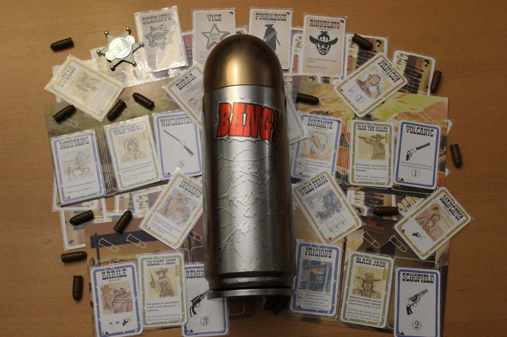
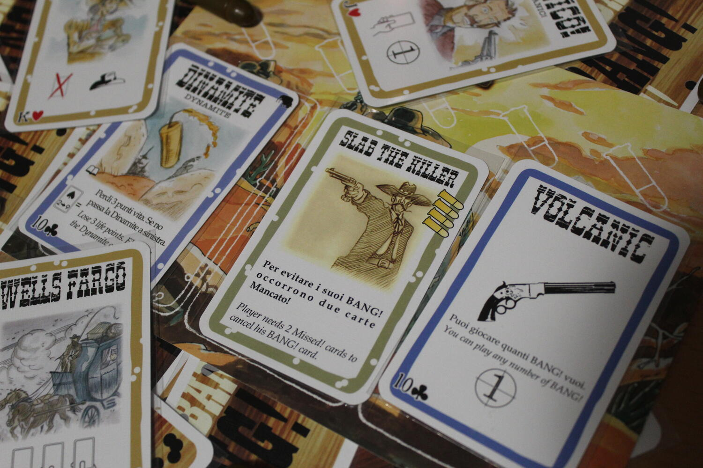

<Setting>

  Nel caro vecchio Far West assisteremo alla classica diatriba tra i
  rappresentanti della legge e i banditi.
   
  Lo Sceriffo e i suoi alleati dovranno proteggere la città da una banda di
  spietati Fuorilegge. Chi riuscirà a sopravvivere sarà il vincitore. Attenzione
  però! Il Rinnegato trama nell’ombra per far fuori tutti e trovarsi faccia a
  faccia con lo Sceriffo per un duello all’ultimo sangue.

</Setting>

<Rules>

  All’inizio del gioco, ogni giocatore riceve una carta ruolo, che manterrà
  segreta, e una carta personaggio. Il giocatore che riceve il ruolo dello
  Sceriffo sarà l’unico a rivelarsi. Ogni giocatore inizia il gioco con una mano
  di tante carte quanti sono i punti vita sulla propria carta personaggio,
  indicati dalle pallottole in alto a sinistra. Lo Sceriffo giocherà tutta la
  partita con una pallottola in più, quindi con un punto vita in più rispetto a
  quanto indicato sulla sua carta personaggio.
   
  Il gioco procede in senso orario a partire dallo Sceriffo.
   
  All’inizio del proprio turno i giocatori dovranno pescare due carte dal mazzo
  di pesca e potranno giocare le carte che vogliono senza limiti; l’unica
  eccezione è la carta BANG! che può essere giocata solo una volta per turno.
   
  Le carte giocabili si dividono in carte a bordo marrone, che hanno un effetto
  istantaneo e vengono scartate subito dopo essere state giocate, e carte a
  bordo blu, che hanno un effetto permanente e rimangono sulla plancia del
  giocatore fino a che non vengono rimosse da altri effetti o sostituite nel
  caso delle pistole. Alla fine del proprio turno, il giocatore dovrà scartare
  eventuali carte in eccesso dalla sua mano. Il limite di carte in mano è
  rappresentato dai punti vita rimanenti al personaggio.
   
  Quando un giocatore viene eliminato, scarta la sua mano e le carte in gioco
  sulla sua plancia e rivela la sua carta ruolo. Se era un Fuorilegge, chi gli
  ha sferrato il BANG! di grazia pesca 3 carte dal mazzo.
   
  Se era il Rinnegato, non succede niente.
   
  Se era un Vice e chi l’ha eliminato era lo Sceriffo, questi dovrà scartare
  tutte le carte che ha in mano ed in gioco.
   
  Il gioco termina quando si verifica una di queste condizioni:
  <ul>
    <li>lo Sceriffo viene eliminato: i Fuorilegge vincono!</li>
    <li>      i Fuorilegge ed il Rinnegato vengono eliminati: Sceriffo e Vice vincono!</li>
    <li>i Fuorilegge e lo Sceriffo vengono eliminati: il Rinnegato vince!</li>
  </ul>

</Rules>

<Feedback>

  BANG! è un grande classico tra i party game. Ricordo con nostalgia le serate
  al pub con gli amici in cui ci prendevamo a colpi di pistola senza pietà! Il
  gioco funziona bene ma dà il meglio di sé dai 5 giocatori in su. Va da sé che
  la durata indicata di 20-40 minuti è fortemente influenzata dal numero di
  giocatori e non è raro fare partite che superano anche l’ora di gioco.
  L’ambientazione è abbastanza sentita, anche grazie ai nomi dei personaggi e
  alle illustrazioni delle carte, oltre al fatto che sentirti un bersaglio
  ambulante ti riporta dritto nel vecchio West.  
  Il gioco è fortemente influenzato dalla fortuna: se non ti ritrovi fornito delle
  carte Mancato! o BANG! al momento decisivo, puoi dire addio al tuo cinturone.
   
  Anche i vari poteri dei personaggi aumentano ulteriormente la dipendenza dalla
  fortuna: per limitare eventuali svantaggi,si può fare un draft con le carte personaggio
  all’inizio del gioco oppure dare 2-3 carte personaggio tra cui scegliere ad ogni
  giocatore (queste sono Home Rules che adottavo spesso con il mio gruppo di gioco).
  Infine, essendo un gioco ad eliminazione, se la partita dovesse andare per le lunghe,
  si rischia di fare annoiare qualche giocatore.  
  In ogni caso, se volete un party game facile anche per chi non ha esperienza
  con i giochi da tavolo, con BANG! andrete sul sicuro!

</Feedback>

