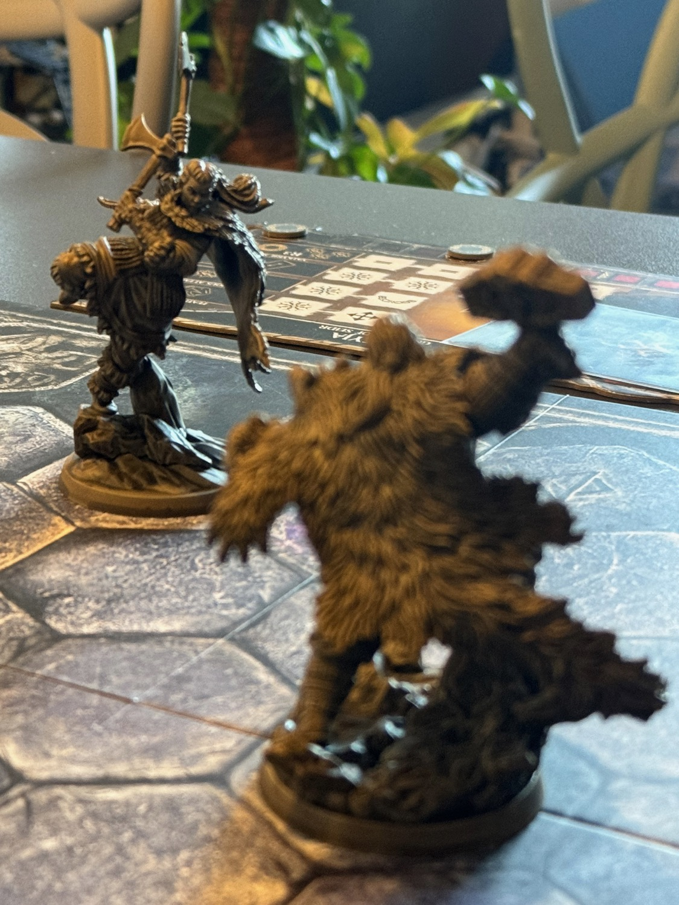
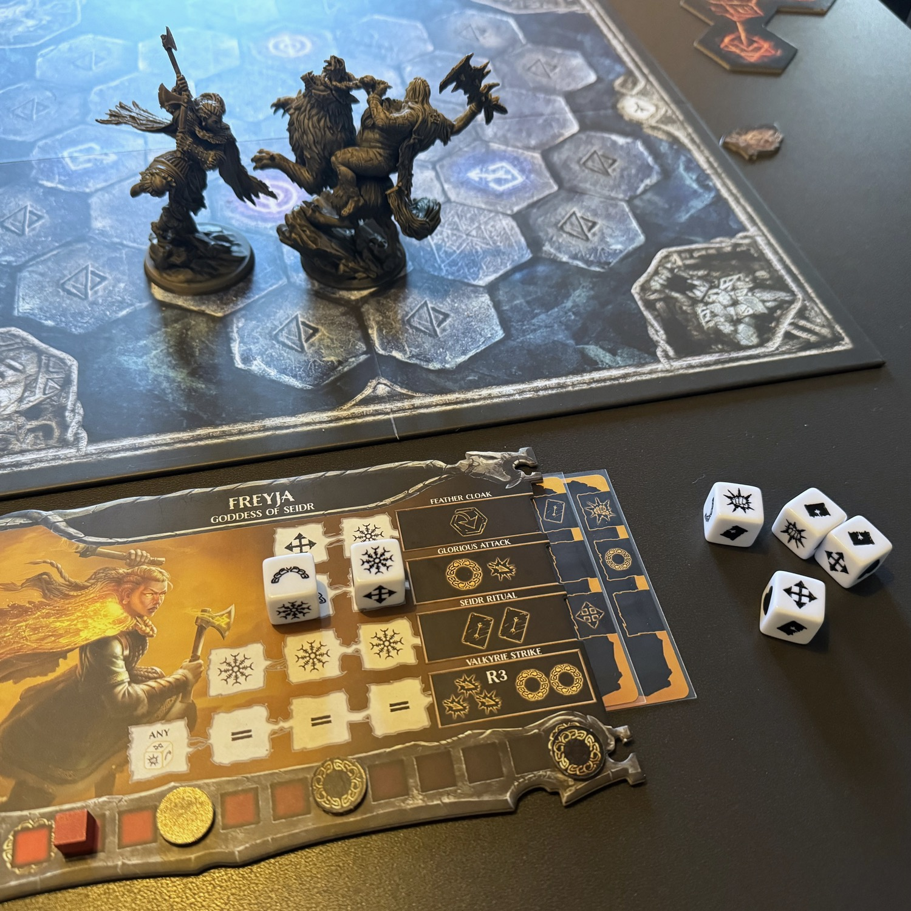
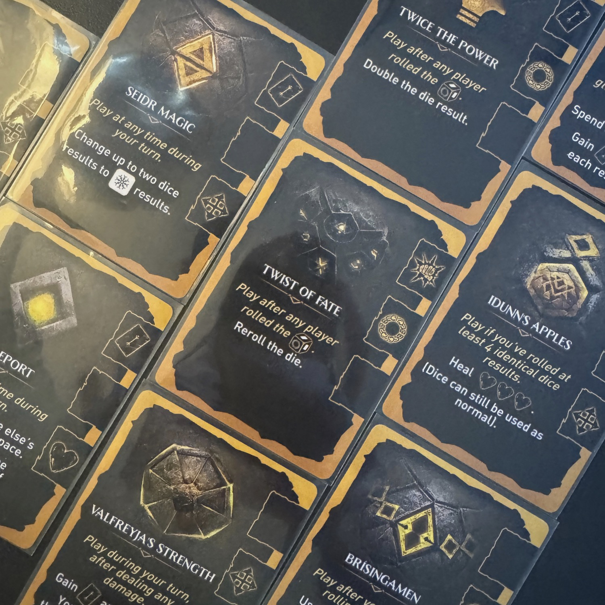

<Setting>

  Possano gli dei favorire gli audaci e gli astuti, perché in quest'arena la vittoria non si ottiene semplicemente, ma
  si conquista con tutte le proprie forze.
   
  Scegli se impersonare <strong>Thor</strong>, il dio del tuono, oppure <strong>Freyja</strong>, dea dell'amore, della
  guerra, della bellezza e della magia Seidr (faceva tutto lei, sì), o ancora <strong>Surtr</strong>, il gigante di
  fuoco, oppure <strong>Hyrrokkin</strong>, la gigantessa!  
  <strong>Scegli se vincere d'astuzia o di pura violenza. </strong>
   
  L'importante è vincere.

</Setting>

<Rules>

  Due o quattro divinità si picchieranno nell'arena, fino a quando una delle due squadre soccomberà o un qualsiasi dio
  otterrà <strong>10 punti gloria</strong>: la squadra che rimarrà in piedi o che conquisterà la gloria, sarà la
  vincitrice.  
  Il gioco si svolge in una serie di turni, composti da tre fasi principali:
   
  <ol>
    <li>      <strong>movimento iniziale</strong>: ci si può spostare di una casella gratuitamente;</li>
    <li>      <strong>potenziare la divinità</strong>: giocare una carta precedentemente ottenuta per migliorare un'azione;</li>
    <li>      <strong>lanciare i dadi</strong>: si lanciano i 6 dadi, come nello <strong>yahtzee</strong> (o come in{" "}
      <Link to="/reviews/marvel-dice-throne/">Dice Throne</Link>) e si svolgono le azioni.</li>
  </ol>
  Le azioni sono molto semplici: ci si sposta nell'arena, ci si cura, si pescano carte, si ottengono punti gloria e si
  tirano pugni ai nemici adiacenti. <strong>Le divinità sono tutte diverse tra loro</strong> e tutte hanno delle "mosse
  speciali" che possono attivare una volta al turno, spendendo una combinazione di dadi: ad esempio,{" "}
  <strong>Thor può lanciare il proprio Mjölnir</strong>, oppure{" "}
  <strong>Freyja potrà partecipare a un rituale seiðr</strong> per ottenere due carte.
   
  Nel tracciato della vita di ogni eroe, sono presenti dei punti gloria. La divinità che porterà il segna-vita avverario
  a superare il segnalino gloria, lo otterrà, avvicinandosi così alla vittoria.

</Rules>

<Feedback>

  Battle of Gods è stata una delle scoperte della mia sempre più lontana <strong>Essen</strong>.  
  Il gioco è semplicissimo, soprattutto se avete già giocato a <Link to="/reviews/marvel-dice-throne/">
    Dice Throne
  </Link> ed è un mezzo perfetto per portare curiosi a giocare dopo che si sono innamorati delle <strong>    fantastiche miniature</strong>: sono davvero strepitose!  
  <strong>Le regole si spiegano in 5 minuti</strong>: alla fine tutto sta nel lanciare i dadi, capire quanto spingere la
  fortuna e attivare i dadi nel giusto ordine per portare a casa la vittoria.  
  Dopo decine di partite non mi sento di dire che c'è una divinità più “rotta” delle altre: sono tutte abbastanza bilanciate
  e portano a <strong>diversi stili di gioco</strong>. I dadi sono dadi: a volte ti aiutano, a volte un po' meno. Ad esempio,
  con Surtr cercheremo di mantenere le distanze, soprattutto all'inizio, in quanto si possono lanciare "onde energetiche"
  di fuoco e bruciare tutti in linea retta… per poi andare all'attacco quando sarà più utile; con Freyja, invece, mi sono
  trovato spesso a scegliere la mia strategia basandomi sulle carte che ho pescato. Queste sono molto situazionali: potrebbero
  stravolgere la partita… oppure potrebbero essere del tutto inutili; di conseguenza, possiamo decidere di investirle nel
  potenziamento delle abilità speciali che la divinità ha sulla propria plancia, rendendolo sempre più forte.  
  Come avrete capito, <strong>"paragono" questo gioco a Dice Throne</strong>, anche se i due titoli sono parecchio
  diversi: certo, entrambi si basano sull'uso di carte e sullo yahtzee, ma Dice Throne è sicuramente più articolato e
  variegato, nonché più difficile da portare al tavolo con giocatori casuali.{" "}
  <strong>    Battle of gods, invece, è il classico gioco che, con poche regole, regala emozioni forti e tanta adrenalina.</strong>
   
  Non vedo l'ora di mettere le mani sulle due espansioni (Hel e Odino) per fare ancora più "mix and match".{" "}
  <strong>Se non vi piacciono la fortuna e l'ingiustizia</strong>, lasciate perdere: questo gioco non fa assolutamente
  per voi! Ricordiamoci che il dado è il dado, “po esse fero, po esse piuma”… E se lo userete come piuma, non uscirete
  mai con lo scudo dall’arena degli dei, ma piuttosto sopra di esso!

</Feedback>

