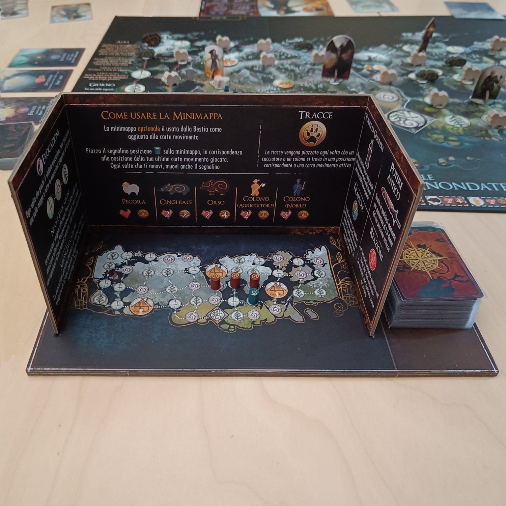
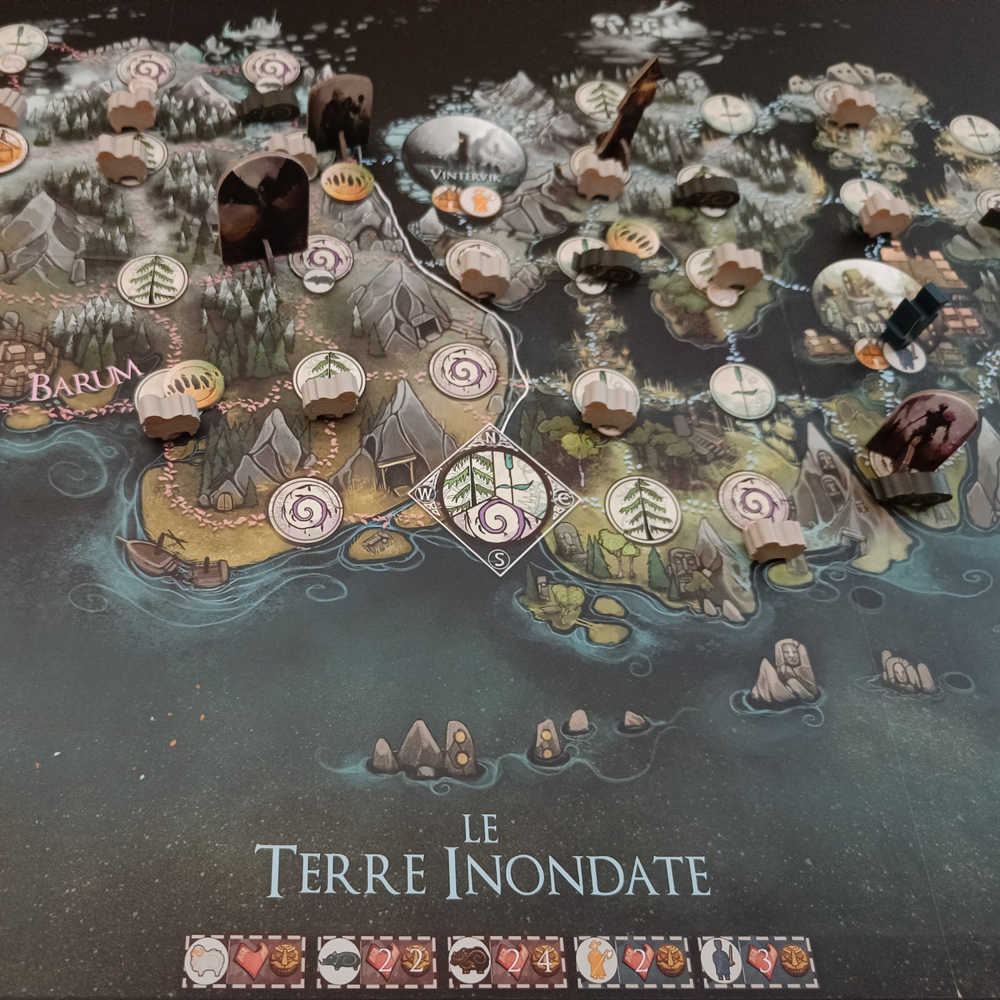
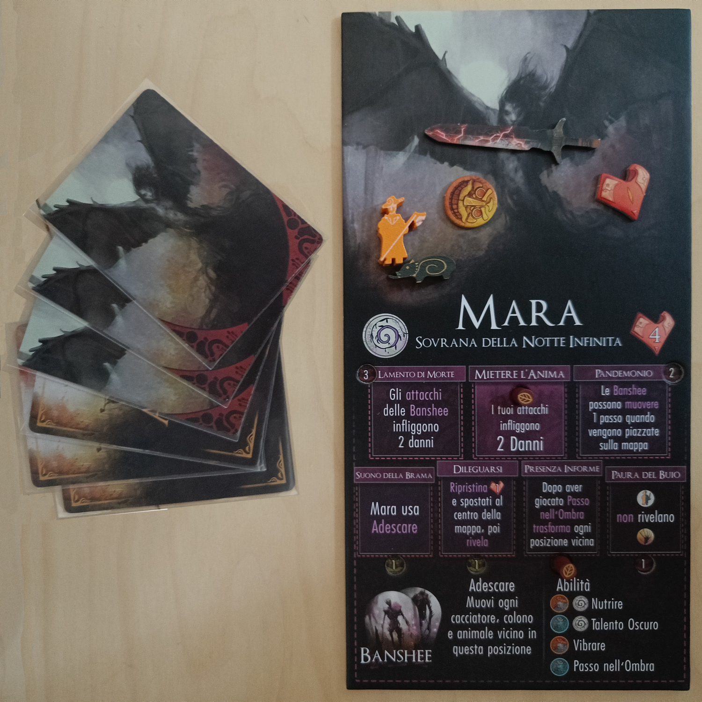

<Setting>

  La Distesa del Nord, quella magnifica terra piena di foreste verdeggianti e
  laghi pieni di pesci, sembrava perfetta per ospitare i nuovi coloni: una nuova
  casa, dove poter prosperare, in un paesaggio rigoglioso e pieno di risorse. Ma
  quel territorio, ad un primo occhio così accogliente, si è rivelato presto una
  zona piena di minacce e pericoli.
   
  Le Bestie, misteriose e dotate di poteri mistici, sono emerse dal profondo
  delle foreste, e con i loro attacchi improvvisi e letali stanno respingendo
  gli uomini da quella terra, la loro terra, spargendo terrore e morte.
   
  Alcuni noti cacciatori sono stati convocati per proteggere i coloni dalla
  terribile minaccia e catturare queste oscure presenze ferine: chi prevarrà? La
  forza primigenia e mistica delle Bestie o l’astuzia e l’abilità dei
  cacciatori?

</Setting>

<Rules>

  Beast è un gioco a <strong>movimento nascosto</strong>, dove una Bestia,
  impersonata da un giocatore, sfiderà un squadra di cacciatori, ovvero gli
  altri giocatori.
   
  Una volta scelta una delle <strong>sei Bestie</strong> differenti e i
  cacciatori (ve ne sono sei tra i quali optare), si procederà alla scelta di un
  “contratto”. Quest’ultimo è sostanzialmente uno scenario che indica il setup
  di gioco, gli obiettivi intermedi e la condizione di vittoria di ciascuna
  delle due parti: per la Bestia la vittoria avviene uccidendo un determinato
  numero di coloni, mentre i cacciatori vincono sconfiggendo la Bestia o
  garantendo la salvezza degli abitanti della foresta.
   
  La sfida si svolge in round, cioè giorni divisi in tre differenti parti: alba,
  giorno e notte.
   
  Durante l’<strong>alba</strong> ha luogo un <strong>draft</strong> tra i
  giocatori per scegliere e suddividere le carte, che si aggiungono alle carte
  specifiche di ciascun cacciatore/Bestia e permettono di svolgere le diverse
  azioni durante il giorno.
   
  Nella fase <strong>giorno</strong> si svolge la fase attiva di caccia: a
  partire sempre dalla Bestia, ognuno{" "}
  <strong>gioca fino ad un massimo di due carte</strong> e svolge le relative
  azioni indicate. La Bestia, muovendosi in incognito all’interno della mappa
  (viene rivelata solo se attacca o se un cacciatore effettua un’azione “cerca”
  nella casella dove questa si cela), cercherà di dileguare i cacciatori e di
  attaccare animali, coloni o gli stessi inseguitori, anche attraverso le
  proprie “evocazioni”, versioni minori di sé che possono essere create per
  supportare gli agguati. I Cacciatori, sfruttando gli indizi a propria
  disposizione, come le tracce e le apparizioni della Bestia, si muoveranno e
  proveranno a stanare e ad infliggere danno all’animalesco avversario.
   
  La <strong>notte</strong> giunge quando tutti i giocatori{" "}
  <strong>passano</strong>: in questa fase si controlla il soddisfacimento degli
  obiettivi intermedi raggiunti e, sulla base di questi e del “rancore” (la
  moneta del gioco) ottenuto, si possono acquistare nuove abilità specifiche,
  potenziandosi per il prosieguo della sfida nei giorni successivi. Gli
  eventuali cacciatori uccisi dalla Bestia verranno ripristinati, così come le
  carte specifiche di ciascuno, mentre le carte azioni verranno rimescolate in
  un mazzo comune per il draft dell’alba seguente.
   
  Quando una delle due parti avrà{" "}
  <strong>raggiunto il proprio obiettivo</strong> stabilito dal contratto
  (solitamente entro massimo 3-4 giorni), il gioco terminerà immediatamente.

</Rules>

<Feedback>

  Come scritto nel nostro{" "}
  <Link to="/convention/2023-05-18-play-love-is-on-the-board/">
    DudeCon di maggio
  </Link>
  , la natura segue logiche che spesso l’uomo non comprende, e <strong>    la crudeltà animale risponde alla brutalità umana</strong>, che colonizza, o meglio invade, un luogo e distrugge gli equilibri di
  un ecosistema in cui non era prevista la sua presenza. È questo sostanzialmente
  il tema di Beast, molto attuale ai giorni nostri anche se ripreso qui in un’atmosfera
  fantasy.
   
  L’ambientazione è il punto di forza di Beast, che è riuscito a ricreare un mondo
  suggestivo in cui immergersi in una sfida senza tempo tra Uomo e Natura: le Bestie,
  così come i cacciatori, sono ben caratterizzati, sia da un flavour text evocativo,
  sia da carte e abilità specifiche, che creano un’ottima <strong>    asimmetria</strong> di gioco. Il tutto viene impreziosito da un <strong>    artwork eccezionale</strong>, con delle bellissime illustrazioni che arricchiscono dei componenti
  facilmente comprensibili oltre che belli. Per quanto riguarda i materiali, gli
  standee (il gioco non contiene miniature) presentano invece qualche difetto una
  volta montati, ma la giocabilità e l’ambientazione ne risentono poco.
   
  Passando alle meccaniche, il gioco ci porta fin da subito all’interno della caccia,
  e ci fa chiaramente sentire <strong>    l’“ansia” di sfuggire ai propri inseguitori</strong>, oppure di catturare la Bestia prima che sia troppo tardi. La crescita
  dei personaggi, con l’acquisizione di nuove abilità, durante la partita rende il
  contesto più avvincente.
   
  La sfida si svolge in pochi round, e se ciò garantisce una durata di circa due
  ore, d’altra parte sembra che tutto possa decidersi con una sola mossa fatta al
  momento giusto: <strong>    una decisione sbagliata della Bestia o dei cacciatori rischia di rendere
    irrecuperabile la partita</strong>, a meno di eventuali ulteriori errori della controparte. In particolare
  la Bestia in alcune partite, dopo i potenziamenti della prima notte, sembra divenire
  inarrestabile. Ma intendiamoci: nonostante questo, che ci ha fatto un po' storcere
  il naso, dopo ogni partita ci è rimasta la voglia di intavolarlo di nuovo, soprattutto
  per l'esperienza immersiva che ci ha restituito.
   
  <strong>Non aspettatevi quindi un gioco di ragionamento, perfettamente bilanciato e privo
    di difetti, ma una sfida di intuizione e abilità</strong>, all'interno della quale poter ricreare una storia evocativa, in una
  foresta abitata da animali leggendari: un gioco da fare di sera, magari in una
  casa in mezzo al bosco, quando tra le ombre fuori si sentono rumori inquietanti
  e sembra che qualche presenza misteriosa, tra gli alberi, vi stia guardando e vi
  aspetti.

</Feedback>

