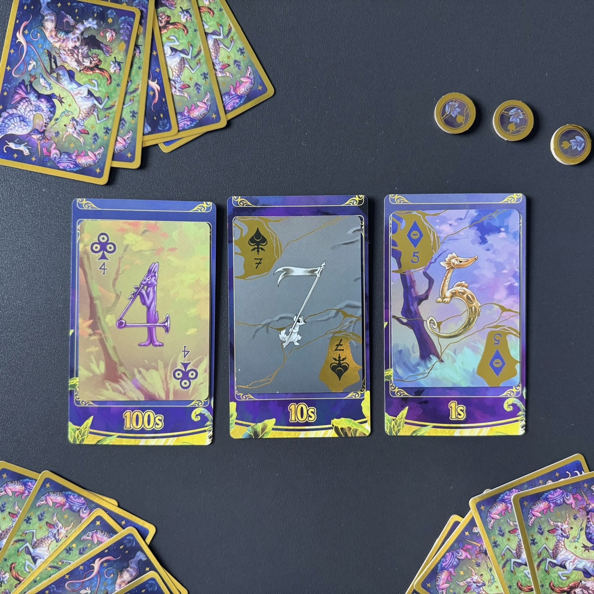
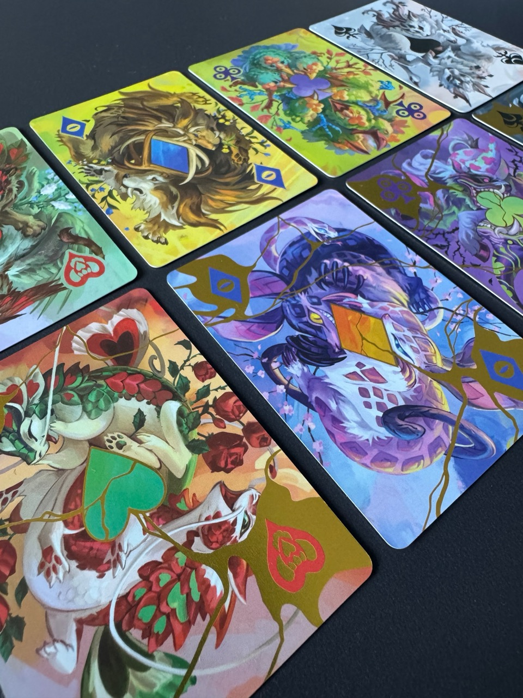
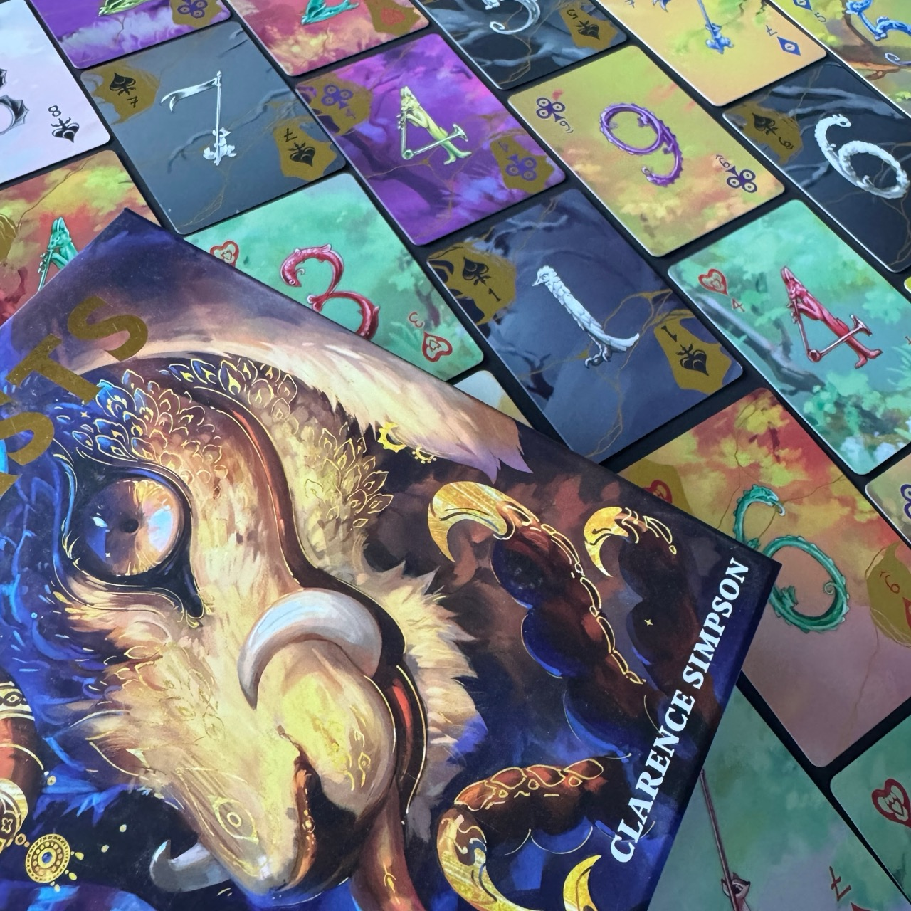

<Setting>

Tra i veli del tempo esiste un regno di numeri viventi, dove le cifre si muovono e ogni combinazione apre un varco nel reale. È lì che dimorano le <strong>Beasts</strong>, spiriti antichi nati dal disordine dei calcoli perduti, custodi di un equilibrio fragile e perfetto.

Quando la sequenza si incrina, i numeri tremano e le bestie si ridestano, portando con sé l’eco di un mondo dove la logica si dissolve nel mistero.

</Setting>

<Rules>

In <em>Beasts</em> i giocatori collaborano per <strong>costruire una sequenza di numeri a tre cifre sempre crescente</strong>, giocando carte numerate. Ogni carta è definita da un <strong>seme</strong> - Cuori, Fiori, Picche o Quadri - e da una <strong>varietà</strong>, Intero o Rotto: la combinazione di questi due elementi determina il <strong>Tipo della carta</strong>.

Durante il proprio turno, un giocatore sceglie un seme e <strong>gioca tutte le carte di quel seme</strong> dalla propria mano, una alla volta. <strong>Ogni carta viene posizionata in una delle tre colonne</strong> - centinaia, decine o unità - contribuendo alla creazione di un numero che deve essere sempre superiore a quello precedente. È anche possibile scartare tutte le carte presenti a destra di quella appena giocata, azzerando così le colonne corrispondenti. Al termine del turno, si pesca fino a tornare ad avere cinque carte in mano. <strong>Se un giocatore non ha carte legali da giocare, la partita termina immediatamente con una sconfitta collettiva.</strong>

<strong>Le Bestie sono carte speciali prive di valore numerico</strong>: bloccano tutte le carte dello stesso Tipo (dunque seme+varietà) nella colonna in cui si trovano. Quando vengono pescate, vengono collocate scoperte davanti al giocatore, ma contano comunque come carte in mano. <strong>Ogni Bestia viene giocata in modo diverso rispetto alle altre carte</strong>: viene posizionata sotto la prima colonna (partendo da quella delle unità e andando in ordine crescente fino alle centinaia) che non presenti lo stesso Tipo della Bestia; se tutte le colonne hanno già quel Tipo, la Bestia scappa per sempre. Quando si gioca una Bestia, il giocatore deve immediatamente giocare tutte le carte di quel seme. Da quel momento in poi, quando qualsiasi giocatore vorrà giocare una carta su una colonna, dovrà controllare che quest’ultima non sia “bloccata” da una bestia: queste carte speciali impediscono di giocare carte dello stesso tipo dove sono presenti!

<strong>Se i giocatori riescono a giocare tutte le carte del mazzo, vincono la partita</strong> e il loro punteggio è rappresentato dal numero al centro del tavolo.

</Rules>

<Feedback>

Beasts si fa apprezzare fin da subito per la <strong>qualità della produzione</strong>: carte e illustrazioni sono eccellenti e valorizzano molto l’esperienza al tavolo. Il sistema di gioco è solido e propone un puzzle interessante, soprattutto per chi apprezza i cooperativi basati sulla gestione delle risorse e delle tempistiche.

 Nel corso delle partite emerge, però, una forte <strong>componente di ottimizzazione delle giocate</strong> in favore della “mossa giusta al momento giusto”, che non sempre si traduce in una cooperazione attiva, in quanto ognuno, alla fine, sarà obbligato a guardare tanto il proprio orticello. <strong>A volte giocare un numero più alto non è affatto una scelta negativa</strong> - 100 è spesso meglio di 99 - perché consente di resettare due colonne e riaprire spazio di manovra per i turni successivi. Alcune idee, come la possibilità di far scappare del tutto una Bestia, restano affascinanti sulla carta ma risultano difficili da sfruttare senza creare problemi agli altri giocatori. <strong>Anche il regolamento non aiuta, richiedendo un certo impegno per essere assimilato.</strong>

<strong>Il numero di giocatori incide molto sull’esperienza</strong>: in tre Beasts dà il meglio di sé, con un buon equilibrio tra controllo e imprevedibilità; in due il gioco risulta più duro ma anche più facile da coordinare; in quattro, invece, tende a diventare caotico e meno leggibile. I <em>Discard Token</em> (dei segnalini che ci permettono, una volta usati, di scartare le carte che abbiamo in mano e di pescarne altrettante) restano uno strumento prezioso per gestire situazioni critiche e, aumentando la difficoltà, il gioco mostra un potenziale interessante.&nbsp;

In definitiva, un cooperativo ben confezionato, che funziona meglio in 3, con il gruppo giusto e con qualche partita alle spalle.

</Feedback>

