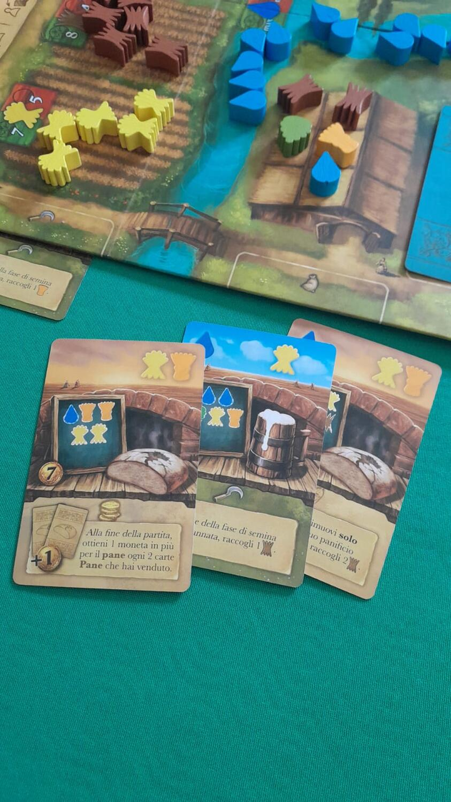
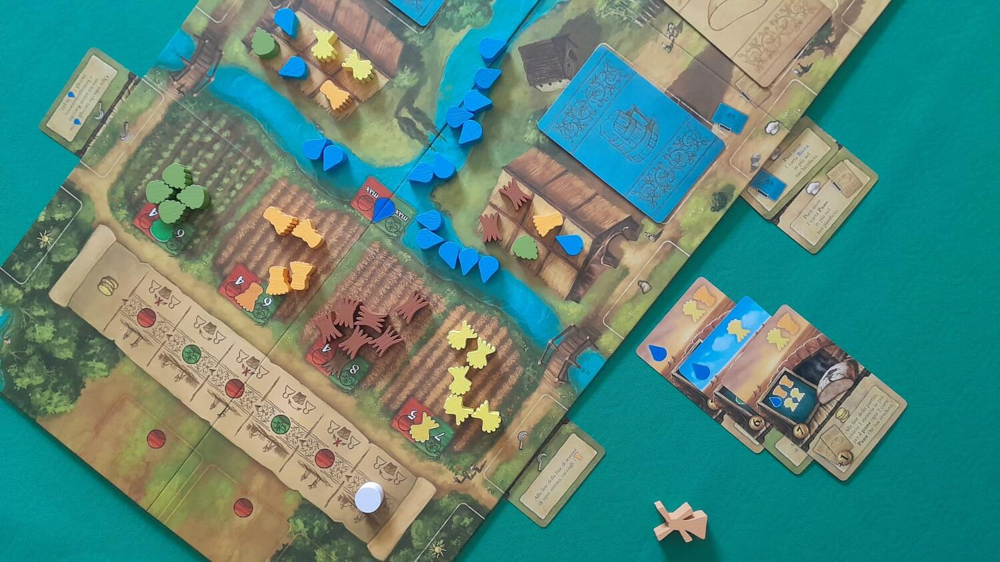
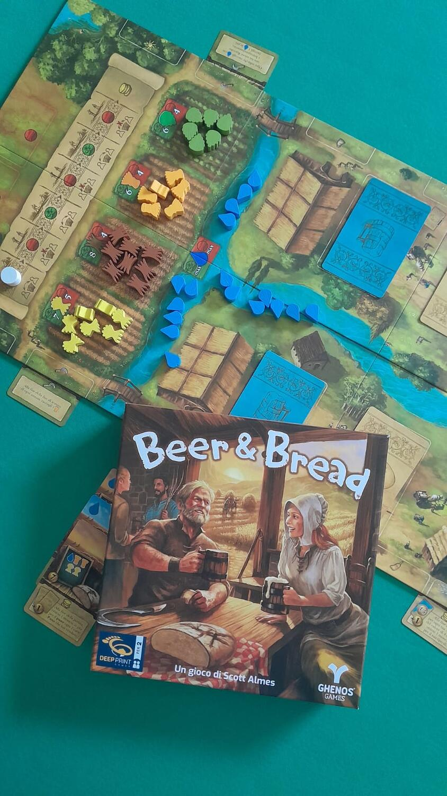

<Setting>

  Due <strong>villaggi</strong>, accomunati da un rigoglioso <strong>fiume</strong> e <strong>campi</strong> fertili, hanno tramandato negli anni la tradizionale tecnica di produzione di birra e pane. Nel corso di <strong>sei annate</strong>, ora fertili ora siccitose, ogni <strong>borgomastro</strong> dovrà organizzare al meglio le proprie risorse (immagazzinandole e/o raccogliendole) con le quali produrre vari tipi di <strong>pane</strong> e di <strong>birra</strong>, cosa che gli permetterà di ottenere <strong>monete</strong> alla fine della partita. 

</Setting>

<Rules>

  Una partita dura <strong>6 Round</strong>, alternati tra <strong>fertili</strong> e <strong>siccitosi</strong>. I
  giocatori iniziano con <strong>5 carte</strong> ciascuno, differenziate nel dorso tra <strong>Pane</strong> (beige) e{" "}
  <strong>Birra</strong> (azzurro).
   
  Nel <strong>Round Fertile</strong> i campi saranno più rigogliosi, forniranno più risorse e si giocherà una carta a
  turno, scambiandosi la mano, finché non saranno terminate le carte.
   
  Nel <strong>Round Siccitoso</strong> sui campi ci saranno meno risorse, i giocatori non si scambieranno più le carte e
  avranno 3 carte “comuni” che ognuno scambierà con le proprie, ma dovranno essere giocate immediatamente.
   
  Le <strong>carte</strong> hanno una <strong>triplice funzione</strong>: 
  a) <strong>Raccolto e Immagazzinamento</strong>, nella <em>parte alta</em>. Potremo prendere, dai campi, il numero e il
  tipo di risorse indicate e posizionarle nel magazzino, che ha un numero limitato di spazi. Se il magazzino è pieno, bisognerà
  donare le risorse all’avversario.
   
  b) <strong>Produzione</strong>, nella <em>parte centrale</em>. Si utilizzeranno le risorse immagazzinate per produrre Pane
  o Birra, con il limite iniziale di 1 a testa.
   
  c) <strong>Miglioria</strong>, nella <em>parte bassa</em>. Aumenterà l’efficienza del villaggio, ampliando gli spazi del
  Magazzino, della Produzione, incrementando la raccolta delle Risorse e i punti a fine partita. Infine, permetterà di liberare
  gli spazi di produzione.
   
  Nel passaggio tra un Round Fertile ed uno Siccitoso, i giocatori riprenderanno in mano le carte utilizzate come “raccolto”
  e ripristineranno il numero a 5 totali.
   
  Alla fine del sesto Round si calcolano i guadagni di Pane e Birra. <strong>    Il valore più basso tra i due sarà il punteggio finale</strong> di ciascuno dei 2 giocatori. Vince la partita il giocatore con il punteggio più alto.
   

</Rules>

<Feedback>

  Il gioco è <strong>compatto</strong>, <strong>portatile</strong> e <strong>graficamente piacevole</strong>. La{" "}
  <strong>componentistica</strong> è <strong>ottima</strong>, anche se le risorse grano e segale si somigliano sia nella
  forma che nel colore e la cosa potrebbe confondere un po’. Il <strong>regolamento</strong> è{" "}
  <strong>molto chiaro</strong>: il workflow della partita lo si impara in un paio di turni, semplice da apprendere
  com’è, senza che ciò impedisca al titolo di offrire <strong>una certa profondità</strong>. Per padroneggiarlo serve
  sicuramente fare qualche partita, anche per poter testare tutte le possibilità offerte dalle carte Miglioria. A
  differenza di <strong>altri giochi per due giocatori</strong> che abbiamo provato – tra i quali basterà citare anche
  soltanto <Link to="/reviews/7wonders-duel/">7 Wonders Duel</Link> o <Link to="/reviews/goryo">Goryo</Link> –,{" "}
  <em>Beer &amp; Bread</em> ci è sembrato <strong>molto sfidante</strong> e con un{" "}
  <strong>un’interazione diretta interessantissima</strong>: le azioni e scelte di un giocatore hanno una grande
  possibilità di avvantaggiare l’avversario, donandogli risorse e passandogli carte che in un dato momento della partita
  potrebbero essere determinanti.
   
  Esiste la possibilità di andare in “paralisi d’analisi”, a causa della triplice scelta che una carta offre,
  soprattutto perché il <strong>principale problema</strong> da risolvere è quello di giocarla al momento giusto in modo
  da massimizzare il profitto. A proposito di profitto, abbiamo trovato particolare il{" "}
  <strong>sistema di calcolo del punteggio</strong>, che cerca di fare rimanere i giocatori in equilibrio sulla
  produzione di pane e birra: sbilanciarsi porterà a sconfitta certa.
   
  <strong>Lo consigliamo alle coppie a cui piace sfidarsi</strong>: una partita tira l’altra!!!
   

</Feedback>

