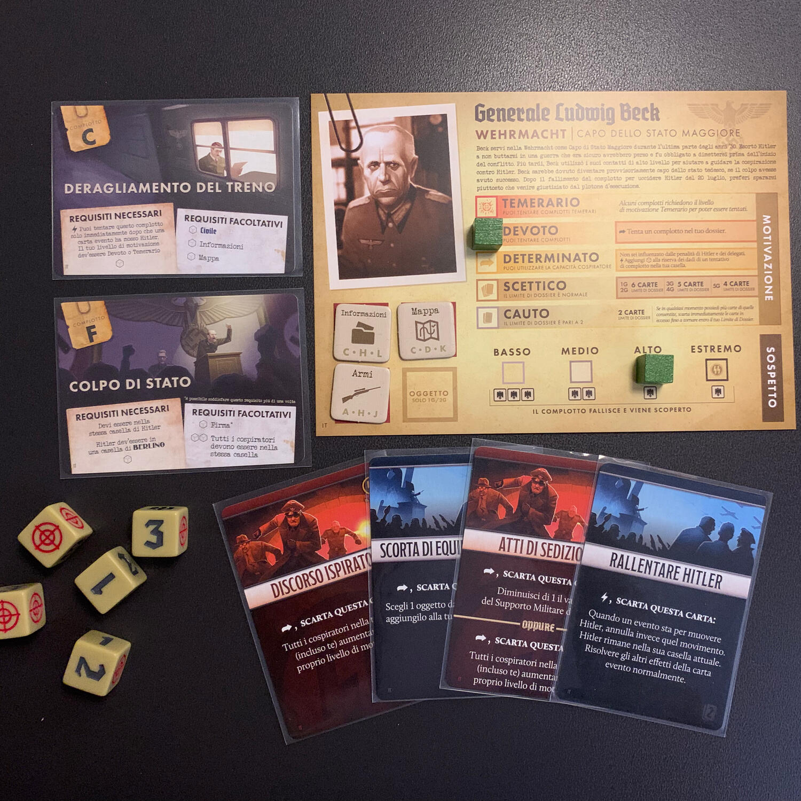

<Setting>

  Anno 1936.
   
  Mentre la stretta di Hitler sulla Germania si fa più serrata e la depravazione
  del regime viene alla luce, tra alcune delle più alte sfere del Reich inizia a
  prendere forma l'idea di assassinare il Führer.
   
  In Black Orchestra dovete ordire un complotto per assassinare il dittatore
  senza attirare le attenzioni indesiderate della Gestapo, il tutto mentre
  infuria la Seconda Guerra Mondiale.  
  <strong>Come fermerete Hitler?</strong>
   
  Avvelenando il cibo che mangerà durante un convengo?
   
  Posizionando una valigetta esplosiva nel palazzo in cui riposa?
   
  Facendo deragliare il treno con il quale si sta spostando da Monaco a Berlino?{" "}
   
  Questo lo deciderete voi.
   
  Ricordatevi che non potete uccidere qualcuno se non siete nel posto giusto al
  momento giusto.
   
  Ricordatevi che la storia non è dalla vostra parte.
   
  Ricordatevi di ricordare.

</Setting>

<Rules>

  Lo scopo della vostra partita è quello di ammazzare Hitler prima che la
  situazione sia del tutto irreversibile e per farlo dovrete preparare un
  attentato e portarlo a compimento.  
  Nel mazzo cospiratore sono presenti diversi attentati che potrete pescare assieme
  alle carte dossier, che vi aiuteranno nella vostra impresa. Preparare un attentato
  vi basta venire in possesso di armi, informazioni, veleno, e simili già presenti
  sulla mappa sotto forma di oggetto, che aspettano solo di essere trovate e raccolte
  da voi.
   
  La vostra partita ruota attorno alla preparazione di questi attentati e alla continua
  fuga dalla Gestapo che vi impedirà di muovervi con facilità, vi troverà e vi arresterà.
   
  Per farlo, ad ogni turno, avrete a disposizione <strong>    tre azioni</strong> tra cui poter scegliere, anche più di una volta, tra:
   
  <ul>
    <li>      <strong>Muoversi</strong>: vi muovete in una città adiacente a quella in cui siete;</li>
    <li>      <strong>Dossier</strong>: pescate una carta dal mazzo complotto;</li>
    <li>      <strong>Rivelare oggetti</strong>: se nella città in cui siete è presente un oggetto coperto, potete rivelarlo;</li>
    <li>      <strong>Raccogliere un oggetto</strong>: raccogliete un oggetto scoperto e lo aggiungete alla vostra plancia;</li>
    <li>      <strong>Trasferire</strong>: passate oggetti e carte da un giocatore all'altro nella stessa città;</li>
    <li>      <strong>Consegnare</strong> un oggetto: scartate un oggetto in cambio di benefit che dipendono dalla città in cui state;</li>
    <li>      <strong>Agire</strong>: attivate una carta presente nella vostra plancia giocatore;</li>
    <li>      <strong>Rilasciare</strong>: provate a rilasciare un vostro compagno arrestato dalla Gestapo;</li>
    <li>      <strong>Cospirare</strong> (utilizzabile una volta): lanciate fino a 3 dadi per provare a ottenere più azioni o a migliorare i personaggi… ma rischiate di far diventare la Gestapo un po' più sospettosa.</li>
  </ul>
       
      Finite le tre azioni, rivelerete una carta evento che potrebbe cambiare
      totalmente le posizioni sul tabellone dei membri del Reich o la forza
      dell'esercito tedesco (questo valore dirà quanti successi serviranno per
      compiere un attentato).  
      Quando avrete preparato per bene l'attentato, fate in modo di essere nella
      stessa città del Führer, lanciate una valanga di dadi, e sperate che la storia
      prenda un'altra piega. Potrebbe andare male. Probabilmente andrà male.
       
      Se fosse stato facile, ci sarebbero riusciti anche nella realtà, no?

</Rules>

<Feedback>

  Black Orchestra ti toglie il fiato, ti butta a terra e ti calpesta. Ogni
  turno.
   
  Poter vestire gli abiti del Generale Ludwig Beck e degli altri cospiratori che
  storicamente hanno fallito nel loro intento di liberare il mondo
  dall'oppressione nazista, dando loro una seconda occasione, è quanto di più
  romantico si possa concedere ad un gioco ambientato in quel periodo.
   
  Correrete da nord a sud, da est ad ovest, alla ricerca di armi che non
  troverete, di informazioni che non vi verranno date e continuerete a cambiare
  piano per mettere un punto fermo a questo periodo storico. Vi troverete a
  rincorrere Hitler, a scappare da Himmler, a liberare i vostri compagni
  arrestati dalla Gestapo (nella speranza di non essere arrestati a vostra
  volta) e vi sacrificherete ogni singolo turno per il bene del mondo.  
  Black Orchestra è un gioco <strong>abbastanza semplice</strong> ma che fa vivere
  davvero l'ambientazione: non ci sono orchi che invadono le vostre verdi lande,
  ma ci sono i gerarchi nazisti che ammazzano ebrei, che ordinano di mettere a ferro
  e fuoco la Polonia… e voi siete gli unici a poter impedire questi atti disumani.{" "}
   
  <strong>L'ansia</strong> e <strong>la disperazione</strong> salgono ogni
  turno, sarà sempre tardi per fare qualsiasi cosa e non sarete mai davvero
  pronti per un attentato… ma se si presenta l'occasione che si fa? Non si
  prova? E se si fallisce?
   
  La quantità di dadi che si lancerà è immensa, ma d'altronde, in un attentato
  entrano in gioco infinite variabili: il treno perso, un congresso inaspettato,
  un arresto che non doveva succedere, la crescita della forza politica di
  Hitler e molto, molto altro.
   
  Essere dei bravi giocatori non vi farà vincere questo gioco: dovrete avere
  tanta, <strong>tanta fortuna</strong>.  
  Fortuna che i nostri avi non hanno avuto.

</Feedback>
