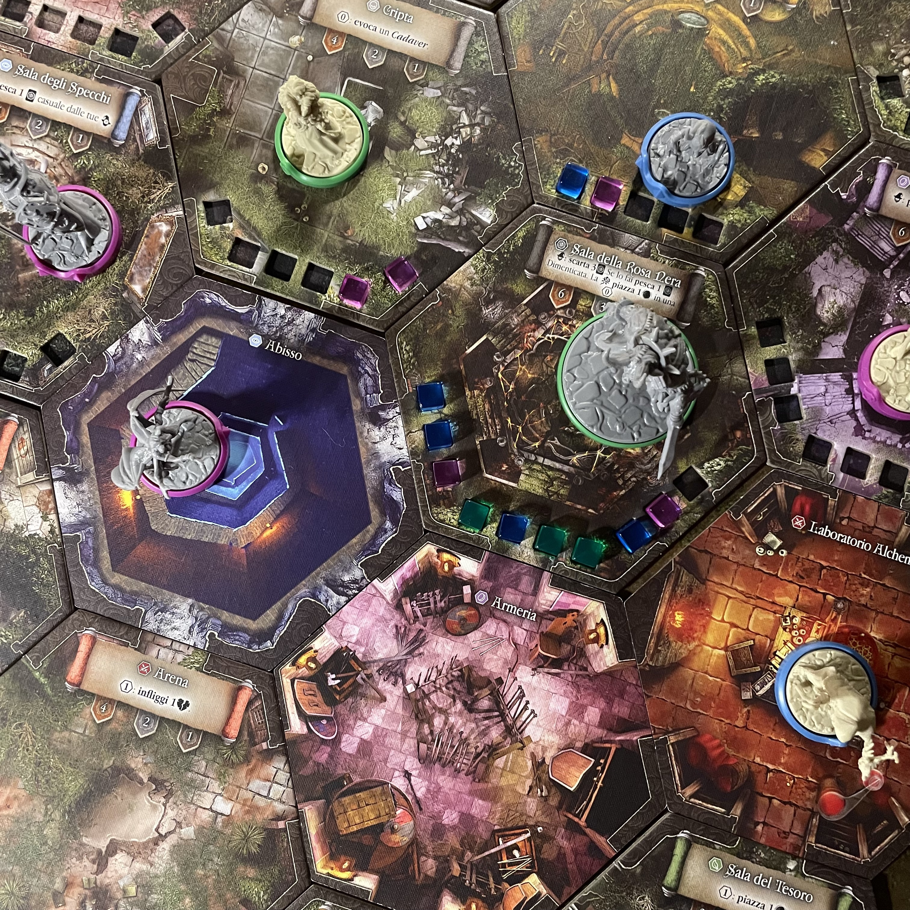
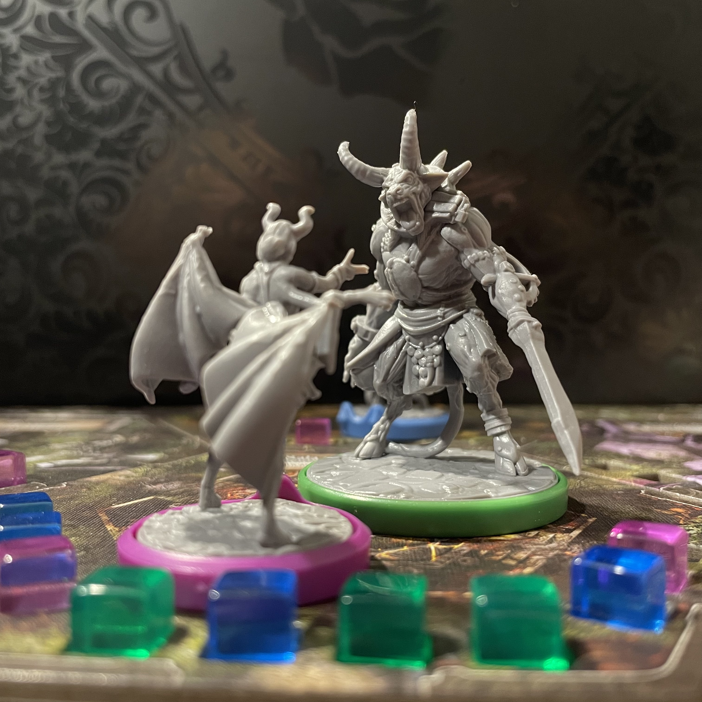
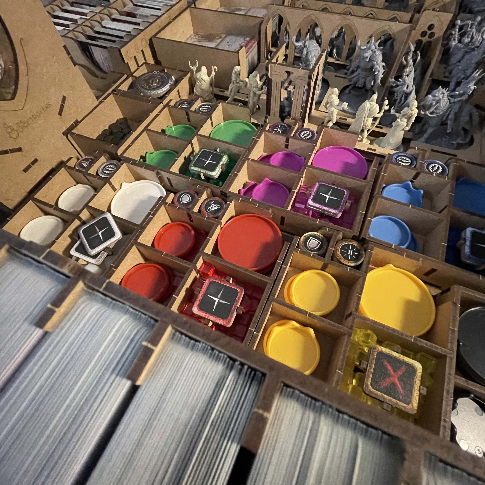

<Setting>

  La Loggia della Rosa Nera è <strong>distrutta</strong>, ma l’entità che ha sfidato i Maghi <strong>si aggira ancora</strong> tra i suoi anfratti e le sue Stanze in rovina. Attirati dalla contesa, <strong>nuovi incantatori</strong> rispondono alla chiamata, con <strong>nuove magie</strong>, <strong>nuove evocazioni</strong> e <strong>nuove tattiche</strong>, pronti a contendersi ancora una volta il titolo di Magister. Ricostruite la Loggia della Rosa Nera, mentre dimostrate di esserne gli unici degni campioni: fuori il grimorio! 

</Setting>

<Rules>

 BRW è uno <strong>skirmish di ambientazione fantasy</strong> in cui i giocatori interpretano dei Maghi che, con i loro incantesimi, si contendono il primato di Magister in un <strong>ambiente modulare</strong> che può cambiare intorno a loro e nel quale intervengono attivamente anche altre entità, prima tra tutte <strong>la Rosa Nera</strong>, insieme a numerose evocazioni. 
Per chi ha già giocato a <em><Link to="/reviews/black-rose-wars">BRW</Link></em> , le regole del secondo capitolo <em>BRW Rebirth</em> non saranno una gran novità, per quanto dobbiamo sottolineare uno sforzo di <strong>aggiustamento</strong> di alcune dinamiche. 
Per prima cosa, una volta scelti i maghi, con le loro scuole di magia, e predisposto il setup generale, si assegna il segnalino primo giocatore (Corona), che passerà di mano in mano a seconda che compaia su carte evento. 
Un turno si sviluppa in 6 fasi:  
<ul>
<li><strong>Fase della Rosa Nera</strong>: le <em>Carte Evento</em> sul tracciato si spostano verso destra; il giocatore a destra del detentore della <em>Corona</em> pesca un nuovo Evento, che andrà collocato sulla posizione indicata del tracciato o si risolverà immediatamente; entrambe le procedure possono innescare un guadagno di <em>Punti Potere</em> per la Rosa Nera. I Maghi, dal canto loro, possono scartare una <em>Carta Missione</em> attiva non risolta, con guadagno di PP anche in questo caso per la Rosa Nera.</li>
<li><strong>Fase di Studio</strong>: i giocatori, nel rispetto del limite di Carte in mano del loro personaggio, pescano 2 <em>Carte Magia</em> dal <em>Grimorio</em> personale e 4 <em>Carte dalle Scuole di Magia</em> presenti in gioco (di queste, ne terranno solo 2, scartando le altre nelle corrispondenti pile degli scarti).</li>
<li><strong>Fase di Preparazione</strong>: i giocatori collocano da 2 a 4 Carte sulla propria plancia personale a faccia in giù (Magie Pronte), tenendo il lato della magia selezionata in basso (in modo che al momento di rivelarlo il movimento della carta andrà dal basso verso l’alto). Occorre ricordare che dei 4 slot a disposizione, uno è riservato ad una Magia Rapida, mentre gli altri (in ordine, da I a III) obbligano il giocatore a lanciare le Magie in ordine di preparazione (appunto, dalla I alla III). In questa fase è possibile sfoltire il proprio Grimorio, sbarazzandosi di una delle Carte Magia in mano.</li>
<li><strong>Fase di Azione</strong>: il vero cuore del gioco avviene in questa fase. I giocatori dispongono di <em>Azioni Fisiche</em> (2 a turno, tra <em>Movimento, Attacco, Attivazione di Stanze, attivazione di Evocazioni, Scatto</em>, rappresentate da 2 token sulla <em>Plancia</em> di ciascun Mago) e <em>Lancio di M</em>agie. Ogni Mago durante il proprio turno … Quando tutti hanno lanciato le loro Magie e non hanno più segnalini Azione Fisica, si procede con la fase successiva. Il lancio di Magie che riportino un simbolo <em>Instabilità</em> fanno collocare cubi del colore del mago sugli slot della stanza. Durante questa Fase è inoltre possibile sconfiggere un Mago: ciò significa che gli attacchi degli altri Maghi o delle Evocazioni hanno collocato sufficienti cubi sulla sua plancia da colmare i suoi <em>Punti Ferita</em>. In conseguenza di ciò, il Mago sconfitto restituisce i cubi ai legittimi proprietari e ricomincia il proprio turno dalla sua Cella (la sua Stanza di partenza a inizio partita). Chi infligge il colpo di grazia a un Mago, sconfiggendolo, guadagna un Trofeo. Chi ha inflitto danni al Mago sconfitto, inoltre, guadagna Punti Potere proporzionalmente alla quantità relativa di danno inflitto.</li>
<li><strong>Fase di Evocazione</strong>: durante questa fase i Maghi attivano le <em>Evocazioni</em> sotto il loro controllo in ordine di turno a partire dal detentore della Corona. I giocatori possono scegliere a inizio partita se fare attivare tutte le Evocazioni di ciascun giocatore, prima di passare al successivo, oppure attivarne una a turno, procedendo in senso orario anche più volte finché tutte le Evocazioni non saranno state attivate. La prima modalità avvantaggia chiaramente il detentore della Corona.</li>
<li><strong>Fase di Pulizia</strong>: in questa fase i Maghi scartano le Magie lanciate tra le proprie <em>Memorie</em> (la zona adiacente alla Plancia personale riservata agli scarti del Grimorio); possono inoltre scegliere di lasciare sulla plancia (anche se non attive) le <em>Magie Trappola</em> o riprendere in mano le <em>Magie Scudo</em>.</li>
</ul>
La partita si conclude alla fine del turno in cui un giocatore (o anche la Rosa Nera) supera il valore 30 del <strong>Tracciato Potere</strong>. Dopo il conteggio dei punti finali (inclusi quelli derivanti dalla maggioranza dei trofei, delle Missioni risolte e il punto del segnalino Corona), si verifica chi ha vinto: e potrebbe anche aver vinto la Rosa Nera…

</Rules>

<Feedback>

  Annotazione preliminare <strong>per chi conosce già la saga</strong>: se ad attirarvi in BRW era stata l’esperienza visiva di quelle Stanze tutte luccicanti, dai colori magici e sgargianti, sappiate che quel godimento oculare era decisamente di maggiore impatto nel primo titolo: qui i toni sono decisamente più smorzati e cupi – che ben si adattano a una Loggia distrutta, beninteso – il che non è necessariamente un male, ma di primo acchito potrebbe stupirvi. Ma appena lancerete il primo incantesimo e appena ribalterete la prima Stanza, ricostruendola, ritroverete tutta l’atmosfera della Loggia segreta di BRW! Tra l’altro, con un sistema di attivazione delle Stanze che non si limita banalmente a replicare il predecessore ma ne ribalta la meccanica principale, aumentando le scelte strategiche e incrementando le possibilità dei giocatori a mano a mano che la Loggia viene ricostruita. Troverete, inoltre, che alcune novità, come la modalità di risoluzione delle missioni o la gestione delle azioni fisiche, migliorano notevolmente l’esperienza di gioco. 
<strong>Per chi non conoscesse il genere</strong> e andasse in cerca del <strong>Deckbuilding</strong> dei suoi sogni, vi avverto: non aspettatevi  <Link to="/reviews/dominion-nasce-un-regno">Dominion</Link>. Sarebbe più corretto, piuttosto, parlare in BRW e BRW Rebirth della presenza di “<strong>elementi di deckbuilding</strong>”. L’aspetto <strong>skirmish</strong>, a confronto, è decisamente più presente e significativo nella caratterizzazione del titolo: incoraggerei i giocatori interessati ad avvicinarsi al genere direttamente con BRW Rebirth. 
<strong>Immaginiamo che proviate questo titolo per la prima volta</strong>. La prima cosa che occorre sapere è che, malgrado il gioco abbia una longevità dignitosissima anche solo con il base, <em>BRW Rebirth</em> è di fatto un’esperienza ludica che va apprezzata attraverso le sue <strong>espansioni</strong>: e più se ne hanno, meglio è. Scava più a fondo del suo predecessore nel multiverso di Ludus Magnus Studio, rendendo alcuni add-on completamente interfacciabili con il colossale <em>Nova Aetas</em>, offrendo ai clienti più disponibili a sborsare grana un’<strong>esperienza gratificante e indimenticabile</strong>. 
Anche se si tratta di uno dei miei giochi preferiti, parliamo di <strong>due difetti macroscopici</strong>, <strong>che non intaccano in alcun modo la bellezza del titolo in sé e per sé</strong>. Il primo: la “sistemazione” delle regole. Il manuale non è particolarmente più intellegibile del precedente e, a parità di divertimento, dà luogo a dubbi che non vengono mai chiariti fino in fondo (lamentela, questa, assai frequente tra gli avventori di BGG), complice l’assenza di un Codex Arcanum, a differenza del predecessore. Anche sul fronte dell’accessibilità al gioco non ho visto grandi semplificazioni: di fatto, le meccaniche sono sempre le stesse (per quanto leggermente migliorate). La modifica più sostanziale e utile riguarda la gestione più flessibile e ottimizzata delle Azioni Fisiche. 
Veniamo al secondo difetto macroscopico. Contrariamente alla vulgata, secondo cui è possibile <strong>interfacciare il primo BRW con questo secondo capitolo</strong>, mi schiererò drasticamente dalla parte di chi non apprezza questo stratagemma di marketing della LMS e dirò (attirandomi addosso mille strali, lo so) che <strong>i due titoli non sono stati pensati sin dall’inizio per essere compatibili</strong>, malgrado vengano spacciati come tali. Lo si vede da molti fattori: magie pensate per distruggere, più che per ricostruire, schede personaggio organizzate in modo diverso, l’introduzione dell’Avatar… Gli amanti più sinceri di BRW sapranno <strong>certamente far dialogare</strong> le due strutture di gioco ma tutti gli altri mi consentano un consiglio: non lasciamo che la nostra passione per il gioco da tavolo accechi il nostro lucido (o ludico?) giudizio. 
Veniamo al <strong>piacere di giocare</strong> <em>BRW Rebirth</em>. La <strong>novità delle scuole di magia</strong> (<em>Agonia</em>,<em> Tecnomanzia</em>, <em>Alchimia</em>, <em>Malocchio</em>, <em>Incubo</em>, <em>Sciamanica</em>), che interagiscono molto di più sul fronte delle evocazioni, insieme ai nuovi incantesimi, ha certamente portato una boccata d’aria fresca. La <strong>modalità Avatar</strong>, poi, che introduce un sistema di IA che simula brillantemente la presenza al tavolo di un altro giocatore, si può integrare in molti modi accattivanti e (da non sottovalutare) fornirà di fatto un giocatore in più ai gruppi meno numerosi. Ma il gioco dà davvero il massimo, ripetiamolo, una volta che si adoperano le espansioni. Quelle della <strong>Rotas Box</strong> introducono una significativa quantità di Avatar supplementari, ciascuno con il proprio mazzo, con i loro token e con le loro strategie; inoltre, aumentano il numero di Maghi, di Evocazioni e di Scuole di Magia – queste ultime con delle combinazioni tattiche e delle meccaniche davvero intriganti. Ma l’espansione più apprezzata, senza ombra di dubbio, è <strong>Apocalypse</strong> (rimandiamo a un’altra occasione un approfondimento ad hoc). 
Ora, chi volesse portare il gioco a un così alto livello di esperienza sentirà subito la mancanza di un <strong>sistema organizzativo</strong> che permetta non solo di includere dentro la scatola base per l’appunto i materiali di queste importanti espansioni, ma anche di gestire con efficacia la fase di setup del gioco. A tal proposito, anche se si parla tanto di <em>ergonomia</em> della scatola base (che certamente è ben organizzata), bisogna nuovamente precisare che l’organizzazione fornito dalla LMS funziona finché non si hanno espansioni: ma come fanno, dico io, i giocatori più spendaccioni a gestire i loro enormi problemi di stoccaggio? Fortunatamente, può giungere in loro soccorso <strong>l’eccellente inserto di  <a href="https://thedicetroyers.com/it/shop/black-rose-wars-rebirth-it/?_gl=1*1aahit4*_up*MQ..*_ga*MTE2NDE1MzI4LjE3MTk0OTQ0NDQ.*_ga_KLNPJL684Z*MTcxOTQ5NDQ0NC4xLjEuMTcxOTQ5NDQ4Mi4wLjAuMA..">TheDicetroyers</a></strong>: per chi volesse sempre disporre non solo di una più ampia scelta delle scuole di magia, ma anche dell’espansione Apocalypse e del 5° e 6° giocatore, questo inserto diventa un <strong>prodotto immancabile</strong>. Soprattutto chi ha investito nell’opera omnia di BRW Rebirth ne ricaverà immenso beneficio: il <strong>guadagno di tempo e l’armonizzazione della gestione del contenuto nella scatola</strong> sono assicurati. Gli inserti di TheDicetroyers sono pensati non solo per alloggiare molte scuole di magia, add-on e alcuni set di miniature (non tutti, purtroppo) della Rotas Box, ma guardano anche e soprattutto al <strong>miglioramento dell’esperienza di gioco e al trasporto</strong>. I ragazzi di TheDicetroyers sono giocatori, e come tali sono specializzati nella semplificazione della vita di chi gioca (diciamo quest’eresia!) quasi più di chi produce il gioco: ho organizzato una gran quantità di partite a <em>BRW Rebirth </em>con il loro inserto e i tempi di setup e desetup si sono drasticamente accorciati, invogliandomi a intavolarlo più spesso e volentieri. E poi, con che perizia sfruttano il singolo millimetro di spazio in ogni scatola! Non saprete più farne a meno e quando accadrà… vi si aprirà il vaso di Pandora dei loro inserti… 
<strong><em>BRW Rebirth</em></strong><strong> merita</strong>. Se proprio non volete scialacquare il vostro patrimonio ma avete amici spendaccioni, patiti delle espansioni, che hanno pure l’inserto di TheDicetroyers… teneteveli stretti! 

</Feedback>

