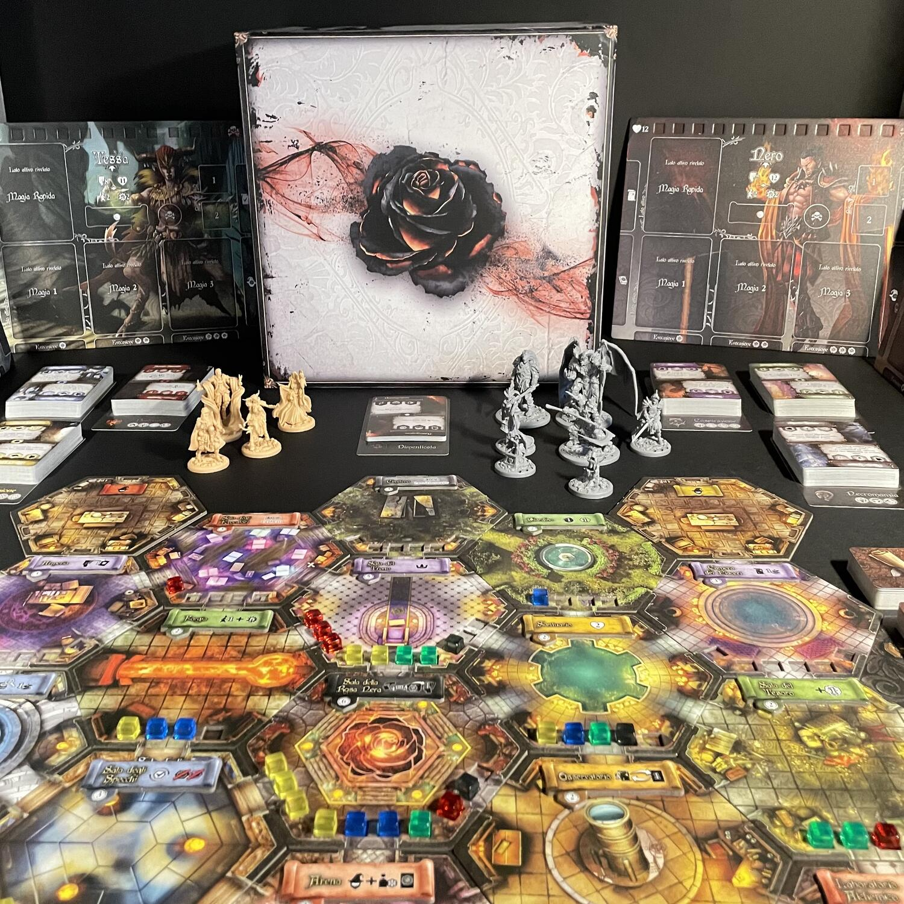
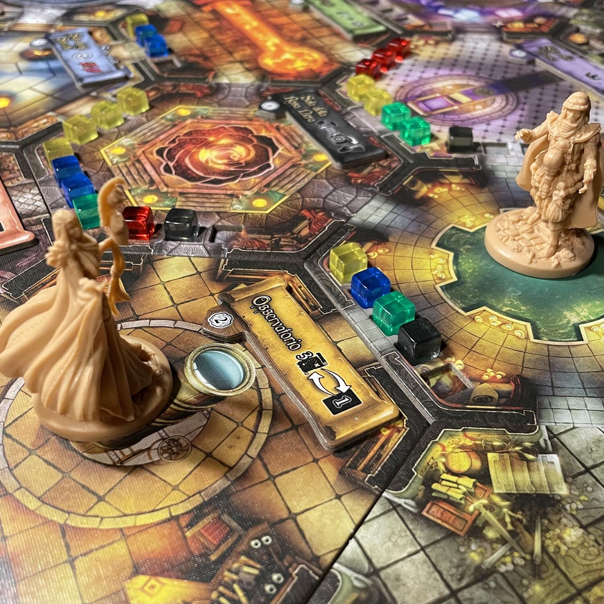

<Setting>

  Torino, A.D. 1522, in un Rinascimento alternativo. Torino: capitale
  dell'occulto, dell'esoterico, della magia. Con la Libreria Arethusa, il
  "Portone del Diavolo", la Sacra Sindone, il Libro dei Morti, l'Accademia delle
  Arti Magiche, il (presunto) Sepolcro del Graal, la Convergenza del Tutto e… la
  segretissima <strong>Loggia della Rosa Nera</strong>. Durante la partita, la
  Torino di Nova Aetas non la vedrete nemmeno ma, dopo aver dato battaglia nella
  Loggia (e magari aver letto l'opera di Marco Oliveri), neanche la vera Torino
  vi sembrerà più la stessa! Buona guerra…
   

</Setting>

<Rules>

  In qualsiasi configurazione, standard o sperimentale,{" "}
  <em>Sala della Rosa Nera</em> e <em>Sala del Trono</em> sono adiacenti tra
  loro e al centro, le <em>Celle dei Maghi</em> agli estremi. Ogni{" "}
  <em>Stanza</em> riceve il proprio <em>Segnalino Attivazione</em>.{" "}
  <em>Plancia Potere</em> e <em>Plancia Eventi</em> vanno ai lati della{" "}
  <em>Loggia</em>, insieme a <em>Carte Missione</em>,{" "}
  <em>Segnalino Attivazione</em> della <em>Sala della Rosa Nera</em>,{" "}
  <em>Carte Evocazione</em>, <em>Segnalini Danno</em>/<em>Instabilità</em> e{" "}
  <em>Carte Evento</em>. I 7 <em>Mazzi delle Scuole di Magia</em> (inclusa
  quella delle <em>Magie Dimenticate</em>, accessibile successivamente)
  formeranno la <em>Libreria</em>. Il primo giocatore, scelto un colore e un
  Mago, prende i relativi componenti e sceglie una <em>Scuola di Magia</em>{" "}
  iniziale, costituendo il suo <em>Grimorio</em> con 7 <em>Carte Magia</em>.
   
  Ogni{" "}
  <em>    <strong>Turno</strong></em>{" "}
  è diviso in 6{" "}
  <em>    <strong>Fasi</strong></em>  : 
  <ol>
    <li>      <strong>Rosa Nera</strong>: gli <em>Eventi</em>, Istantanei o meno,
      avanzano di uno spazio – con guadagno di <em>Punti Potere</em> da parte
      della <em>Rosa Nera</em>, nel caso di uscita dal tracciato; l’ultimo Mago
      ad agire pesca un nuovo Evento dal <em>Mazzo della Luna</em> attuale,
      appropriandosi del segnalino <em>Primo Giocatore</em> ove riporti una
      Corona; ogni giocatore pesca, se soddisfa i requisiti, 1{" "}
      <em>Carta Missione</em> dal mazzo corrente.</li>
    <li>      <strong>Studio</strong>: i Maghi pescano Carte dal proprio{" "}
      <em>Grimorio</em> e dalla <em>Libreria</em> e ne selezionano da aggiungere
      alla loro mano, senza eccedere il limite; possono scartare 1{" "}
      <em>Carta Magia</em> dalla propria mano nella pila del Mazzo
      corrispondente.</li>
    <li>      <strong>Preparazione</strong>: si piazzano tra 2 e 4 <em>Carte Magia</em>,
      coperte, sugli spazi delle <em>Schede del Mago</em>, orientate in base
      all’effetto che si vuole giocare; il loro ordine di attivazione va da
      sinistra a destra; la <em>Magia Rapida</em> può essere giocata al di fuori
      dell’ordine.</li>
    <li>      <strong>Azione</strong>: ogni giocatore a turno esegue una certa
      combinazione di <em>Azioni</em> (<em>Magie Standard</em> / <em>Rapide</em>{" "}
      o <em>Azioni Fisiche</em>) finché può farlo, attivando<em> Stanze</em>,
      usando <em>Trappole</em> e <em>Protezioni</em>, <em>scartando Carte</em>{" "}
      per muovere di un passo in più, colpendo bersagli, sconfiggendo altri
      Maghi e ottenendo i relativi <em>Segnalini Trofeo</em>, piazzando{" "}
      <em>Instabilità</em> nelle <em>Stanze</em> e contribuendo a{" "}
      <em>Distruggerle</em>, <em>Evocando</em> creature.</li>
    <li>      <strong>Evocazioni</strong>: le creature evocate possono muoversi e poi
      attaccare.</li>
    <li>      <strong>Pulizia</strong>: i Maghi piazzano nelle <em>Memorie</em> le{" "}
      <em>Carte Magia</em> giocate, ripristinano i <em>Segnalini Azione</em>,
      eliminano eventuali <em>Magie Dimenticate</em>; i{" "}
      <em>Segnalini Attivazione</em> delle <em>Stanze</em> si girano,{" "}
      <em>Stanze Instabili</em> vengono <em>Distrutte</em> e forniscono{" "}
      <em>Punti Potere </em>al Mago con la maggioranza di{" "}
      <em>Segnalini Instabilità</em> (in caso di pareggio il{" "}
      <em>Segnalino va alla Rosa Nera</em>); se un giocatore (anche la{" "}
      <em>Rosa Nera</em>) raggiunge o supera i 30 <em>Punti Potere</em>, la
      partita finisce, altrimenti si ricomincia un nuovo turno.
       A fine partita, conferiscono punti vittoria, oltre a quelli già segnati
      nel Tracciato, il <strong>Maggior numero di Missioni Completate</strong>, il{" "}
      <strong>Maggior numero di Segnalini Trofeo</strong>, ogni <strong>        Segnalino di Stanze Distrutte</strong>, il <strong>Segnalino Corona</strong>.</li>
  </ol>

</Rules>

<Feedback>

  Un’altra monade imponente? L’ennesimo gioco peso? Roba per fanatici
  dell’universo di Nova Aetas o di infinite schermaglie? Niente di più
  sbagliato. La confezione massiccia potrebbe scoraggiare i meno arditi: in
  realtà vi divertirete fin dalla prima partita, anche se il più ‘master’ del
  gruppo passerà molto tempo a controllare (e leggervi, ahimé, ad alta voce) il
  regolamento. Certo, il divertimento crescerà esponenzialmente quando saprete
  di quali malefici andarvi ad armare (perché fare il solletico ai piedi
  dell’avversario quando potreste incenerirlo con una bella palla di fuoco?) e,
  certo, padroneggiarlo sarà un altro paio di maniche. D’altronde, nessuno ha
  detto che diventare il nuovo <em>Gran Maestro della Rosa Nera</em> fosse
  semplice…
   
  Il regolamento del gioco presenta una serie di dettagli che qui volutamente
  sono stati omessi ma, una volta incamerata la struttura essenziale del turno,
  si lascia spulciare senza intoppi (giunge in soccorso, a tal proposito, il{" "}
  <strong>Codex Arcanum</strong>: un compendio che vi ritroverete spesso a
  consultare). Servirà a volte un pizzico di intraprendenza interpretativa,
  qualora vi imbattiate in una frase ambigua o in una regola non proprio
  esplicita, ma nelle sue linee teoriche il gioco funziona, eccome.
   
  La <em>Rosa Nera</em> è un’entità che aleggia dappertutto, dalle{" "}
  <em>Carte Missione</em> al tracciato dei <em>Punti Potere</em>: la possibilità
  che la vittoria possa esserle assegnata determinerà non poche scelte al tavolo
  e, poiché lo stesso ritmo di avanzamento della partita ne sarà influenzato, i
  giocatori dovranno stare costantemente in guardia.
   
  La componentistica è sontuosa, dalle illustrazioni alla qualità delle
  miniature: non riuscirete a staccarle gli occhi di dosso, ma questo genere di
  distrazione potrà risultarvi fatale… Perciò occhi aperti, se non volete essere{" "}
  <em>ridotti in cenere insieme a tutta la città</em>!

</Feedback>

