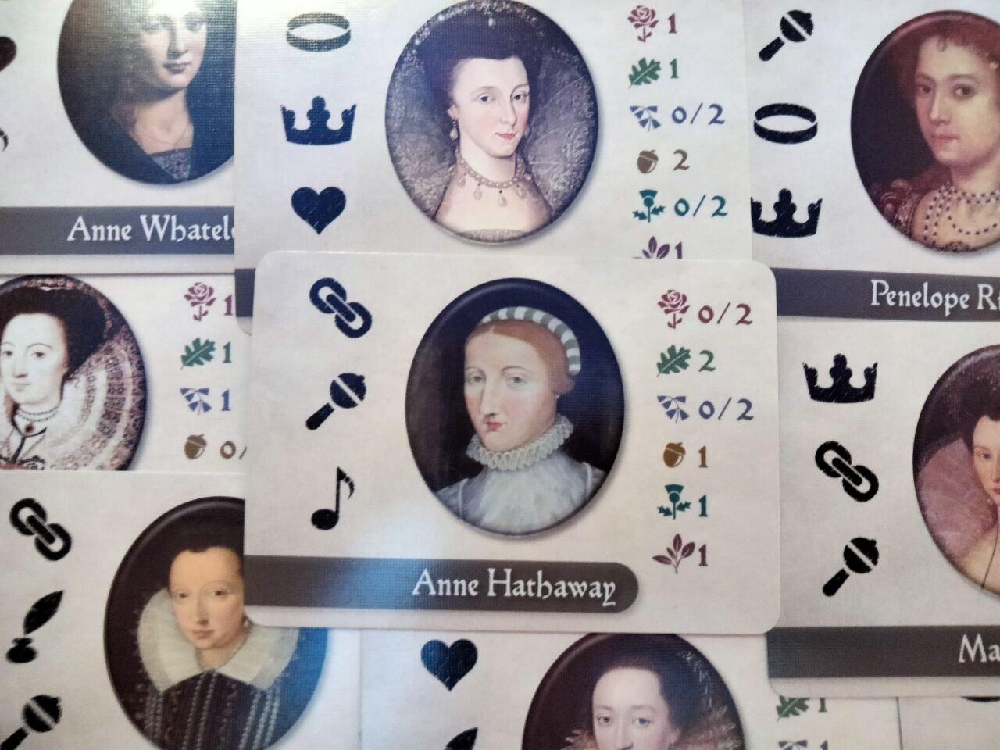
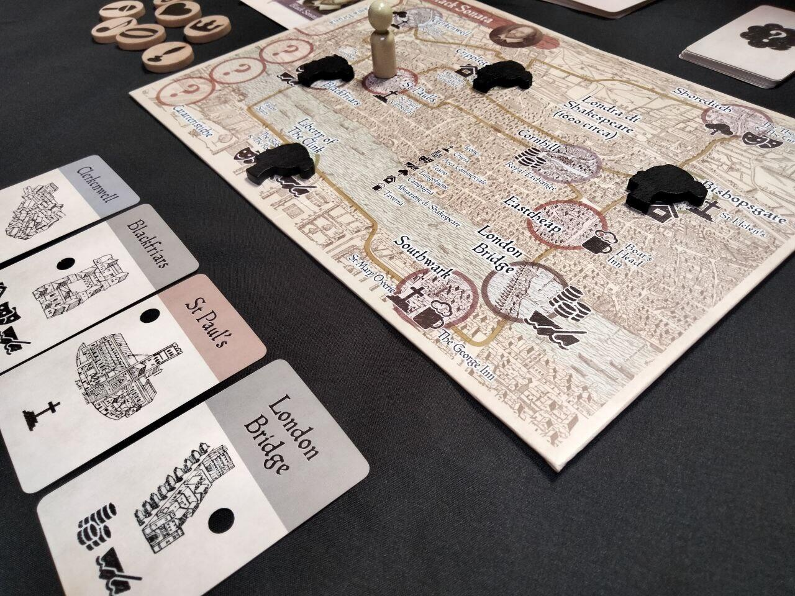

<Setting>

Da più di 400 anni studiosi e storici sono stati ossessionati dalla ricerca dell’identità della Dama Bruna citata nei sonetti di Shakespeare. Il Poeta trascorse buona parte della sua vita a Londra, scrivendo e lavorando nei teatri, sebbene la famiglia e la moglie, Anne Hathaway, si trovassero a Stratford. Questo periodo della sua vita ispirò ben 154 sonetti, pubblicati nel 1609 quasi sicuramente senza l’autorizzazione dell’autore; 28 di questi sonetti sono dedicati alla Dama Bruna.
Siete pronti a tornare nella Londra del 1600 e a percorrere le sue strade e i suoi vicoli per pedinare la schiva Dama? Molti miti e misteri circondano la vita di Shakespeare e occorrerà aguzzare l’ingegno per provare a svelare l’identità della donna.

</Setting>

<Rules>

L’obiettivo in Black Sonata è quello di scoprire l’identità della Dama Bruna, sorteggiata per la partita, deducendo le tre caratteristiche che la contraddistinguono.
Il turno di gioco si sviluppa in due fasi:

<ul>
  <li>Movimento della Dama;</li>
  <li>Turno del Giocatore.</li>
</ul>

Il <strong>Movimento della Dama</strong> è determinato da un mazzo (Discrezione) di 26 carte che indica il luogo in cui si nasconde. È bene ricordare il percorso della Dama perché, al termine del secondo giro del mazzo Discrezione, la partita termina con la sua fuga e la sconfitta del Giocatore. 

Il <strong>Turno del Giocatore</strong> si svolge scegliendo una tra le seguenti opzioni:

<ul>
  <li>Muovere la Pedina;</li>
  <li>Cercare la Dama Bruna;</li>
  <li>Usare la carta Nebbia;</li>
  <li>Passare.</li>
</ul>

<em>Muovere la Pedina</em> consente di visitare e raggiungere i diversi luoghi di
Londra. Visitarli tutti, infatti, è utile al Giocatore per ottenere una carta Indizio
e scoprire qualcosa in più sulle caratteristiche della Dama Bruna.
 
<em>Cercare la Dama Bruna</em> permette al giocatore di ottenere carte Indizio,
se e solo se si trovano entrambi nello stesso luogo. Per verificarlo si segue
una procedura ben precisa che utilizza speciali carte Nebbia. Al termine della
verifica, e dell’eventuale rivelazione della carta Indizio, la Dama fugge,
facendo perdere le proprie tracce.
 
Quando una carta Nebbia si trova in cima al mazzo Discrezione, è possibile <em>  Usare la carta Nebbia</em> per ottenere dei vantaggi. Attenzione però: non tutte aiuteranno nella
ricerca!
 
<em>Passare</em>, a volte, è un’opzione da non sottovalutare, specialmente se si
vuole aspettare la Dama Bruna e “tenderle un’imboscata”.  
Una volta raccolto un numero sufficiente di carte Indizio, si potrà <em>  Smascherare la Dama Bruna</em>. Questa azione richiede di trovare la donna misteriosa e utilizzare l’azione Cercare
la Dama Bruna. A questo punto, invece di pescare una nuova carta Indizio, devi rivelare
la carta della Dama messa da parte: se le tre caratteristiche dedotte corrispondono,
il giocatore ha vinto la partita. In caso contrario, ha perso; ma non disperate:
molti studiosi e storici hanno fallito per più di quattro secoli prima di voi!

</Rules>

<Feedback>

Tra i tanti giochi con <Link to='/mechanisms/movimento-nascosto/'>Movimento nascosto </Link>, Black Sonata occupa sicuramente un posto di rilevanza, grazie all’elevata rigiocabilità e ai tanti livelli di difficoltà, che può essere modulata costruendo il mazzo Discrezione in modi diversi, correggendo il numero di giri completi del mazzo Discrezione, rimuovendo una serie di carte Indizio o eliminando alcune le carte Nebbia durante la preparazione.  
È necessario osservare che il gioco richiede una piccola dose di manualità nello scorrere le carte Discrezione per non rivelare i successivi passi della donna e rovinarsi l’esperienza di gioco. Ma al di là di questo aspetto,Black Sonata è unico nel suo genere anche per meccaniche d’indagine: dover sbirciare, attraverso il foro di una serratura sulla carta, la sagoma di una donna e dover studiare il suo percorso, permette di immergersi completamente in un clima di ricerca e tensione. 
Se poi per voi svelare l’identità della Dama fosse troppo facile, è disponibile un’estensione con diverse espansioni, una delle quali a tema Bel Giovane, fonte di ispirazione dei restanti 126 sonetti shakespeariani. Riuscirete a svelare entrambe le identità nella stessa partita?

 
Fun fact: all’interno della scatola di gioco troverete una breve raccolta di sonetti
commentata dall’autore di Black Sonata.

</Feedback>

