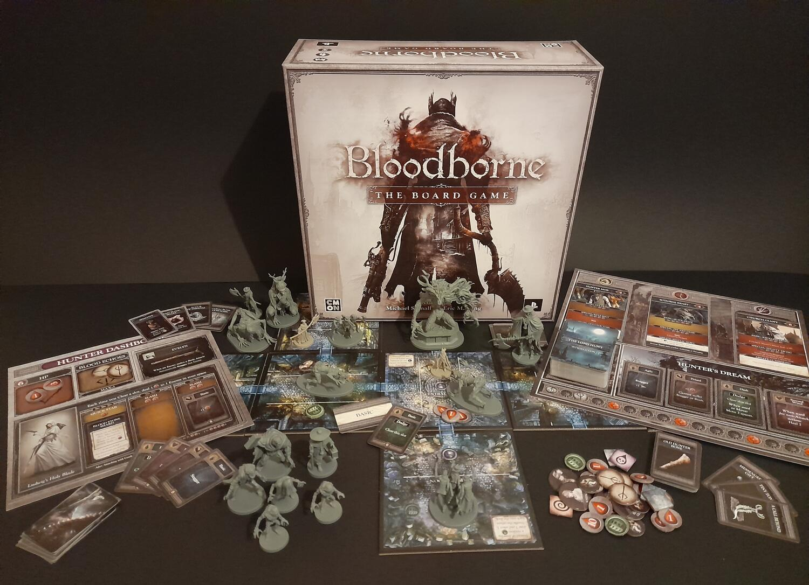
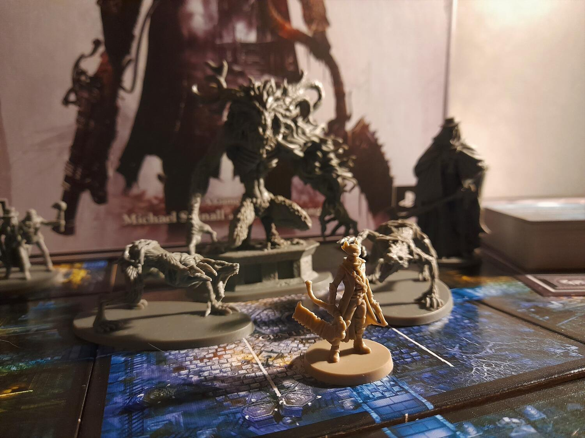

<Setting>

  Molto tempo fa si scoprirono le proprietà curative di un sangue misterioso, rinvenuto nelle profondità della foresta
  di Byrgenwerth, presso la città di Yarnham. Somministrato alla popolazione dalla Chiesa della Cura, il sangue guariva
  da ogni male. Si scoprì però ben presto che chi ne faceva uso tendeva a trasformarsi in una belva, una bestia omicida
  senza ragione. Troppo potente e diffuso per interromperne l'utilizzo, si decise invece di arginare la piaga in altro
  modo. Nacquero i cacciatori che, nelle notti di caccia, quando la luna piena è alta nel cielo, inseguono ed eliminano
  questi abitanti mutati in mostri e, a volte, creature anche peggiori… Questa notte, anche tu ti sei unito alla caccia!

</Setting>

<Rules>

  Dopo aver preparato i mazzi di consumabili e statistiche, si sceglie la campagna o il capitolo da giocare e se ne
  preparano le carte. Ogni giocatore seleziona poi uno dei quattro cacciatori disponibili, diversificati tra loro
  dall'arma utilizzata, ognuna con poteri, danni e velocità d'attacco differenti. Armi diverse prevedono approcci
  differenti ai combattimenti. Ogni cacciatore dispone poi di un proprio mazzo (inizialmente uguale per tutti) e di
  un'arma da fuoco. Infine, rivelata la prima carta del capitolo, si esegue la preparazione specifica: tessere terreno,
  mostri, obiettivi ecc. Ora siete pronti per mondare le strade di Yharnam dalla piaga delle belve!
   
  I giocatori eseguono un turno a testa all'interno di un round di gioco: per ogni carta che scartano dalla mano possono
  svolgere un'azione tra movimento, interazione, trasformazione dell'arma e ritorno nel sogno del cacciatore. Per
  attaccare, invece, si pone la carta su uno dei tre slot dell'arma. Sia gli attacchi dei cacciatori che quelli delle
  belve hanno danni e velocità diverse. Se l'attacco del cacciatore non è sufficiente ad uccidere l'avversario o è
  semplicemente più lento, subirà un contrattacco dalla creatura, subendo danni e potenzialmente finendo per essere
  fatto a pezzi.
   
  Finito il turno, tutte le creature “a portata” si attivano, avvicinandosi al cacciatore attivo e attaccandolo se
  possibile, dopo di che si fa avanzare la luna di sangue (il conta turni).
   
  Si procede in questo modo finché non si soddisfano gli obiettivi dello scenario, vincendo, o il contatore dei turni
  non supera l'ultima casella, decretando la sconfitta dei giocatori.

</Rules>

<Feedback>

  All'interno del gioco troverete quattro campagne, corrispondenti ai primi quattro boss del videogioco, divise in tre
  capitoli ognuna, per un totale di circa 20 ore, facendole tutte una volta. Le storie, narrate brevemente dalle carte
  “campagna”, le splendide miniature, i cacciatori, tutto partecipa nel far respirare l'aria fetida di Yharnam, che
  siate veterani del videogioco o che sia la vostra prima visita alla città. Il sistema di combattimento è estremamente
  ben congegnato, atto ad avvicinarsi alla dinamicità della versione videoludica: i mostri hanno pattern d'attacco
  parzialmente prevedibili su cui si può pianificare, prestando attenzione alla velocità degli attacchi, alle
  caratteristiche della propria arma e a stare sempre ben pronti a schivare. Anche la notoria difficoltà dei “Souls” è
  presente: da un lato belve che se mal gestite vi spediranno nel sogno in men che non si dica, dall'altro la necessità
  di non metterci troppo tempo perché il contatore dei turni procede inesorabile. Proprio quest'ultimo ha fatto storcere
  il naso a più di qualcuno perché avulso dall'ambientazione. A mio parere l'inserimento di un “timer” funziona invece
  benissimo per trasmettere ai giocatori quel senso d'ansia e urgenza che altrimenti mancherebbe (un po' come fanno i
  segnalini destino in Arkham Horror).
   
  Un difetto invece evidente è il regolamento, non chiarissimo in alcune parti. Ma non disperate, su Bgg è stato
  esaustivamente sviscerato dagli stessi autori, e quasi tutti i dubbi trovano ora risposta nelle Faq.
   
  Dal punto di vista di materiali e miniature non c'è davvero niente da dire: la Cmon da tempo ci ha abituato ad
  un'elevata qualità, e anche in questo caso non si smentisce.
   
  Amanti di Bloodborne, dei collaborativi, di giochi dal combattimento “intelligente” e di splendide miniature da
  dipingere, non avete scuse: Yharnam vi sta aspettando!

</Feedback>

