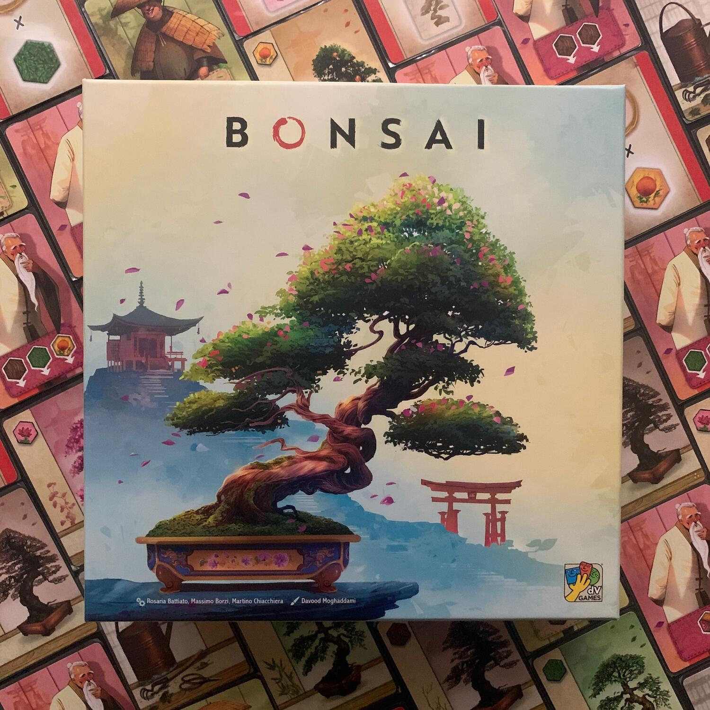
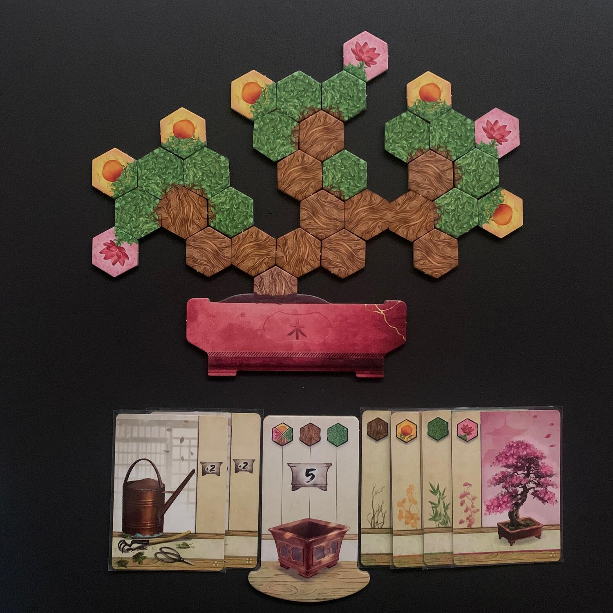

<Setting>

  Il termine giapponese "bonsai" significa "coltivare in un vassoio".
   
  Un bonsai è un'opera d'arte vivente, una pianta perfetta in miniatura,
  identica in tutto e per tutto al suo simile a grandezza naturale, ma decine di
  volte più piccola. Un bonsai è un microcosmo che contiene al suo interno,
  immutato in tutto tranne che nelle dimensioni, il mistero dell'universo.

</Setting>

<Rules>

  Lo scopo di bonsai è quello di fare in modo che il nostro alberello sia il più
  redditizio (in termini di punti vittoria) di quello di tutti gli avversari al
  tavolo.
   
  Per farlo andremo, turno dopo turno, a <strong>meditare</strong>, ovvero a
  scegliere delle carte da un mercatino oppure, quando sarà il momento, a{" "}
  <strong>coltivare</strong>, ossia a far crescere il nostro bonsai tramite le
  tessere.
   
  Ci sono <strong>4 tipologie di tessera bonsai</strong>: il legno, le foglie, i
  fiori e i frutti, ognuno con le sue regole di piazzamento. Il legno e le
  foglie devono stare vicini al legno, i fiori crescono attaccati alle foglie e
  i frutti si posano tra almeno due foglie.
   
  La nostra plancia, inizialmente, è composta da un semplice vaso da cui spunta
  un tronchetto (che crescerà e diventerà il nostro alberello) e, sotto di
  questo, da una <strong>tessera seishi</strong> (ndr: l'arte di dar forma e di
  coltivare un bonsai) che definirà i nostri limiti nella meditazione e nella
  coltivazione. Il primo limite ci obbligherà a{" "}
  <strong>non avere più di 5 tessere bonsai nella nostra riserva</strong>,
  mentre il secondo a posizionare nel bonsai solamente un legno, una foglia e
  una tessera a nostra scelta quando andremo a coltivare.
   
  Ed è qui che entrano in gioco le carte. Ce ne sono di 5 tipologie:  
  <ul>
    <li>      <strong>crescita</strong>: fanno coltivare più velocemente, permettendo di
      posizionare sull'alberello più tessere contemporaneamente oltre alle 3
      iniziali;</li>
    <li>      <strong>strumento</strong>: aumentano il limite di riserva di 2;</li>
    <li>      <strong>maestro</strong>: fanno raccogliere 1 o 2 tessere bonsai extra
      oltre al solito bonus del mercatino;</li>
    <li>      <strong>aiutante</strong>: fanno posizionare immediatamente nel bonsai
      delle tessere in nostro possesso;</li>
    <li>      <strong>pergamena</strong>: danno ulteriori modi di far punti a fine
      partita, ad esempio 1 punto per ogni legno nell'albero.</li>
  </ul>
  Quando andremo a coltivare, dovremo tenere in considerazione anche i 3
  obiettivi globali scelti a inizio partita. Appena ne soddisferemo uno, potremo
  decidere di prenderlo (e fare punti) rinunciando a conquistare i successivi,
  oppure potremo aspettare nella speranza di raggiungere il successivo livello,
  con il rischio di rimanere a bocca asciutta.
   
  La partita continuerà alternandosi tra i giocatori e terminerà quando finirà
  il mazzo di pesca.  
  Si farà un turno finale e poi si conteranno i punti provenienti dalle <strong>    tessere</strong> di cui è composto il nostro bonsai, dalle <strong>    carte pergamena</strong> e dagli <strong>obiettivi globali</strong>. Ogni foglia vale 3 punti,
  ogni fiore un punto per ogni lato vuoto che lo circonda, mentre il frutto vale
  sempre 7 punti, ma non può avere altri frutti adiacenti.

</Rules>

<Feedback>

  Più che "regole in breve", la sezione precedente si potrebbe chiamare "regole
  quasi complete" in quanto mancano davvero 2-3 dettagli di poco conto per avere
  la visione totale del regolamento. Questo per dire che il gioco è tanto
  semplice, quanto diretto.  È un gioco ideale per introdurre nuovi adepti
  nel mondo del gioco da tavolo: 4 regole molto semplici che fanno di Bonsai un{" "}
  <Link to="/mechanisms/piazzamento-tessere">piazzamento tessere</Link> perfetto
  a questo scopo.  
  Al tavolo fa la sua <strong>bella figura</strong>… a tal punto che non si fa in
  tempo a finire una partita in associazione che qualcun altro vuole rigiocarlo immediatamente.
   
  Se siete <strong>neofiti</strong> e vi ha incuriosito la meccanica e il modo in
  cui è stata s-fruttata per costruire dei bellissimi bonsai, questo è assolutamente
  un buon titolo per iniziare: <strong>    in 10 minuti leggerete il regolamento</strong> e potrete giocarlo davvero con chiunque, facendo crescere dentro di voi
  la famosa scimmia che vi farà spendere un sacco di soldi nell'hobby più bello di
  sempre.
   
  Da <strong>giocatori esperti</strong>, lo apprezzerete sicuramente per la resa
  al tavolo e per quello che vi permetterà di fare con 4 regole in croce. Non direte
  mai ai vostri amici "Stasera ci troviamo per un Bonsai?", ma sarà uno dei <strong>    filler</strong> che prenderete in considerazione per iniziare la serata mentre aspettate
  le pizze, oppure quello che userete per rilassare la testa dopo il <Link to="/reviews/black-rose-wars/">
    Black Rose Wars
  </Link> di turno. <strong>Bonsai è molto zen</strong>, davvero!
   
  Siete dei giocatori da solitario? Nessun problema. Bonsai vi offre una <strong>    modalità in solo niente male</strong> che si basa su scenari tutti diversi. L'automa è davvero semplice da
  gestire: basterà scartare una carta specifica dal mercatino a seconda del fatto
  che decidiate di meditare o di coltivare.
   
  In ogni caso, credo (e spero) che questo gioco possa dare ancora molto e che ora
  sia soltanto un <strong>piccolo seme</strong> che andrà a germogliare con le <strong>    innumerevoli espansioni</strong> che si potrebbero creare: banalmente, mi sarebbe piaciuto avere più tipologie
  di tessere bonsai e regole di posizionamento più complicate per rendere il nostro
  alberello ancora più complesso da far crescere.
   
  Ci sono due ultimi dettagli che mi hanno sorpreso e che mi hanno fatto davvero
  piacere. Il primo è che ogni copia acquistata aiuterà a piantare nuovi alberi nell'Africa
  sub-sahariana tramite <a href="https://trees.org/" target="_blank">Trees for the future</a>. Il secondo è che il manuale contiene una parte revisionata dall'<a href="https://www.ubibonsai.it/" target="_blank">Unione Bonsaisti Italiani</a>{" "}
  che, in due pagine, racconta la filosofia che un buon cultore di questa arte
  dovrebbe seguire e ci descrive i principali stili di bonsai: ad esempio, io ho
  capito che che vorrei un "Bunjin" a casa, mentre il "Kengai" non fa proprio
  per me!

</Feedback>

