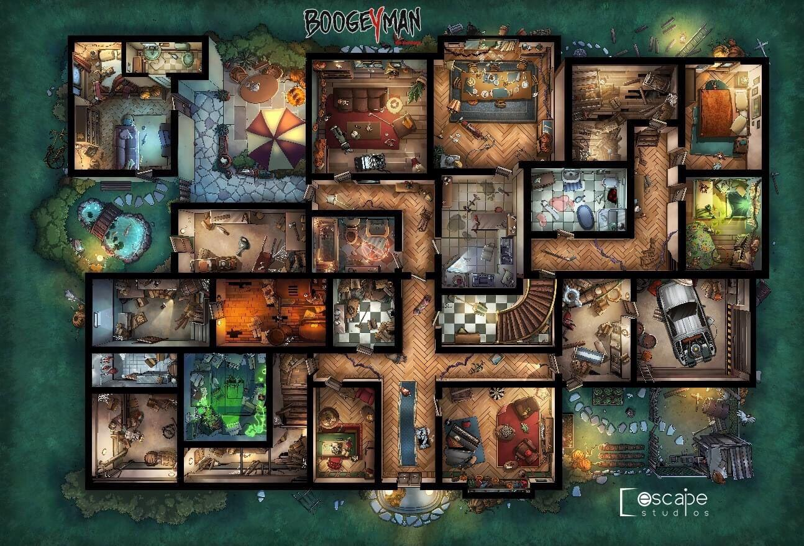

<Setting>

  Sicuramente avete memoria di quella sensazione che da piccoli vi portava ad
  aver timore di entrare in una stanza buia oppure di guardare sotto il letto…
  ed allo stesso tempo però di quel brivido che vi correva lungo la schiena per
  la trepidante voglia di sconfiggere quella paura e scacciare l'Uomo Nero dai
  vostri incubi…
   
  Ecco, questo è esattamente quello che potrete ritrovare in Boogeyman, il tutto
  pervaso da un'atmosfera super anni 80!  
  La plancia infatti vuole ricreare una villa di quel periodo, per non parlare della
  grafica, delle carte e dei riferimenti ad oggetti realmente riconducibili a quel
  tempo; ogni piccolo dettaglio vi evocherà 80's vibes e per chi ha vissuto quegli
  anni da bambino o adolescente sarà un vero tuffo nel passato, ma anche per i più
  giovani l'esperienza non sarà da meno!  
   
  Ma perché si è scelta proprio quest'ambientazione?  
  “Da ragazzino degli anni 80'” dice Antonio Ferrara autore del gioco “Boogeyman
  era l'incubo che albergava tra le ombre di casa. La maggior parte dei nostri
  genitori per farci stare buoni ci ripeteva che se non facevano i bravi sarebbe
  arrivato Boogeyman o il lupo cattivo a prenderci. Ora questa cosa fa
  sorridere, ma vi posso garantire che su un bambino queste storielle mettevano
  i brividi, quindi da grande e dopo essere sopravvissuto a Boogeyman, ho voluto
  omaggiarlo con un gioco da tavolo per permettere a tutti di poter esorcizzare
  questa figura tramite il gioco.”  

</Setting>

<Rules>

  Ad inizio partita, dopo aver sistemato il tabellone e disposto tutti i
  segnalini necessari, ogni giocatore pesca una carta missione personale che
  dovrà tenere nascosta per tutta la partita; dopo di che viene pescata
  un'ulteriore carta missione che diventerà invece l'obiettivo principale del
  gruppo e che i bambini dovranno concludere muomendosi tra le innumerevoli
  stanze della casa senza, ovviamente, farsi prendere da Boogeyman o dalla
  babysitter psicopatica!  
   
  Il round si sviluppa in due parti: il turno dei bambini e il turno di
  Boogeyman e Jennifer.  
  Le azioni che possono effettuare i bambini sono svariate: muoversi, rimuovere un
  segnalino luce/buio o un segalino lucchetto, svolgere una ricerca oppure risvegliare
  un altro bambino se è svenuto.  
  Alcune azioni poi sono gratuite come giocare carte ricerca, giocare segnalini
  caramella, modificare il risultato del dado o scambiarsi oggetti quando si
  trovano nella stessa stanza.  
  A differenza dei bimbi Boogeyman non si muove in maniera canonica, di casella in
  casella, ma appare di turno in turno in una stanza diversa precedentemente scelta
  casualmente; quali interazioni innescherà la sua comparsa? Sarete fortunati o vi
  troverete faccia a faccia con lui?  
   
  Infine quando le condizioni per terminate la missione sono state rispettate verrà
  intrapresa l'ultima fase durante la quale si scoprirà il finale raggiunto.  
  Solo prima di questo passo i giocatori potranno svelare la loro carta missione
  personale.

</Rules>

<Feedback>

  Sicuramente due degli aspetti che più rendono interessante questo gioco sono
  la possibilità di avere più finali a disposizione e quella di poter scegliere
  modalità diverse di gioco a seconda dell'esperienza che si desidera vivere e
  dal gruppo con cui si affronterà l'avventura. Entrambi aiutano a rendere il
  gioco longevo e sicuramente con un'alta variabilità!  
   
  Vogliamo poi parlare del Fusion System? Un particolare sistema che farà
  compiere ai giocatori particolari azioni o li farà interagire con oggetti
  comuni, il tutto nella vita reale, al di fiori del gioco. Queste azioni
  avranno delle conseguenze dirette sullo svolgimento dell'avventura e in base a
  questa compenetrazione tra realtà e finzione potranno accadere o non accadere
  diverse cose e situazioni.  
   
  Ma veniamo alla vera curiosità sul gioco:  
  Boogeyman è il prequel di Tales of Evil?  
  “Sì” risponde Antonio “infatti l'universo narrativo è lo stesso ed i
  personaggi che interpreterete sono gli stessi di ToE.  
  Si tratta però di un gioco completamente diverso e indipendente!”  
   
  Bene lettori, con queste premesse, ed avendo già messo mano a Tales of Evil, che
  tra l'altro ho adorato, non posso che essere super curiosa e trepidante per l'uscita
  di Boogeyman.  
   
  Sperando di aver suscitato in voi un po' di curiosità in fondo potete trovare il
  link diretto per l'acquisto!

</Feedback>

