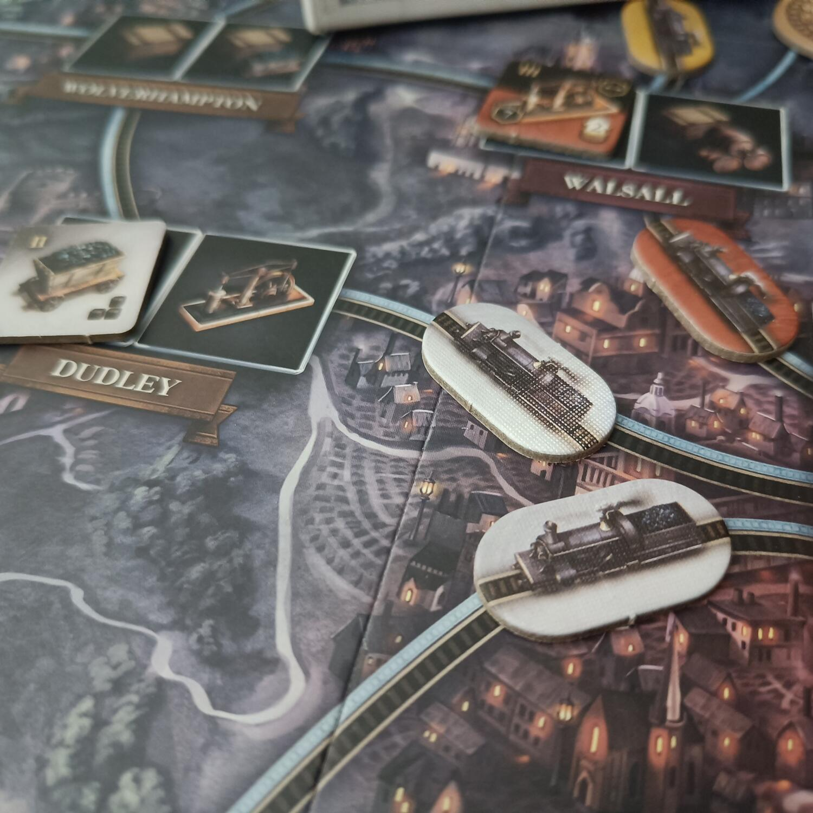
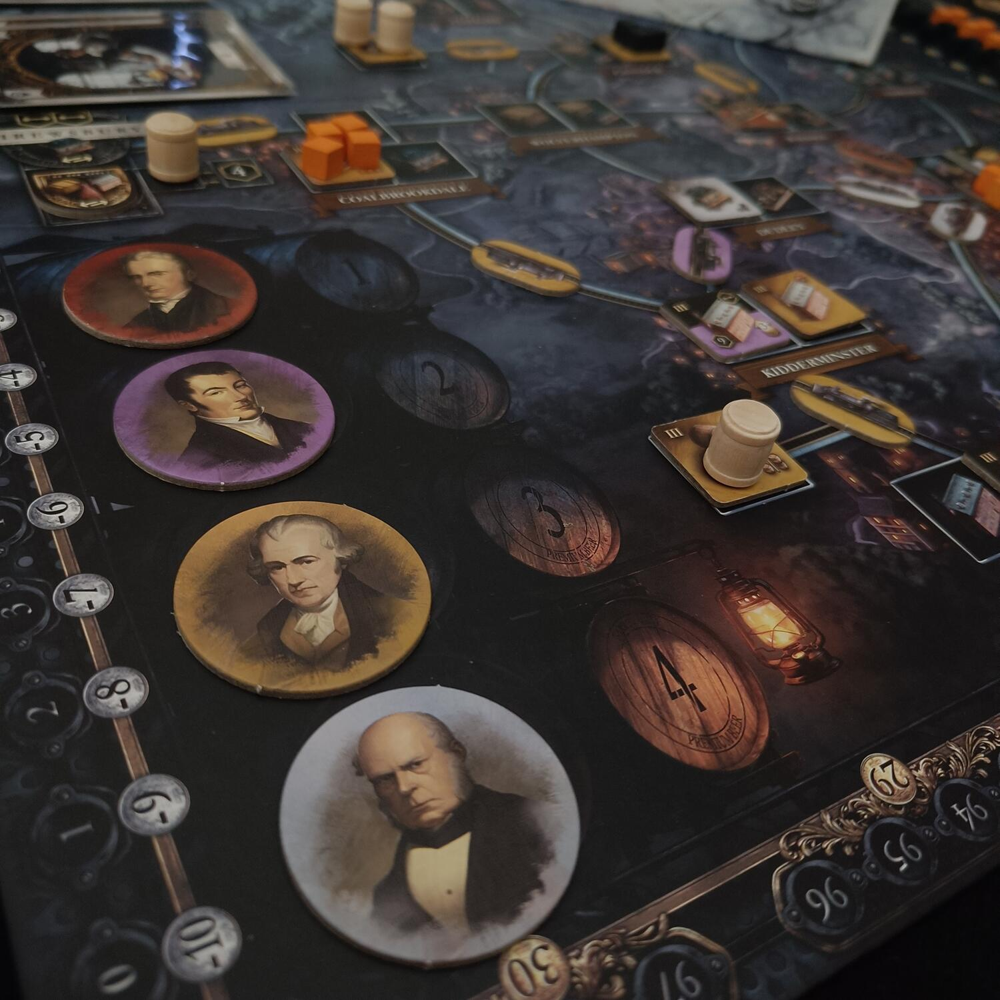
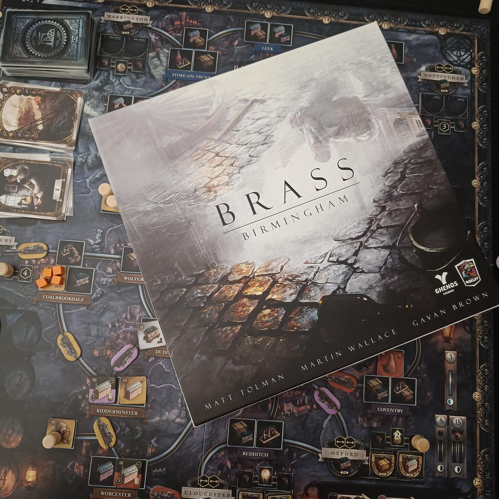

<Setting>

  “<strong>Brass: Birmingham</strong>” ci porta a rivivere uno dei periodi più
  dinamici della storia della Rivoluzione Industriale, in uno dei fulcri di
  questo periodo: l’omonima città del titolo e le West Midlands. Saremo chiamati
  quindi a creare la nostra <strong>rete industriale</strong>, mettendo insieme
  una ragnatela di <strong>collegamenti </strong>e <strong>fabbriche </strong>
  efficiente e produttiva.
   
  Questo gioco, del 2018, è la variante stand-alone di “<strong>    Brass: Lancashire</strong>”, il quale a sua volta è la riedizione di “Age of Industry”, creato da
  Martin Wallace e pubblicato per la prima volta nel 2010.
   

</Setting>

<Rules>

  "Brass: Birmingham" è un gioco competitivo da 2 a 4 giocatori, dove
  gareggeremo per creare la migliore rete industriale.
   
  Ogni giocatore avrà a disposizione una propria plancia personale, con delle
  tessere che rappresentano <strong>sei tipologie diverse di edifici</strong>, a
  loro volta suddivisi in livelli crescenti di sviluppo, e{" "}
  <strong>8 carte in mano</strong>, che potranno mostrare un tipo di edificio
  oppure una città.
   È importante focalizzare l’attenzione su due concetti preliminari: la differenza
  tra <strong>rete personale</strong>, costituita esclusivamente da collegamenti
  e città del proprio colore, e la <strong>rete generale</strong>, formata dalle
  connessioni di tutti i giocatori. Se non ben esplicitato, quando scriveremo di
  connessioni o collegamenti ci riferiremo alla rete generale.
   
  Il secondo punto sul quale concentrarsi è invece dato dalle
  <strong> tre risorse </strong>del gioco:
   
  <ul>
    <li>      il <strong>ferro</strong>, che potrà essere sfruttato e comprato da tutti i giocatori in qualsiasi momento;</li>
    <li>      il <strong>carbone</strong>, che invece potrà essere sfruttato solo se il punto dove lo si vuole usare è connesso al punto dove è il carbone presente (e, allo stesso modo, potrà essere acquistato solo se si è connessi ad un mercato);</li>
    <li>      la <strong>birra</strong>, che potrà essere sfruttata in qualsiasi momento dai giocatori proprietari del birrificio d’origine, oppure dagli altri giocatori, solo se con la rete generale arrivano a connettersi a quel birrificio.</li>
  </ul>
   
  Durante ogni turno, ciascun giocatore effettuerà <strong>due azioni</strong>,
  scartando per ognuna di queste una carta, scegliendo fra:
  <ul>
    <li>      <strong>Costruzione</strong>: ogni giocatore potrà posizionare sulla mappa una tessera edificio (partendo sempre dal livello più basso disponibile), scartando una carta che mostra la città dove si vuole realizzare la costruzione, oppure la tipologia di struttura. In quest’ultimo caso l’edificio dovrà essere posizionato su una città facente parte della propria rete personale. Ogni edificio richiederà inoltre il pagamento di denaro e di alcune risorse indicate, da sfruttare secondo quanto indicato sopra. Ogni tessera verrà disposta a faccia in giù, e su tre tipologie di edificio (carboniere, acciaierie e birrifici) verrà posizionato il numero di risorse indicate (carbone, ferro e birra). Quando non saranno più presenti risorse sopra una determinata tessera, questa verrà girata a faccia in su, permettendo il guadagno dei punti rendita e punti vittoria indicati.</li>
    <li>      <strong>Collegamento</strong>: ogni giocatore, scartando qualsiasi carta e pagando il corrispondente costo in denaro e carbone quando richiesto, realizzerà un collegamento tra una città e l’altra. Quel collegamento non potrà più essere occupato da nessun altro giocatore.</li>
    <li>      <strong>Sviluppo</strong>: pagando uno o due risorse ferro, si scarteranno altrettante tessere edificio, a partire dal livello più basso. Quest’azione permette di costruire molto prima edifici di livello più alto, che portano in dote più punti.</li>
    <li>      <strong>Vendita</strong>: questa azione permette di “sviluppare” (ovvero di girare a faccia in su) i lanifici, le manifatture e le fornaci collegati al corrispondente mercato, e di guadagnare i punti rendita e vittoria indicati.</li>
    <li>      <strong>Prestito</strong>: si possono perdere tre livelli di rendita per guadagnare 30 monete.</li>
    <li>      <strong>Spionaggio</strong>: è possibile scartare due carte per guadagnare una carta jolly luogo o edificio.</li>
  </ul>
      La partita è divisa in due fasi, l’<strong>era dei canali</strong>, che ha
      alcune limitazioni e che rallenta lo sviluppo della rete di ciascun
      giocatore, e infine l’<strong>era delle ferrovie</strong>: ciascuna era
      terminerà quando tutti i giocatori avranno giocato tutte le carte dalla
      loro mano, e si procederà quindi al conteggio dei punti vittoria per
      determinare il vincitore.

</Rules>

<Feedback>

  Tanto si è detto e tanto si può dire su "<strong>Brass Birmingham</strong>",
  soprattutto in questo momento storico (Ottobre 2023), dopo che da qualche mese
  questo gioco ha conquistato la{" "}
  <strong>cima della prestigiosa classifica di Boardgamegeek</strong>, soffiando
  il posto, dopo tanti anni, a Gloomhaven. È quindi il capolavoro assoluto, il
  “PIÙ-BEL-GIOCO-DEL-MONDO”? Assolutamente no, perché la classifiche possono
  essere solo un’indicazione e mai un dato oggettivo: ma questo è un primato che
  ha avuto un riscontro nella nostra vita di giocatori.
   
  Parliamo di un gioco dal peso medio-alto: ma il <strong>regolamento</strong>,
  pur presentando <strong>parecchie eccezioni</strong>,{" "}
  <strong>è facilmente assimilabile</strong>, a tal punto che siamo riusciti a
  far giocare a “Brass: Birmingham” anche alcuni giocatori appena oltre il
  livello di neofita. Ma la <strong>profondità di gioco</strong> restituita è{" "}
  <strong>straordinaria</strong>: dovremo essere pronti a pianificare una
  strategia per sviluppare al meglio la nostra rete, ma dovremo al contempo
  essere sempre
   
  pronti a fare le azioni e a sfruttare le{" "}
  <strong>risorse (che spesso si rivelano spesso carenti)</strong> al momento
  giusto, soffiandole agli avversari. Soprattutto per la birra, fondamentale per
  poter effettuare l’azione di vendita, vi sarà una corsa ad accaparrarsela,
  cosa che renderà <strong>l’interazione, seppur indiretta, molto forte</strong>
  : questa sarà inoltre aumentata dagli spazi limitati per la realizzazione delle
  costruzioni e dei collegamenti, fondamentali per racimolare punti vittoria. La
  varietà di edifici, di reti e di relazioni tra giocatori che si possono creare
  rende il gioco molto vario e diversificato.
   
  Vi è inoltre un elemento non banale che abbiamo notato: per realizzare le azioni
  è spesso necessario sfruttare le risorse fornite da altri giocatori, quindi, sebbene
  l’interazione sia forte e a volte cattiva, <strong>    lo sviluppo della nostra rete e dei nostri edifici paradossalmente porterà
    sempre anche alcuni benefici per gli avversari</strong>
  . 
  Un po’ come nel mondo reale, dove nella visione capitalistica (stiamo parlando
  di Rivoluzione Industriale, no?) la concorrenza tra i privati crea un’economia
  dinamica e fiorente, e porta ad un beneficio medio complessivo: nella sua semplicità,
  non trovate geniale il riuscire a ricreare questa dinamica in un gioco da tavolo?
   
  "Brass Birmingham", insieme al suo gemello "<strong>Brass Lancashire</strong>",
  è insomma uno di quei due-tre prodotti che non si possono non provare nella propria
  vita almeno una volta: <strong>    un gioco eccezionale, da gustare, capire e approfondire con attenzione e
    cura</strong>.

</Feedback>

