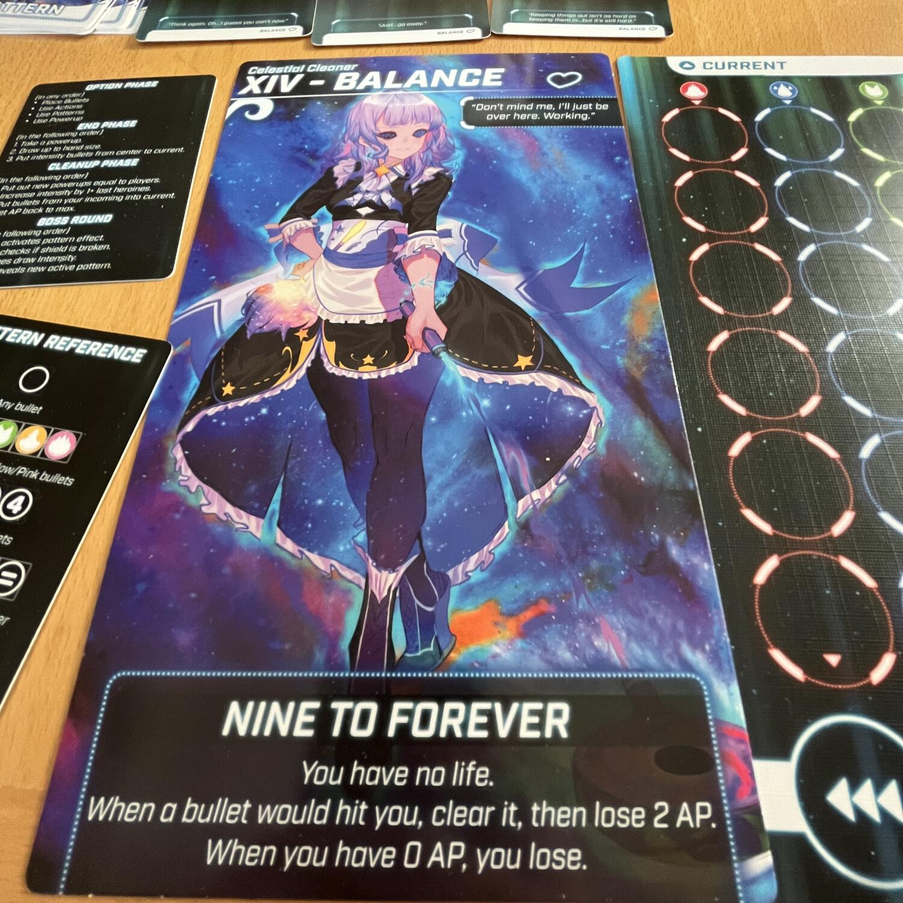
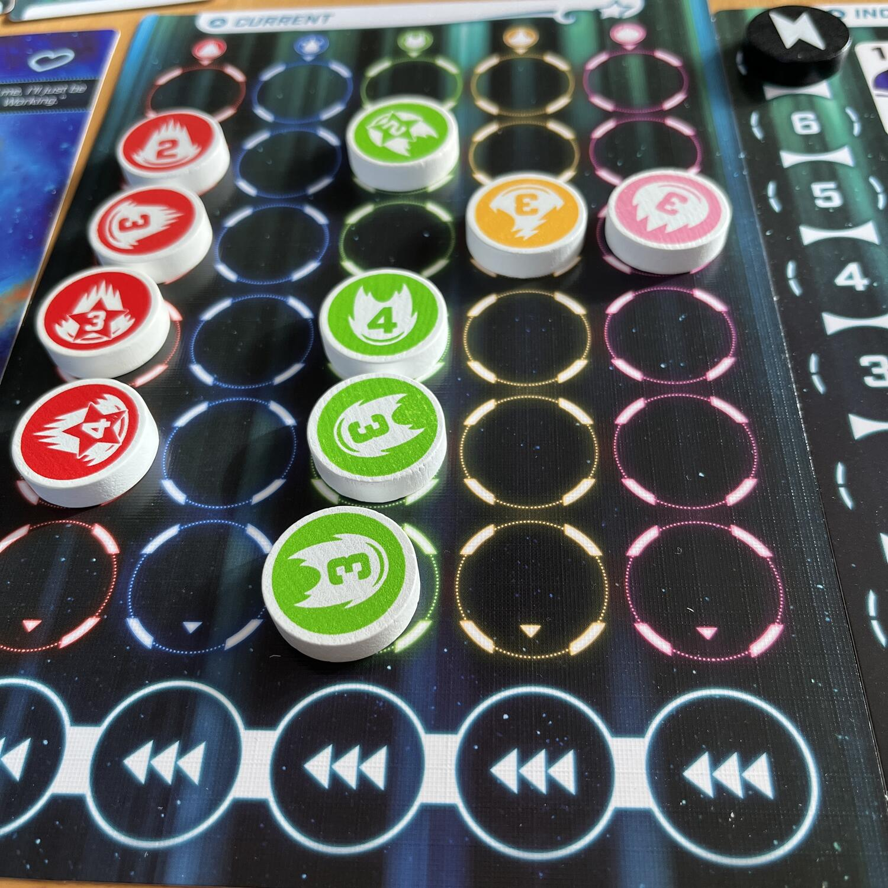
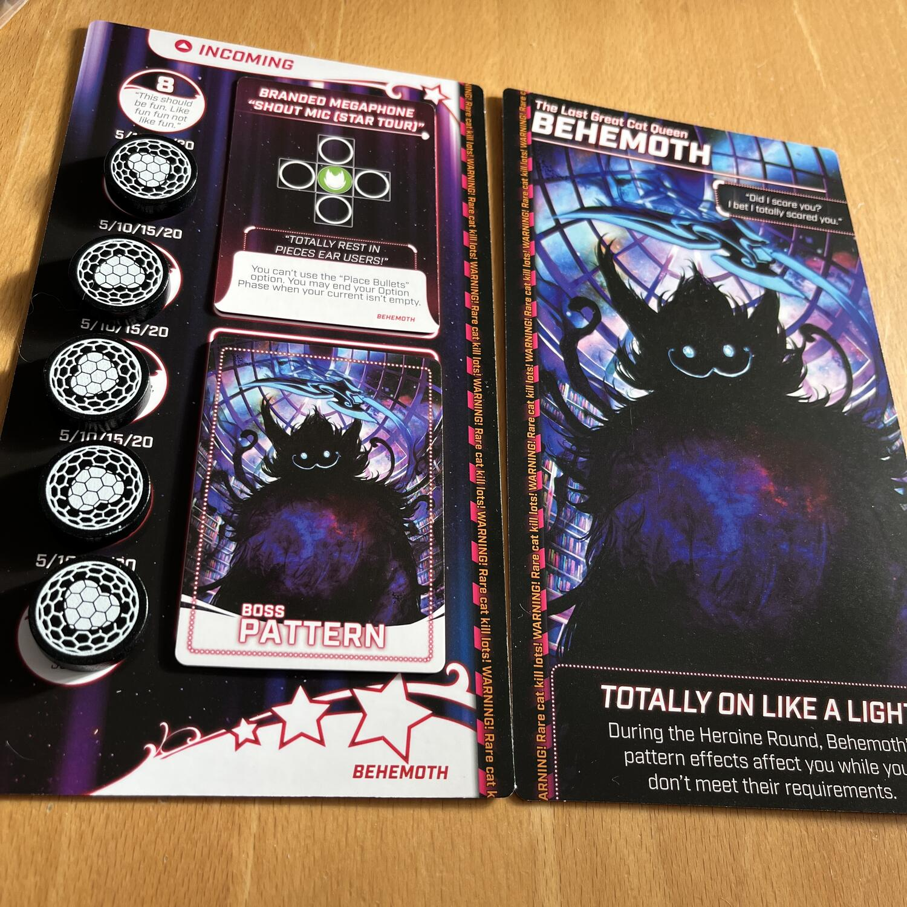

<Setting>

  Le eroine più forti dell'universo si stanno per scontrare in una battaglia
  senza esclusioni di colpi… O di proiettili… O di zombie? O di news?  
  Beh ci siamo capiti, in Bullet bisogna essere pronti a tutto per uscirne vincitori!
  Sia affrontando altri giocatori, sia affrontando delle potentissime eroine corrotte
  in modalità solitario. Un <strong> gioco per tutti i gusti </strong>!

</Setting>

<Rules>

  Bullet ha 4 modalità di gioco: Solitario, Cooperativo, tutti contro tutti e
  scontro a squadre. Tutte queste modalità si intersecano tra di loro senza
  cambiare le regole base del gioco, ma solo aggiungendo o togliendo poteri
  speciali. <strong> Fantasmagorico, no? </strong>  
  Il gioco segue un meccanismo che si ispira al <em>shoot'em up</em> dei videogiochi.
  I giocatori avranno una griglia su cui scorreranno dei proiettili, ciascuno di
  tanti spazi verso il basso quanto indicato dal numero su di esso. Se c'è già un
  proiettile che blocca la strada, si scende allo spazio successivo. Se i proiettili
  arrivano in fondo, si è stati colpiti. E se si viene colpiti troppe volte? <strong>    Game Over</strong>
   
  Tutto il gioco si baserà sull'interazione dei giocatori con questa griglia. Ci
  saranno poteri speciali in grado di manipolare la posizione dei proiettili, effetti
  che faranno le cose più disparate e carte con dei <Link to="/mechanisms/costruzione-pattern/">
    pattern
  </Link>, che faranno dirottare i proiettili dalla propria plancia verso gli avversari.
   
  All'inizio di ogni turno arriveranno sulla plancia del giocatore un numero di proiettili
  definito dal livello di intensità del round corrente più tutti i proiettili mandati
  dagli altri giocatori.
   
  Se si gioca contro giocatori umani il tutto deve essere gestito nel limite di un
  timer. Si può anche rinunciare a questa possibilità, ma consiglio almeno di provarla.

</Rules>

<Feedback>

  Tagliamo la testa al toro. Se cercate un gioco con un peso medio-basso un po'
  caciarone da giocare in compagnia, o un solitario che sa essere punitivo, ma
  quasi mai ingiusto, non cercate oltre: Bullet è il gioco che fa per voi. Tra
  modalità di gioco varie e divertenti non ci sarà mai da stufarsi. Non ho
  ancora parlato neanche delle eroine, ognuna delle quali riesce a trasmettere
  un'esperienza diversa da un'altra, e che scontro dopo scontro, ferita dopo
  ferita, sapranno ricompensare il giocatore che vuole dedicare il suo tempo a
  studiarne il comportamento.  
  Un'ultima nota sulla modalità <Link to="/mechanisms/solitario/">
    solitario
  </Link>, davvero fatta bene. Ogni eroina ha sul retro della sua plancia una versione
  corrotta che il giocatore dovrà affrontare. La versione corrotta non vi scaglierà
  addosso proiettili, ma vi costringerà a risolvere delle carte pattern mentre cercherete
  di superare le sue barriere. Non siete riusciti a soddisfare il pattern nemico?
  Beccatevi dei malus.   Una lotta contro il tempo, pur non dato da un timer,
  che saprà soddisfare chi vorrà dedicarci le attenzioni dovute!

</Feedback>

