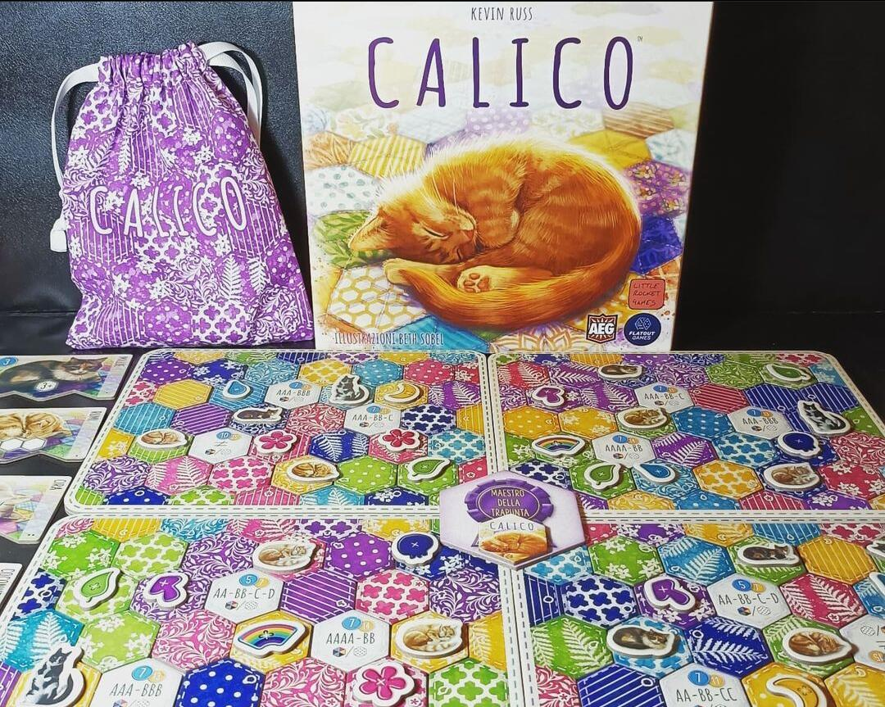
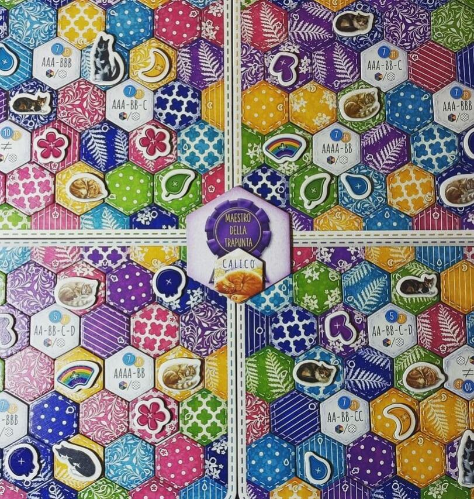

<Setting>

  Coperte morbide e colorate, tanti bottoni e una miriade <strong>gattini coccolosi</strong>. In Calico dovrete tessere
  e cucire la vostra coperta di stoffa, cercando di collezionare più bottoni possibili e al contempo cercare di attirare
  l'attenzione di tanti soffici e carini gattini.

</Setting>

<Rules>

  Durante la preparazione dovrete scegliere <strong>tre gattini</strong>, e abbinare ad ognuno di essi due tipologie di
  fantasie; oltre a ciò dovrete scegliere tre obiettivi da posizionare negli appositi spazi. Fatto ciò, pescate due
  tessere a testa, create un mercato comune di tre tessere e decidete il primo giocatore. Ad ogni turno un giocatore
  dovrà posizionare dove vuole una tessera stoffa e successivamente pescarne un'altra. Infatti la vera bellezza di
  questo gioco sta proprio nella moltitudine di possibilità che avrete durante il piazzamento. Ogni volta che verranno
  posizionate <strong>tre tessere dello stesso colore</strong>, potrete collocare su una di esse un bottone, ottenendo
  così 3 punti vittoria. Se riuscirete a collocarne invece uno di ogni colore potrete collocare{" "}
  <strong>il bottone arcobaleno</strong> ottenendo così ulteriori 3 punti. Durante la partita potrete attirare anche
  alcuni gattini sulla vostra coperta. Per farlo basterà posizionare nel corretto ordine o un numero sufficiente di
  tessere adiacenti tra loro di una determinata fantasia. I gatti faranno ottenere più punti in base alla difficoltà.
  Ultimo ma non meno importante, potrete portare a termine i vari obiettivi sulla vostra coperta. In base alle tessere
  che circonderanno l'obiettivo potrete completarlo sia con i colori, sia con le fantasie o{" "}
  <strong>addirittura con entrambe</strong>. Facendo ciò infatti, potrete ottenere davvero tantissimi punti, ma non sarà
  affatto semplice. La partita termina quando non ci saranno più spazi disponibili sulla vostra coperta. Fatto ciò,
  contate i punti e il giocatore con il punteggio più alto è il vincitore.

</Rules>

<Feedback>

  Calico è stato una sorpresa sin dalla prima partita. A prima vista, con i suoi colori sgargianti e i{" "}
  <strong>disegni carini</strong> e pucciosi, sembrerebbe un altro semplice gioco per famiglie, ma come dice il
  proverbio, l’abito non fa il monaco. Calico è un <strong>fantastico astratto</strong>, ben curato non solo nella
  grafica ma anche nelle meccaniche. Un puzzle game per nulla scontato che vi porrà di fronte a numerose scelte fin dal
  setup. Ovviamente alcuni difetti non mancano, come ad esempio la completa <strong>assenza di interazione</strong> tra
  i giocatori, abbastanza comune in questa tipologia di gioco. Anche la dea bendata avrà la sua parte, infatti una forte
  componente aleatoria, data dalla pesca delle tessere stoffa, sarà presente durante tutta la partita, facendo, in molti
  casi, sfumare fantastiche strategie da voi pianificate. Per ridurre questa componente, posso consigliarvi la house
  rule di aumentare il numero di tessere sia in mano sia nel mercato comune. Detto ciò, Calico risulta comunque un
  piccolo gioiellino, che ha scalato le classifiche dei migliori giochi astratti in circolazione. È riuscito ad ottenere
  tanto successo, non solo grazie alle sue meccaniche semplici seppur strategicamente profonde, ma anche grazie alla
  presenza di una buona longevità di gioco, data da aggiunte come{" "}
  <strong>scenari, campagne e una modalità in solitario</strong>, davvero non scontate in titoli del genere . Se vi
  piacciono i gatti e i puzzle game, beh, questo è il gioco che fa per voi!

</Feedback>

