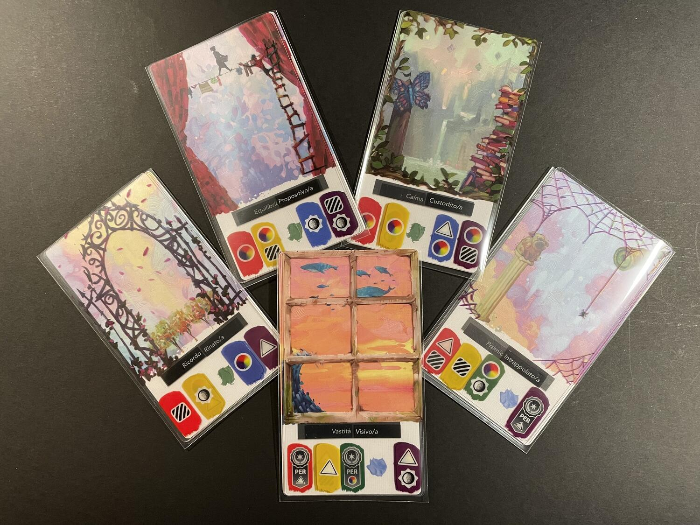

<Setting>

  <em>    Non ha l'ottimo artista alcun concetto  
    c'un marmo solo in sé non circonscriva  
    col suo superchio, e solo a quello arriva  
    la man che ubbidisce all'intelletto.</em>   
   
  Lo sapeva bene Michelangelo (Buonarroti), che l'ottimo artista non si inventa nulla che il materiale di cui si serve per
  la sua creazione non includa già: oggi è il vostro turno!
   
  Siete grandi pittori, avete a disposizione tre cavalletti di cui avete già creato lo sfondo e dovete ora tirar fuori il
  soggetto: un soggetto astratto, stravagante, onirico. Vi aspetta una gara di pittura a suon di combinazioni iconografiche,
  una corsa alla creazione dell'opera d'arte del secolo, un appetitoso premio in Coccarde e la gloria per l'artista migliore.

</Setting>

<Rules>

  Il gioco si svolge in turni, durante i quali ogni giocatore sceglie se ottenere una carta arte tra quelle disponibili
  sul tappetino (la plancia di gioco dove scorrono le carte stesse), oppure se completare un proprio dipinto con 3 delle
  carte arte che ha già in mano (se ne possono avere fino a 5 contemporaneamente).
   
  Ogni carta arte, oltre a proporre un elemento iconografico da aggiungere al set finale, presenta dei simboli, la cui
  combinazione fornirà punti in base alle carte punteggio di volta in volta estratte a inizio partita.
   
  Quando tutti i giocatori hanno calato tre dipinti, la partita finisce: vince chi ha più punti.

</Rules>

<Feedback>

  Che dire? L'artwork di questo titolo è davvero straordinario e accattivante: il vero punto di forza del gioco. Ma c'è
  dell'altro: Canvas è adatto a tutti, ottimo per suscitare l'interesse di chi cerca un gioco dal forte impatto visivo e
  di chi apprezza un design di alto livello. Sovrapponendo le immagini sui coloratissimi sfondi si ottengono
  costantemente miscele oniriche che vi delizieranno gli occhi. Ma come la vita si vive o si scrive, anche in Canvas col
  quadro si dipinge o si vince: raramente salterà fuori un'opera che soddisferà la vostra vena pittorica e al tempo
  stesso vi farà ottenere una tonnellata di punti. Eppure il fascino di questo titolo dai colori sgargianti è
  innegabile: c'è una dimensione edonistica nel mondo del gioco da tavolo che consiste nella qualità della sua
  componentistica, delle vibrazioni che essa trasmette al vostro cervello e delle proiezioni che suscita alla vostra
  immaginazione. In Canvas c'è tutto questo. E le bustine protettive sono incluse!
   E poi, siamo onesti: chi mai vorrebbe accumulare Coccarde e trasformare questa poderosa galleria di sogni a occhi
  aperti in un draft dal sapore astratto? Fate una sfida di coppia e una corsa al dipinto più stravagante, sognante, incoerente
  e straniante (e lasciate perdere ogni altra variante… No, sul serio: lasciate perdere la variante in solitaria). Vi divertirete
  tanto lo stesso.

</Feedback>

