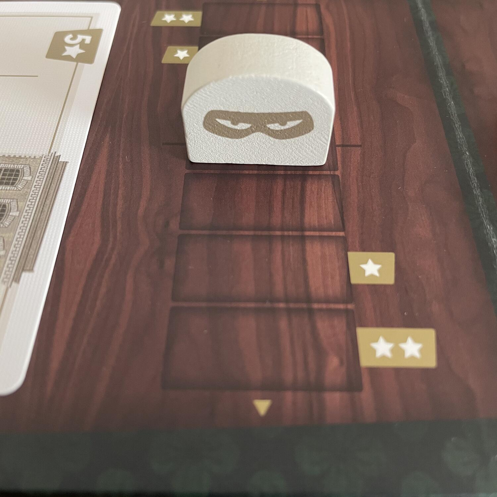
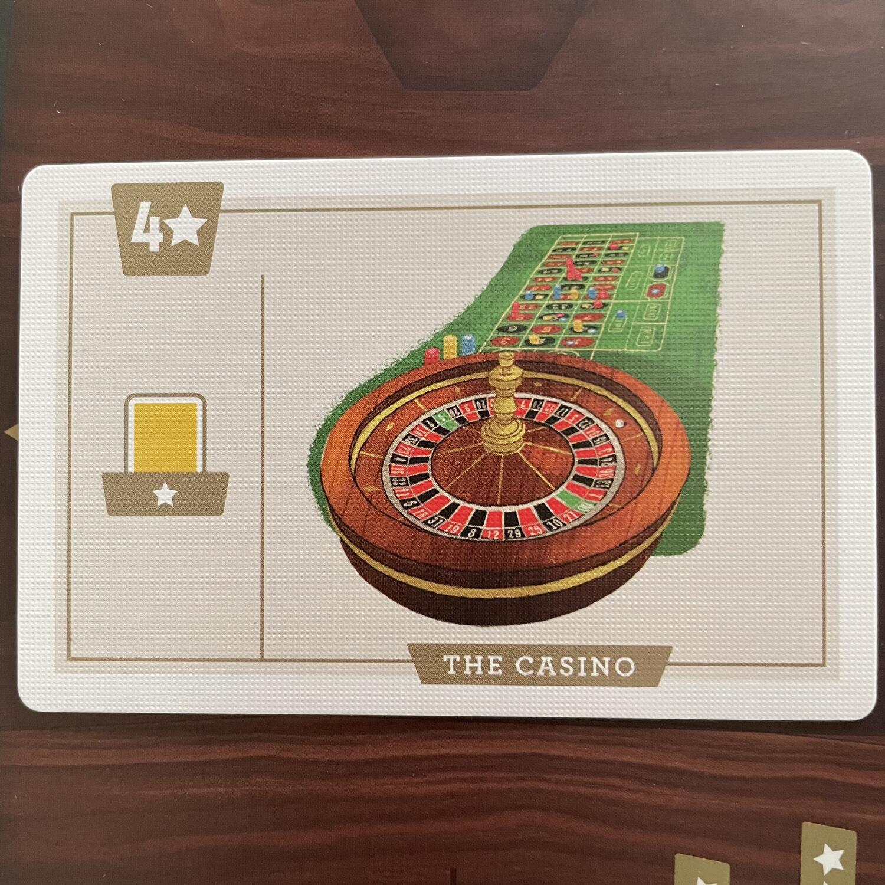
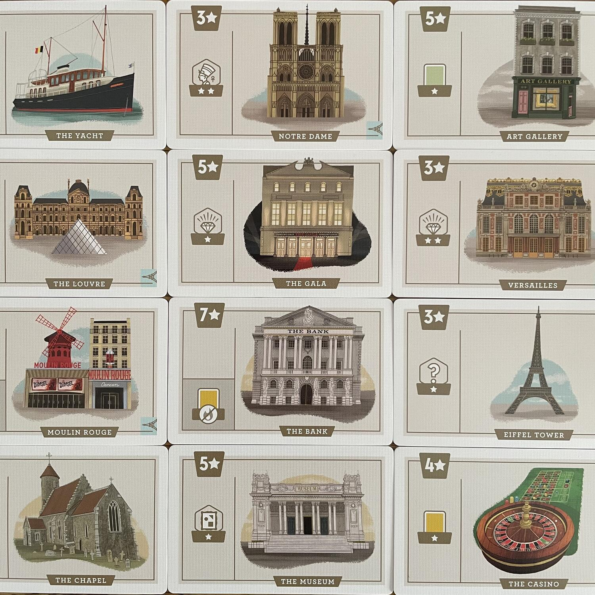

<Setting>

  Siete l’<strong>astuta mente criminale</strong> che si cela dietro le rapine
  con cui famigerate bande di ladri stanno audacemente svuotando Parigi, Roma,
  Londra e Barcellona dei loro <strong>splendidi e preziosi tesori</strong>!
   
  Equipaggiate la vostra squadra al meglio per il lavoro e giocate bene le
  vostre carte. Ma soprattutto siate subdoli: il vostro piano, per quanto
  elaborato, rischia costantemente di essere sventato!

</Setting>

<Rules>

  I due sfidanti si collocano ai lati opposti del tabellone, diviso in 3{" "}
  <strong>Settori Località</strong>, ognuno con i suoi 4 alloggiamenti per i{" "}
  <strong>Tesori</strong> e il suo <strong>Tracciato Caper</strong> (che qui
  sembra stare per “attività illecita”). Accanto ai 3 Settori Località trovano
  posto il <strong>Segnaturni</strong> e i mazzi dei <strong>Ladri</strong> e
  degli <strong>Attrezzi</strong>. Scelta una città tra le 4 disponibili e
  aggiunte le Carte specifiche ai relativi mazzi base, si pescano casualmente 3{" "}
  <strong>Località</strong>, a ciascuna si abbinano 4 Tesori casuali e si piazza
  ogni <strong>Segnalino Caper</strong> alla metà esatta degli appositi
  tracciati. Ora si può iniziare.
   I giocatori pescano un certo numero di <strong>Carte Ladro</strong> o di{" "}
  <strong>Carte Attrezzi</strong>, variando l’ordine di turno e il tipo di Carta
  secondo le indicazioni del Segnaturni. Il giocatore di turno sceglie una Carta
  dalla sua mano e la colloca, pagandone il costo (e/o riscuotendone il vantaggio),
  su una delle 3 colonne disponibili in una delle 3 Località; poi il secondo giocatore
  fa lo stesso, dal suo lato del tabellone. Possono esserci fino a un massimo di
  3 Ladri in ogni Località e di 3 Attrezzi su ogni Ladro. Quindi, i giocatori si
  scambiano la mano di carte.
   
  Si procede così finché non resta un’ultima carta in mano a ciascun giocatore, che
  viene scartata. Il Segnaturni avanza e ha inizio un nuovo turno. Alla fine dell’ultimo
  turno di gioco si verifica chi controlla ogni Località, in base alla posizione
  del segnalino Caper sul relativo Tracciato, e si fa un calcolo dei punti derivanti
  dalle Località, dai Ladri, dagli Attrezzi e dai Tesori trafugati. Chi ha più punti
  vince.

</Rules>

<Feedback>

  Questo rifacimento di <em>Caper</em> (2018), a sua volta rifacimento di{" "}
  <em>It’s mine</em> (2015), <strong>supera entrambi i predecessori</strong> su
  molti fronti: il sistema di gioco, la componentistica e l’artwork ne risultano
  variamente <strong>rinfrescati</strong> e non c’è da stupirsi se questo
  rinnovamento susciterà l’appetito di chi ha adocchiato quest’ultima versione.
   
  Fatta salva l’<strong>ambientazione</strong>, <strong>accattivante</strong>{" "}
  <strong>ma</strong> tutto sommato <strong>pretestuosa</strong>,{" "}
  <em>Caper: Europe</em> vi trasporta in un{" "}
  <strong>fittissimo scambio di colpi bassi e cattiverie</strong>, dove il
  secondo classificato sarà dimenticato con ignominia. La <strong>sfida</strong>{" "}
  si farà rapidamente <strong>tesa e sofisticata</strong> e non potrete
  permettervi di distrarvi neanche per un momento: se l’occhio dovrà correre
  svelto alle monete possedute dall’altro giocatore, la mente dovrà{" "}
  <strong>sequenziare con costante vigilanza</strong> la vostra serie di azioni.
  Le mani, invece, tenetele a posto e giocate quella benedetta carta solo dopo
  aver riflettuto lungamente! Siate avidi e spavaldi al momento giusto, cercate
  di rifilare all’avversario solo carte che non potrà giocare a proprio
  vantaggio e <strong>scegliete con attenzione il momento più opportuno</strong>{" "}
  per tirare il Segnalino Caper dal vostro lato del tracciato. Questo Tiro alla
  fune (link) ricorderà forse l’esperienza di <em><Link to="/reviews/inbetween/">InBetween</Link></em> , ma laddove quest’ultimo
  era incentrato sull’ <Link to="/mechanisms/asimmetrico">Asimmetria</Link> dei mazzi, Caper:
  Europe fa del meccanismo di <Link to="/mechanisms/drafting">Drafting</Link> la sua cifra più
  caratterizzante.
   
  La componentistica, anche rispetto alla versione del 2018, è deluxe: per un
  prezzo contenuto vi porterete a casa una{" "}
  <strong>confezione piccola ma lussuosa</strong>, organizzata con quella classe
  che vorremmo per tutti i giochi nella nostra collezione. Per di più, i
  materiali sono di fattura pregiatissima ed è la stessa confezione a dirvi con
  languore ammiccante: “I giochi vanno trattati con gli inserti di
  (simil)velluto”.
   
  <strong>Ogni città introduce una variante</strong> che determina lo stile
  della partita e la presenza di un set base contribuisce ad aumentare la
  longevità e la variabilità di certi elementi del flusso di gioco. Inoltre, le
  4 città corrispondono a <strong>4 livelli crescenti di difficoltà</strong>: la
  romantica Parigi (difficoltà 1) illuderà i vari Mr. e Mrs. Smith che ci può
  essere più di una subdola Mastermind in famiglia, mentre Roma e Barcellona
  (difficoltà 2) vi insegneranno l’amarezza del pestarsi i piedi tra colleghi
  nell’arte di Arsène Lupin. Quanto a Londra (difficoltà 3)… sarà il caso di
  rispolverare il vostro set di insulti da <em>gentlemen cambrioleurs</em>.
   
  Attualmente il gioco circola solo in inglese, ma la dipendenza dalla lingua,
  una volta assimilato il regolamento, sarà pari a zero. La{" "}
  <strong>sintassi dell’iconografia</strong> è{" "}
  <strong>altamente intellegibile</strong> e solo all’inizio necessiterà di
  momenti di verifica sul manuale, che troverete in ogni caso molto ben scritto
  e strutturato (seppur con qualche errore di ortografia: dai più ambigui, come
  “next two” invece di “next to”, ai più veniali, ma pur sempre marchiani, come
  “Lourve” al posto di “Louvre” o “voluer” invece di “voleur”).
   
  Che dire? Questo titoletto a momenti rischia di passare inosservato e, invece,{" "}
  <strong>tra i competitivi per due</strong> giocatori ha raggiunto in pochi
  istanti la <strong>vetta del mio indice di gradimento</strong>. E ora state
  alla larga: i gioielli della corona d’Inghilterra sono miei!

</Feedback>

