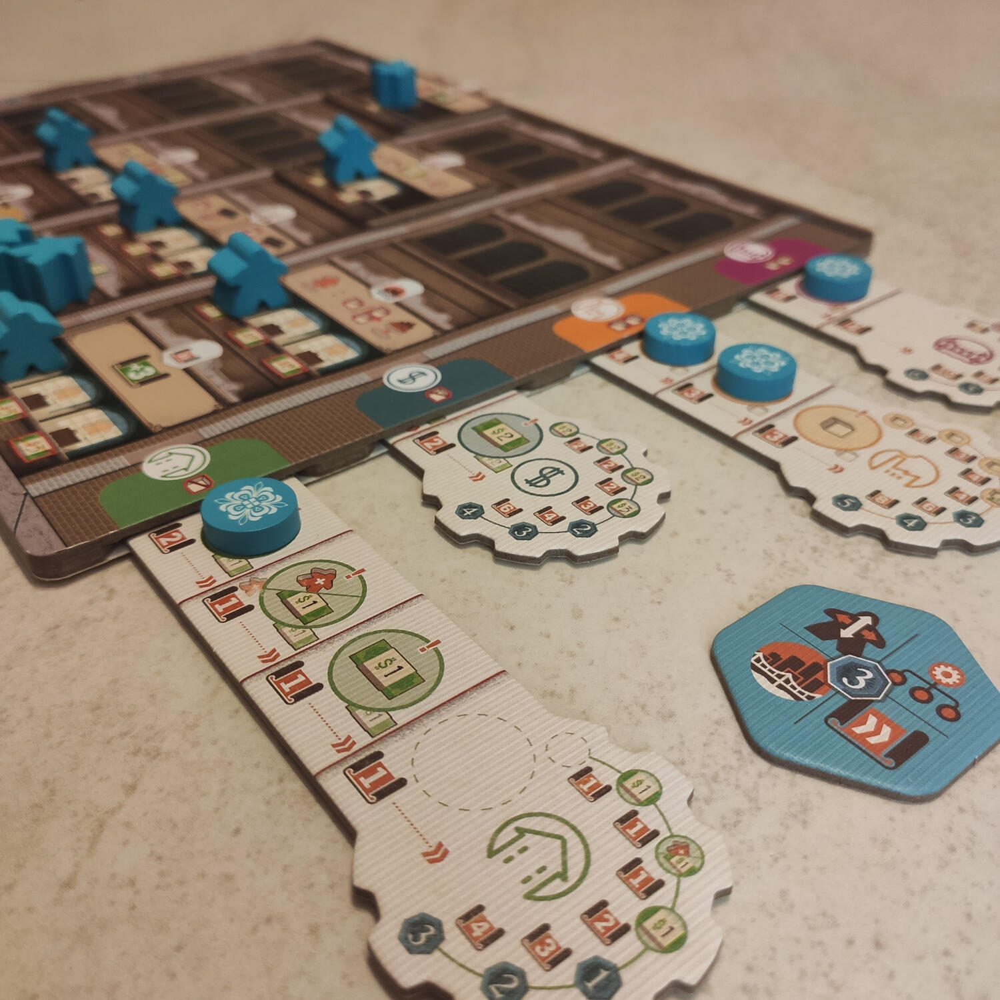
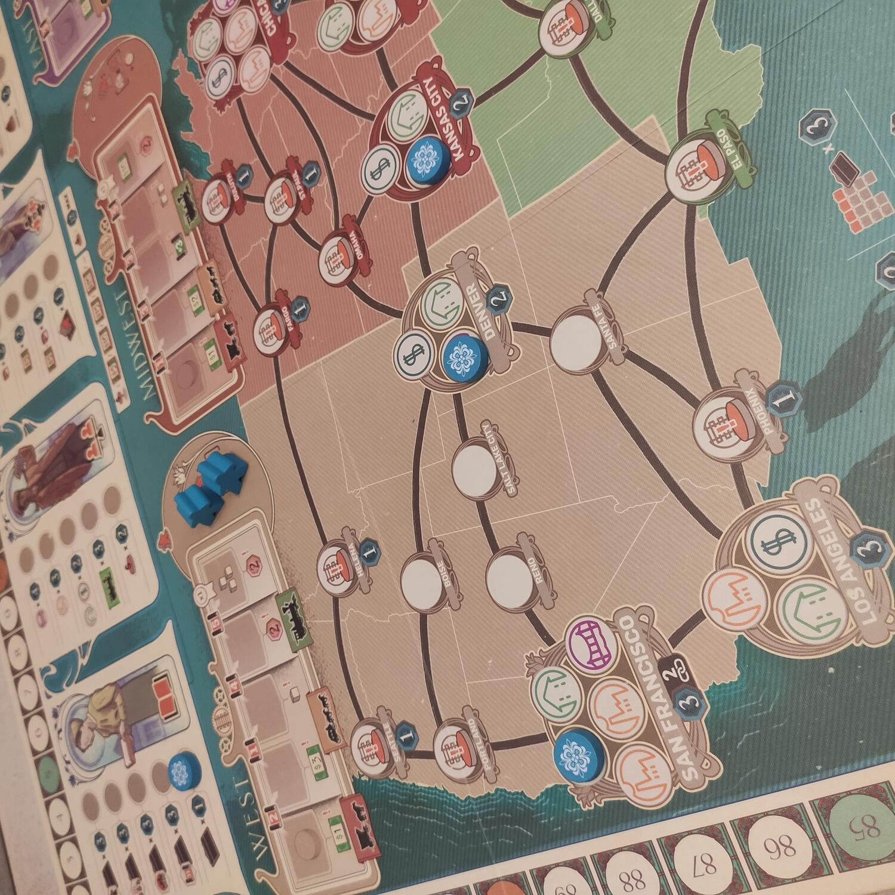

<Setting>

  Stati Uniti d'America. 1919. Il celebre industriale Andrew Carnegie lascia il
  mondo che conosciamo dopo aver lavorato una vita intera a costruire il suo
  impero economico e ad accumulare una fortuna. Durante gli ultimi anni della
  sua vita si è pure dedicato alla filantropia, donando più di 400 milioni di
  dollari ad organizzazioni ed enti benefici.  
  Sicuramente Carnegie ha vissuto il famoso Sogno Americano, ma chi siete voi per
  fare da meno del sosia di “Hide the Pain Harold”? Allora preparate le mazzette
  di soldi e assoldate i collaboratori migliori: la prossima azienda di successo
  deve essere la vostra.

</Setting>

<Rules>

  Ci girerò poco intorno: Carnegie è un German puro, piazzamento lavoratori old
  school, ma con meccaniche molto interessanti che rendono le partite varie.
   
  Ogni giocatore ha a disposizione una plancia della propria sede, suddivisa in
  dipartimenti, alcuni già costruiti altri ancora vuoti. Nei dipartimenti
  vengono piazzati i lavoratori.
   
  A turno un giocatore sceglie il tipo di azione tra le 4 disponibili: Risorse
  umane, Management, Costruzione, Ricerca &amp; Sviluppo, di conseguenza tutti i
  giocatori in sequenza dovranno effettuare quella azione.
   
  Una volta scelta l'azione viene attivata una zona geografica sulla mappa e
  ogni giocatore con dei lavoratori inviati in quella zona potrà decidere di
  richiamarli per ricevere la rendita della zona in aggiunta alla propria
  produzione, oppure lasciarli lì aspettando tempi migliori.
   
  Successivamente si attivano i propri dipartimenti associati al tipo di azione
  scelta con lavoratori al loro interno. In linea generale l'azione Risorse
  Umane permette di allocare lavoratori, Management permette di inviare
  lavoratori sulla mappa oppure allargare i propri dipartimenti, Costruzione
  banalmente permette di costruire le proprie industrie e consolidare la propria
  rete di infrastrutture, mentre Ricerca e Sviluppo permettere di migliorare
  vari fattori.
   
  In determinati turni ci verrà proposto di effettuare una donazione, come usava
  fare il vecchio Carnegie: ciò ci permetterà di scegliere nuovi modi per fare
  punti.
   
  La partita finisce alla conclusione del 20esimo turno e verrà decretato
  vincitore il possessore dell'azienda che ha totalizzato il maggior numero di
  punti vittoria.

</Rules>

<Feedback>

  Carnegie è un gioco dal peso e dalla massa considerevoli, richiede molta
  attenzione, pianificazione e non potrete contare sulla dea bendata.
   
  L'interazione tra giocatori è ridotta ma si fa comunque sentire, dovrete stare
  attenti al gioco dei compagni di tavolo per riuscire a predire quale tipo di
  azione sceglieranno per non farvi trovare impreparati. Inoltre potrebbero
  darvi un po' di fastidio nel controllo della mappa in un mini-game in stile
  Ticket to Ride.
   
  Le donazioni sono una meccanica molto interessante che permette di
  personalizzare i criteri di punteggio, ma con un limite massimo per donazione
  per non sbilanciare troppo la partita a seguito di una mossa.
   
  Insomma i criteri di punteggio sono veramente tanti e nessuno è dominante, le
  meccaniche e le regole ci obbligano a dover tener conto di tutti i fattori
  senza mai focalizzarci su una tattica specifica.
   
  In conclusione, è un gioco molto ampio che può spiazzare al primo turno per la
  vastità di fattori di cui tener conto, ma che allo scorrere dei turni si
  dimostra ben progettato e scorre preciso come il migliore degli orologi
  svizzeri.

</Feedback>

