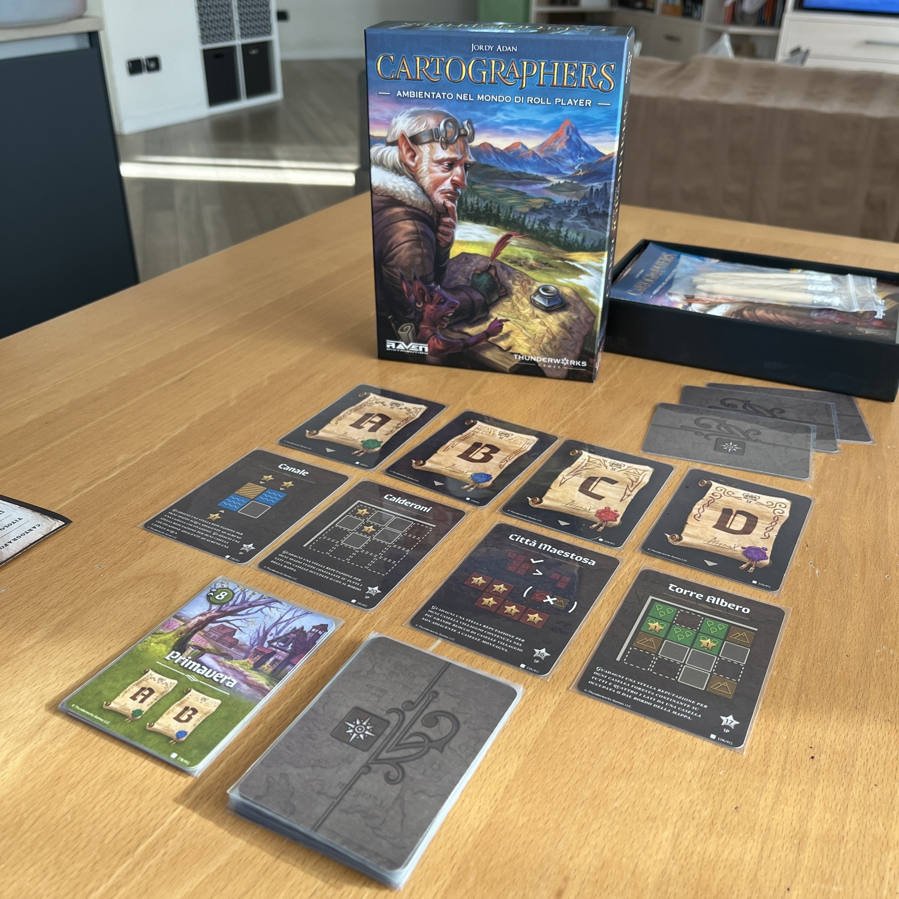
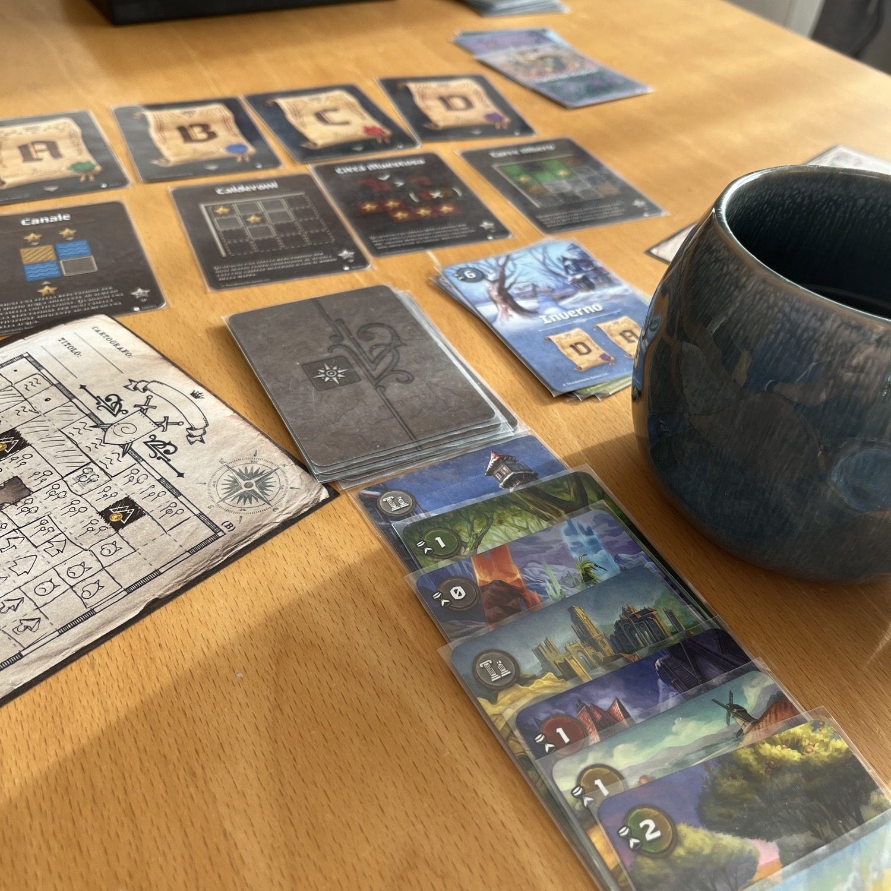
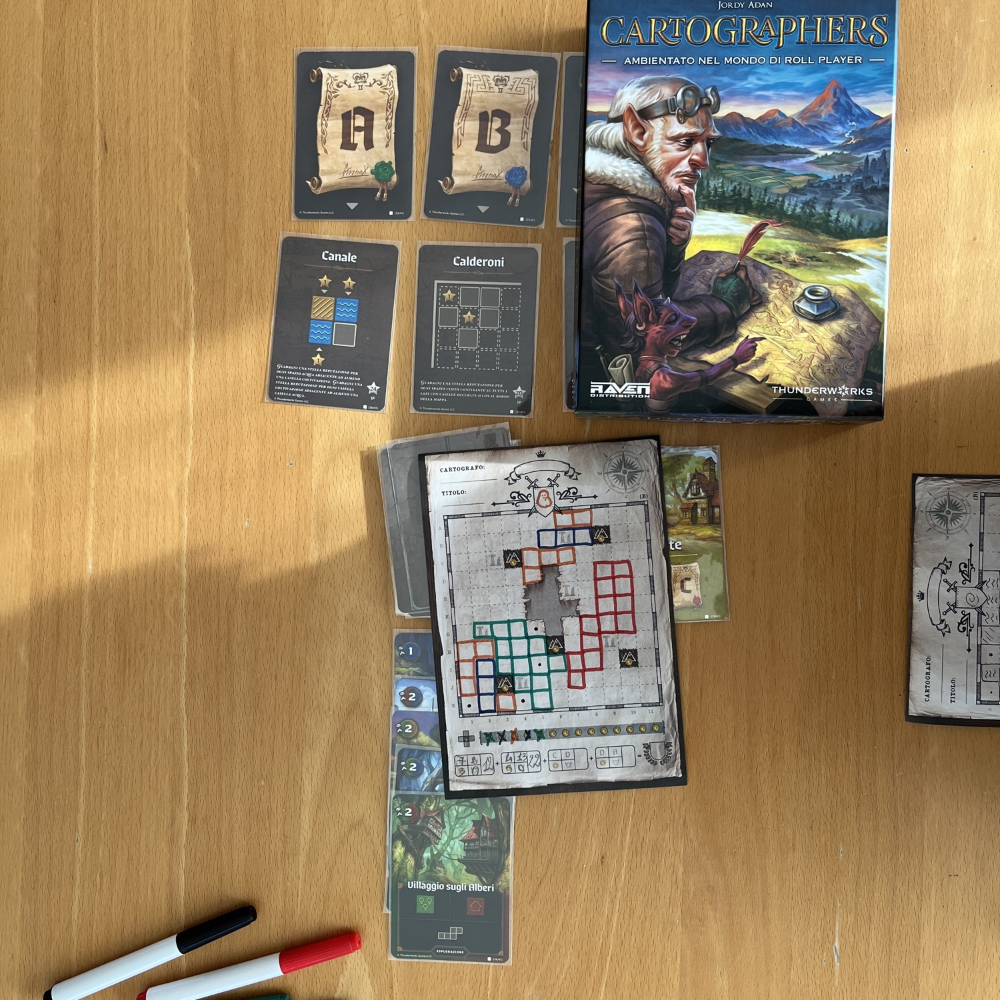

<Setting>

  La regina ha deciso di reclamare le terre del nord. Chi verrà incoronato miglior cartografo? Sarai per caso tu? Sarai in grado di dimostrare la tua bravura?

</Setting>

<Rules>

  Una partita a Cartographers è divisa in 4 stagioni. Ogni stagione ha un <strong>tempo</strong>, che stabilisce il numero di carte che possono essere giocate durante quella stagione, e due <strong>obiettivi</strong> di fine partita, che verranno valutati per quella stagione. Sapendo che ogni obiettivo verrà valutato solamente due volte nel corso della partita, i giocatori dovranno sapientemente scegliere come e dove premere l’acceleratore per guadagnare i tanto agognati punti. Infatti, ogni carta pescata durante la stagione farà sì che i giocatori dovranno scegliere come disegnare la figura al suo interno, tenendo conto, appunto, degli obiettivi della partita. Per quanto tutti i giocatori affrontino le partita in maniera separata, quasi fosse un solitario, esiste un tipo di carta, i <strong>mostri</strong>, che farà sì che i giocatori dovranno scambiarsi la propria “mappa” e ognuno dovrà lasciare ad un avversario il compito di disegnare questi simboli malvagi sulla loro “mappa” che ad ogni fine stagione, se non opportunamente contenuti, faranno perdere punti!

</Rules>

<Feedback>

  Cartographers è uno di quei giochi che <strong>non stufa mai</strong>. L’unico limite è, paradossalmente, il fatto che prima o poi i fogli finiscono e plastificarli, vuoi per pigrizia, vuoi per mancanza di tempo, non è sempre una possibilità. Ciononostante, <strong>non è un gioco senza difetti</strong>: alle volte, l’intersezione delle carte punteggio rende la partita un inferno, sia per la questione del calcolo del punteggio sia per come i giocatori si trovano costretti a pilotare una partita complicata per niente. E no, Cartographers non è un gioco complicato, quindi doverci mettere più testa del dovuto non è un difetto ben accetto.

</Feedback>

