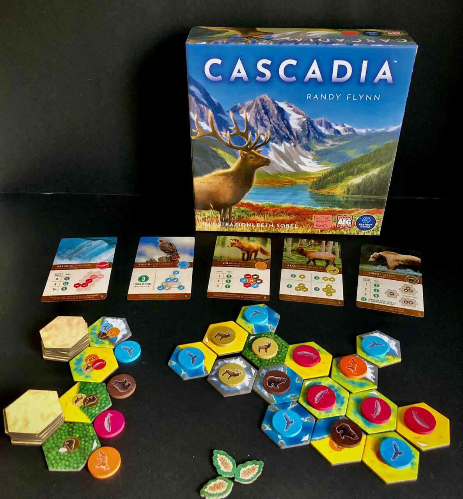
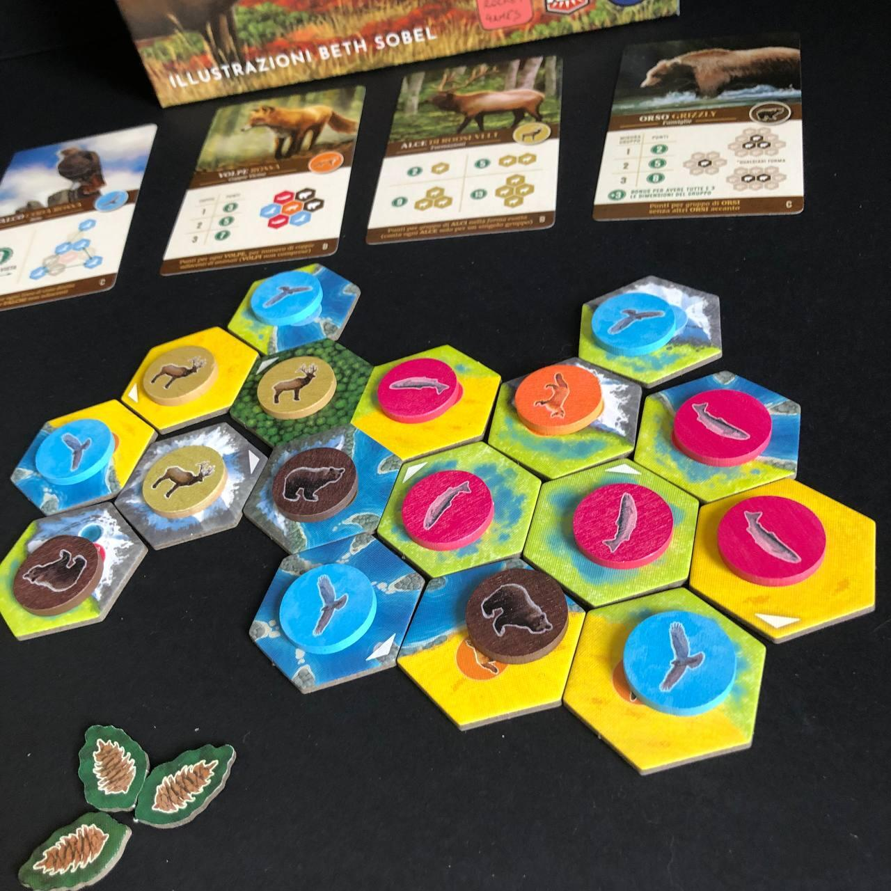

<Setting>

  Cascadia, Nord-Ovest Pacifico: una regione <strong>incantevole</strong>,
  immersa nella <strong>natura</strong> più pura, tra l’Oceano e la Catena delle
  Cascate. Ospita <strong>diversi</strong> <strong>climi</strong>{" "}
  <strong>ed</strong> <strong>ecosistemi</strong>: dalle foreste più
  lussureggianti dell’America settentrionale alle foreste pluviali temperate,
  dalle linee costiere con fiordi più lunghe al mondo a un clima alpino, o
  addirittura artico. Alla confluenza di diversi grandi parchi nazionali
  nord-americani, alcuni ospitanti la grande sequoia sempreverde, Cascadia è un{" "}
  <strong>paradiso di vita selvatica</strong>. Cosa potrebbe mai renderla più
  bella? L’immaginazione dei giocatori, ovviamente, che componendo{" "}
  <strong>nuove micro-versioni di Cascadia</strong> creeranno nuovi spazi vitali
  per la fauna locale. Chi riuscirà a rendere Cascadia ancora{" "}
  <strong>più bella?</strong>  

</Setting>

<Rules>

  Dopo aver riposto i <strong>Segnalini Fauna</strong> nell’apposito sacchetto e
  aver impilato 20 <strong>Tessere Habitat</strong> per giocatore più 3, si
  rivelano 4 Tessere e a ciascuna si abbina casualmente un Segnalino Fauna; si
  pescano casualmente 5 <strong>Carte</strong>{" "}
  <strong>Punteggio Fauna Selvatica</strong> (una per ciascun animale), si
  assegna una <strong>Tessera Habitat Iniziale</strong> a ogni giocatore e il
  set-up è concluso.
   
  Il giocatore, nel proprio turno, <strong>sceglie</strong>{" "}
  <strong>una coppia</strong> di Tessera Habitat e Segnalino Fauna tra gli
  abbinamenti disponibili nel “mercato” comune e la colloca nell’ecosistema
  della propria area di gioco. Se dispone di un{" "}
  <strong>Segnalino Natura </strong>(= le pigne), potrà decidere di scartarlo
  per scegliere una coppia non abbinata o anche per sostituire un qualsiasi
  numero di Segnalini Fauna tra quelli attualmente disponibili. L’unica altra
  occasione per sostituire i Segnalini Fauna si presenta <strong>quando</strong>{" "}
  <strong>3 su 4 siano identici</strong> (allora il giocatore ha facoltà di
  metterli da parte, pescarne altri tre e scartare nuovamente nel sacchetto
  quelli già messi da parte) oppure{" "}
  <strong>quando 4 su 4 siano identici</strong> (in quel caso il giocatore di
  turno è obbligato a sostituirli).
   
  Dopo che un giocatore ha pescato la coppia di Tessera e Segnalino, per prima
  cosa piazzerà e orienterà liberamente la Tessera Habitat, purché essa si
  colleghi con almeno un lato a una Tessera già presente nella propria area di
  gioco. Vi sono cinque tipologie di Terreni sulle Tessere Habitat:{" "}
  <strong>Zone Umide, Montagne, Foreste, Fiumi e Praterie</strong>. Collocare{" "}
  <strong>Terreni</strong> dello stesso tipo in modo che risultino adiacenti tra
  loro, per quanto non obbligatorio, può contribuire a far guadagnare punti
  vittoria. Ogni Segnalino Fauna, invece, può essere posizionato solo su quelle
  Tessere che ne riportino la relativa icona e che non siano già occupate da un
  altro Segnalino Fauna (non importa che si tratti della Tessera appena
  collocata o no). Se non è possibile trovargli una collocazione, il Segnalino
  Fauna dovrà essere scartato nel sacchetto, mentre se lo si colloca su una
  tessera con il simbolo del Segnalino Natura, si otterrà uno di questi
  segnalini dalla riserva. <strong>Tessere e Segnalini</strong>, una volta
  collocati, <strong>non potranno più essere riposizionati</strong>. 
  Alla fine del proprio turno, il giocatore sostituisce la Tessera e il Segnalino
  scelti con altri due, attingendo dalla riserva predisposta durante il setup. Quindi
  tocca al giocatore successivo. Si procederà così in senso orario <strong>    finché non ci saranno più Tessere Habitat con cui sostituire l’ultima
    pescata</strong>. 
  Vince il giocatore con più punti, considerando quelli derivanti dalle Carte
  Punteggio Fauna Selvatica, dalle Tessere adiacenti con la stessa Tipologia di
  Terreno, dalle Aree più grandi di Habitat adiacenti identici, dai Segnalini
  Natura non spesi (il cui numero dirime anche eventuali pareggi).

</Rules>

<Feedback>

  Non a caso vincitore dello <strong>Spiel des Jahres 2022</strong>, Cascadia,
  con la sua <strong>rilassatezza</strong>, vi trasporterà in un paradiso
  naturalistico tutto da costruire, suggerendo l’idea che un equilibrio tra le
  specie animali passa non solo per il tramite delle loro relazioni, ma anche
  inserendo quelle relazioni in un ecosistema a sua volta equilibrato. Sembra
  incredibile che un titolo <strong>astratto</strong> possa trasmettere
  quest’idea, ma è proprio ciò che succede quando vi rendete improvvisamente
  conto che ci sono Carte Punteggio che premiano la presenza di animali
  selvatici adiacenti alla corsa dei salmoni, simulando attivamente il
  funzionamento della catena alimentare.
   
  Pur essendo <strong>adatto alle famiglie</strong> e con uno{" "}
  <strong>sfondo sostanzialmente educativo</strong>, non bisogna però aspettarsi
  che Cascadia sia un gioco che favorisca l’interazione diretta: anzi,{" "}
  <strong>l’interazione tra giocatori è minima</strong> e consiste nella
  semplice selezione delle tessere migliori, sottraendole agli altri. Dopodiché,
  ognuno guarderà all’area di gioco degli avversari occasionalmente, o solo per
  assicurarsi di avere l’Area di Habitat più grande.  
  Da un punto di vista del gameplay, la <strong>difficoltà</strong> non risiede tanto
  nella collocazione degli animali in modo da soddisfare i requisiti delle Carte
  Punteggio, quanto piuttosto nella ricerca di una strategia che consenta di ottenere
  il maggior numero di punti possibile da ciascuna Carta Punteggio, e che al tempo
  stesso consenta di costruire Aree di Habitat sufficientemente ampie da far ottenere
  punti a fine partita. Riuscire in questo intento non è proprio immediato, tanto
  è vero che il regolamento prevede anche un <strong>    sistema di sfide di difficoltà crescente</strong>, pensato sia per le partite in solitaria che in quelle tra più giocatori,
  che consiste in una sorta di <strong>allenamento</strong> volto a migliorare il
  proprio punteggio nel tempo, ma anche in un sistema di <strong>    milestones</strong> per comprendere più a fondo i tanti meccanismi soggiacenti al gioco.
  Insomma, non un titolo poi così banale come si sente dire in giro.
   
  Aspettiamo con ansia crescente l’<strong>espansione Landmarks</strong>, che consentirà
  peraltro di arrivare fino a 6 giocatori!

</Feedback>
