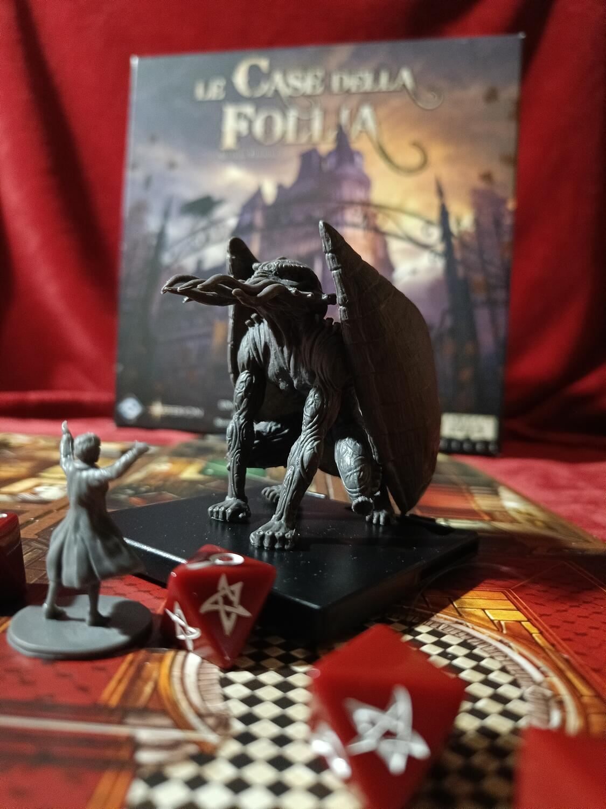
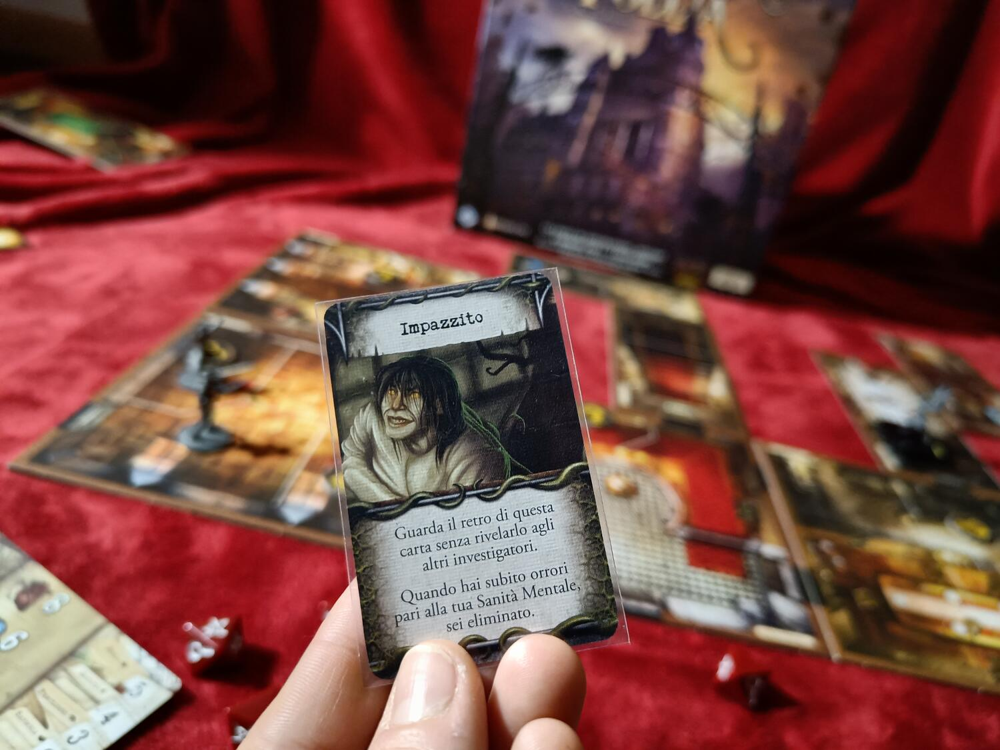
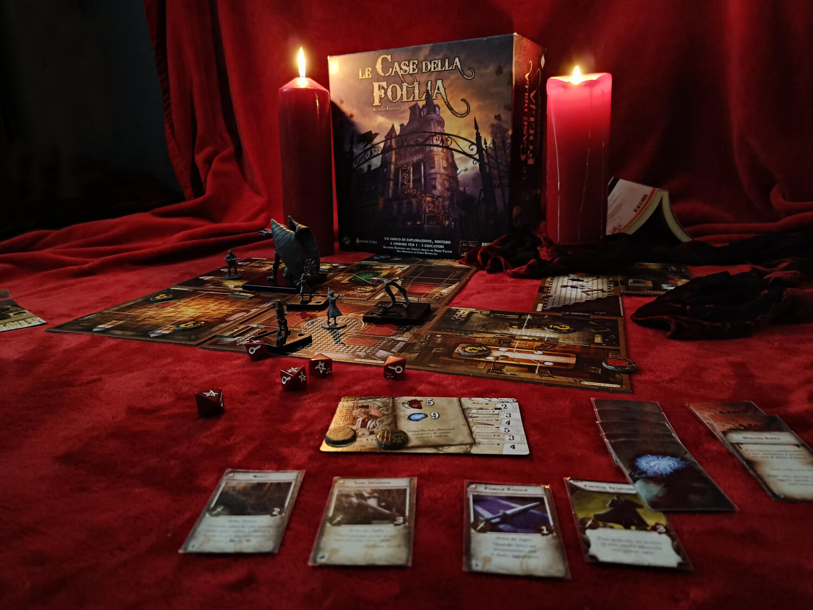

<Setting>

  <em>    “Noi camminiamo nell’oscurità insieme a fantasmi e spettri che non conosciamo, e il nostro piccolo mondo si immerge
    ciecamente in abissi senza fondo, verso mete che non possiamo neanche concepire”</em>{" "}
  (H.P.Lovecraft, "Qualcosa dall''alto")
   
  E voi, siete pronti a nuovi orrori senza nome, a sfidare la vostra razionalità senza cadere preda della follia?
   
  “Le case della Follia (seconda edizione)” è un gioco che ripropone l’omonima prima edizione del 2011, nel quale sarete
  chiamati a impersonare degli investigatori e a indagare su misteriosi casi di ambientazione lovecraftiana: vi
  troverete catapultati in luoghi infestati da mostri e fantasmi, in città maledette o in cimiteri abbandonati, e
  dovrete fermare il male che incombe… o semplicemente scappare! Ma l’ostacolo più grande non verrà dall’esterno, bensì
  da dentro di voi: riuscirete a non impazzire e a non rivoltarvi contro i vostri stessi compagni?&nbsp;
   

</Setting>

<Rules>

  “Le case della follia” è un dungeon crawler collaborativo con possibile traditore, ed è diviso in diversi scenari non
  collegati fra loro. È guidato da un’app gratuita che si occuperà del comparto narrativo.  
  All’inizio bisogna scegliere un caso da risolvere fra quelli disponibili e gli investigatori coinvolti, tutti con caratteristiche
  differenti e un’abilità speciale. La partita si sviluppa attraverso dei turni strutturati in due fasi.
   
  Nella “Fase degli investigatori” potrete scegliere di compiere 2 azioni (anche ripetute) tra le 6 disponibili: grazie a
  queste potrete esplorare, investigare gli oggetti attorno a voi, raccogliere equipaggiamenti utili, interrogare alcuni
  personaggi ed attaccare i mostri, se presenti. In alcune situazioni sarà necessario risolvere dei rompicapo, che sono sostanzialmente
  dei puzzle o degli enigmi ad incastro.
   
  Nella “Fase dei miti” sarete invece sfidati a resistere agli orrori attorno a voi: l’app vi porterà a scontrarvi con dei
  mostri e a resistere a terribili prove.
   
  Un elemento importante, per tutta la durata del gioco, è la salute, sia fisica che mentale: il problema non sarà solo la
  morte per i danni subiti, ma anche la follia. Una volta impazziti, potreste arrivare a giocare segretamente contro i vostri
  stessi compagni.&nbsp;
   

</Rules>

<Feedback>

  “Le case della follia” è nel complesso un gioco ben riuscito, con una seconda edizione che corregge i maggiori difetti
  della precedente edizione (come i tempi di setup, qui ridotti a pochi minuti). Gli scenari sono evocativi, gli
  obiettivi richiesti per vincere mai ripetitivi e le storie appassionanti: queste ultime spaziano da trame volte al
  combattimento contro mostri a racconti incentrati sull’esplorazione e l’investigazione.
   
  Le plance e le carte sono di buona qualità, così come i token e le miniature: tutti gli elementi concorrono a ricreare
  al meglio l’atmosfera gotica del gioco. Sono presenti 8 investigatori e 24 miniature di mostri, suddivisi in 7
  tipologie differenti. L’unica nota stonata è data dai piedini dei mostri e dalle basette di questi, che si incastrano
  a fatica fra loro e non sono esteticamente eccelse. Considerando i restanti componenti, è davvero un peccato. L’app
  inoltre è ben fatta e molto intuitiva, ed è capace di accompagnare i giocatori senza disturbare l’esperienza sul
  tavolo.
   
  La difficoltà degli scenari è variabile, anche se bisogna notare come molto sia lasciato all’alea: tutto è guidato dal
  lancio di alcuni dadi e, se in quella serata la fortuna non vi sorride, vi possiamo assicurare che c’è poco da fare!
   
  La longevità è scarsa: la scatola base offre quattro scenari non rigiocabili (almeno non in maniera significativa). Ma
  non disperate! Oltre alle espansioni (ciascuna delle quali offre dai 2 ai 3 scenari), è disponibile “Valkyrie”, un’app
  gratuita non ufficiale che vi permette di affrontare scenari creati da altri giocatori.
   
  “Le case della follia” vi porterà all’interno del vasto mondo di Lovecraft, con le sue atmosfere orrorifiche e
  gotiche: un gioco forse non rivoluzionario, ma semplice e godibile. Insomma, un mix perfetto per passare alcune serate
  “da pauuura”!&nbsp;
   

</Feedback>

