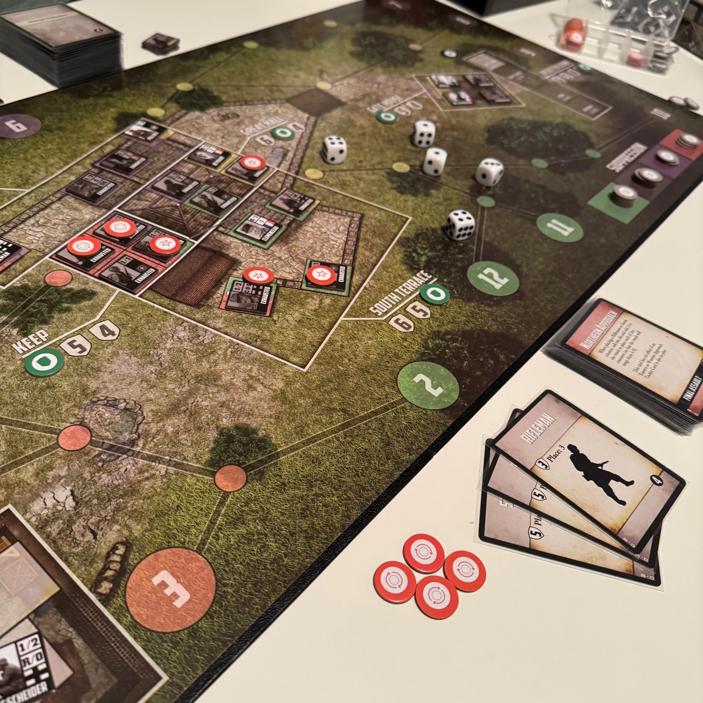
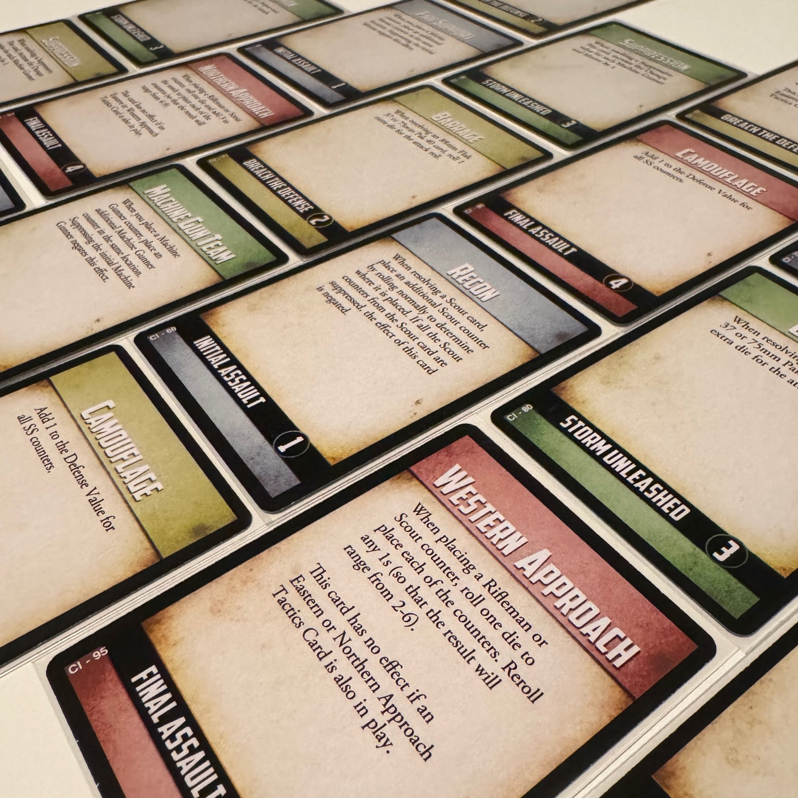
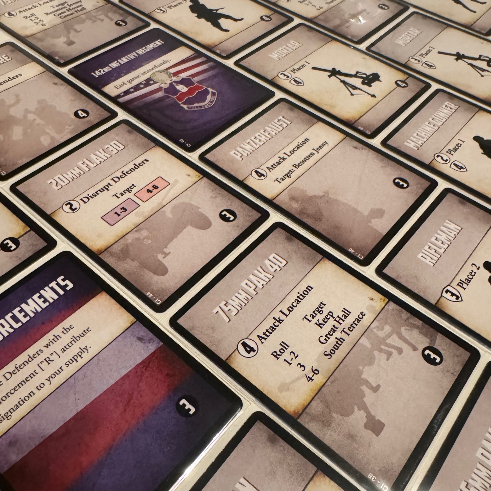

<Setting>

  Nel cuore delle Alpi austriache, nell’ombra degli ultimi giorni della <strong>Seconda Guerra Mondiale</strong>, un castello diventa teatro di una battaglia leggendaria. Castle Itter narra l’incredibile storia di un’alleanza improbabile: <strong>soldati americani, prigionieri francesi, un ufficiale della Wehrmacht e persino un ex membro delle SS uniscono le forze</strong> per respingere un feroce assalto della 17ª Divisione SS Panzergrenadier. Mentre il sole sorge su quel fatidico 5 maggio 1945, le mura del castello tremano sotto il fuoco nemico e i difensori, armati di coraggio e disperazione, combattono contro un destino apparentemente segnato.  
Il tempo è il loro più grande avversario: resistere significa sfidare l’impossibile, trasformando un manipolo di uomini in leggende. Mentre il fragore della battaglia scuote le antiche mura, ogni colpo sparato è una dichiarazione di resistenza, ogni sacrificio un atto di eroismo. Nel caos della guerra, in un remoto castello avvolto dal fumo e dal fuoco, uomini un tempo nemici combattono fianco a fianco, uniti da un destino ineluttabile. E quando tutto sembra perduto, quando l’ombra della sconfitta si allunga sulle torri di pietra, la speranza si fa largo tra le rovine, portata dall’eco di passi in avvicinamento.

</Setting>

<Rules>

 Castle Itter è un gioco da tavolo <strong>tattico</strong> per un solo giocatore, in cui si deve <strong>difendere il castello</strong> dall’assalto delle SS fino all’arrivo dei rinforzi. Il gioco si svolge in turni, ciascuno diviso in due fasi: la <strong>Fase dei Difensori</strong>, in cui si potranno compiere cinque azioni con i propri combattenti, e la <strong>Fase delle SS</strong>, in cui tre carte nemiche determineranno gli attacchi e i rinforzi nemici. 
I difensori possono attaccare, sopprimere il fuoco nemico, muoversi, recuperare e usare abilità speciali. Ogni combattente ha caratteristiche uniche, come l’abilità <em>Inspire</em>, che migliora gli attacchi degli alleati, o <em>Sacrifice</em>, che permette a un personaggio di proteggere un compagno. Le unità nemiche avanzano lungo percorsi prestabiliti e, se raggiungono il castello, la partita termina con la sconfitta. 
Le carte SS determinano il tipo di minaccia: attacchi diretti ai difensori, bombardamenti sulle posizioni, avanzata dei nemici o interruzione delle azioni alleate. La <strong>gestione delle risorse</strong>, come i segnalini soppressione e i valori di difesa delle posizioni, è cruciale per resistere fino alla fine del mazzo delle SS o all’arrivo del 142° Reggimento di Fanteria. 
Per aumentare la sfida, il gioco include <strong>varianti di difficoltà</strong> e una modalità competitiva per due giocatori, in cui un giocatore controlla l’assalto delle SS, pianificando strategicamente gli attacchi.

</Rules>

<Feedback>

  Se avete già giocato a <Link to="/reviews/pavlov-s-house/">Pavlov’s House</Link>, ritroverete un’aria familiare. <em>Castle Itter</em> è, infatti, parte della serie <strong>Valiant Defense</strong> di <Link to="/designers/david-thompson">David Thompson</Link> e anche qui l’obiettivo è resistere all’assalto nazista, gestendo al meglio le unità e le poche risorse a disposizione. Ma attenzione: sebbene la struttura di base sia simile, le <strong>differenze tra i due titoli sono sostanziali</strong>. 
Se <strong>Pavlov’s House è una sfida profonda e multilivello</strong>, dove oltre alla difesa della casa dovete anche coordinare il supporto logistico e l’artiglieria, <strong>Castle Itter taglia tutto il superfluo e va dritto al sodo</strong>. Qui ogni unità è un personaggio con abilità specifiche: il prigioniero francese che motiva i compagni facendo tirare più dadi, il carrista americano fa stragi come nessun altro sulla sua amata Besotten Jenny mentre i generali riescono a ispirare i compagni facendoli agire ancora e ancora. Il cuore del gioco è il <strong>posizionamento tattico</strong> e la <strong>gestione delle azioni</strong> per contenere l’assalto nazista fino all’arrivo dei rinforzi. 
Ma non fatevi ingannare dalla sua immediatezza: Castle Itter non vi farà sconti. Ogni partita è una lotta disperata e, se volete davvero sentire la pressione dell’assedio, provate le <strong>modalità avanzate</strong>. Una volta che ci avrete preso gusto, difficilmente tornerete a giocare senza. 
Quale dei due scegliere? Dipende da voi. Se vi piace la gestione complessa e il ragionamento a lungo termine, <em>Pavlov’s House</em> è il vostro gioco. Se invece cercate qualcosa di più rapido, intenso e fortemente tematico, <em>Castle Itter</em> fa al caso vostro. Ma sapete che c’è? Io sono felicissimo di averli entrambi!

</Feedback>

