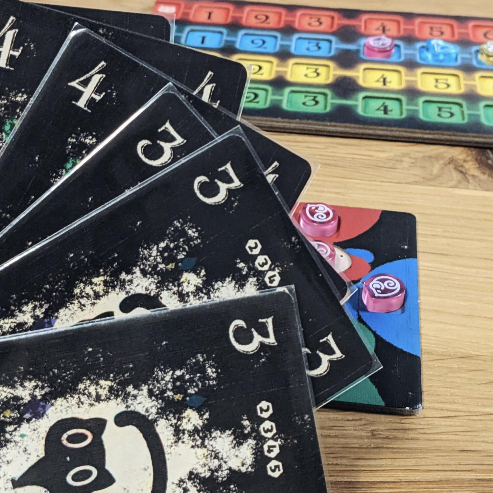
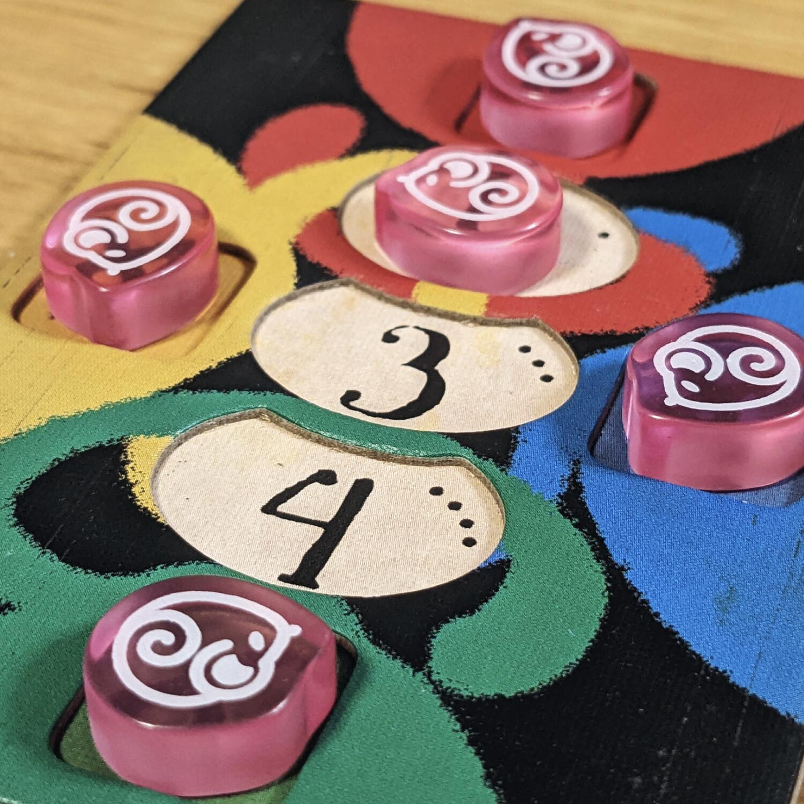

<Setting>

  In Cat in the Box prendiamo le vesti di scienziati appassionati di fisica
  quantistica! Questo piccolo gioco di carte è ispirato al principio di
  indeterminazione di Heisenberg, secondo il quale ci sono stati della materia
  che non sono determinabili se non al momento in cui vengono finalmente
  osservati. Cat in the box prende ingegnosamente questi principi di fisica
  quantistica e li trasforma in un trick-taking game, utilizzando il principio
  del gatto di Schrödinger come inquadratura.

</Setting>

<Rules>

  In questo gioco, la mano di carte è costituita da gatti con un numero
  assegnato ma con nessun colore a rappresentarli fino al momento in cui non
  vengono giocati (osservati). Durante il turno i giocatori assegneranno un
  colore a ciascuno dei loro gatti, prendendo possesso di quel particolare
  numero + colore, cosicché nessun altro possa osservarlo. Il gioco procede come
  un normale trick-taking, dove ciascuno cerca di vincere il particolare numero
  di tricks predetto all’inizio del round. La parte interessante arriva nel
  momento in cui in ogni mazzo ci sono 5 carte per ogni numero e solo 4 colori,
  e se una combinazione numero + colore è stata presa da un giocatore, significa
  che un altro non la può prendere. Cosa succede quando al proprio turno non è
  possibile piazzare nessuna combinazione? Si causerà un paradosso e il
  giocatore perderà tutti i punti accumulati con fatica durante il round.

</Rules>

<Feedback>

  Cat in the Box è un gioco estremamente divertente, specialmente grazie al suo
  tema e alla sua ambientazione (e sicuramente grazie ai fantastici componenti).
  I turni procedono velocemente in una continua battaglia per non essere la
  persona a causare il paradosso, sperando che ci sia qualcuno prima del proprio
  turno a non poter giocare nessuna carta. Ma Cat in the Box non è solo una
  questione di mera fortuna: dovrete essere bravi a valutare la quantità di
  tricks che vincerete durante il turno e giocare le giuste carte al momento
  opportuno, cosa che non risulterà mai banale. I componenti rendono il gioco
  immersivo e colorato; l'integrazione della meccanica con il tema risulta
  geniale e decisamente unica. Nonostante non sia un gioco complicato o
  meccanicamente originale, sarà gradito a ogni tipo di giocatore: a chi amai
  giochi hardcore ma è in cerca di qualcosa di veloce e portatile, ma anche a
  chi ama giocare con la famiglia.

</Feedback>
