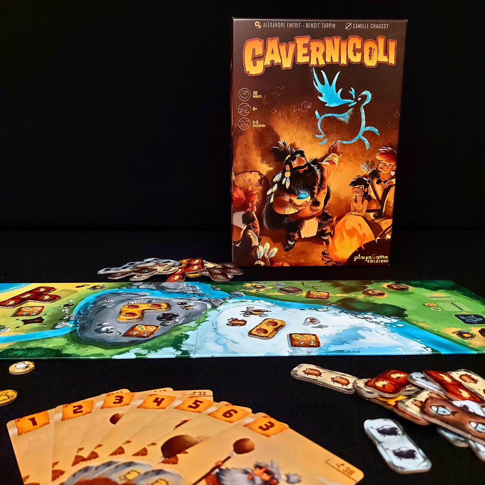
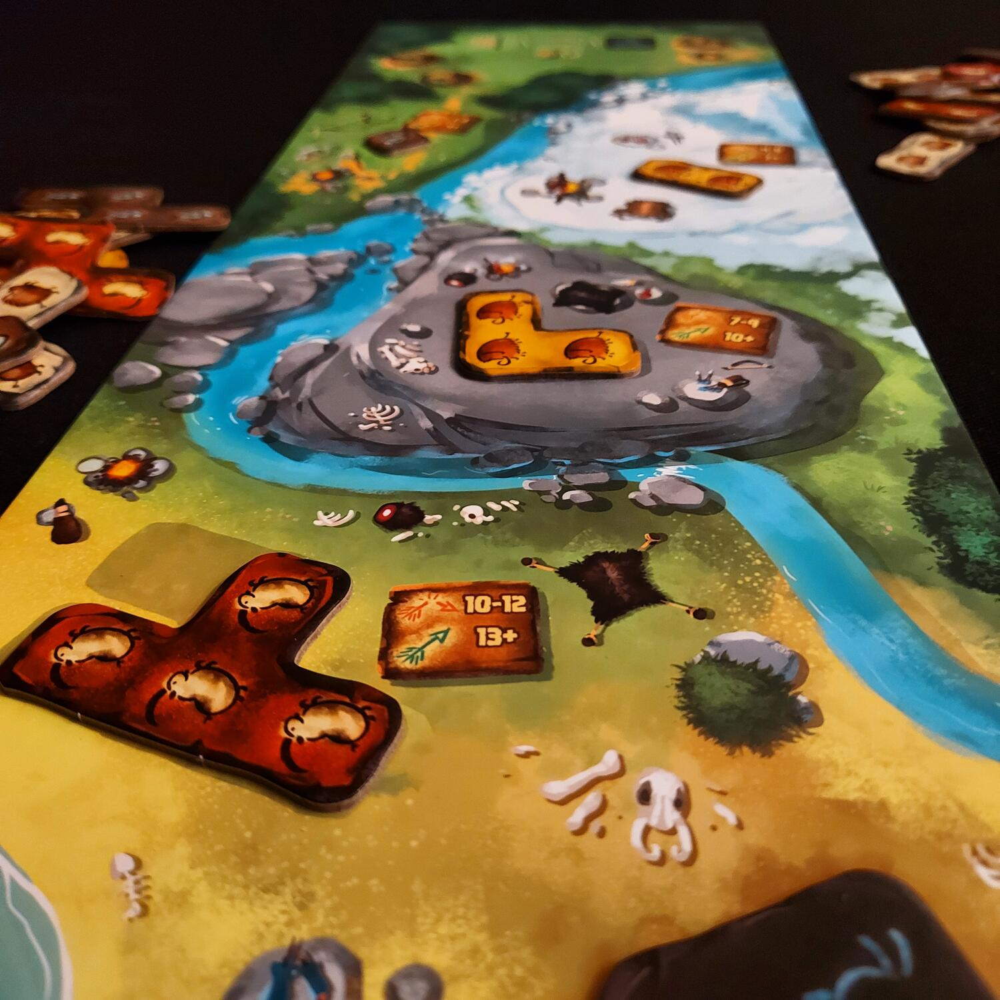

<Setting>

  In Cavernicoli i giocatori vestono i panni di un gruppo di valenti cacciatori
  appartenenti a diverse tribù, ai quali gli Anziani hanno assegnato la missione
  di organizzare delle efficaci battute di caccia da ricordare per l'eternità
  attraverso la realizzazione di pitture rupestri sulle pareti della propria
  Grotta.
   
  La Tribù che meglio pitturerà queste imprese rispettando le richieste degli
  Anziani riceverà onore e gloria. Per riuscirci, sarà necessario essere la
  prima Tribù ad aver posizionato gli 8 segnalini Totem sugli Obiettivi (sulle
  carte o sul Tabellone) che rappresentano le richieste degli Anziani.
   
  Non sarà necessario prendere in mano clave, lance e fionde… per avere la
  meglio sugli avversari sarà sufficiente gestire al meglio la propria mano di
  carte.  
  Buona Caccia!

</Setting>

<Rules>

  Dopo aver posizionato il Tabellone, avendo cura di scegliere il lato corretto
  in base al numero di giocatori, in ciascuna Zona di Caccia si dovrà
  posizionare una tessera animale della forma corrispondente. Sempre in base al
  numero dei giocatori dovranno essere rivelate 4 o 5 carte Obbiettivo. Ogni
  giocatore infine riceverà 12 carte Cacciatore del colore della propria tribù
  con valori di caccia da 1 a 6, la Grotta del proprio colore e 8 segnalini
  Totem. Ogni giocatore mescola le proprie carte Cacciatore, crea una pila a
  faccia in giù a fianco della propria grotta, pesca le prime tre che compongono
  la sua mano iniziale. A questo punto si è pronti per iniziare.
   
  La partita si svolge in un numero variabile di round. All'inizio di ciascun
  round (fase di Iniziativa) ogni giocatore sceglie dalla propria mano quante
  carte mettere in gioco e le posiziona coperte davanti a sé. Le carte scelte
  vengono svelate simultaneamente da tutti i giocatori, si determina per ciascun
  giocatore il Valore di Caccia complessivo sommando il valore di tutte le carte
  messe in gioco e il giocatore con il Valore di Caccia più basso si aggiudica
  l'Iniziativa.
   
  Seguendo l'ordine di Iniziativa, ogni giocatore prende una o più tessere
  Animale dalle Zone di Caccia presenti nel Tabellone. Per prendere le tessere
  Animale il giocatore assegna uno o più Cacciatori a una o più zone di Caccia.
  Per ogni Zona di Caccia il Valore di Caccia delle carte dovrà rientrare almeno
  nell'intervallo di Caccia della Freccia Arancione. Se il Valore di Caccia
  rientra nell'intervallo dei Valori di Caccia della freccia arancione, la Tribù
  otterrà la corrispondente tessera Animale, ma subirà una ferita. Se il Valore
  di Caccia è pari o superiore al Valore di Caccia della freccia verde, la Tribù
  otterrà la corrispondente tessera Animale senza subire ferite.
   
  Una volta prese le tessere Animale il giocatore scarta le carte Cacciatore
  utilizzate e pesca nuove carte Cacciatore in base al numero di tessere prese e
  di ferite subite.
   
  Infine, il giocatore posiziona le tessere Animale nella propria Grotta,
  seguendo determinate regole di posizionamento per cercare di soddisfare le
  carte Obbiettivo. Se viene soddisfatta una carta Obbiettivo, il giocatore vi
  posiziona sopra il numero di segnalini Totem raffigurato. Il primo giocatore
  che posiziona tutti i suoi segnalini Totem vince la partita.

</Rules>

<Feedback>

  Quello che colpisce da subito di questo gioco sono gli ottimi materiali, con
  disegni davvero belli, dai colori vivaci e una simbologia semplice e chiara.
  Cavernicoli è un titolo intuitivo e adatto a tutti, la partita sarà una vera e
  propria corsa al completamento degli obbiettivi, ponendo i giocatori davanti
  alla costante scelta tra l'essere veloci, quindi con un basso Valore di
  Caccia, oppure più forti, con il rischio che deriva dal cacciare dopo gli
  altri ovvero di non riuscire a raccogliere le tessere Animali più congeniali
  alla propria strategia; questo fa sì che vi sia molta interazione con gli
  altri giocatori al tavolo, anche se indiretta.
   
  Cavernicoli dà il meglio di sé in partite con tanti giocatori. La componente
  fortuna gioca un ruolo abbastanza importante sull'esito della partita, ma
  considerando Cavernicoli un buon party game questa componente non incide sulla
  valutazione del gioco che è indubbiamente positiva.

</Feedback>

