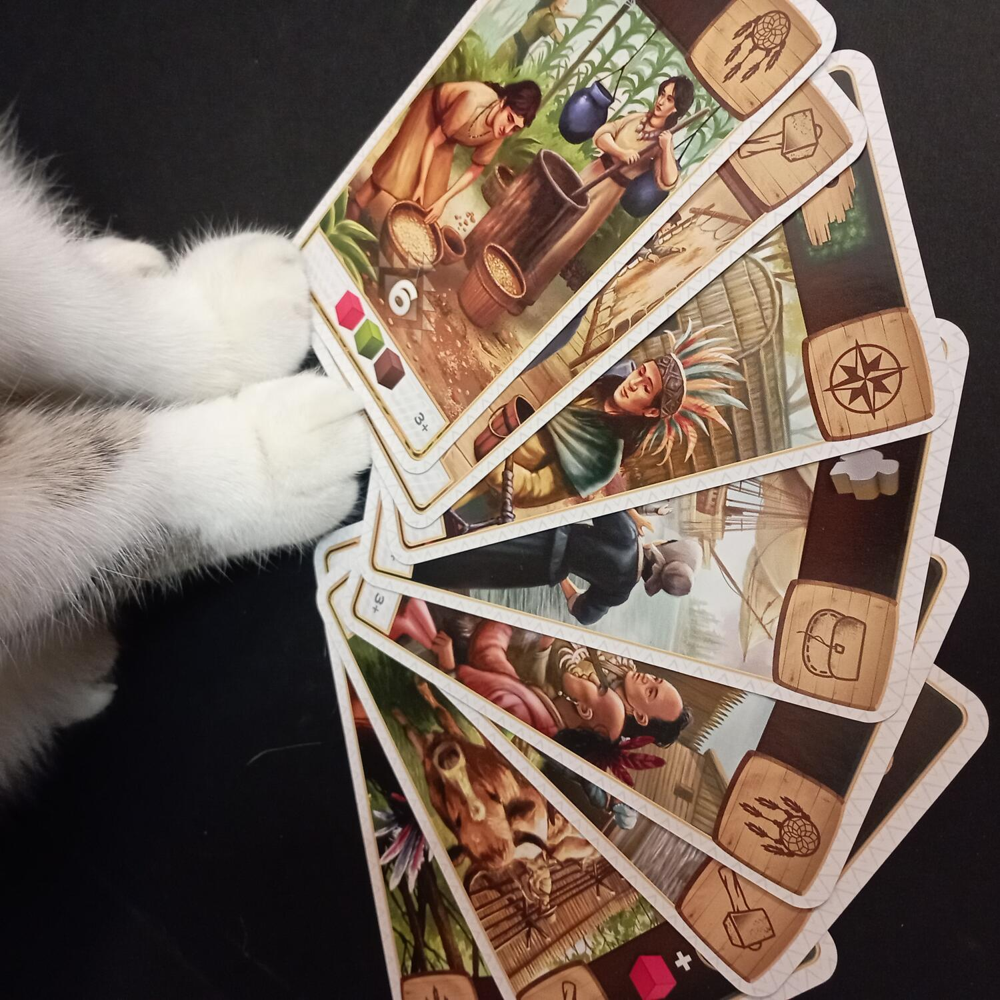
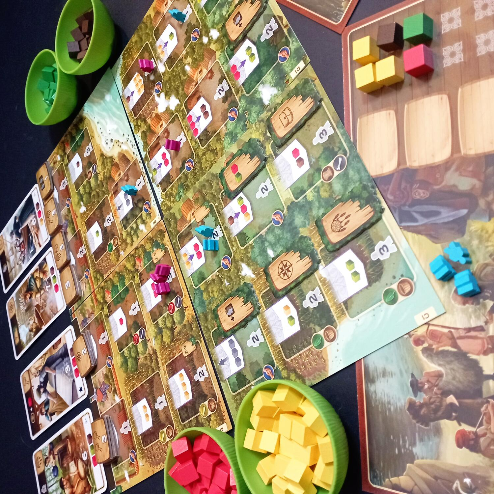
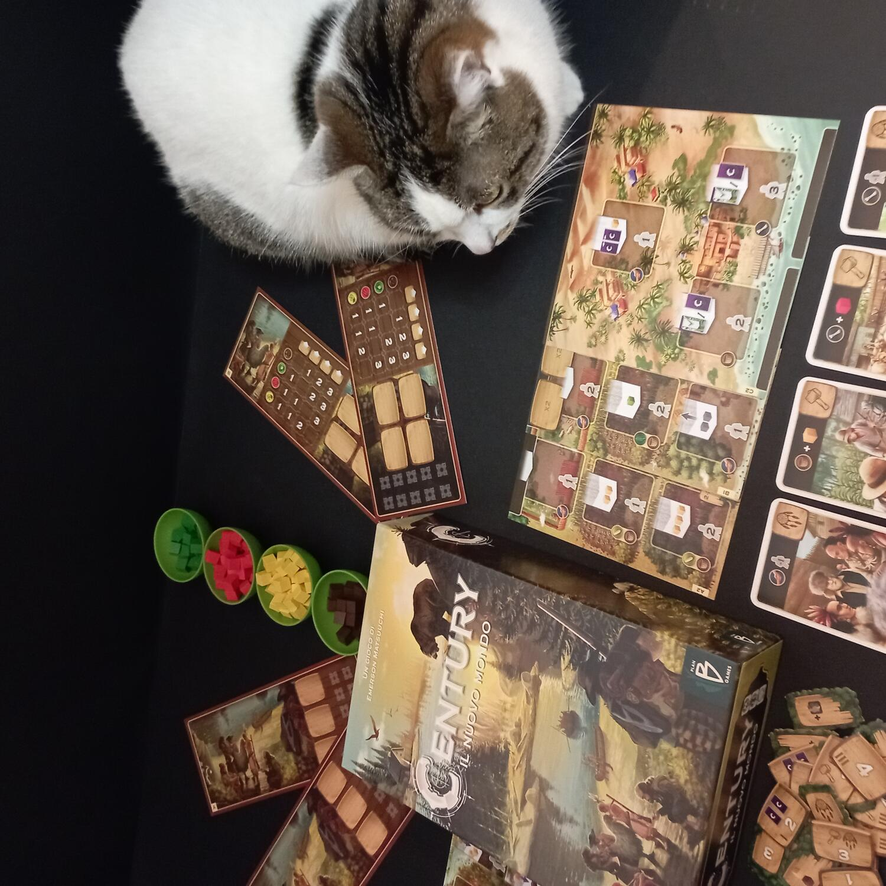

<Setting>

  XVI secolo: le grandi potenze europee cercano nuove rotte per spingersi verso
  i confini del mondo. Ed ecco infine profilarsi all’orizzonte una nuova terra,
  selvaggia e sconosciuta!
   
  Vestendo i panni di avventurieri e mercanti, i giocatori di{" "}
  <strong>    <em>Century: Il Nuovo Mondo</em></strong>{" "}
  dovranno accumulare più risorse possibili al fine di esplorare il territorio,
  commerciare con i nativi e costruire nuovi insediamenti.

</Setting>

<Rules>

  Il regolamento del gioco è molto breve e ben riassunto in un’unica scheda di
  facile comprensione, corredata di indicazioni per la fase di preparazione: si
  compone il tabellone di gioco unendo 4 plance, si crea il mazzo delle{" "}
  <strong>Carte Punteggio</strong> e se ne scopre una sopra ogni luogo Fortezza.
   
  Si mischiano poi le <strong>Tessere Bonus</strong> e si dispongono sulle
  caselle Bonus del tabellone (tante quante indicate dal tabellone stesso). Si
  mescolano anche le <strong>Tessere Esplorazione</strong> che verranno
  collocate sulle rispettive icone.
   
  Infine, ogni giocatore riceve una <strong>Plancia Giocatore</strong>, i{" "}
  <strong>lavoratori </strong>del colore scelto e un numero di{" "}
  <strong>cubetti risorsa</strong> iniziali in base all’ordine nel turno di
  gioco.
   
  Il gioco si svolge in una serie di round nei quali ogni giocatore può
  effettuare una tra le seguenti azioni:
   
  <ul>
    <li>      <strong>Lavorare</strong>: attivare un luogo del tabellone collocandovi sopra il numero di lavoratori richiesti.</li>
    <li>      <strong>Riposare</strong>: riprendere tutti i propri lavoratori dal tabellone.</li>
  </ul>
      Eseguendo la prima azione il giocatore sceglie un qualsiasi luogo libero,
      colloca il numero richiesto di lavoratori ed effettua l’azione
      corrispondente. Tramite questa azione ogni giocatore otterrà delle risorse
      o migliorerà quelle già in suo possesso: esse gli permetteranno di
      acquistare delle Carte Punteggio, che possono fornire, unitamente ai punti
      vittoria, anche alcuni bonus molto utili nel conteggio finale.  
      La partita finisce al termine del round in cui un giocatore rivendica la sua
      ottava Carta Punteggio. Sarà dichiarato vincitore il giocatore che avrà ottenuto
      più punti sommando quelli derivanti dalle Carte Punteggio, dalle tessere Bonus,
      dalle tessere Esplorazione e dai cubetti risorsa rimasti nella riserva.

</Rules>

<Feedback>

  Terzo “capitolo” della trilogia <em>Century</em>,{" "}
  <strong>    <em>Century: Il Nuovo Mondo</em></strong>{" "}
  si presenta come un gioco completo e indipendente oppure combinabile con le
  altre due avventure Via delle Spezie e Meraviglie Orientali, del quale potete trovare la recensione seguendo questo <Link to="/reviews/century-meraviglie-orientali/"> LINK </Link>. 
   
  La scatola è organizzata in modo da contenere tutto in ordine. 
   
  Anche in <em>Il Nuovo Mondo</em> i componenti che durante il gioco vengono
  usati di più sono in legno, cosa che li preserva dall’usura; risultano invece
  un po’ leggere e facili da danneggiare le schede componenti il tabellone,
  nello stesso cartoncino sottile delle carte. I meeples che rappresentano i
  lavoratori sono un po’ piccini e rischiano di sfuggire di mano, ma sono
  adeguati alla grandezza del tabellone. Infine, le ciotoline, ancora una volta
  (purtroppo) in plastica, in cui contenere i cubetti risorsa che mantengono gli
  stessi colori di tutta la trilogia, ma che questa volta rappresentano
  opportunamente carne, tabacco, mais e pellame. Ciotole e cubetti, con i loro
  colori accesi, creano un bel contrasto su un tabellone forse troppo “a tinta
  unita”.
   
  Come i suoi predecessori della trilogia, anche <em>Il Nuovo Mondo</em> risulta
  un gioco piacevole e coinvolgente, adatto a qualsiasi tipo di giocatore, dal
  neofita all’esperto. Ogni giocatore vi troverà ciò che fa al caso suo: il
  neofita sarà facilitato dalla semplicità delle regole e dalle molteplici
  modalità di acquisire punti vittoria, che gli daranno soddisfazione
  indipendentemente dal risultato finale; l’esperto invece potrà intavolarlo con
  altri giocatori del proprio livello per sperimentare diverse strategie, grazie
  anche alla bassa componente aleatoria.  
  In conclusione, <em>Century: Il Nuovo Mondo</em> si conferma un buon titolo, non
  immancabile, ma certo godibile e divertente, capace di arricchirsi ulteriormente
  se giocato in combinazione con uno o entrambi i “capitoli” precedenti della trilogia.

</Feedback>

