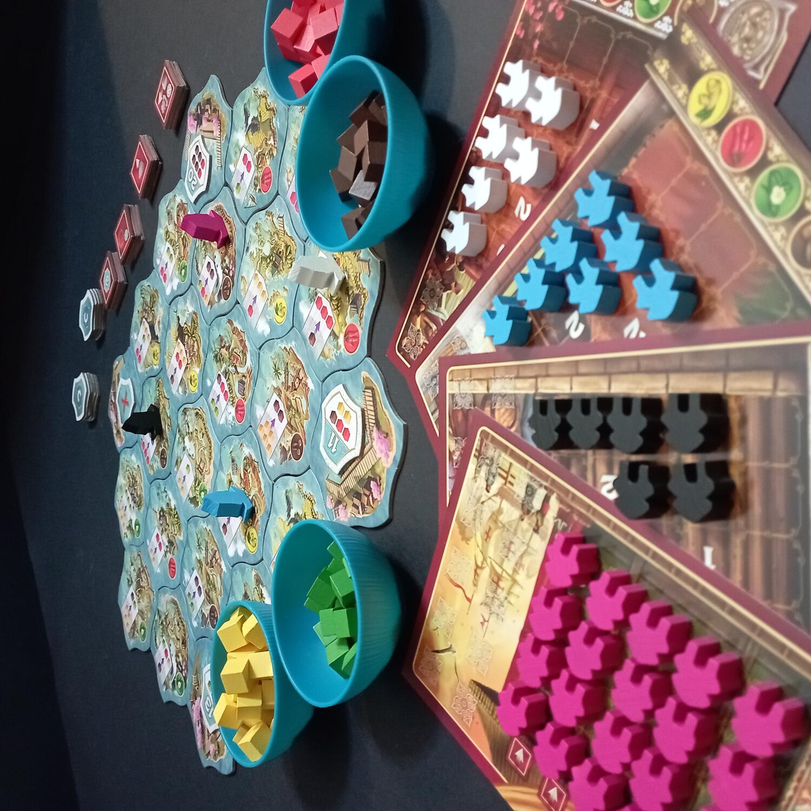
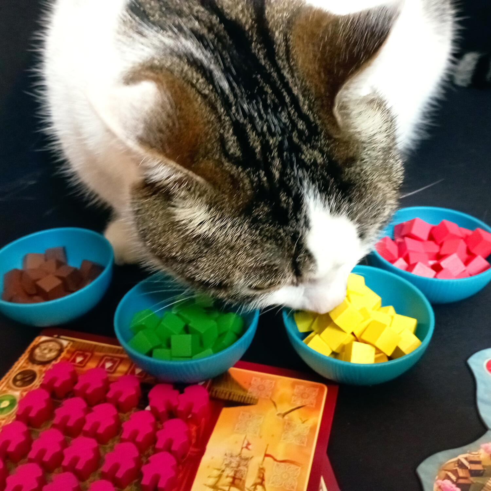
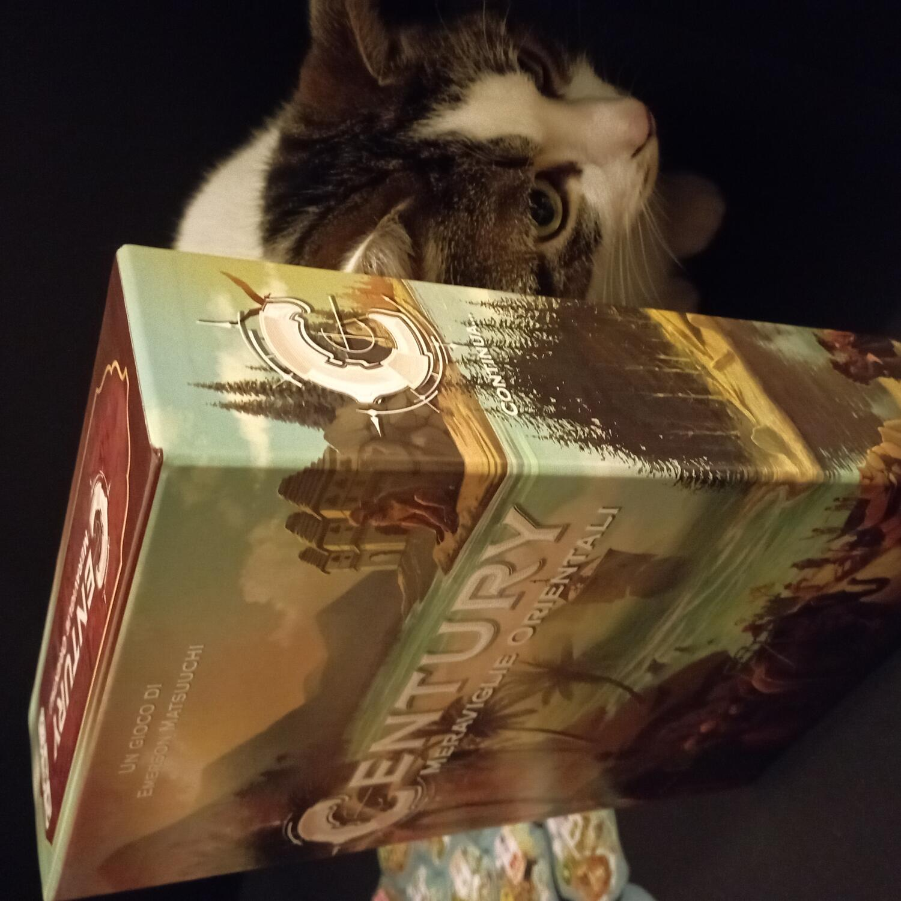

<Setting>

  Secondo titolo appartenente alla fortunata “trilogia” dedicata ai grandi commerci lungo la via della seta,{" "}
  <em>Century Meraviglie Orientali</em> ci farà solcare i mari alla volta degli estremi del mondo conosciuto.  
  Nei panni di ricchi mercanti in viaggio per affari o di rapaci pirati in cerca di fortuna, il nostro obiettivo sarà accumulare
  preziosissime spezie. Vento in poppa per una nuova avventura!
   
  &nbsp;
   

</Setting>

<Rules>

  La preparazione del gioco è molto semplice: si dispongono le <strong>tessere Mercato</strong> a formare una mappa, con
  le quattro <strong>tessere Porto</strong> agli angoli. Si mescolano poi le <strong>tessere Punto Vittoria</strong> e
  si forma una pila coperta, si dividono le <strong>tessere Bonus</strong> e si distribuiscono a ciascun giocatore una{" "}
  <strong>Scheda Giocatore</strong>, una <strong>barca </strong>e i 20 <strong>avamposti </strong>del colore scelto.
   
  Il gioco si svolge in una serie di round nei quali ogni giocatore può svolgere un’azione e muovere la propria barca.
  Si può muovere la propria barca su una tessera adiacente gratuitamente e poi continuare il movimento pagando però il
  prezzo di uno o più cubi colorati, che verranno lasciati su ogni tessera attraversata. Se la barca termina il
  movimento su una tessera Mercato contenente dei cubi, può raccoglierli.  
  Ora il giocatore può effettuare una tra le seguenti azioni:  
  <ul>
    <li>      <strong>Mercato</strong>: il giocatore può, a patto di avere precedentemente costruito un avamposto, scambiare i
      cubi come indicato nella legenda riportata nella parte alta della tessera Mercato</li>
    <li>      <strong>Porto</strong>: se la barca si trova su un Porto, il giocatore può rivendicare la tessera Punti Vittoria
      pagandone il costo</li>
    <li>      <strong>Raccolto</strong>: il giocatore prende 2 cubi dalla riserva e li aggiunge alla sua stiva</li>
  </ul>
  Dopo che un giocatore ha rivendicato la sua quarta tessera Punti Vittoria, la partita termina con un ultimo round di gioco.
  A questo punto chi ha totalizzato più punti è il vincitore!
   
  &nbsp;
   

</Rules>

<Feedback>

  <em>Century Meraviglie Orientali</em> è il secondo “capitolo” della trilogia di giochi <em>Century</em>, giocabile
  singolarmente oppure in combinazione con gli altri due.
   
   
  All’apertura della scatola di , saltano subito all’occhio i tanti e pregevoli componenti in legno, organizzabili tramite
  l’apposito inserto, e le immancabili ciotoline (purtroppo) in plastica e di un colore azzurro forse un pochino troppo vivace.
  Gradevoli anche le tessere Mercato dai bordi ondulati e pensati per essere accostati in modo da formare un’unica mappa
  di forma esagonale.  
  I colori dei cubetti che rappresentano le risorse sono uguali per tutta la trilogia, ma cambiano opportunamente
  tipologia di spezia in base al titolo: qui rappresentano zenzero, peperoncino, tè e chiodi di garofano.  
  Un altro punto a favore è certamente il regolamento: snello e molto breve, riesce ad organizzare un set-up immediato, grazie
  anche all’ausilio delle illustrazioni (queste forse un po’ piccole).  
  Dal punto di vista dell’esperienza di gioco, <em>Meraviglie Orientali</em> risulta non immancabile ma piacevole da
  intavolare, eppure alla presenza al tavolo di giocatori totalmente inesperti sono più consigliabili{" "}
  <em>Via delle Spezie</em> o <em>Nuovo Mondo</em>, dalle meccaniche leggermente più semplici.  
  Ogni “capitolo” di <em>Century</em> è giocabile singolarmente, ma è anche possibile unire i giochi per creare un’esperienza
  ludica più complessa. A nostro parere, <em>Meraviglie Orientali</em> rimane, tra i tre, il titolo più completo e meglio
  bilanciato. Quindi, se siete degli incalliti collezionisti: capiamo e incoraggiamo il desiderio di possederli tutti e tre.
  Se invece siete costretti a scegliere: <em>Meraviglie Orientali</em> potrebbe rivelarsi l’opzione migliore.
   
  &nbsp;
   

</Feedback>

