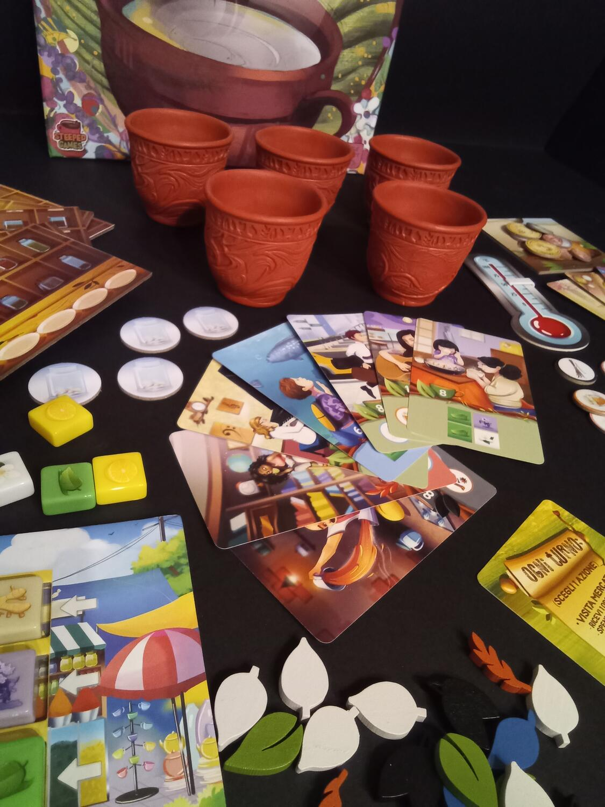

<Setting>

  Con l’arrivo dell’autunno e l’approssimarsi dell’inverno, cosa c’è di meglio che coccolarsi con un tè caldo e un gioco
  da tavolo? Risposta ovvia: un gioco da tavolo sul tè!
   
  Ma certo non esiste una sola varietà di tè, così come non esiste un solo modo di berlo. Starà a noi, esperti
  commercianti di aromi e spezie, soddisfare le richieste dei clienti più esigenti per creare la tazza di tè migliore
  del tavolo.
   

</Setting>

<Rules>

  La preparazione è molto semplice: ogni giocatore riceve
   
  <ul>
    <li>una plancia casa da tè</li>
    <li>i corrispondenti segnali tè base</li>
    <li>monete</li>
    <li>      8 carte cliente, tra cui dovrà sceglierne 2 e mischiare le restanti nel mazzo comune delle carte cliente. Delle 2
      carte cliente scelte una sarà da tenere in mano e l’altra da posizionare al centro del tavolo per formare il pool
      clienti.</li>
  </ul>
       
      Pescando dai sacchetti delle tessere aroma e degli articoli della dispensa, si riempiono le corrispondenti plance;
      si mischiano le carte abilità e se ne pescano 3 posizionandole al centro del tavolo insieme alle tazze, in numero
      pari al numero dei giocatori, a cui viene assegnato un segnalino mancia.
   
  Una partita dura 5 round, nei quali ogni giocatore durante il proprio turno può effettuare una tra queste tre azioni:
  <ul>
    <li>      Visitare il mercato: il giocatore ottiene 3 monete e ne deve spendere almeno 1 per acquistare gli aromi il cui prezzo è indicato dalla plancia</li>
    <li>Visitare la dispensa: il giocatore sceglie 3 articoli dalla dispensa tra i 5 disponibili</li>
    <li>      Prenotare un cliente e usare abilità: il giocatore può prenotare un cliente dal pool di clienti disponibili o dal mazzo e usare una delle tre carte abilità presenti sul tavolo.</li>
  </ul>
       
      Alla fine del proprio turno, il giocatore può evadere un ordine soddisfacendo la richiesta di un cliente dal pool
      o dalla mano: per farlo, è necessario riempire una delle tazze con gli aromi e gli articoli indicati dalla carta,
      a cui si aggiunge un segnalino tè base del colore corrispondente alla carta cliente soddisfatta. Riempiendo una
      tazza, il giocatore ha diritto a scoprire e ottenere il beneficio del segnalino mancia di quella tazza.
       
      Alla fine di ciascun round si posizionano dei nuovi segnalini mancia accanto alle tazze da tè, si rimuove la prima
      tessera aroma di ogni fila sostituendola con una nuova e si pesca una nuova carta abilità posizionandola sopra una
      delle tre precedentemente utilizzate.
       A fine partita si sommano i punti ottenuti dalle carte cliente soddisfatte e le monete rimanenti: ovviamente
      chi ne totalizza di più vince!

</Rules>

<Feedback>

  Il gioco offre un ottimo colpo d’occhio grazie all’aspetto dei materiali, tra i quali spiccano, ovviamente, le tazze
  da tè: la plastica con cui sono realizzate però risulta non sufficientemente rigida da evitare eventuali deformazioni.{" "}
   
  Le varie plance, invece, sono realizzate con un cartoncino molto solido e resistente, le tessere aroma sembrano quasi caramelle
  dai toni pastello e la grafica sulle carte è graziosa e colorata.
   
  Per quanto riguarda l’esperienza di gioco, è innegabile che ci troviamo davanti a un titolo pensato per famiglie e giocatori
  di primo pelo: meccaniche semplici, turni ben definiti, anche se non manca il brivido della competitività quando sale l’interazione
  al tavolo se più giocatori mirano allo stesso cliente o alle stesse tessere. Si dovrà essere quindi sempre pronti a deviare
  dal percorso pensato senza rischiare di aver perso turni accumulando risorse inutili.  
  Un titolo che forse potrebbe non essere necessario nella collezione dei grandi esperti, ma che di certo saprà rendere
  lo scaffale più colorato e che funzionerà benissimo come filler o come introduttivo per nuovi giocatori.
   

</Feedback>
