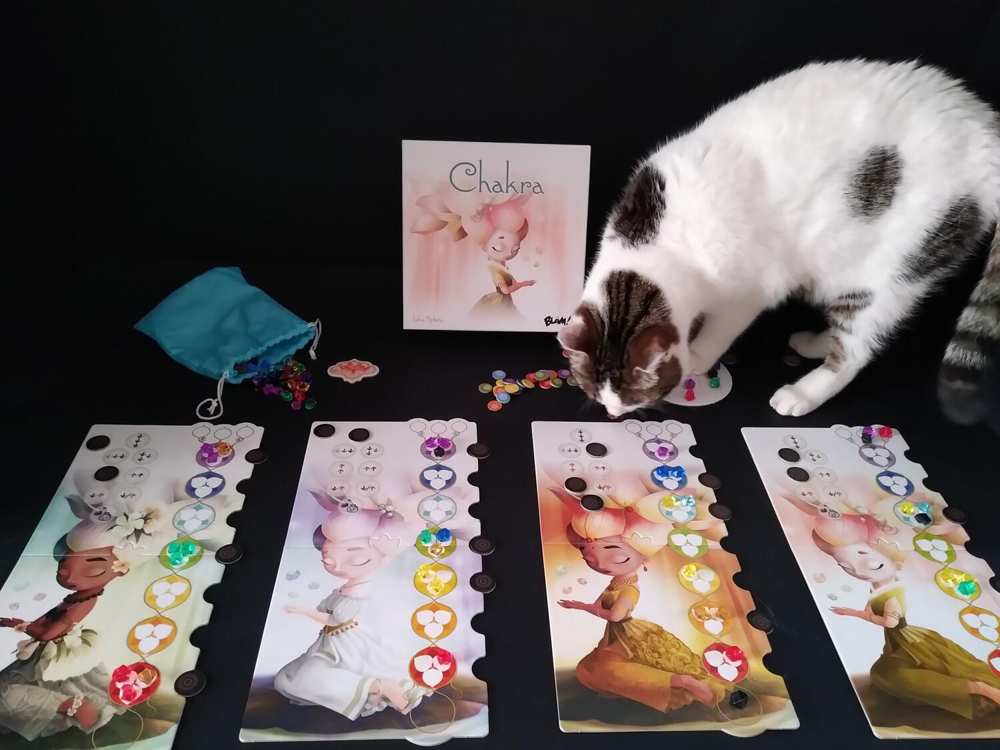

<Setting>

  Come ad ogni appassionato di anime e manga che si rispetti, anche a noi alla parola “chakra” viene in mente solo una
  cosa: quella concentrazione di energia necessaria a Naruto Uzumaki e compagni per utilizzare le tecniche ninja.  
  Ma giustamente, nella nostra ignoranza, ci troviamo davanti ad un'altra verità, che a ben pensarci era già intuibile dall'aspetto
  pacifico ed evocativo dell'illustrazione presente sulla scatola, dalla scelta di delicati colori pastello e da un tratto
  morbido e grazioso.  
  Facendo qualche ricerca, scopriamo anche che l'autore è un insegnante di yoga e che con Chakra ha voluto unire le
  proprie passioni: il gioco da tavolo e l'arte meditativa per eccellenza. Chapeau!

</Setting>

<Rules>

  Chiaramente di categoria German, Chakra è un gioco molto solido sul piano delle meccaniche ludiche, che scorre veloce,
  facilissimo da spiegare e adatto a tutte le tipologie di giocatori.
   
  All'interno del sacchetto di pesca si trovano tre gemme di energia in otto colori diversi per ciascun giocatore, più
  alcune energie “negative” nere. Nella plancia Fiore di Loto centrale vengono disposti, pescando casualmente, tre set
  di gemme, mentre i giocatori vengono dotati di plancia giocatore e cinque gettoni ispirazione.  
  Lo scopo del gioco è quello di prendere le gemme dal fiore di loto e incanalarle nei chakra presenti nel tabellone giocatore
  fino ad armonizzarle, portando un set di tre gemme dello stesso colore nel chakra del colore corrispondente.  
  Il gioco terminerà quando un giocatore armonizzerà cinque chakra.
   
  In ciascun turno è possibile fare una delle seguenti azioni:
  <ol>
    <li>      prendere da una a tre gemme da una delle tre file del Fiore di Loto, senza mai prendere due colori uguali, e tutte
      le gemme di energia negativa lì presenti. A questo punto andranno posizionate o su uno dei chakra, "bloccandolo"
      con uno dei cinque gettoni ispirazione, oppure nelle tre “sacche” che sovrastano i chakra, senza utilizzare il
      gettone ispirazione;</li>
    <li>      selezionare un'azione sulla plancia giocatore con lo scopo di far scorrere le gemme verso il basso o verso l'alto
      nel flusso dei chakra, cercando di posizionare le gemme in quello del colore corrispondente e/o cercando di
      espellere l'energia negativa;</li>
    <li>      meditare recuperando i gettoni ispirazione precedentemente utilizzati per selezionare le azioni, lasciando però
      quelli bloccati sui chakra che potranno essere recuperati solo quando quel chakra verrà armonizzato.</li>
  </ol>
  La vittoria è assegnata a chi avrà totalizzato il miglior punteggio. All'inizio del gioco a ogni chakra viene
  assegnato un valore da uno a quattro in maniera casuale e nascosta, ma i giocatori avranno modo di sbirciare i vari
  valori durante la partita. I giocatori quindi faranno punti in base ai chakra armonizzati, all'energia negativa
  espulsa e all'eventuale bonus ottenuto da chi avrà creato la fila di chakra armonizzati più lunga partendo dal basso.

</Rules>

<Feedback>

  Si tratta dunque di un gioco leggero, che ben si adatta a chi cerca un prodotto non troppo impegnativo ma comunque
  dotato di un briciolo di strategia. I giocatori più esperti impiegheranno poco a sviscerare le varie meccaniche; ciò
  nonostante, visto anche il prezzo molto contenuto, si dimostra un buon titolo per avvicinarsi al mondo dei giochi da
  tavolo.
   
  La durata indicata sulla scatola è veritiera: il gioco scorre senza intoppi, con qualche rischio di paralisi da
  analisi che viene meno già dopo i primi turni, quando diventa chiaro come e dove posizionare le gemme e come sfruttare
  l'energia negativa.  
  Simpatica anche la scala di punteggio riferita ai livelli di armonia interiore raggiunta, che passa da “fatti una bella
  tisana”, per il punteggio più basso, a “saggio” per il punteggio più alto.
   
  La componentistica è di ottimo livello e colpisce sin dalla prima apertura della scatola: plance solide seppur non troppo
  spesse, illustrazioni veramente evocative (anche se personalmente avremmo preferito diversi disegni per ogni plancia, piuttosto
  che variazioni di colore sullo stesso disegno), gemme colorate che aiutano non poco il colpo d'occhio e un piccolo tabellone
  tondeggiante chiamato "Fiore di Loto".
   
  Un piccolo difetto potrebbe essere la pesca delle gemme dal sacchetto: se si è sfortunati si potrebbe aspettare un colore
  a lungo o avere il Fiore di Loto invaso da gemme nere ed essere obbligati a prenderle. Per questo motivo è importante approcciarsi
  al tavolo con l'intento di giocare un filler leggero e divertente.  
  L'interazione è scarsa, si avverte soltanto nella scelta delle gemme, naturalmente con intensità crescente in base al
  numero di giocatori. Potrebbe nascere qualche “amichevole” discussione, ma tutto il gioco è una lotta con noi stessi
  per ottimizzare gli spostamenti delle gemme sulla nostra plancia personale. I turni sono veloci e i tempi di attesa
  veramente brevi.  
  Anche l'ambientazione riesce a farsi sentire: è molto rilassante l'idea di far fluire l'energia positiva, incanalandola
  nello spazio corretto, e far scendere invece fino a terra quella negativa, che può infine essere espulsa e addirittura
  “ripulita”, donandoci punti extra. Come se, anche solo giocando, potessimo esercitare una sorta di purificazione interiore,
  liberandoci di tutte quelle “tossine emotive” che rischiano di appesantirci l'anima.

</Feedback>

