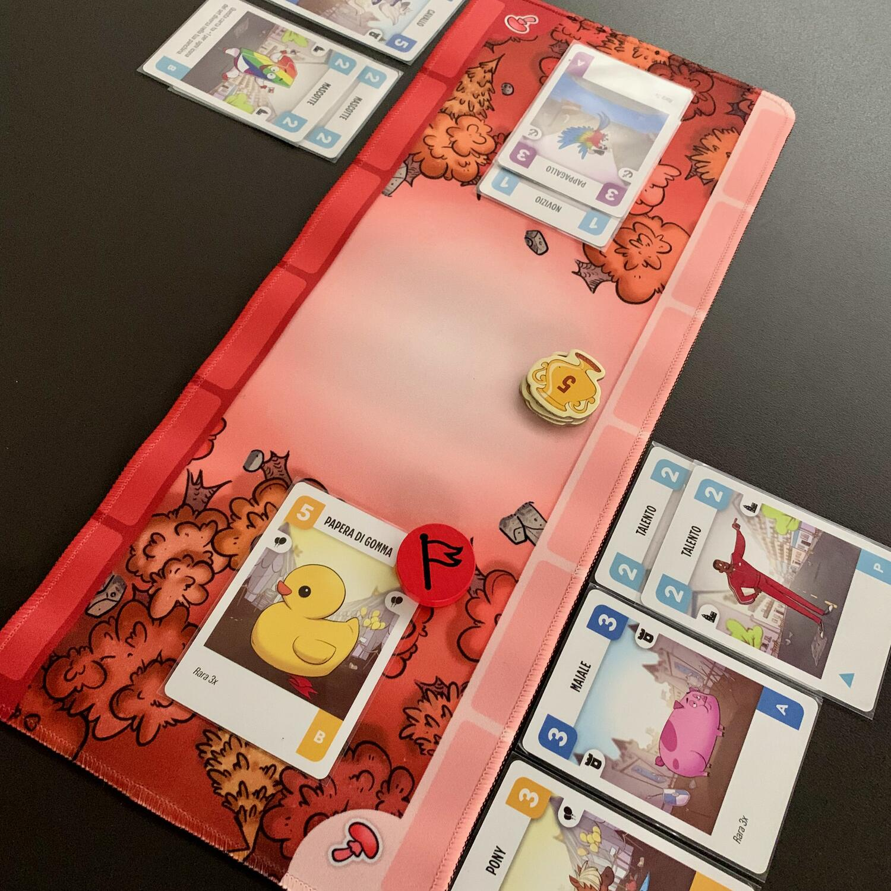
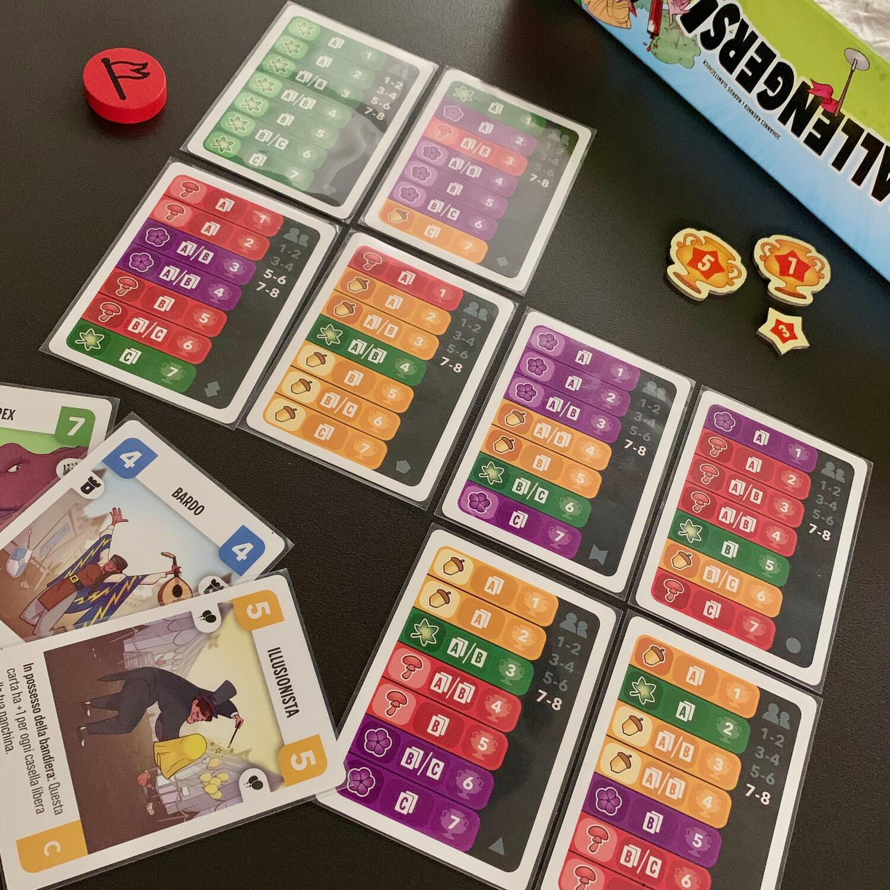

<Setting>

  La vostra squadra riuscirà a trionfare? Con l'aiuto del vostro{" "}
  <strong>Bardo</strong>, il vostro <strong>Kraken</strong> ha appena catturato
  la bandiera! Ora state aspettando l'attacco dell'avversario , pronti a reagire
  con il vostro <strong>Necromante</strong> e la vostra{" "}
  <strong>Papera di Gomma</strong>! 
  Dagli alieni dello spazio alle creature delle profondità marine, alleati improbabili
  collaborano per raggiungere un obiettivo comune: <strong>    Vincere il più grande torneo di rubabandiera al mondo!</strong>

</Setting>

<Rules>

  I giocatori partecipano a un torneo di <strong>7 round</strong>. 
  Ogni giocatore, a inizio partita, <strong>    riceve il programma del proprio torneo e un mazzo di carte identico agli
    altri</strong>, che va a definire la propria squadra di catturatori di bandiere.
   
  Ogni round inizia con la Fase Mazzo e prosegue con la Fase Incontro.  
  Durante la prima fase, i giocatori migliorano il proprio mazzo selezionando
  nuove carte. Durante la seconda, invece, ogni giocatore gioca contro un
  avversario.  
  La <strong>Fase Mazzo</strong> si gioca tutti contemporaneamente, ogni giocatore
  andrà a pescare 5 carte dal mazzo A, B o C e, a seconda di quanto stabilito nel
  programma di torneo e ne sceglierà 1 o 2.
   
  Dopo aver deciso se bruciare o meno delle carte dal proprio deck, si preparerà
  per sfidare il prossimo avversario, anche qui seguendo il programma.  
  Nella <strong>Fase Incontro</strong>, invece, si giocano contemporaneamente
  tante partite, tutte 1 contro 1.  
  Ogni duello inizia mescolando il proprio mazzo. Uno dei due duellanti girerà, alla
  cieca, la prima carta del proprio mazzo e otterrà, così, la bandiera. D'ora in
  poi, i turni si giocheranno finché non si entra in possesso della bandiera o si
  perde il duello. Per attaccare si gireranno, sempre <strong>    alla cieca</strong>, le carte del proprio mazzo finché la forza d'attacco pareggia o supera
  quella della difesa.
   
  Le carte che hanno attaccato vengono nascoste sotto l'ultima giocata (se si giocano
  3 carte con valore 2-5-1 si avrà attacco 8 che si trasformerà in difesa 1); mentre
  le carte della difesa verranno spostate in panchina.  
  Se, durante un attacco, un giocatore{" "}
  <strong>finisce le carte del proprio mazzo</strong>, senza riuscire a tornare
  in possesso della bandiera, quel giocatore perderà.
   
  Se, in qualsiasi momento, <strong>la panchina</strong> di un giocatore{" "}
  <strong>non potrà più ospitare carte</strong> (quelle con lo stesso nome
  occuperanno un solo spazio), quel giocatore perderà.
   
  A fine duello, il vincitore otterrà un numero segreto di fan.
   
  Alla fine delle 7 sfide,{" "}
  <strong>i due giocatori con più fan andranno al duello finale</strong> senza
  poter modificare il mazzo.
   
  Chi vincerà, vincerà il torneo e sarà il mago del ruba bandiera.

</Rules>

<Feedback>

  Se mi avessero detto di poter organizzare{" "}
  <strong>un torneo da 8 persone in 15 minuti…</strong>
   
  E se, poi, mi avessero detto che i giocatori potevano non essere dei
  professionisti, ma potevano essere presi dalla strada…
   E se, infine, mi avessero detto che avrei giocato a un gioco di <strong>    Rubabandiera</strong>… 
  Avrei sicuramente iniziato a ridere.
   
  <strong>Follia.</strong>
   
  E invece, eccoci qui.
   
  Le regole di Challengers sono facili, elementari e chiunque potrebbe spiegarle
  dopo aver letto il regolamento per quanto è scritto bene.
   I <strong>materiali sono spettacolari</strong>: nella scatola ci sono ben
  4 playmat, uno per ogni sfida in corso.
   
  Ma non è tutto oro quello che luccica.
   
  Tra una sfida e l'altra, bisognerà alzarsi e andare a trovare il prossimo posto
  dove sedersi. Avete presente <strong>il gioco delle sedie</strong>? A volte si
  ha lo stesso feeling.  
  <strong>    Credo che la cosa più "brutta" sia il "gioco che si gioca da solo"</strong>
  . Come dicevo voi sarete i fautori del vostro deck, scegliendo carta per carta,
  ma non avrete mai la possibilità di giocarlo secondo l'ordine che avete in testa;
  vi limitiate a girare carte e a guardar girare carte.
   
  Ma, in ogni caso, a Challengers vince chi se lo merita.  
  Certo,{" "}
  <strong>    la fortuna c'è ed è indiscussa, ma la fase di deck building è
    importantissima.</strong>{" "}
  Si riescono sempre a creare combo con le carte che si vanno a pescare tra una
  sfida e l'altra. Punterete su avere poche tipologie di carte per non rischiare
  di occupare la panchina troppo velocemente? Vi lancerete su carte grossissime
  o opterete per quelle piccole ma con combo capaci di sfasciare qualunque cosa?
  Terrete il mazzo il più snello possibile rischiando che l'avversario riesca a
  resistere abbastanza a lungo per vedervi soccombere?{" "}
  <strong>Non c'è una scelta giusta.</strong>  
  Dipende dalle carte che pescherete nel corso della partita e gioco che fanno gli
  altri, nello stesso momento in cui giocherete. State attenti!
   
  <strong>    Challengers è appagante, adrenalinico e davvero molto, molto divertente.</strong> Avesse un altro tema… ma vabbè, non poteva essere perfetto! Provatelo.

</Feedback>

