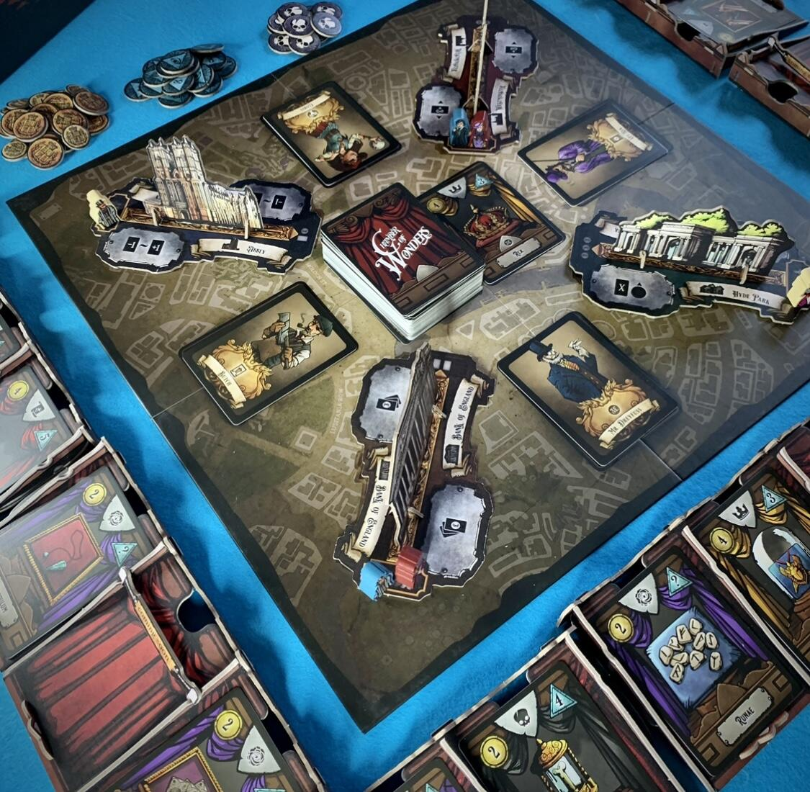
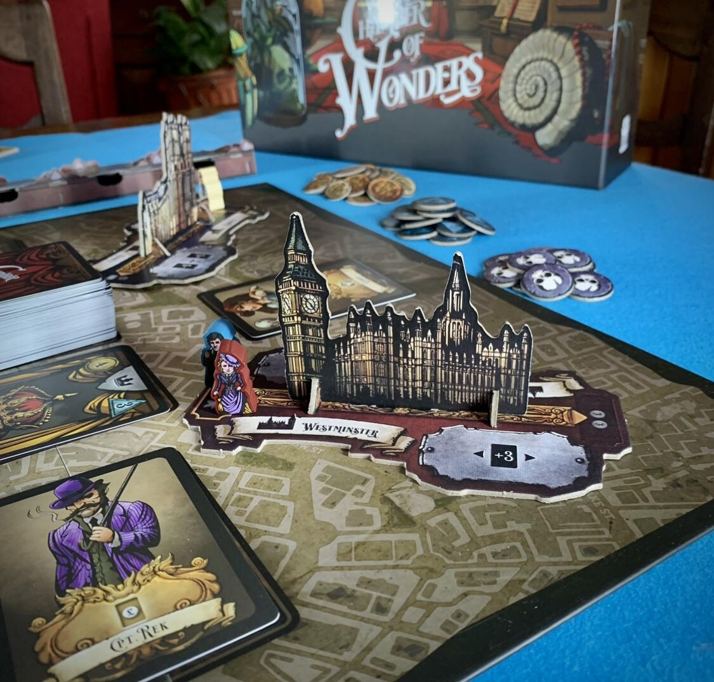
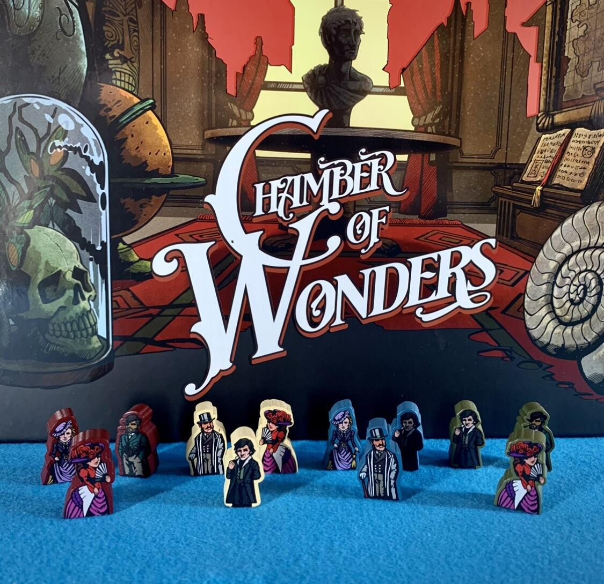

<Setting>

  Londra, XIX secolo: dei nobili inglesi, ricchi e annoiati sposeranno una nuova
  e alquanto strana moda: l’allestimento di una “Camera delle Meraviglie”. Sarà
  una corsa contro i propri rivali a chi porterà più stranezze possibili, tra
  cui anche improbabili reperti della cultura nerd.
   
  Si avrà l’occasione di visitare case d’asta, di fare affari con losche figure
  o di cercare reperti improbabili nei negozi di Piccadilly.{" "}
  <em>Chi riuscirà a stupire tutti con le meraviglie più impressionanti?</em>

</Setting>

<Rules>

  Lo scopo del gioco è quello di{" "}
  <strong>allestire la miglior Camera delle Meraviglie</strong>, posizionando
  nei propri espositori le carte meraviglia, recuperate tramite i propri agenti
  nelle varie zone di Londra. Ogni meraviglia collezionata permetterà di
  guadagnare dei punti fama.
   
  Ogni giocatore ha a disposizione tre espositori, ciascuno dei quali
  inizialmente provvisto di due teche, con la possibilità di sbloccarne una
  terza.
   
  Durante il turno è possibile:  
  <ul>
    <li>      <strong>        Riempire una teca con delle carte meraviglia presenti nella propria mano</strong>
      . Attenzione! Una volta messe delle carte in una teca non si potrà più aggiungere
      o togliere niente. Ogni teca può ospitare una singola meraviglia oppure dei
      set, ad esempio i set mostro o i set libri.</li>
    <li>      <strong>Inviare i propri agenti in giro per Londra</strong>. I giocatori
      avranno a disposizione dei meeple che potranno svolgere diverse azioni. In
      base alla zona in cui ogni meeple verrà inviato, partirà una sorta di
      “minigioco” nel quale saranno sempre coinvolti tutti i giocatori, dalla
      semplice pesca, o consultazione di carte meraviglia dal mazzo, fino a
      un’asta o alla vendita delle proprie carte.</li>
  </ul>
       
      Vi è pure la possibilità di attivare un’abilità speciale di uno dei due
      contatti posti a lato del luogo in cui ci si trova, che permetteranno al
      giocatore di ottenere diversi benefici, come pescare delle carte o
      sbloccare delle teche.
       
      La partita termina alla fine del turno in cui l’ultimo giocatore ha
      piazzato l’ultimo agente, e le relative azioni sono state svolte. Poi si
      sommeranno i punteggi e{" "}
      <strong>        il giocatore che avrà ottenuto il maggior numero di punti fama sarà
        decretato vincitore</strong>.

</Rules>

<Feedback>

  <strong>Partito da una campagna Kickstarter</strong>, Chamber of Wonders è
  diventato un gioco immancabile in ogni collezione, sia per la qualità dei
  componenti, sia per la facilità delle regole, che rendono il gioco
  avvicinabile da chiunque.  
  Devo ammettere che, una volta aperta la scatola, mi sono spaventata di fronte alla
  vastità dei componenti da montare e credo di averci messo circa 40 minuti (forse
  anche a causa della mia pignoleria). Fortunatamente, la scatola è abbastanza capiente
  da consentire di riporre tutto montato.
   
  Le illustrazioni danno un tocco di mistero e si incastrano perfettamente negli
  scenari: la Londra Ottocentesca vi incuriosirà sin dal primo sguardo.
   
  Un altro punto a favore del gioco è dato dalla vastità dei componenti: la varietà
  di zone, carte contatto e Clubs (carte che forniscono abilità aggiuntive ai giocatori)
  consente di giocare molte partite senza annoiarsi.
   
  Una partita dura spesso meno di mezz’ora, anche se durante le prime partite occorrerà
  più tempo per memorizzare l’abilità di ogni zona.
   
  Questo gioco performa egregiamente anche nella modalità in solitario, grazie a
  contatti, zone e regole create appositamente.

</Feedback>

