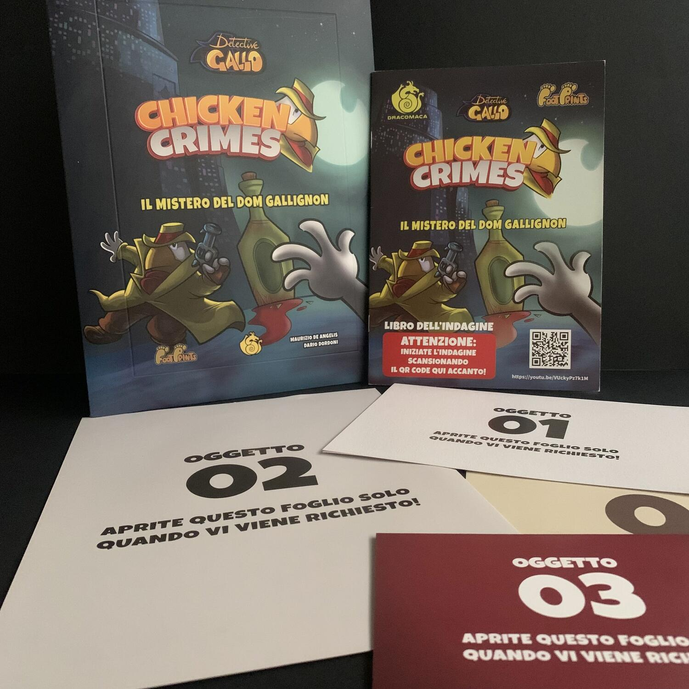
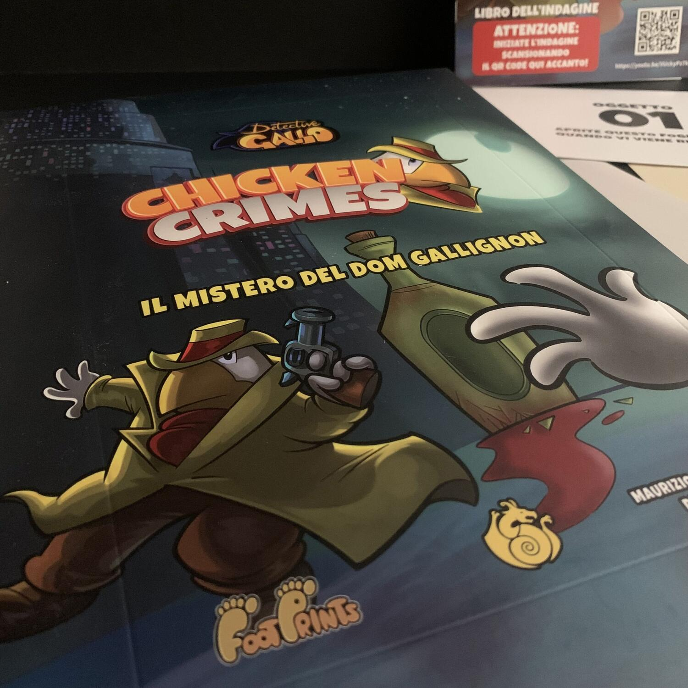

<Setting>

  Becco Perbacco, il noto magnate di vini di Chicken City, è nei guai!
   
  Qualcuno gli ha inviato una lettera anonima minacciando di ucciderlo… a meno
  che non consegni entro mezzanotte l'unica bottiglia del suo vino più pregiato
  e leggendario, il Dom Gallignon. Ma il problema è che gli è stata recentemente
  rubata!  
  Riuscirete con il Detective Gallo a salvare Becco Perbacco e a risolvere il mistero
  legato al suo vino?

</Setting>

<Rules>

  Chicken Crimes: il mistero del Dom Gallignon è un misto tra un libro-game
  investigativo, un gioco da tavolo fisico e virtuale.  
  Dopo aver letto il lunghissimo regolamento (1 facciata), sarete pronti a investigare
  e decisi a portare a <em>Gallo</em> tutta la verità.
   
  Inquadrate il QR code e via, si gioca!  
  Il Detective Gallo in persona, tramite un bellissimo video, vi presenterà il
  caso e toccherà a voi aiutarlo a risolverlo.
   
  Una serie di domande e una lista di luoghi, noti sin dall'inizio, vi faranno
  capire verso cosa spingere la vostra indagine, nella speranza di imboccare
  tutte le strade necessarie per formalizzare la vostra tesi ed essere in grado
  di difenderla.
   
  Scegliete il primo luogo da esplorare e leggete il relativo paragrafo, fate le
  scelte del caso, interrogate chi volete, osservate attentamente le immagini e
  via così.  
  In alcuni luoghi verrete a conoscenza di alcuni siti web che vi aiuteranno nelle
  indagini, siti web veri e propri, quindi tenete a portata di mano il browser di
  un pc o telefono che sia.  
  Nel corso della storia, troverete anche delle prove che andrete ad estrarre
  dalla busta per poterle analizzare con più facilità.  
  Quando pensate di aver raccolto tutte le informazioni necessarie per capire cosa
  è successo, andate al paragrafo finale e rispondete alle domande.... E controllate
  se avete la stoffa degli investigatori!

</Rules>

<Feedback>

  Non fatevi trarre in inganno dalla grafica "per bambini" di Chicken Crimes: il
  gioco è tutt'altro che banale, è un vero e proprio caso, con colpi di scena,
  indizi da raccogliere, informazioni da far collimare, per cui è molto
  importante annotare quanti più dati possibile.  
  Appena ho aperto il libricino e letto il regolamento ho pensato subito a <Link to="/reviews/sherlock-holmes-consulente-investigativo/">
    Sherlock Holmes Consulente Investigativo
  </Link>, ma con un'ambientazione molto più ironica e simpatica, benché sempre noir.
  Vista l'immediatezza del regolamento e dello stile di gioco, è perfetto per una
  serata con amici non giocatori.  
  Il mondo del detective è pieno di giochi di parole davvero geniali: cercherete
  di risolvere il caso del Dom Gallignon, visiterete la stazione di Pollizia e
  leggerete il Galletto del Mattino.  
  Le domande all'inizio dell'avventura sono molto comode per indirizzarvi verso la
  soluzione, per farvi capire cosa è davvero necessario capire per risolvere il caso
  e per non finire in vicoli ciechi e perdere tempo e denaro. Proprio il denaro,
  i Beak Coin, sarà il mezzo con il quale potrete pagare dei biglietti d'ingresso,
  corrompere delle persone e chissà che altro... e sarà molto complesso farseli bastare.
  Saranno pochi, pochissimi.  
  Chicken Crimes si presenta come una collana che continuerò ad acquistare in
  quanto racchiude in questa avventura una sana dose di umorismo e leggerezza,
  nonostante ci si senta davvero le piume coperte da un impermeabile mentre si
  sta lavorando alla risoluzione di un caso molto bello, per niente banale e ben
  strutturato.
   
  Ps: è già possibile acquistare un'espansione che merita di essere giocata
  immediatamente dopo aver completato il caso!

</Feedback>

