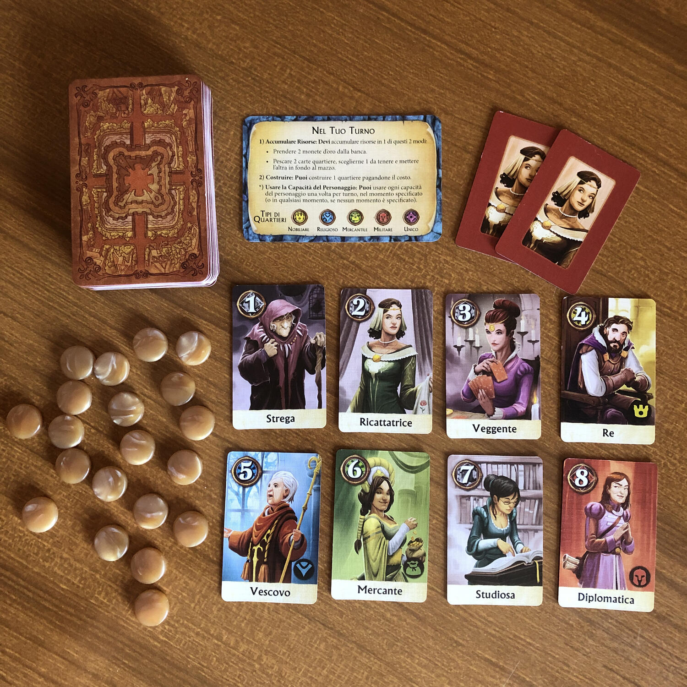
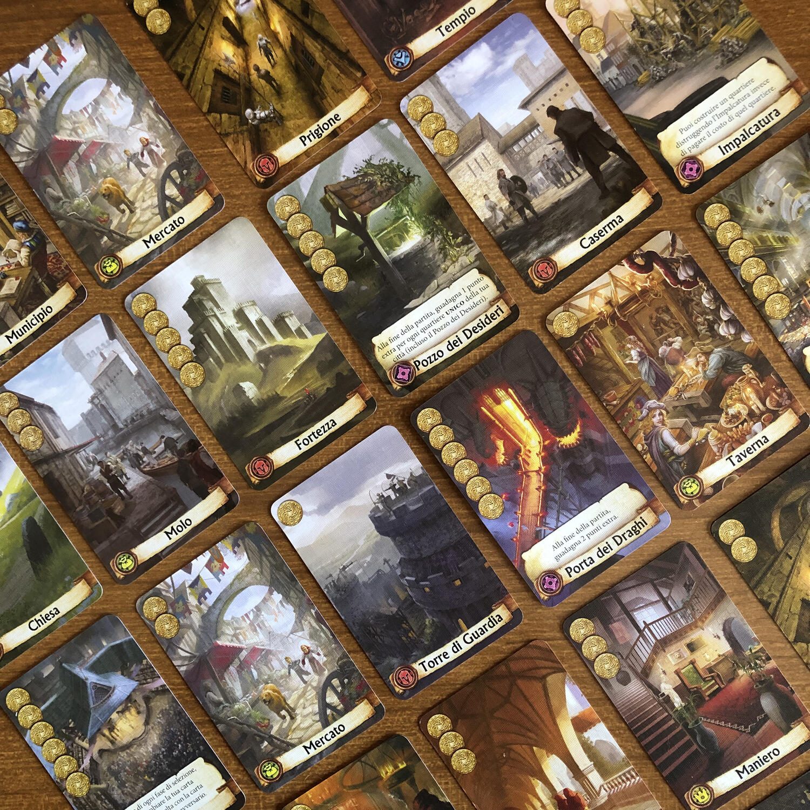
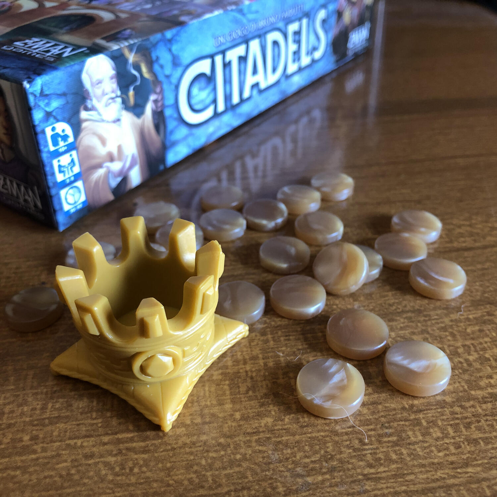

<Setting>

  Un’ambientazione medioevale ci permette di impersonare diversi cittadini con
  un unico obiettivo: costruire la città più imponente.
   
  Potrai impersonare assassini, ladri, mercanti o architetti, accumulando (
  <em>o rubando</em>) risorse per costruire quartieri.
   
  Considerando che la prima edizione è del lontano 2000, Citadels è un classico
  “invecchiato bene”. Questa nuova edizione, in una box di dimensioni ridotte,
  integra al gioco originale le due espansioni e mantiene le illustrazioni
  dell’edizione del 2016, meno cupe rispetto a quelle della prima edizione.
   
  Citadels è un gioco di carte a turni strategico e veloce (se giocato in
  massimo in 3/4 giocatori), che diverte sia i giocatori più navigati che i
  neofiti.

</Setting>

<Rules>

  Le regole di Citadels sono semplici e ben spiegate nel breve manuale in
  dotazione.  
  La partita si compone di una serie di round caratterizzati da due macrofasi: la
  prima di selezione dei personaggi e la seconda di svolgimento dei turni.  
   
  Nella fase di selezione dei personaggi ogni giocatore decide, senza comunicarlo
  agli altri, quale tra gli 8 cittadini usare.
   
  Cercare di nascondere la propria scelta agli altri giocatori e cercare di capire
  i personaggi scelti porta un notevole vantaggio: ogni personaggio ha infatti delle
  caratteristiche speciali che permettono di accumulare più risorse, di costruire
  più quartieri, o di rubare questi due agli altri giocatori.  
  I personaggi sono numerati e la fase dei turni si svolge seguendo proprio
  l’ordine dei personaggi, chiamati di volta in volta dal Re (o da colui che in
  quel turno possiede la corona), che ha anche l’onore di scegliere, per primo,
  quale cittadino giocare per il round.  
  Una volta chiamato il nome del proprio personaggio, il giocatore lo mostra e svolge
  il suo turno, composto da 3 fasi:
   
  <ul>
    <li>      pescare carte o accumulare oro (dei carinissimi bottoncini oro simili a
      delle caramelle particolarmente apprezzate dai gatti);</li>
    <li>costruire un solo quartiere;</li>
    <li>      svolgere le capacità speciali del personaggio (queste azioni vengono
      svolte nel momento specificato dalla carta stessa).</li>
  </ul>
  Tra le azioni speciali degne di nota citiamo il fastidioso Assassino, che
  uccide un altro personaggio e il quale dovrà quindi saltare il turno, la
  subdola Ricattatrice, che richiede il pizzo a due personaggi, portando viala
  metà delle monete d’oro accumulate, e il comodo Architetto, che permette di
  accumulare più carte e costruire fino a 3 quartieri nel proprio turno
   
  La partita si conclude quando un giocatore ha costruito 7 quartieri nella sua
  città (8 per le partite a due giocatori). Il giocatore che ha accumulato più
  punti, dati dal costo dei quartieri e dai punti extra che alcuni di questi
  forniscono, vince la partita.
   

</Rules>

<Feedback>

  Questa nuova edizione include 27 personaggi e 30 quartieri unici, e
  garantiscono quindi un’alta rigiocabilità.  
  All’inizio di ogni partita i 9 personaggi possono essere scelti seguendo i suggerimenti
  del manuale (utili soprattutto nelle prime partite per prendere confidenza con
  le varie abilità) o creando delle combinazioni autonomamente, così come i 14 quartieri
  unici.
   
  Attenzione a questi ultimi e ai loro effetti speciali: potrebbero ribaltare le
  sorti di una partita!
   
  Nonostante sia possibile giocare fino ad 8 giocatori, con più di cinque persone
  al tavolo il ritmo di gioco potrebbe rallentare molto.  
  Per le partite a 2 giocatori, invece, sono state introdotte delle meccaniche
  specifiche, delle quali la più interessante è probabilmente la possibilità di
  poter scegliere 2 personaggi per ogni round. Il gioco fluisce quindi in
  maniera diversa, richiede maggiore pensiero strategico e, a nostro parere,
  guadagna quella marcia in più.
   
  Qualunque sia il numero di giocatori, il livello di interazione è alto.
  Teniamo in considerazione che le relazionitra i personaggi sono per la maggior
  parte negative e potrebbero portare le anime competitive ad infiammarsi: alla
  seconda volta che mi uccidi il personaggio, potrei volerti lanciare il primo
  oggetto contundente a mia disposizione, o se mi distruggi quel quartiere unico
  fondamentale per la mia strategia, e non sei il gatto che lo lancia giù dal
  tavolo, potrei lanciarti il gatto stesso!

</Feedback>

