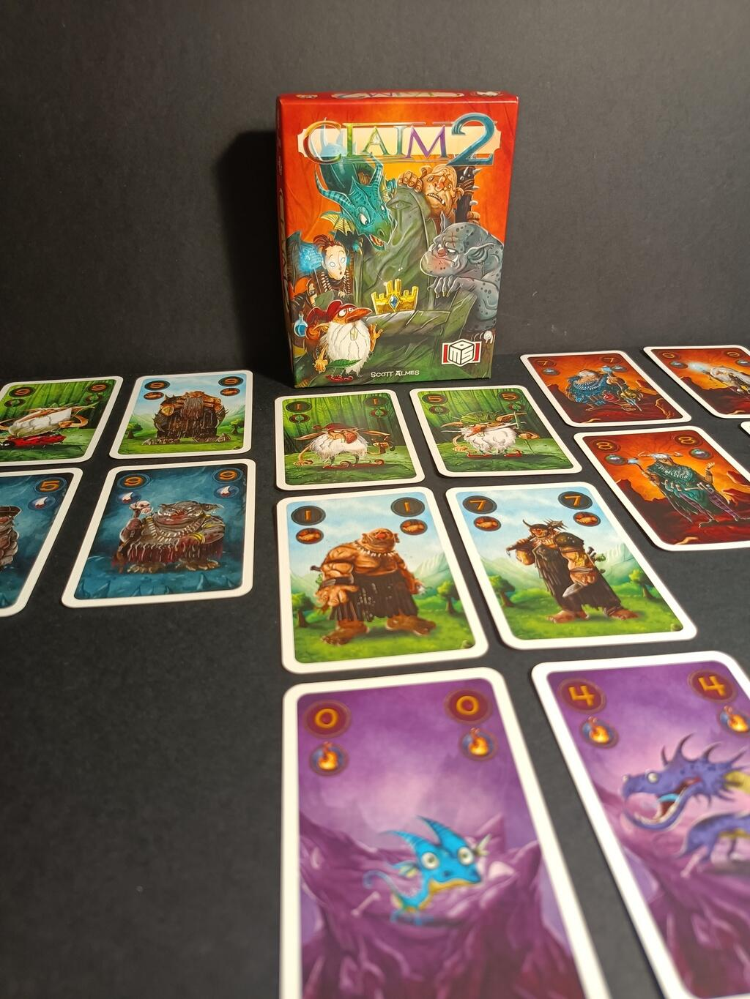
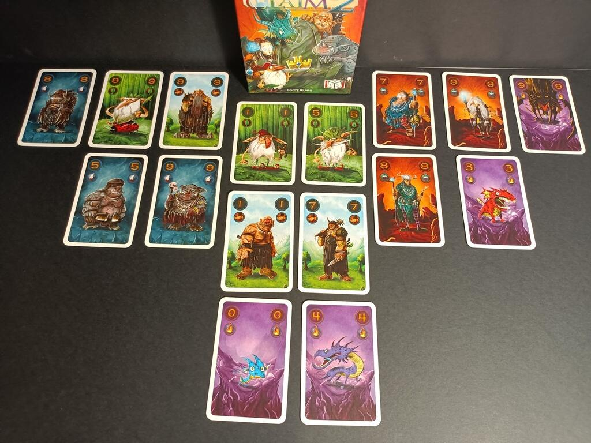

<Setting>

  Il re è morto e non ha lasciato eredi. Nuove fazioni sono arrivate in questa
  terra. Riuscirai a portarne dalla tua parte il maggior numero e a diventare il
  nuovo sovrano?

</Setting>

<Rules>

  Le regole di Claim 2 non differiscono dalla prima scatola: cambiano solo gli
  effetti delle fazioni . 
  Una partita di Claim 2 si compone di due fasi ben distinte: durante la prima i
  giocatori si contenderanno le carte che saranno utilizzate durante la seconda,
  e che diventeranno, eventualmente, loro seguaci.  
  Claim 2 è sempre lo stesso gioco di carte che si basa su meccaniche
  assimilabili a quelle della briscola e del tressette. Quando il giocatore di
  mano giocherà una carta di una fazione, l'altro dovrà per forza rispondere con
  una carta della stessa fazione, se la possiede; in caso contrario, potrà
  giocare una qualsiasi altra carta.  
  Ad inizio partita ogni giocatore pescherà 13 carte. Durante la prima fase del gioco
  si svolgeranno proprio 13 mani, con le quali i giocatori si contenderanno delle
  carte estratte dal mazzo. All'inizio di ogni mano della prima fase, si posizionerà
  di fronte ai giocatori una carta scoperta prendendola dal mazzo. Per vincere la
  mano e ottenere dunque la carta rivelata si farà riferimento a chi ha giocato la
  carta della fazione del giocatore di mano con il numero più alto, salvo eventuali
  poteri. Chi perde la mano prenderà invece la prima carta dal mazzo di pesca.
   
  Durante la seconda fase, le carte delle fazioni vinte nel corso della prima diventeranno
  vostri seguaci, ovvero la vostra nuova mano di carte con cui giocare le successive
  13 mani, e vi permetteranno di ottenere il favore delle fazioni: al termine di
  questa seconda fase si confronterà il numero di carte di ogni fazione ottenuto
  dai giocatori e chi avrà la maggioranza ne otterrà il favore (in caso di pareggio
  si guarda la carta di valore più alto). Il giocatore che ha il favore del maggior
  numero di fazioni sarà incoronato nuovo re.  A questo punto vediamo gli effetti
  di queste simpatiche e divertentissime fazioni:
  <ul>
    <li>      <strong>Gnomi</strong>: quando ottenuti nella fase due, vanno posizionati
      di fronte al giocatore, pronti per essere massacrati. Gli gnomi
      sopravvissuti diventeranno vostri seguaci.</li>
    <li>      <strong>Giganti</strong>: durante la fase due, il giocatore che vince la
      mano può eliminare gli gnomi dello stesso valore dell'avversario.</li>
    <li>      <strong>Draghi</strong>: l'ultimo che ha giocato un Drago in una mano
      diventa primo giocatore.</li>
    <li>      <strong>Troll</strong>: nella fase due, se più di un Troll viene giocato,
      quello di valore più basso viene messo da parte. Il vincitore della mano
      successiva prende un Troll messo da parte. Ogni giocatore può ottenere
      come seguace solo un Troll a mano. Se alla fine della seconda fase ci sono
      ancora Troll da parte, il giocatore che vince l'ultima mano li ottiene
      tutti.</li>
    <li>      <strong>Veggenti</strong>: nella fase uno, se un giocatore vince una mano
      con un Veggente può guardare la carta in cima al mazzo e scegliere tra le
      due disponibili.</li>
  </ul>

</Rules>

<Feedback>

  Se <Link to="/reviews/claim">Claim</Link> era un gioco gradevole fin dalla
  prima partita, semplice, veloce ma con una buona profondità strategica, un
  titolo facile da portare in giro e da intavolare in qualsiasi momento, con
  Claim 2 le combinazioni tra le nuove fazioni si fanno davvero divertenti ed
  esplosive e alzano l'asticella della complessità strategica di uno scalino.
   
  Inoltre, combinando la seconda scatola con la prima si potrà giocare anche in
  tre o quattro giocatori. In tre sarà un classico tutti contro tutti, in
  quattro una partita a squadre. Ovviamente alcune interazioni tra fazioni
  cambieranno, ma è tutto spiegato per filo e per segno sul regolamento.  
  In conclusione, anche Claim 2 si conferma un bel gioco da portare in giro, semplice
  da spiegare ma che comunque presenta un pizzico di strategia.

</Feedback>
