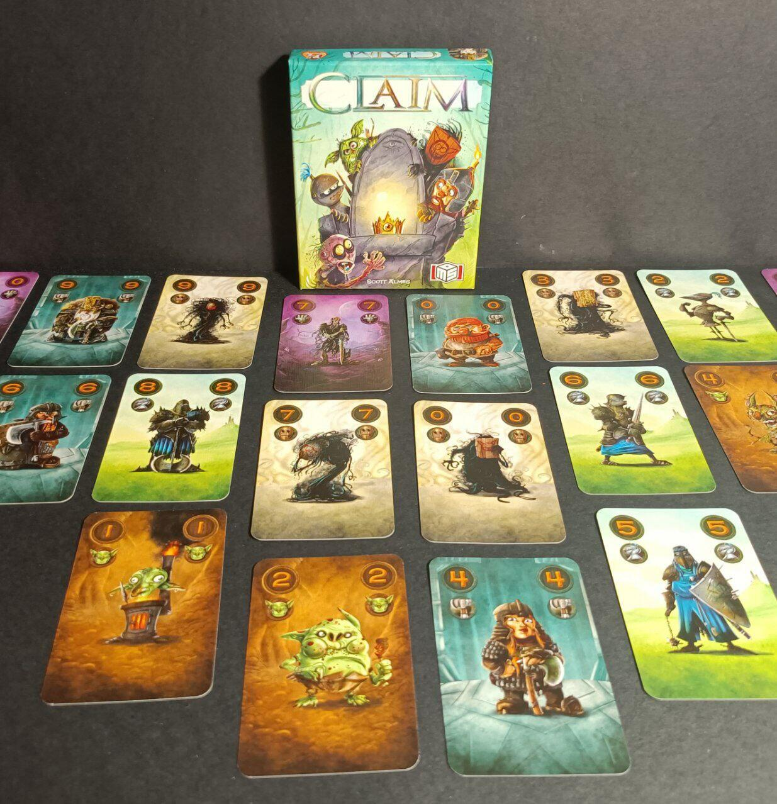
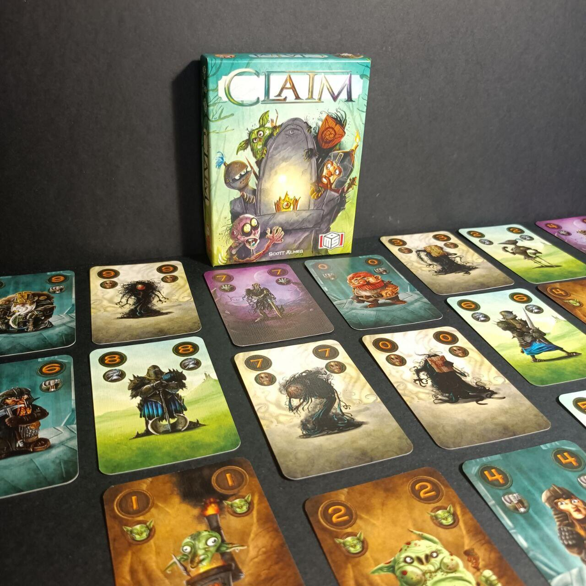

<Setting>

  Il re è morto e non ha lasciato eredi. Riuscirai a portare dalla tua parte il
  maggior numero di fazioni e a diventare il nuovo sovrano di queste terre?

</Setting>

<Rules>

  Claim è un gioco di carte che si basa su una meccanica assimilabile a quella
  della briscola. Quando il giocatore di mano giocherà una carta di una fazione,
  l’altro dovrà per forza rispondere con una carta della stessa fazione, se la
  possiede; in caso contrario, potrà giocare una qualsiasi altra carta.  
  Ad inizio partita ogni giocatore pescherà 13 carte. Durante la prima fase del gioco
  si svolgeranno dunque 13 mani, durante le quali i giocatori si contenderanno delle
  carte estratte dal mazzo. In apertura di ogni mano si posizionerà di fronte ai
  giocatori una carta scoperta prendendola dal mazzo: per vincere la mano e ottenere
  dunque la carta rivelata si farà riferimento a chi ha giocato la carta della fazione
  del giocatore di mano con il numero più alto, salvo eventuali poteri. Chi perde
  la mano prenderà invece la prima carta dal mazzo di pesca.  
  Durante la seconda fase, le carte delle fazioni vinte nel corso della prima
  diventeranno la vostra nuova mano di carte con cui giocare nuovamente 13 mani.
  Alla fine di questa fase le carte vinte saranno invece vostri seguaci, i quali
  vi permetteranno di ottenere il favore delle fazioni: si confronterà il numero
  di carte di ogni fazione ottenuto dai giocatori e chi avrà la maggioranza ne
  otterrà il favore (in caso di pareggio si guarda la carta di valore più alto).
  Il giocatore che ha il favore del maggior numero di fazioni sarà incoronato
  nuovo re. Ecco una panoramica degli effetti delle varie fazioni:
  <ul>
    <li>      <strong>Goblin</strong>: letteralmente inutili, non fanno nulla, sono solo
      tanti e scarsi.</li>
    <li>      <strong>Cavalieri</strong>: se giocati contro un Goblin vincono sempre, ma
      non possono essere giocati se avete ancora Goblin in mano.</li>
    <li>      <strong>Non-morti</strong>: se vinti in una mano durante la prima fase
      diventano direttamente seguaci.</li>
    <li>      <strong>Nani</strong>: durante la seconda fase, è il giocatore che perde
      una mano a ottenere i nani, se presenti, al posto del vincitore.</li>
    <li>      <strong>Mutaforma</strong>: può essere giocato come carta di qualsiasi
      fazione, ma non copia le abilità. Se il giocatore di mano gioca un
      Mutaforma, anche il secondo dovrà giocare un Mutaforma se lo possiede.</li>
  </ul>

</Rules>

<Feedback>

  Claim è una piccola scatola ricca di divertimento. Le regole sono semplici e
  intuitive, anche se alcune combinazioni di carte vi potranno lasciare
  spiazzati. Le partite sono contenute e rapide, ma con una forte componente
  strategica. Il gioco sembrerà semplice a primo impatto, ma capirete subito che
  la profondità non è così scontata. Dovrete pianificare già dalla prima fase
  tutta la partita, perché se costruirete una mano scadente le vostre
  possibilità di vittoria si abbasseranno drasticamente. I poteri delle fazioni
  sono davvero simpatici e aumentano la componente strategica di uno scalino non
  indifferente. Le interazioni sono tante e, che dire, c’è da pensarci un po’
  durante ogni mano. Grazie alla meccanica simile alla briscola, per la
  limitazione del secondo giocatore, ovviamente le possibilità sono limitate,
  rendendo comunque la partita abbastanza rapida.
   
  Una nota davvero positiva va alla grafica delle carte, bella e simpatica.
  Punto a suo sfavore, invece, come per tanti giochi di carte, è la componente
  di alea: la pesca delle carte iniziali, e in alcuni casi la pesca fortunata
  per il giocatore perdente durante la prima fase, possono pesare parecchio
  durante la partita.
   
  In conclusione, Claim è davvero un bel gioco: uno di quei titoli da avere
  sempre nello zaino durante i viaggi, o da intavolare per serate rilassanti.
  Ciò detto, tenete presente che è già uscita la seconda scatola del gioco,
  Claim 2, con nuove fazioni: restate connessi!

</Feedback>

