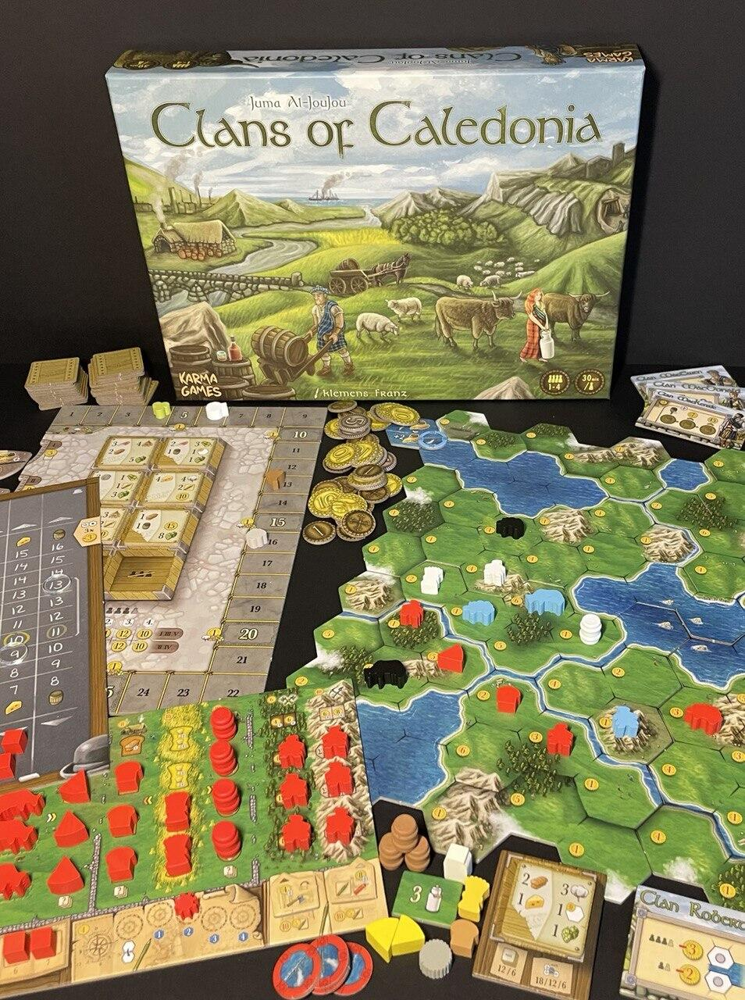
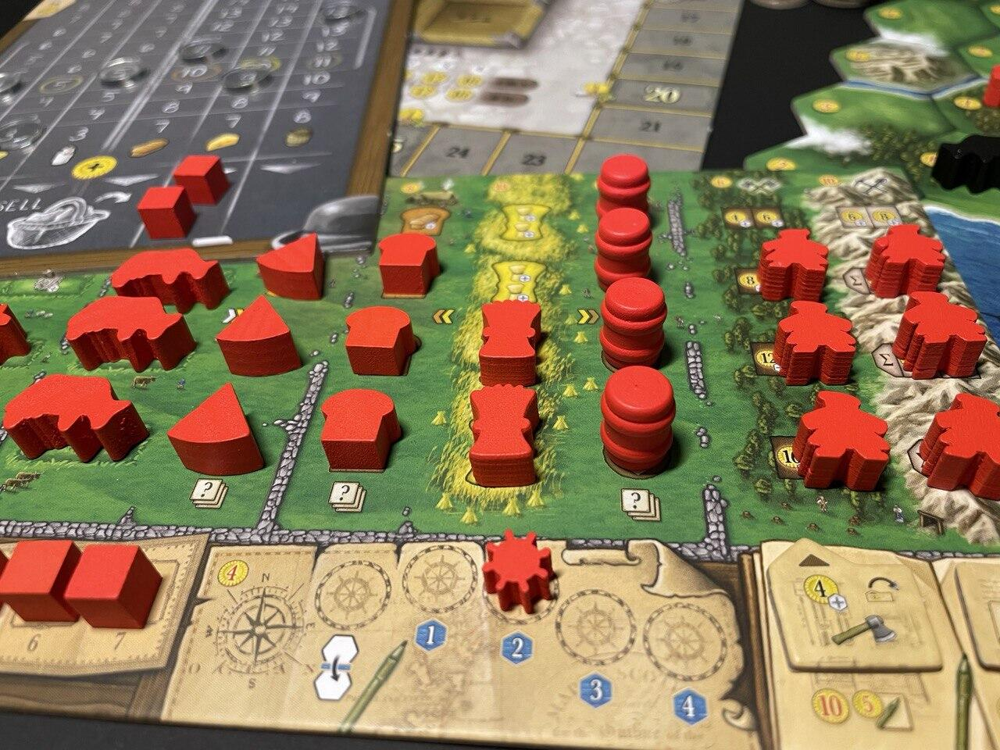

<Setting>

  Non avete sempre desiderato allevare pecore e vacche, tosarle, mungerle e
  macellarle il turno dopo nell'antica Scozia? Non sentite l'aspro e dolciastro
  odore del migliore Scotch Whiskey lasciato invecchiare due turni? Non vi
  alletta la fragranza del “panbauletto” appena sfornato o il deciso sapore del
  groviera stagionato? Non vi piace bonificare la torbiera e trasformarla in una
  piantagione di grano talmente costosa da sembrare placcata in oro? O forse non
  vi affascina il pensiero di sgobbare tutto il giorno tagliando legna e
  lavorando in miniera per fare quattrini a palate? Suvvia, ripensateci!

</Setting>

<Rules>

  Il gioco finisce alla fine del 5° turno. Durante ciascun turno i giocatori si
  alternano svolgendo azioni. Spesso, per svolgere un'azione, occorre pagare,
  denaro o risorse. Chi non può o non vuole più svolgere azioni passa il turno,
  guadagnando un certo numero di monete (variabile a seconda dell'ordine in cui
  si passa). Quando tutti i giocatori hanno passato, ognuno ottiene una serie di
  benefici (risorse o denaro) in base alla sua produzione, determinata da quante
  unità sono state spostate dalla plancia personale sullo scenario. Il cuore del
  gioco è costituito dalla risoluzione dei contratti e appunto dall'occupazione
  dello scenario (mappa modulare con una certa variabilità) con le proprie
  unità: tali modalità costituiscono anche il modo principale per ottenere punti
  vittoria a fine partita. Accanto a queste dinamiche, si aggiunge quella, molto
  originale e verosimile, del mercato, dove si possono comprare e vendere le
  risorse a prezzi variabili in base alla legge della domanda e dell'offerta.

</Rules>

<Feedback>

  Il primo impatto con il gioco è, in questo caso, il più sincero: Clans of
  Caledonia è un titolo che ha bisogno di tempo per essere padroneggiato, ma ha
  un'alta curva d'apprendimento e già dal secondo turno della prima partita vi
  renderete conto di quanto avreste potuto fare il turno precedente. La variante
  a un giocatore resta più che altro una modalità utile a migliorare le proprie
  prestazioni individuali. L'interazione nelle partite a più giocatori è
  limitata a poche circostanze, ma scoprirete che le cattiverie possono essere
  fatte in modo apparentemente molto innocuo… Il gioco invecchierà molto bene
  (come il buon Whiskey), anche senza espansioni: anzi, forse in questo caso
  l'assenza di espansioni aiuta ad apprezzare la natura di un titolo che non
  nasce con l'idea capitalistica di spennare i polli, ma di soddisfare un
  pubblico che ama un buon gestionale. Certo, i fan di ambientazioni scozzesi
  forse saranno un po' delusi per l'assenza di un Clan MacLeod (There can be
  only one!), di un Clan Wallace (Freedom!) e di un Clan McDuck (And I'll make
  my money square!)... Ma consolatevi: la componentistica è talmente gradevole e
  riposante, nella sua semplicità; la plancia comune e quella personale talmente
  mignon; il colpo d'occhio talmente adatto alle esigenze strategiche dei
  giocatori; la dipendenza dalla lingua talmente ridotta… che, insomma, avrete
  senz'altro compensazione.

</Feedback>

