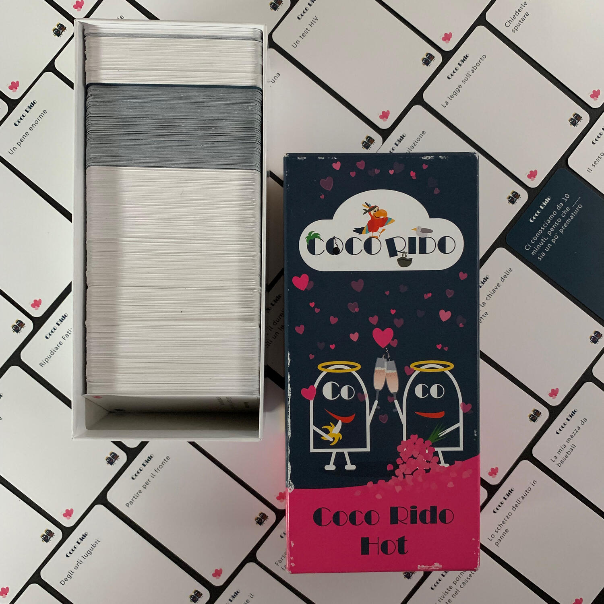

<Setting>

  Tra gli infiniti e ipotetici mondi paralleli in cui potrebbe vivere l'umanità,
  ce n'è sicuramente uno dove questa parla senza peli sulla lingua, dove questa
  vive quotidianamente situazioni imbarazzanti e dove questa non si preoccupa
  del parere degli altri.  
  Noi, ovviamente, noi non viviamo in quell'universo... ma possiamo trasferirvici
  nelle nostre serate in compagnia dei nostri amici.  
  In questo universo, alla frase "Ci conosciamo da 10 minuti, penso che ___, sia
  un po' prematuro" si può rispondere "Un dito in più" senza troppi pensieri e
  sfoggiando un bellissimo sorrisino adolescenziale.

</Setting>

<Rules>

  Credo che un regolamento più semplice non esista.  
  In Coco Rido Hot, come negli altri Coco Rido, sono presenti due tipologie di carte,
  quelle blu e quelle bianche, ovvero le domande e le possibili risposte.  
  Sulle carte domanda è presente una frase da completare e sta a ogni giocatore
  colmare la parte vuota con le carte che ha in mano.  
  Ogni turno, il question master legge ad alta volte la domanda e tutti gli altri
  giocheranno, segretamente, la propria risposta.  
  Una alla volta, le frasi complete verranno lette dal narratore ad alta voce e
  quella più divertente, più assurda, o più apprezzabile, sarà la vincitrice.
   
  Il ruolo di question master passa così al vincitore del turno.  
  Chi arriva a 5 punti vince.  
  Fine.

</Rules>

<Feedback>

  Cards against hum... Coco Rido Hot è un gioco che non conosce tempo.  
  La sua semplicità gli permette di essere intavolato con chiunque (ehm, forse questa
  versione non proprio) voglia passare del tempo tra una risata e l'altra. Un party
  game a tutti gli effetti, due regole che si trasformano in tempo di qualità, soprattutto
  se c'è del vino ad accompagnare la serata.
   
  Questa versione è incentrata sul sesso, su situazioni ridicole e periodi ipotetici
  elevati all'ennesima potenza. Ed è proprio la sessualità che caratterizza questa
  versione rispetto alle altre, introducendo termini e frasi piccanti, facendo piangere
  dal ridere gli amici "pornolesi" che tutti abbiamo.  
  Le foto presenti in questa pagina, sono state catturate durante una vera
  sessione di gioco.
   
  Che dire, questo gioco non dovrebbe mancare nella libreria di nessuno. Tenere
  lontano dalla portata di bacchettoni, moralisti, puritani e fanatici di
  qualsiasi argomento.

</Feedback>

