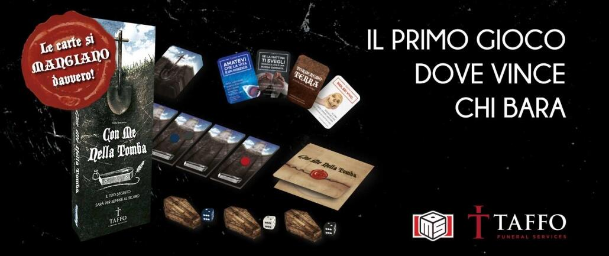
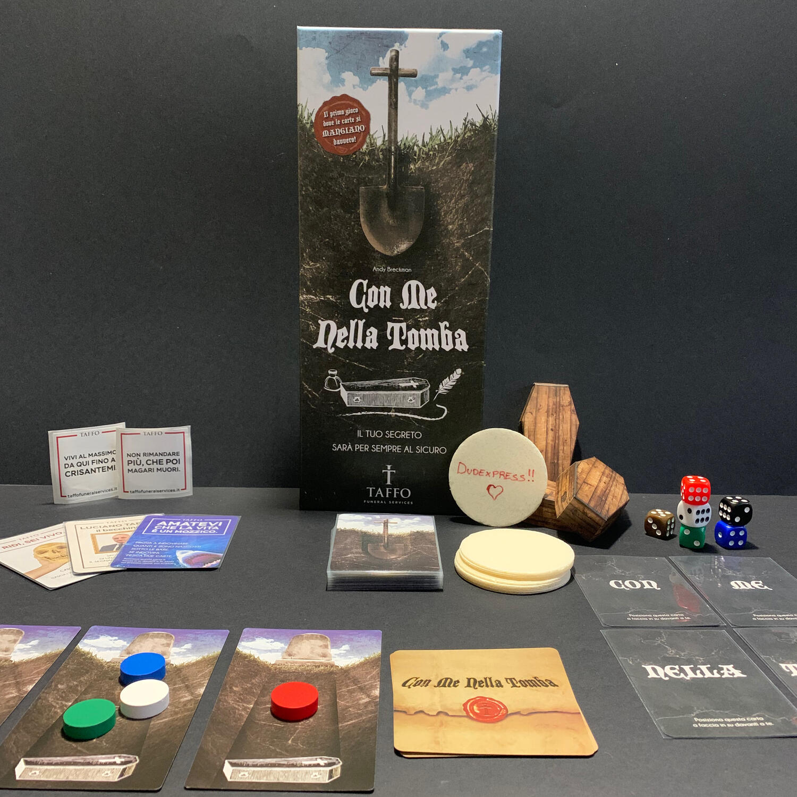

<Setting>

  Cosa sono i segreti?
   
  I segreti sono quelle informazioni che noi conosciamo e che, in qualche modo,
  coinvolgono un'altra persona. I segreti possono essere mantenuti tali, oppure
  utilizzati per avere potere sul confidente, utilizzandolo contro la stessa,
  con l'intento di danneggiare la reputazione di quella persona, facendo
  sgretolare del tutto il rapporto di fiducia evidentemente già logoro.
   E se fosse proprio un segreto il premio finale di una serata spesa a giocare
  da tavolo? Vi mettereste in gioco? Riuscirete a proteggerlo dagli altri? Sarete
  in grado di "spogliarvi" davanti al vincitore e concedergli quest'arma?

</Setting>

<Rules>

  A inizio partita, un giocatore scrive un vero segreto, qualcosa di cui nessuno
  dei presenti sia a conoscenza, anche un po' imbarazzate e in parte
  compromettente, su di una particola che poi posiziona all'interno
  dell'apposita busta.
   
  Ogni turno, ogni giocatore deve scegliere la faccia del proprio dado e
  posizionarlo sotto la propria bara. Quando tutti avranno fatto, le bare
  verranno capovolte e i dadi mostrati. I dadi che mostrano lo stesso numero
  vengono eliminati per il round in corso. Tra i dadi rimanenti, il più alto
  permette al giocatore di pescare una carta, il più basso fa avanzare il
  segnalino sul tracciato. Questo è composto da 6 carte/passi che inizialmente
  distanziano dalla busta.
   
  Le carte, invece, possono rappresentare sia una parola, sia un'abilità per
  contrastare gli altri, rallentandone la vittoria... o spingendoli ancora più
  verso la sconfitta, rubandovi carte o facendovi retrocedere sul tracciato.
   
  Si prosegue così fino a quando un giocatore possiede tutte le carte
  CON-ME-NELLA-TOMBA o quando un segnalino raggiunge la busta del segreto.
   
  Quel giocatore avrà accesso alla conoscenza del segreto, lo legge tra sé e sé,
  se lo mangia... e se lo porterà nella tomba.

</Rules>

<Feedback>

  Che dire, Con me nella tomba è un bel modo per passare una serata stravagante
  con degli amici fidati, magari anche un po' alticci e disinibiti... che si
  abbandonano al divertimento e smettono di pensare a quello che potrebbe
  ritorcersi contro di loro nel futuro più o meno lontano.
   
  Le regole sono presto spiegate, come avete potuto vedere, e il gioco porta
  tutti a voler correre per venire a conoscenza del segreto... o per fare in
  modo che questo non venga condiviso tra gli altri.
   
  Dovresti puntare sempre 1? E se lo fanno anche gli altri? Allora dovresti
  puntare 2? E se tutti la pensano come te?
   
  Ti spingerai alla raccolta delle carte o alla corsa sul percorso? O andrai
  dove tira meglio il vento?
   
  Non aspettatevi un gioco profondo ma un semplice party game perfetto per
  mettervi in ridicolo e per perdere la poca dignità che avete conservato fino
  ad oggi.

</Feedback>

