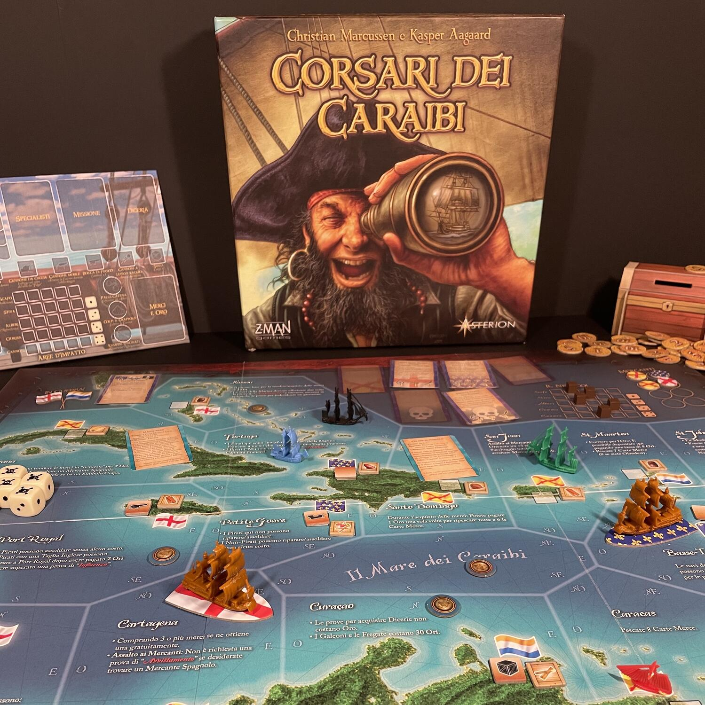
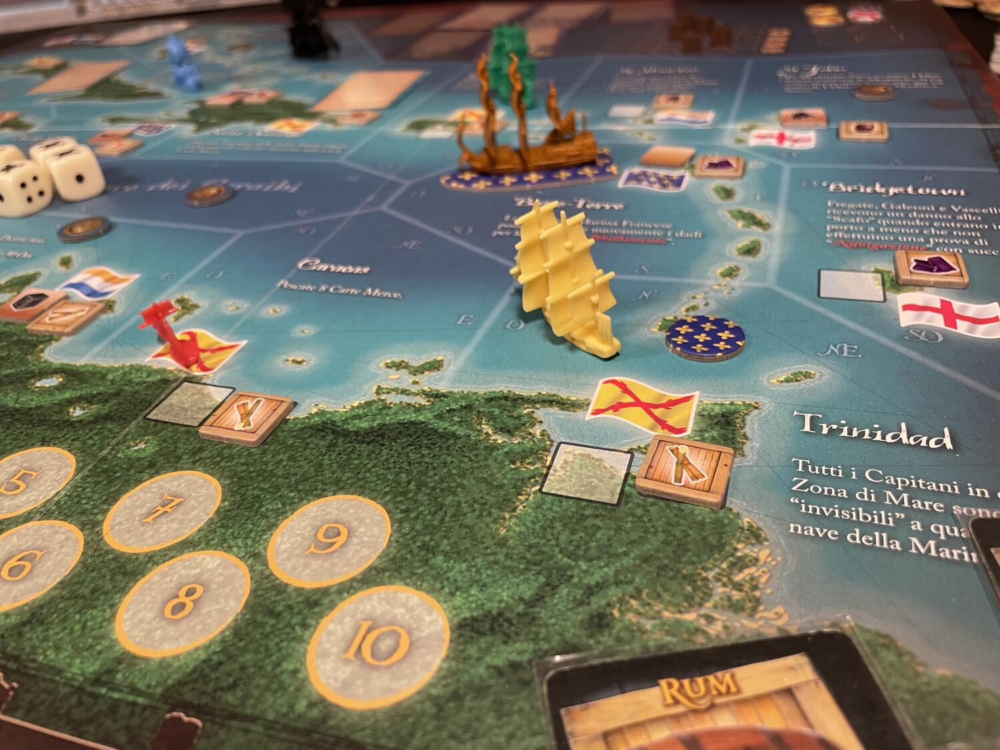

<Setting>

  È l'epoca d'oro della navigazione caraibica e voi siete intraprendenti capitani al timone di una piccola nave.
  All'uscita del porto vi attendono grandi avventure, tra commercio e pirateria, missioni e dicerie, grandi ricchezze o
  somme rovine. Nel corso della vostra carriera potrete apportare migliorie al vostro veliero, o addirittura sostituirlo
  con uno più grande e potente. E mentre i vostri avversari competono con voi solcando i flutti, tra tempeste e uragani,
  a volte passerete pericolosamente vicino alla gittata dei rispettivi cannoni e allora… “Gun crews! At the ready!”

</Setting>

<Rules>

  Predisposta la plancia con i numerosi segnalini (mercanti, merci, modifiche nave) e collocate le carte in prossimità
  di essa (tranne due carte missione, che vanno allocate nei relativi porti), il gioco può iniziare. Tutto ciò che
  avrete all'inizio sarà un capitano, una nave (fluyt o corvetta), una carta Gloria, 10 monete e un forziere. Le abilità
  del capitano, il suo porto d'origine e la sua nazionalità, le sue statistiche e quelle della nave iniziale
  influenzeranno la vostra carriera di pirata e/o mercante. Ogni turno sarà preceduto dalla rivelazione di un evento che
  determinerà il movimento dei capitani non giocanti presenti in mappa e avrà determinati effetti fino alla rivelazione
  dell'evento successivo (o anche più a lungo termine). Segue poi la fase delle azioni (
  <strong>Movimento, Avvistamento, Attracco</strong>), per svolgere le quali, in qualsiasi combinazione, i giocatori al
  proprio turno dispongono di tre punti azione. Con il <strong>Movimento</strong> potrete spostarvi sulla plancia
  comune, tra porti e aree di mare; l'
  <strong>Avvistamento</strong> prevede un tiro di dado e determinerà se potrete combattere con le altre navi o saccheggiare
  i mercanti in plancia; l'
  <strong>Attracco</strong>, infine, vi consentirà di svolgere le attività portuali:{" "}
  <em>    Compravendita delle merci, Riparazione/Modifica/Miglioramento della vostra nave, Acquisto di una nuova nave,
    Reclutamento della ciurma, Acquisizione di Dicerie</em>{" "}
  o <em>Missioni</em> e, infine, <em>Deposizione</em> o <em>Prelievo di oro</em> in quantità segrete nel/dal vostro
  forziere.
   
  Il gioco si vince accumulando 10 punti gloria: si ottiene un punto gloria ogni volta che si realizza un{" "}
  <em>raid mercantile epico</em>, una <em>vendita colossale</em> di merci, quando si vince un <em>conflitto navale</em>{" "}
  con un altro capitano, si realizza una <em>missione</em>, si verifica una <em>diceria portuale</em> e, per finire, con
  ogni <em>set di 10 monete</em> d'oro nel forziere, rivelato a fine partita. Nel corso del gioco potrete ottenere
  taglie che vi renderanno ricercati, assoldare specialisti sulla vostra nave, ritirarvi per iniziare una carriera più
  fortunata con una nuova nave e un nuovo capitano, se le cose si mettessero male, e (diverse volte) calare a picco con
  il vostro veliero.
   
  La parte più emozionante (e aleatoria) del gioco è certamente il combattimento navale: un vero e proprio gioco dentro
  il gioco. Sì, perché entrando in contatto con gli altri giocatori e i capitani non giocanti (questi ultimi, se siete
  pirati o appartenete a una potenza ostile, vi daranno la caccia), si seguiranno delle regole specifiche: i capitani
  dichiareranno le loro azioni, si misureranno in sfide di <em>navigazione, spareranno con i cannoni</em> danneggiando
  la nave avversaria, la <em>abborderanno</em> affrontandosi in mischie furibonde o <em>fuggiranno</em>. La fortuna
  determinata dal lancio di dadi che caratterizza il combattimento dall'inizio alla fine può essere mitigata tramite i
  segnalini armi speciali, ma non eliminerà il brivido dell'american.

</Rules>

<Feedback>

  Merchants and Marauders è un gioco lungo e monumentale, dalla componentistica sontuosa, che vale la pena giocare con
  un gruppo affiatato e in cerca di un'epica avventura ludica (ancora più epica - e ancora più lunga - se introducete
  l'espansione Mari della Gloria, che con i suoi undici moduli porta il gioco a un livello di verosimiglianza
  straordinario). Apparecchiare il tavolo e vedere quel blu caraibico vi trasporterà immediatamente tra i mari che avete
  sognato da quando eravate bambini leggendo Salgari o Stevenson.
   
  Nel 2010, anno di pubblicazione della prima edizione del gioco, erano già usciti tre film a marchio Pirati dei Caraibi
  e l'analogia tra il titolo di Marcussen e Aagaard con la serie Disney di grande successo era per forza di cose
  inflazionata e imperante, qui in Italia: la stessa traduzione di “Merchants and Marauders” in “Corsari dei Caraibi”
  ammiccava al noto brand. Se però volessimo descrivere più correttamente l'ambientazione e l'aria che si respira in
  questo gioco, non si possono avere dubbi: la serie Black Sails si presta straordinariamente meglio. Non ci sono
  elementi di fantasy, si commercia e si combatte in un'ambientazione storica e <em>Mari della Gloria</em> introduce
  perfino il galeone del tesoro, che vi farà pensare alla Urca de Lima con la stessa ossessione di Flint.
   
  Se non lo avete mai giocato, dovreste davvero provarlo: la curva di apprendimento non è altissima, ma se giocate le
  prime partite con chi ha più esperienza di voi vi mancheranno i trucchi del mestiere e patirete un po' la frustrazione
  di non fare punti gloria con altrettanta rapidità di altri.
   
  Ma un vero capitano non si lascia intimidire, perciò… vento in poppa e spiegate le vele!

</Feedback>

