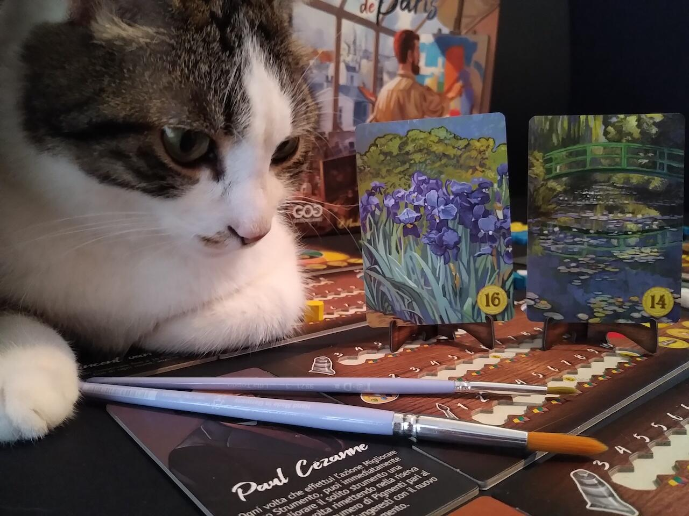
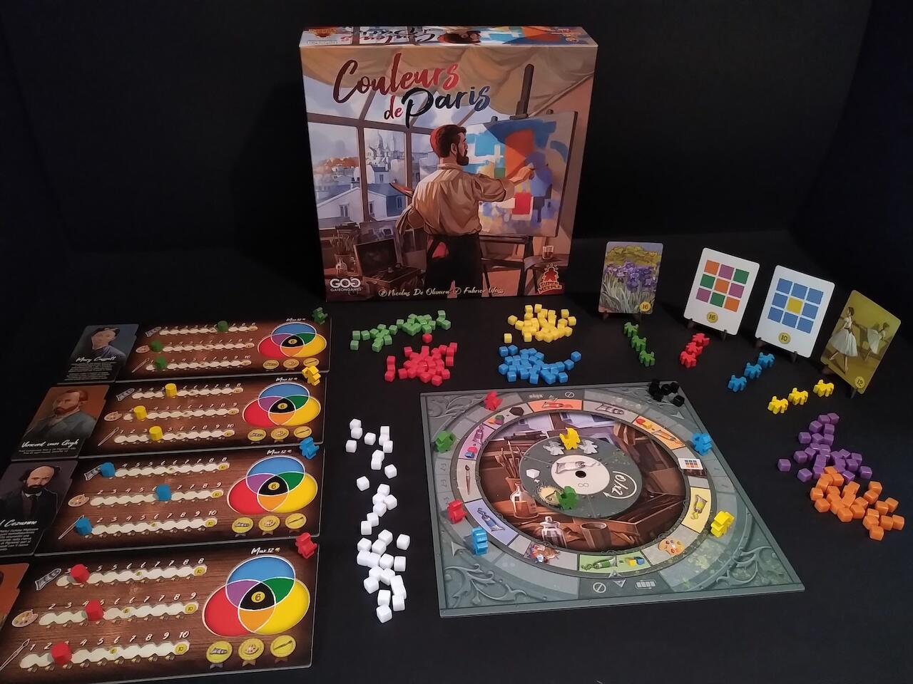

<Setting>

Un sole settembrino illumina pigramente le stradine acciottolate del quartiere di Montmartre. Un piccolo atelier comincia ad animarsi lentamente, il maestro accoglie gli apprendisti e i modelli, le tele sono già schierate sui cavalletti, su alcune sono state già tracciate pennellate di colore. Sul tavolo giacciono in disordine gli strumenti dell’artista, dai carboncini consumati alle tavolozze cosparse di macchie. Tutto l’ambiente è pervaso da un intenso odore di trementina e olio di lino…
Se tutti noi conosciamo grandi nomi come Cézanne, Degas, Gauguin, Monet, Renoir, Van Gogh, è grazie a “Couleur de Paris” che potremo davvero, per il tempo di una partita, calarci nei panni di uno di questi famosissimi artisti e vivere un’intensa giornata lavorativa immersi nell’arte e nei colori.

</Setting>

<Rules>

Al centro del tavolo viene disposta una Plancia comune composta da una parte fissa e una parte rotante.

Ogni giocatore ottiene

<ul>
  <li> una Tessera Personaggio che riporta la sua particolare capacità </li>
  <li>  la Plancia Giocatore e i rispettivi 3 indicatori sviluppo che andranno inizialmente posizionati nello spazio a sinistra di ogni riga. Queste tre righe rappresentano il livello di Prestigio del giocatore in tre diversi ambiti: Tubetto di Colore, Tavolozza e Pennello</li>
  <li> 6 meeple Assistente </li>
  <li> 3 cubetti Pigmento (uno giallo, uno rosso e uno blu) </li>
</ul>
A partire dal Primo Giocatore, ognuno può posizionare i propri Assistenti in uno qualsiasi degli spazi liberi della plancia
comune. Ogni spazio permette di ottenere un determinato beneficio:
<ul>
  <li>Ottenere 1 cubetto colore primario (blu, giallo, rosso) </li>
  <li>Mescolare 2 colori primari e ottenere 1 colore secondario (verde, viola, arancione) </li>
  <li>Mescolare 3 colori secondari e ottenere 1 cubetto di colore nero </li>
  <li>Scartare 2 cubetti di qualsiasi colore per avanzare di uno spazio in uno dei tre ambiti di prestigio </li>
  <li>Ottenere una Carta Dipinto </li>
  <li>    Dipingere: posizionare tanti cubetti quanti indicati dal livello prestigio Pennello sulle Carte Dipinto
    precedentemente ottenute{" "}</li>
  <li>Ottenere il segnalino Primo Giocatore e 1 cubetto di colore bianco (valido come jolly) </li>
  <li>Imitare l’azione già scelta da un altro giocatore </li>
  <li>Ruotare la plancia, decidendo se non farla ruotare oppure farla avanzare di due spazi </li>
  <li>Ottenere cubetti di colore bianco (tanti quanti indicati dal livello prestigio Tubetto di Colore) </li>
</ul>
Una volta che tutti i giocatori avranno esaurito le azioni a disposizione e ottenuto i benefici, la plancia ruota e si procede
nuovamente al piazzamento degli Assistenti.  
La partita termina quando uno dei giocatori avrà completato il suo secondo dipinto oppure quando uno dei giocatori avrà
ottenuto 5 cubetti di colore nero. A questo punto si conteggiano i punti vittoria sommando i punti sulle Carte Dipinto
completate, i punti sulle plance giocatore e i punti dati da eventuali cubetti neri presenti nella propria
tavolozza.{" "}

</Rules>

<Feedback>

Couleurs de Paris è il tipico gioco che prima di tutto attira gli amanti della bella grafica: una splendida illustrazione sulla scatola, colori vivaci ma ben bilanciati tra loro, elementi di forme differenti e buona qualità dei materiali sono di certo le prime caratteristiche che colpiscono. Le plance sono spesse e sagomate appositamente per contenere token e per incastrarsi con la Tessera Personaggio, la plancia rotante è formata da due dischi da montare la prima volta che si effettua il setup (rimarranno poi montati per tutte le partite future) e il perno che le tiene insieme è già fornito all’interno della scatola. Le Carte Dipinto sono ovviamente molto belle, dato che riproducono alcuni famosi quadri e un aspetto che rivela particolare cura è il fatto che i colori dei cubetti necessari per dipingere un quadro appartengono effettivamente alla palette del quadro stesso. Purtroppo le Carte Dipinto tendono a ripetersi: sarebbe stato molto stimolante se fossero state tutte diverse, corredate magari da titolo dell’opera, nome dell’artista e - perché no? - luogo di conservazione.  
Al di là dell’estetica, il gioco è molto interessante perché presenta meccaniche molto note (il piazzamento lavoratori) e lineari, facili da spiegare ad eventuali neofiti al tavolo, ma aggiunge una componente strategica che riuscirà a non annoiare anche i più esperti.  
L’interazione indiretta è, infatti, altissima: risulta fondamentale l’ordine del turno di gioco, la capacità di pianificazione delle proprie azioni, accaparrandosi gli slot azione sulla plancia comune prima che sia troppo tardi e sfruttando i poteri speciali in modo da ottimizzare il più possibile le proprie mosse.  
Data la quasi totale assenza di fortuna, sarà necessario perseguire una determinata strategia per arrivare alla vittoria: non è detto che tentare di essere il primo a completare la seconda Carta Dipinto sia necessariamente la mossa vincente, anzi è molto proficuo collezionare cubetti neri oppure avanzare sui livelli di prestigio della plancia giocatore (le posizioni 6 e 8 di tutti e tre gli ambiti conferiscono rispettivamente 6 e 10 punti vittoria). 
All’interno della scatola sono presenti anche delle carte bonus: velocizzano le azioni, ma non sembra che aggiungano nulla all’esperienza di gioco e il più delle volte si tenderà a scegliere di giocare senza utilizzarle. Risultano invece efficaci se si opta per un’altra variante “casereccia”, ovvero aumentare il numero di Carte Dipinto da dover completare prima della fine della partita.  
In definitiva, Couleurs de Paris è un gioco che certo non manca di piccoli difetti ma che compensa altrettanto bene con i suoi pregi e che offre una divertente occasione di gioco per qualsiasi tipo di giocatore.

</Feedback>

