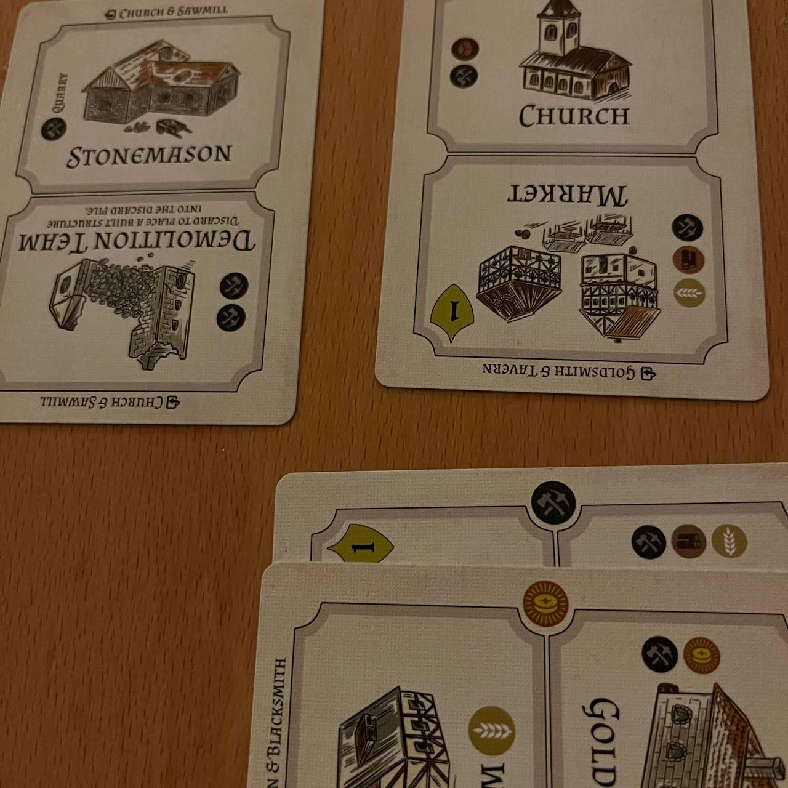
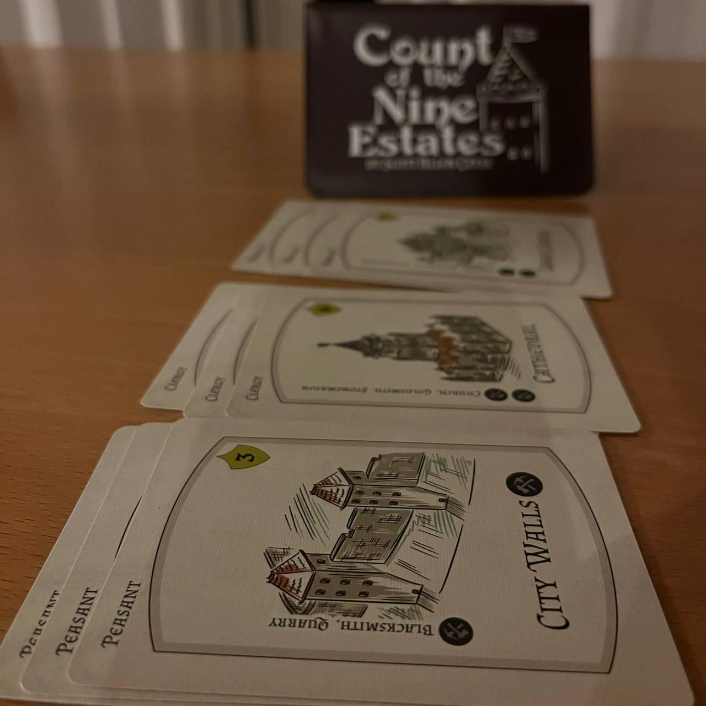
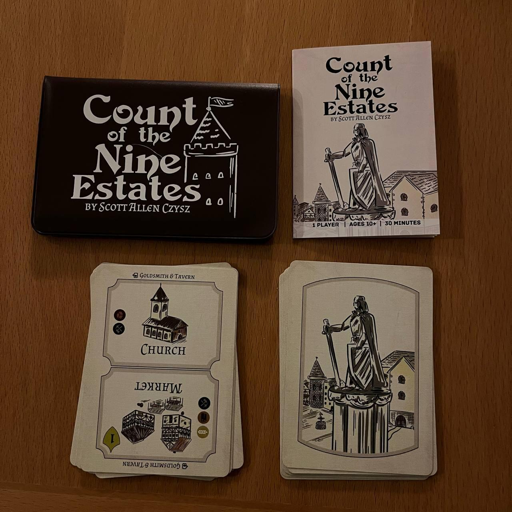

<Setting>

  Sei un costruttore in una città lontana. Per realizzare le opere più belle del
  reame avrai bisogno di trovare più risorse, più manodopera. Solo così la tua
  città potrà dimostrare il suo valore.

</Setting>

<Rules>

  Count of the nine estates è un solitario strategico dalla durata di mezz’ora
  in cui con solo 18 carte ti sarà richiesto di compiere miracoli della
  tecnologia.  
  Il gioco è suddiviso in round, la cui quantità è decisa dal giocatore: più round
  equivarranno a più punti negativi a fine partita.  
  <strong>Ogni carta ha una duplice funzione : edificio o risorsa.</strong> Il
  flusso di gioco risiede proprio nell’alternanza di queste funzioni che
  andranno decise volta per volta. Bisogna ripetere i round fino a che non si
  saranno costruite 3 grandi opere di difficoltà di produzione crescente (che
  forniranno punti vittoria sempre maggiori). Se si riuscirà a portare a termine
  l’impresa, il gioco sarà concluso!
   
  Il twist interessante?
  <strong>    Le carte rappresenteranno un tipo di risorsa piuttosto che un altro in base
    al verso in cui verranno pescate</strong>
    Infatti ogni volta che si costruisce una grande opera il mazzo verrà
  rimescolato, ruotandolo però di 180°! Nuovo round, nuovi edifici, nuove
  risorse!

</Rules>

<Feedback>

  Count of the nine estates è un solitario che come
  <Link to="/reviews/sprawlopolis/">Sprawlopolis</Link> e <Link to="/food-chain-island/">
    Food Chain Island{" "}
  </Link> potrebbe rischiare di non lasciare mai il vostro tavolo. In così poche
  carte Scott Almes è riuscito a creare un gioco che, con materiali limitati - sono
  solo 18 carte in fondo - riesce a regalare molteplici ore di divertimento a chi
  lo saprà apprezzare. E voi? <strong> Accetterete la sfida di costruire la miglior città? </strong>

</Feedback>

