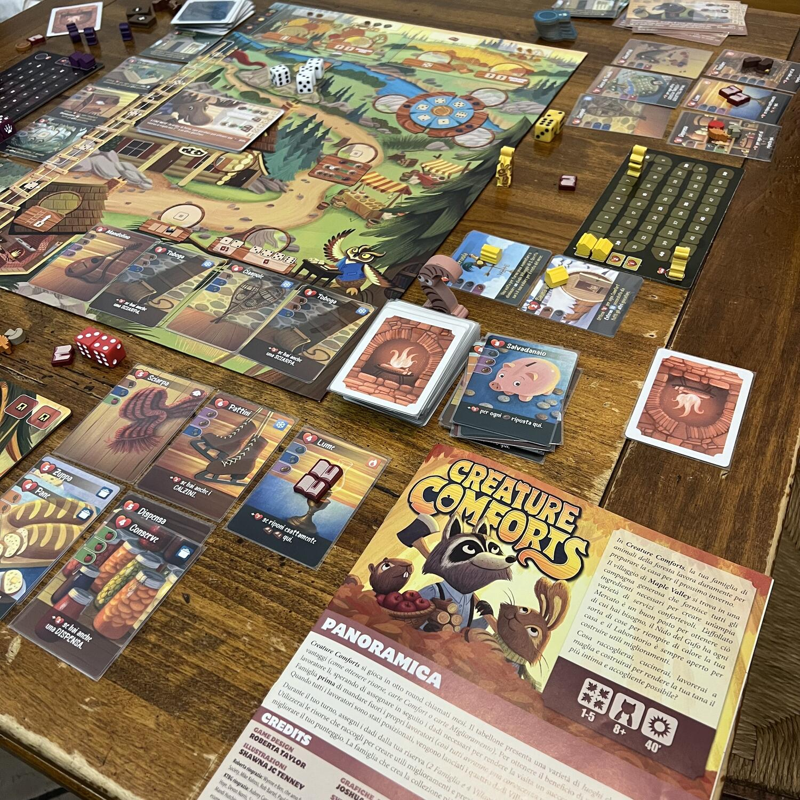
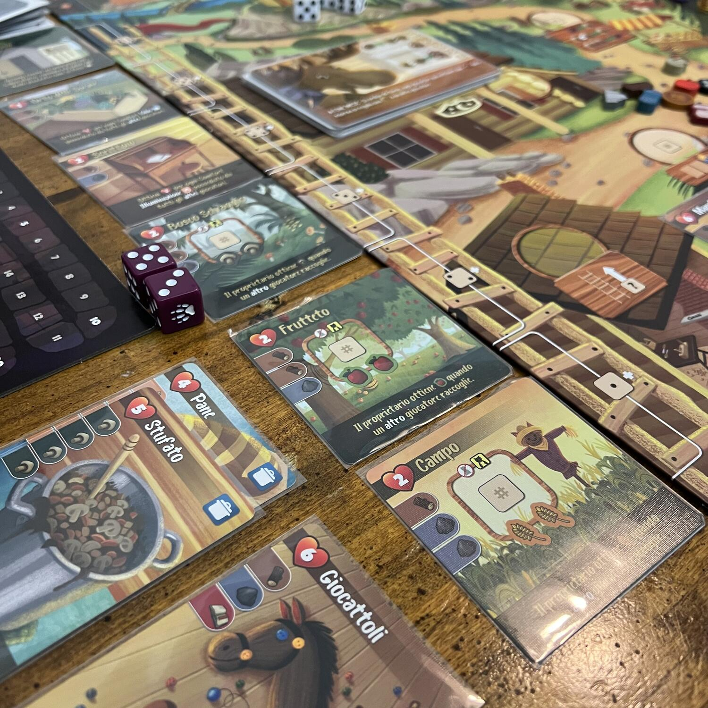
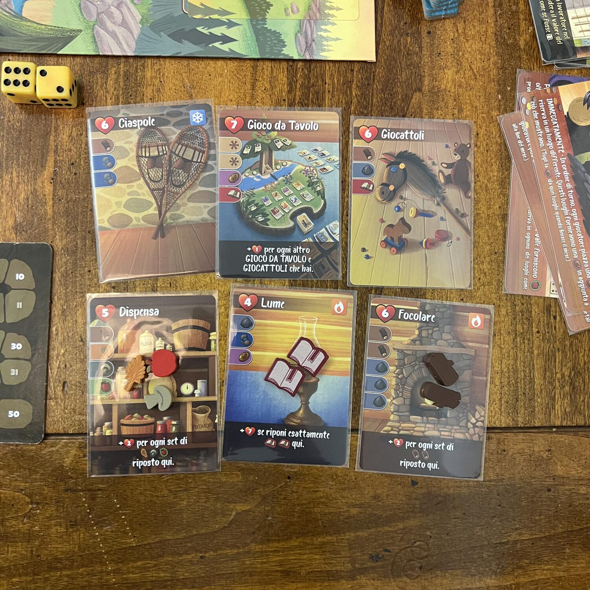

<Setting>

  La primavera è tornata a Maple Valley! È ora di godersi il clima caldo e il
  divertimento che questo periodo offre… ma non è mai troppo presto per iniziare
  a prepararsi per il prossimo letargo invernale! Gli animali più saggi sanno
  che è il momento giusto per raccogliere rifornimenti per il lungo freddo che
  li aspetta.
   
  Visto che l'inverno è un periodo lungo, trascorrerai molti mesi nascosto nella
  tua tana e renderla il più accogliente possibile ti aiuterà a goderti anche
  questa stagione fredda. Una bella ciotola piena di zuppa calda, una comoda
  sedia a dondolo e alcuni giochi per far passare velocemente quelle buie
  giornate invernali saranno i migliori comfort che potrai avere.
   
  In <strong>Creature Comforts</strong> trascorri la primavera, l’estate e
  l’autunno raccogliendo diverse risorse dalla valle e spendendole per
  raccogliere oggetti che renderanno la tua casa più confortevole quando il
  mondo esterno sarà ricoperto da uno strato di neve.

</Setting>

<Rules>

  La partita dura <strong>8 round</strong> (6 nella versione breve).
   
  Ogni round è composto dalle seguenti fasi:
   
  <ul>
    <li>      Viene rivelato un <strong>nuovo viaggiatore</strong></li>
    <li>      Ogni giocatore lancia i propri <strong>dadi famiglia</strong></li>
    <li>      Ogni giocatore piazza i propri <strong>lavoratori </strong>sugli spazi
      azione che si trovano sulla mappa oppure sulle carte miglioramento di
      altri giocatori</li>
    <li>      Il primo giocatore tira i <strong>dadi villaggio</strong> comuni e li
      piazza sulla collina a disposizione di tutti</li>
  </ul>
  In ordine di turno, ogni giocatore <strong>assegna</strong> sia i propri <strong>    dadi</strong> famiglia che i dadi villaggio ai propri lavoratori che ha piazzato precedentemente
  per <strong>risolvere</strong> le <strong>azioni</strong> desiderate. A seguire,
  si possono creare carte comfort da aggiungere alla propria tana.
   
  Dopo che tutti i giocatori hanno risolto le loro azioni, il round termina e si
  ripristina la mappa per iniziare il mese successivo di gioco

</Rules>

<Feedback>

  Un gioco tanto bello e puccioso quanto cattivo (con i giusti giocatori al
  tavolo).
   
  Questo titolo della{" "}
  <Link to="/publishers/little-rocket-games">Little Rocket Games</Link> è uno
  dei nostri titoli preferiti.
   
  All’inizio può sembrare un po’ complicato da capire a causa delle molteplici
  azioni possibili, ma già dalla seconda partita in avanti tutto fila molto
  liscio e senza alcun intoppo. È un gioco dove l’interazione tra i giocatori è
  presente sulla scelta delle carte comfort e miglioramento, ma non nella scelta
  delle azioni, in quanto esse sono disponibili a più lavoratori di giocatori
  diversi.
   
  Consigliamo questo gioco a chiunque piaccia la meccanica di piazzamento
  lavoratori vincolato ai dadi e a chiunque apprezzi la tematica degli animali
  della foresta! Per i giocatori neofiti sarà necessario svolgere due o tre
  partite prima di entrare un po’ nella meccanica.
   
  <strong>P.S.</strong> Nelle foto vedete l’edizione kickstarter del gioco, con
  i materiali in legno e due espansioni incluse nella scatola; purtroppo questa
  edizione non è più disponibile all’acquisto ma l’edizione base rimane comunque
  ottima, senza che il gameplay ne risenta.

</Feedback>

