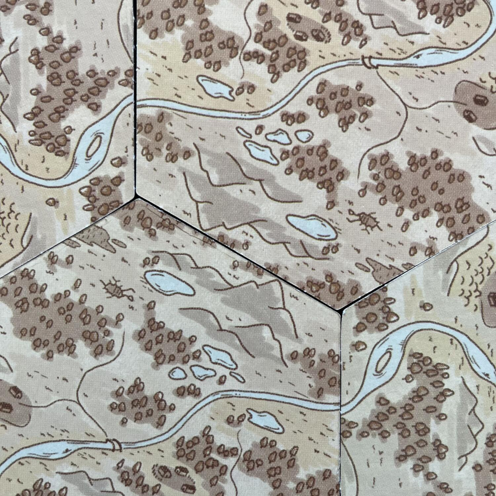
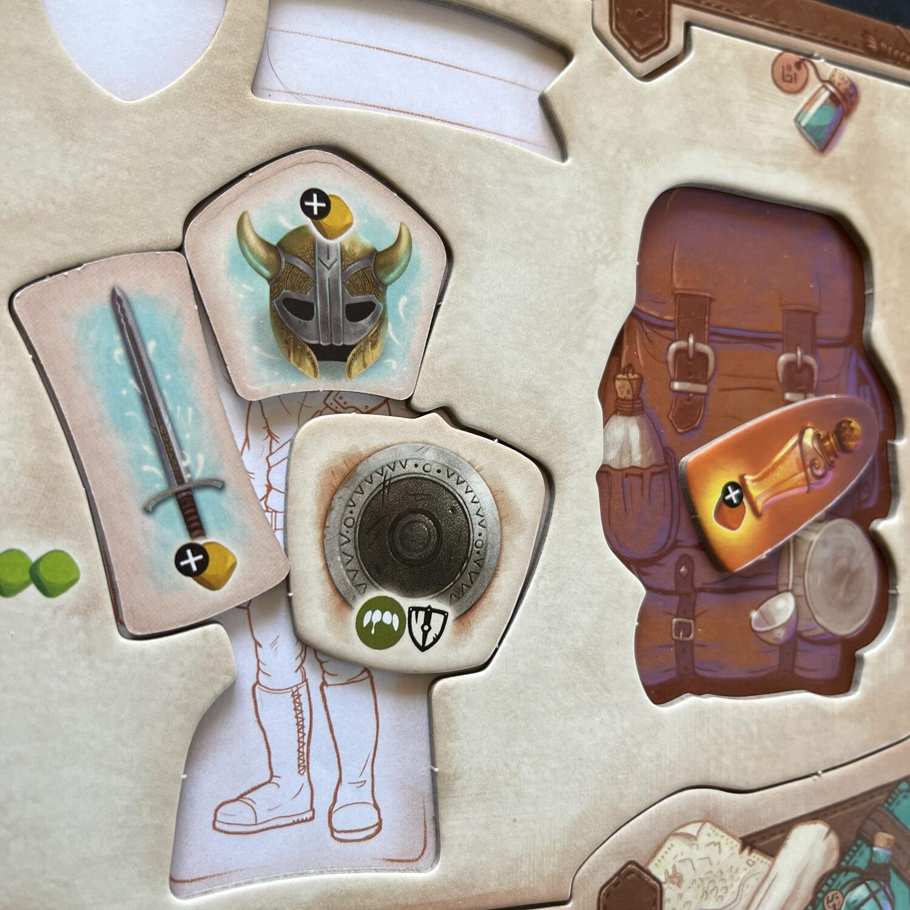

<Setting>

  Il Regno di Avel è stato attaccato! Tocca a voi coraggiosi eroi difenderlo
  dalle orde degli emissari della luna nera e dalla Crudele Bestia. Esplorate le
  terre, rinforzate le difese e soprattutto potenziatevi. Il tempo che vi separa
  dal risveglio della bestia stessa è meno di quello che pensate ed è lei la più
  grande minaccia! Posso contare su di voi vero?

</Setting>

<Rules>

  Cronache di Avel è un gioco da 1 a 4 giocatori in cui impersonerete degli Eroi
  che dovranno fermare le avanzate delle orde delle tenebre. Per farlo, avrete a
  disposizione 12 round prima della Luna nera e del risveglio della Bestia e
  dovrete muovervi in una mappa formata da tessere esagonali coperte, che
  verranno rivelate quando un personaggio vi si muoverà sopra con l’azione
  corrispondente.
   
  Ogni Round sarà a sua volta suddiviso nei turni dei giocatori, i quali
  dovranno scegliere due azioni tra:
  <ul>
    <li>      <strong>Muoversi</strong>: il giocatore potrà muoversi fino a un esagono
      adiacente, rivelando eventualmente una tessera ed eventuali mostri. Con il
      movimento ci si potrà anche teletrasportare usando specifici portali…</li>
    <li>      <strong>Combattere</strong>: il giocatore combatterà contro un nemico di
      qualsiasi genere (piccolo, grande, bestia), lanciando i suoi dadi
      stabiliti dall’equipaggiamento a sua disposizione e lanciando i dadi del
      nemico. Confrontando i risultati di danno e parata si avranno i danni
      subiti dai due contendenti. Semplice, veloce ed efficace.{" "}</li>
    <li>      <strong>Attivare una tessera</strong>: utilizzando questa azione si potrà
      accedere ai poteri dei luoghi, che garantiranno effetti utili di vario
      tipo ai giocatori.</li>
    <li>      <strong>Riposarsi</strong>: uno dei pochi modi di cui i giocatori
      dispongono per curarsi, azione da non sottovalutare.{" "}</li>
  </ul>
  Oltre a ciò, un giocatore, prima o dopo un’azione, potrà scambiare un oggetto
  con un altro giocatore se entrambi si troveranno su una tessera vuota (sempre
  ammesso che l’oggetto in questione ci stia nel vostro zaino… Sì, gli oggetti
  occupano fisicamente un posto).

</Rules>

<Feedback>

  Cronache di Avel è un gioco d’avventura che saprà sicuramente regalare
  sorprese ai giocatori. Un regolamento snello, un gameplay veloce, una grafica
  pucciosa et voilà: un <Link to="/mechanisms/cooperativo">Cooperativo</Link>{" "}
  con i fiocchi. Diciamocelo poi, l’idea che un oggetto di qualsiasi tipo, anche
  le monete, occupi fisicamente spazio nell’inventario, come in un videogame, è
  affascinante e poco esplorato nel mondo dei giochi da tavolo.  
  Il grande grosso problema di Avel è quello di non essere abbastanza ambizioso:
  votato a un pubblico di bambini e famiglie, ci riesce per la maggior parte delle
  volte, ma lascia sempre l’amaro in bocca se si pensa a cosa sarebbe potuto essere…

</Feedback>

