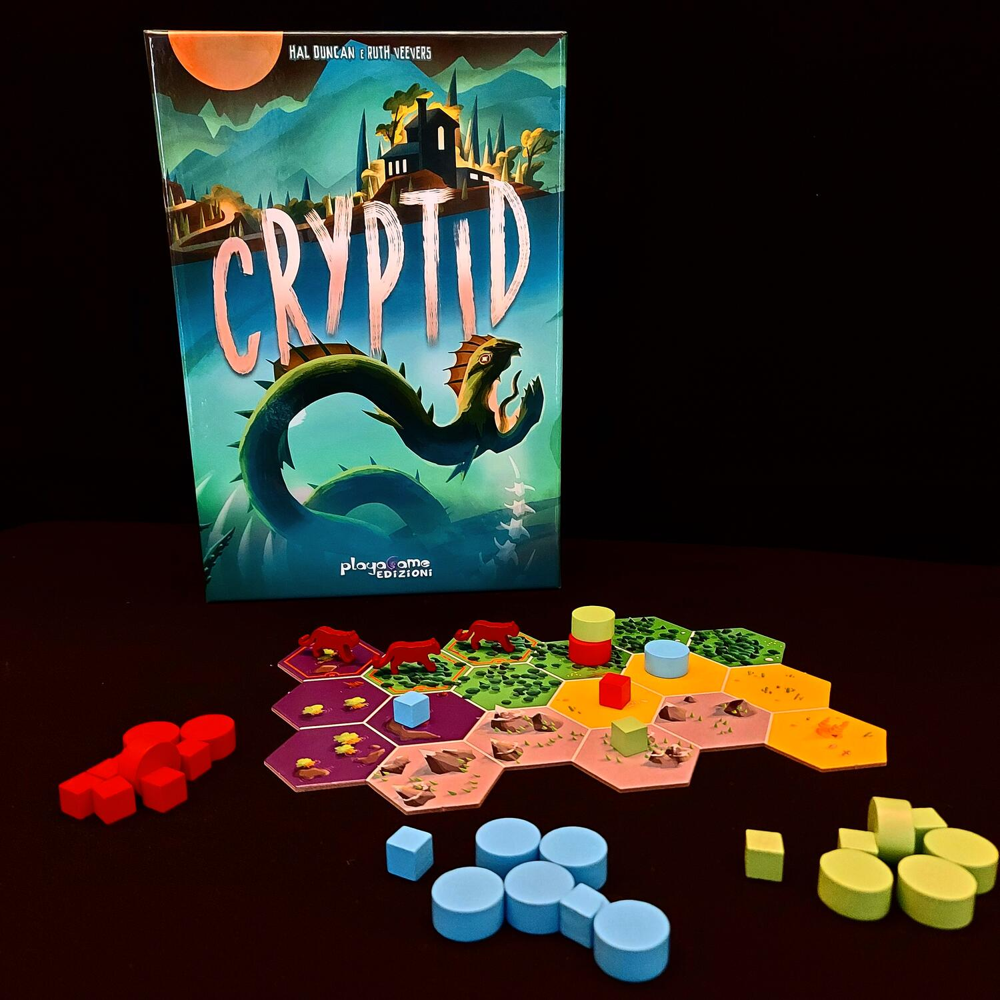
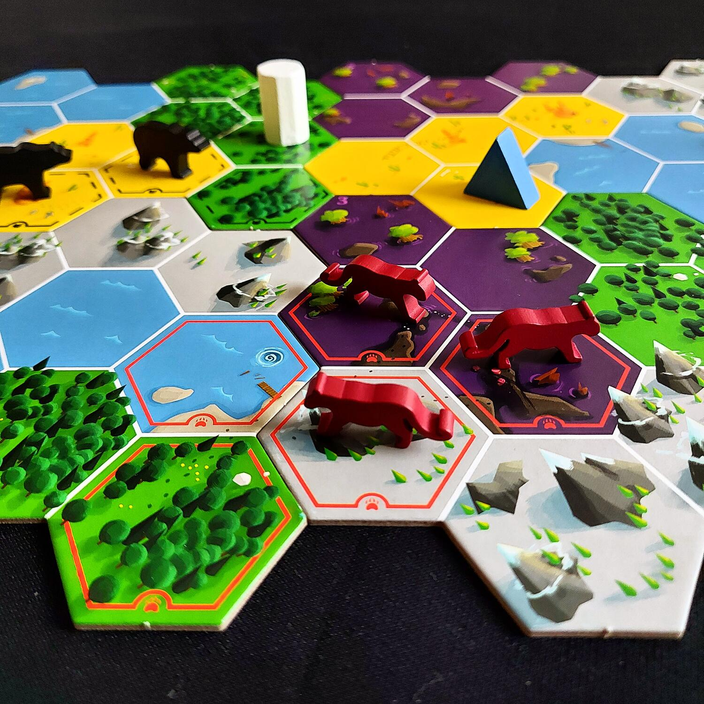

<Setting>

  Nei panni di un gruppo di crypto-zoologi i giocatori dovranno cercare di scovare una creatura misteriosa, avendo a
  disposizione un unico indizio sul possibile luogo del suo nascondiglio. Per farlo dovranno cercare di scoprire gli
  indizi degli altri giocatori, stando ben attenti a non rivelare troppo del proprio, per evitare che sia un altro
  giocatore ad arrivare per primo alla soluzione. In definitiva nel corso del gioco i giocatori dovranno cercare di
  “bluffare” cercando di mandare fuori strada gli altri e al contempo dovranno provare a intuire le informazioni che
  mancano per trovare la tana del Cryptid.

</Setting>

<Rules>

  In primo luogo si dovrà allestire il tabellone assemblando le sei plance mobili secondo un determinato schema; ogni
  plancia è suddivisa in esagoni che rappresentano i diversi territori. I giocatori dovranno tenere presente che per
  ogni configurazione ci sarà un <strong> UNICO</strong> esagono nel quale si celerà la creatura misteriosa.
   
  In questa prima fase i giocatori dovranno inoltre dare un'informazione sul proprio indizio piazzando due cubetti su
  degli esagoni della mappa che secondo l'informazione a disposizione <strong>NON</strong> possono contenere la creatura
  misteriosa: in Cryptid, infatti, i cubetti rappresentano i territori che sono sicuramente da escludere dalle ricerche.{" "}
   A questo punto si è pronti per l'inizio vero e proprio della partita: i giocatori a turno potranno scegliere di
  effettuare una delle seguenti azioni:
  <ul>
    <li>      <strong>Interrogare:</strong> si sceglie un esagono privo di cubi e vi si piazza la pedina nera chiedendo a uno
      degli avversari se, secondo il suo indizio, la tana potrebbe trovarsi in quel territorio. In caso di risposta
      affermativa, l'avversario posizionerà un proprio disco su quel terreno, altrimenti vi piazzerà un cubetto. Al
      piazzamento del cubetto bisogna sempre rispondere con un piazzamento di un proprio cubetto su un altro terreno,
      quindi con un'interrogazione sbagliata si è costretti a dare altre informazioni sul proprio indizio.</li>
    <li>      <strong>Esplorare:</strong> questa azione può potenzialmente portare alla conclusione della partita;l, poiché un
      giocatore dichiara di voler indovinare l'esatta posizione della tana. Per farlo, piazzerà un proprio disco su quel
      territorio (ovviamente il territorio deve essere valido per il proprio indizio), e a partire dal giocatore alla
      sua sinistra ciascuno, secondo il proprio indizio, piazzerà un disco o un cubetto. Non appena viene posizionato un
      cubetto, il giro si ferma, e si ricade nel caso precedente di interrogazione sbagliata. Se tutti i giocatori
      posizionano dischi, la tana è stata scoperta e il giocatore di turno vincerà la partita.</li>
  </ul>

</Rules>

<Feedback>

  Cryptid è un gioco deduttivo in cui la mappa modulare rende la rigiocabilità praticamente infinita, mentre il
  regolamento assolutamente facile e veloce da apprendere e un tempo di gioco contenuto fanno sì che il gioco possa
  essere adatto praticamente a qualunque tipo di giocatore.
   
  In ogni caso, qualche partita di rodaggio sarà necessaria per la corretta interpretazione degli indizi, perché un
  errore di interpretazione potrebbe finire con il compromettere la partita. Il regolamento però è chiaro, ben scritto e
  ricco di esempi pratici.
   
  Detto questo, la vera “ricchezza” di Cryptid è che non è per nulla banale ed è la dimostrazione di come con poche
  regole si possa realizzare un gioco che per me è un must-have.

</Feedback>

