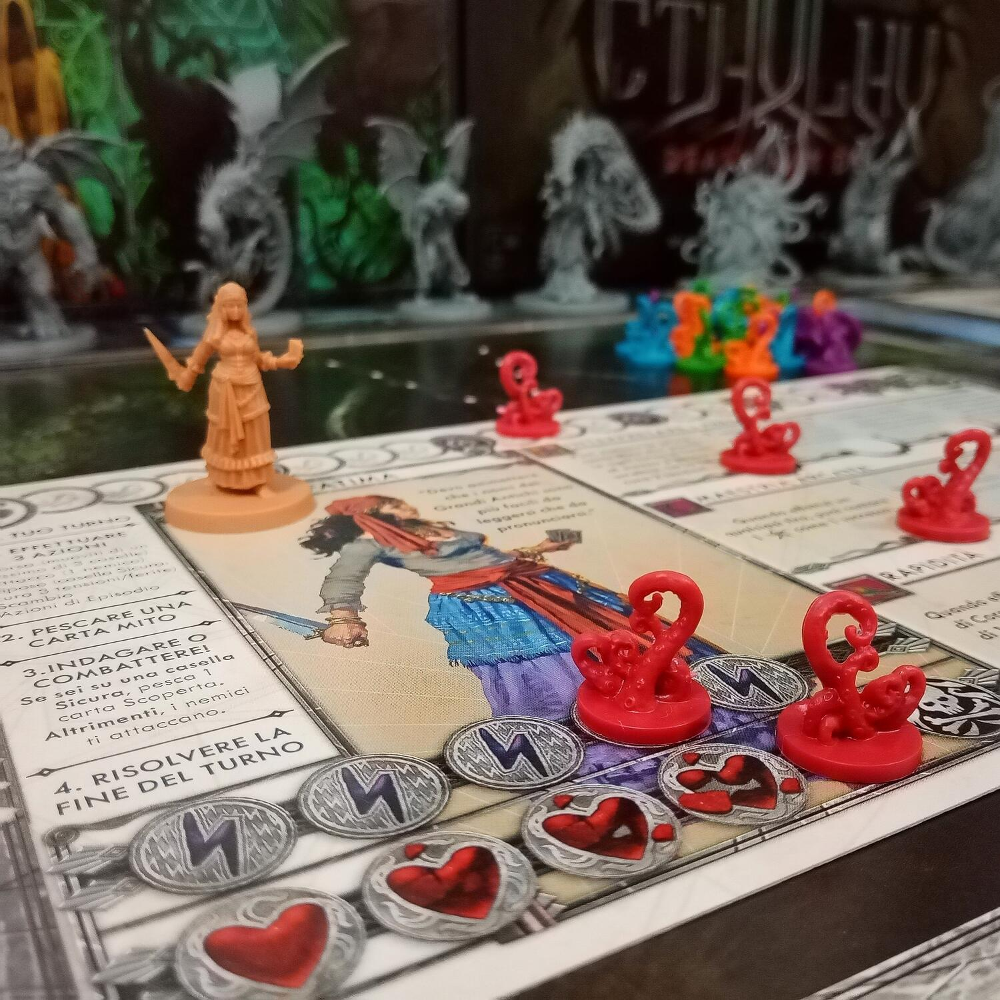
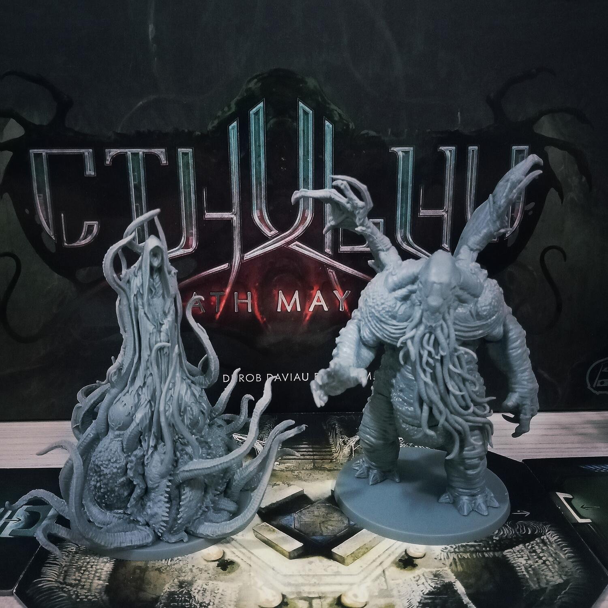

<Setting>

  Un ossessivo culto apocalittico con la fissa per i Grandi Antichi sta per
  terminare di evocarne uno nel nostro mondo e la FINE è vicina!
   
  Dovremo investigare in luoghi fuori dal comune: da un laboratorio in fiamme ad
  una villa di un ricco e singolare padrone, fino ad una festa in maschera. Sarà
  necessario risolvere i misteri che sono celati in questi luoghi, sconfiggere i
  sacrileghi cultisti e gli altri adepti e, infine, il mostruoso Grande Antico
  evocato nel nostro mondo, per mettere fine al suo regno di terrore e scampare
  così alla devastazione dell’intera civiltà umana. Impersoneremo degli
  investigatori, uomini e donne dalle singolari personalità, che tenteranno il
  tutto per tutto nel fermare la setta responsabile del compimento del rituale e
  dar battaglia al Grande Antico di turno.
   
  Tra le nostre risorse a disposizione ci saranno armi, abilità speciali ed
  uniche e persino improvvisati aiutanti… Attenzione però: la FOLLIA imperversa
  tra gli stessi investigatori. Sopportare la visione di creature orrende e
  malefiche sarà una prova impossibile da superare incolumi: danni fisici e
  mentali saranno all’ordine del giorno. Sarà la mente umana abbastanza forte o
  queste creature faranno breccia e faranno crollare anche i più impavidi sotto
  il peso della coscienza?
   
  Le forze del Male sono vicine quindi… armi alla mano!

</Setting>

<Rules>

  Il gioco si svolge in un numero indefinito di Round che si susseguono finché
  non si verificano le condizioni di fine partita o di vittoria o sconfitta per
  i Giocatori.
   
  Nella prima fase i Giocatori svolgono un massimo di 3 azioni e possono anche
  ripetere la stessa azione più di una volta, ad esempio CORRERE (ogni
  investigatore può muoversi fino ad un massimo di 3 caselle), ATTACCARE
  (bersagliare una miniatura nemica nella propria casella - salvo diversamente
  specificato da abilità particolari - tramite il tiro di dadi che infliggono
  danni ed eventualmente follia),  
  SCAMBIARE EQUIPAGGIAMENTO (con altri investigatori nella propria casella) o RIPOSARE
  (solo su caselle senza nemici, un investigatore recupera vita/tensione fino ad
  un massimo complessivo di 3). Esistono poi AZIONI DI EPISODIO che sono specifiche
  dello scenario giocato e che vengono spiegate nel dettaglio nella carta corrispondente.
   
  La seconda fase prevede la pesca di una CARTA MITO, nella quale sono spesso rappresentati
  l’evocazione di nuovi nemici, effetti speciali ed anche un SIMBOLO GRANDE ANTICO;
  quando una Carta Mito riporta il SIMBOLO GRANDE ANTICO viene conservata da parte
  e, non appena i simboli collezionati sulle carte sono 3, il grande antico avanza
  sul tracciato di evocazione, avvicinandosi sempre di più alla sua evocazione sulla
  mappa e quindi alla fine della partita.
   
  La terza fase può distinguersi in 2 diverse strade obbligate: COMBATTERE o INDAGARE.
  Più precisamente, si combatte SOLO quando sulla casella dove ha finito il turno
  l’investigatore si trovano uno o più nemici: in tal caso essi attaccano l’eroe.
   
  Qualora fosse una “casella sicura”, si può invece INDAGARE e quindi pescare una
  carta potenziamento specifica di scenario.
   
  La quarta ed ultima fase è la risoluzione della FINE DEL TURNO, in cui vengono
  svolti tutti gli eventuali passaggi che di scenario in scenario potrebbero verificarsi,
  come l'evocazione del Grande Antico, risolvere il fuoco accumulato dai giocatori
  ecc.
   
  Il gioco procede così fin quando il Rituale Magico non viene interrotto o il Grande
  Antico evocato: in quest’ultimo caso il gioco si riduce semplicemente a raccogliere
  coraggio ed affrontare il Grande Antico, sconfiggendolo una volta e per tutte.

</Rules>

<Feedback>

  Cthulhu Death May Die si presenta come un titolo a “scenari aperti”.
   
  Gli scenari presenti nella scatola sono 6 in totale e i Grandi Antichi 2
  (Cthulhu ed Hastur - Il Re In Giallo), il che porta alla possibilità di
  giocare l’intera scatola base due volte, per un totale di 12 scenari in
  totale. Certo, gli scenari di base sono quelli e quelli rimangono, ma cambiare
  il Grande Antico di turno può modificare l’interazione tra i giocatori ed
  anche le sorti della partita, senza contare la strategia di vittoria che
  necessariamente dovrà essere differente, in quanto i motori di gioco dei due
  diversi nemici finali sono molto diversi.
   
  È perciò un titolo mediamente rigiocabile, che necessita però dell’espansione
  Seasons 2 e delle mini-expansion dei Grandi Antichi aggiuntivi per essere
  assaporato al meglio. I materiali rasentano l’eccellenza: le Tail sono ottime
  e si incastrano alla perfezione, per quanto a volte possa risultare difficile
  individuarle a colpo d’occhio nella scatola, dato che sono double-face. Le
  miniature sono il vero punto forte del gioco: i Grandi Antichi ed in generale
  i mostri hanno un livello medio-alto, sono miniature particolareggiate e
  dipingerle potrebbe essere una vera goduria per gli occhi.
   
  Alcuni scenari possono risultare più semplici di altri, anche se a tutti gli
  effetti la difficoltà del titolo è per giocatori esperti. È facile, infatti,
  ritrovarsi a vincere per il rotto della cuffia (in una partita realmente
  giocata Il Prof ha vinto da solo all’ultimo round quando Endor e Drugo erano
  stati brutalmente uccisi da Cthulhu).
   
  Quanto alle meccaniche, nota di merito ad alcune “azioni bonus” di scenario
  che aiutano i Giocatori ad immedesimarsi nella missione da portare a termine
  (basti pensare al primo scenario dove è tutto in fiamme e “Spegnere il Fuoco”
  è una delle azioni da usare maggiormente se non si vuole finire per essere
  arsi vivi!)

</Feedback>

